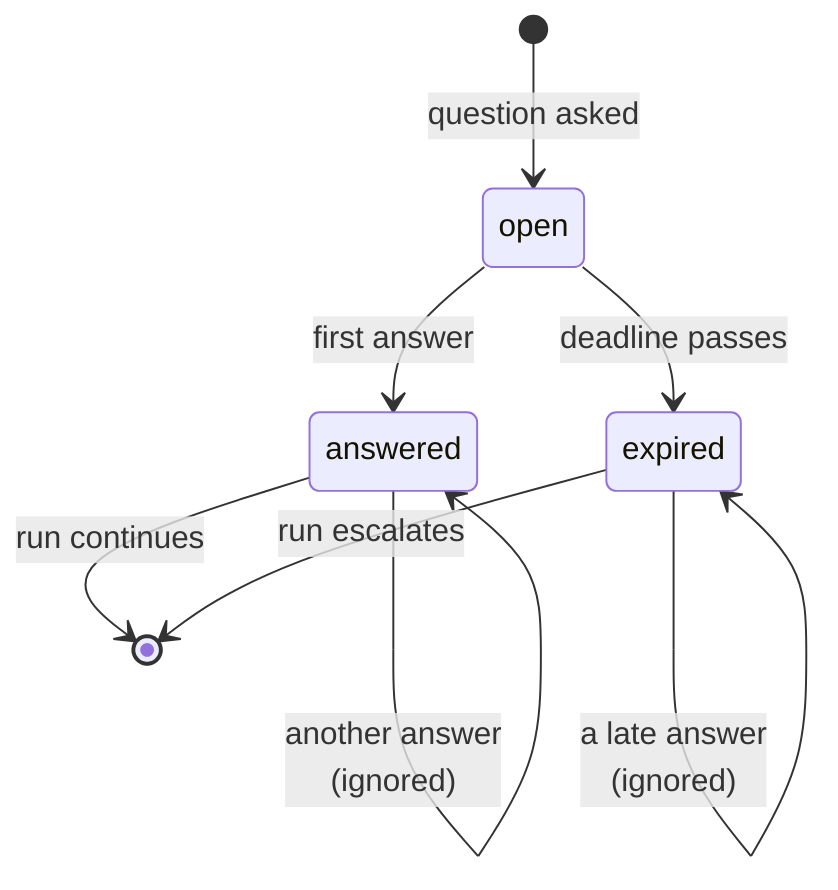

# 1.3 — Late, twice, or never

## One-line answer

A human is a dependency with no timeout, no retry semantics and no guarantee of replying at
all, and the naive handler gets exactly one of the four possible histories right: it sends
the reply **twice** when answered twice, and sends it **after the deadline** when answered
late.

## The story

A parcel arrives at your building and needs a signature. You are out.

The courier tries again the next day. Still out. He leaves a card. On the third attempt your
neighbour is in and signs for it, and later that afternoon you get home, find the card from
yesterday, and telephone the depot to arrange redelivery of a parcel that is already sitting
in your neighbour's hallway.

Somewhere in that depot's system, one delivery now has two answers. One says *signed for by
the neighbour*. The other says *customer requested redelivery*. Both are true. Both arrived
through legitimate paths. And if the system acts on both, a second van goes out.

Nobody did anything wrong. The parcel was answered late, and answered twice, and a design
that assumed one answer arriving at one moment has no idea what to do about it.

## The idea in plain language

When your code calls another service, the ways it can fail are well understood and there are
words for them: a timeout, a retry, a failed connection, an error status. You handle them
because the libraries you use make you handle them.

A person is also a dependency, and the failure modes have no library. Strip away the
politeness and there are exactly three of them:

- **Late.** The answer arrives after you had already given up and moved on.
- **Twice.** The same question gets two answers, because someone clicked twice, because a
  retry re-sent the same click, because two people were both looking at the queue, or
  because a phone call and a button press said different things.
- **Never.** Nobody replies. Ever. This is not an exception, it is a Tuesday.

Two of those three are not the person's fault in any sense. Clicking a button twice when the
first click appears to do nothing is the correct behaviour of a reasonable adult. Answering a
question you find in your inbox is the correct behaviour even if it has been sitting there
since last week.

So the rule is not *train the humans*. The rule is:

> **A pending question has a state, and the state decides what an answer is allowed to do.**

A question that is `open` accepts one answer and becomes `answered`. A question that is
already `answered` accepts nothing. A question past its deadline becomes `expired` and
accepts nothing either, because the system has already acted on the assumption that no answer
was coming.

That single field — the state — is the difference between the two handlers measured below.
The naive one has no state, so every answer looks like the first one.

The term for this is **idempotency**: doing the thing twice has the same effect as doing it
once. Day 60 built it for the case where a *machine* retries a step
([Day 60, part 3.2](../../../day-60-durable-execution/parts/03-doing-it-twice/3.2-naturally-idempotent-or-made-so.md)).
This part is the same requirement with a person as the source of the duplicate, which matters
because the machine's retries are yours to control and the person's are not.

## Why Sutra needs it

Sutra's gated action is sending a reply to a customer. Sending it twice is not a
near-miss — it is a customer receiving two emails about one problem, and on a refund it is a
customer receiving money twice.

Day 64 builds the approval gate. If the gate is built without the state field, the very first
double-click in testing will send two replies and it will look like a race condition in the
graph, which is where a team will then spend an afternoon.

Day 65 then tries to kill the system mid-run and resume it, and a resume is indistinguishable
from a duplicate answer unless the pending record can tell them apart.

## The mechanism

Four histories, two handlers, one ticket. The histories are the three failure modes plus the
one that goes well:

```bash
cd days/day-62-human-in-the-loop/lab
uv run python unreliable.py
```

**Line by line:**

- `naive()` has no pending record at all. It acts on every answer it sees, which is what
  anyone writes first, because in the happy path it is correct.
- `guarded()` writes a record with `state: "open"` before anything, and every answer first
  reads that state. The whole difference between the two functions is three lines.
- `HISTORIES` are fixed lists of events, not a simulation with randomness, so the table is
  the same on every machine.
- The `deadline` event is what the system does when nobody has replied: it is an event in its
  own right, not the absence of one, which is the point
  [6.1](../06-nobody-answered/6.1-a-default-is-a-decision-nobody-made.md) develops.

Measured on 2026-09-05:

```text
  history           handler   replies sent  what happened
  answered once     naive                1  sent
  answered once     guarded              1  sent

  answered twice    naive                2  sent; sent
  answered twice    guarded              1  sent; ignored: question is answered

  answered late     naive                1  deadline passed, nothing done; sent
  answered late     guarded              0  deadline passed, question closed unanswered; ignored: question is expired

  never answered    naive                0  deadline passed, nothing done
  never answered    guarded              0  deadline passed, question closed unanswered
```

Read the middle two blocks.

**Answered twice:** the naive handler sends the reply twice. The customer gets two emails.
Nothing errored, nothing was logged as unusual, and both sends look identical in every record
the system keeps.

**Answered late:** this is the subtle one and it is worse than the duplicate. The naive
handler has already passed its deadline and decided to do nothing. Then the answer turns up
and it sends. So the reply goes out at a moment when the system had already recorded that it
was not going to go out, and anything downstream that acted on that decision — an escalation
to a person, a note on the ticket, a customer already telephoned — is now inconsistent with
what actually happened.

The guarded handler gets all four right, and it gets them right by refusing rather than by
being clever. Two of its four outcomes are the word *ignored*.



## When it breaks

The guard above is written in one process, and that is exactly where it stops being enough.

🎬 **The scene:** the approval screen has one button. A reviewer clicks it, the page does not
visibly change, and they click it again.

😬 **The naive fix:** check the state before acting, exactly as `guarded()` does.

💥 **Why it fails:** two clicks arrive as two requests, and each request reads the state
before either has written it. Both see `open`. Both proceed. The check is real and it is in
the wrong place — between the read and the write there is a gap, and two requests fit in it.

💡 **The insight:** a state check protects you only if reading the state and changing it
happen as one indivisible step. Day 60 named this exactly, and the fix is its fix: the state
transition and the effect belong in the same transaction, which is
[Day 60, part 3.4](../../../day-60-durable-execution/parts/03-doing-it-twice/3.4-the-ledger-and-the-atomic-window.md).

You can watch the unguarded version do it, because `_pending.answer()` deliberately allows
it — the module's docstring says so, so that this part has something to measure:

```bash
uv run python -c "
import _pending
_pending.clear()
_pending.put('q-1', {'ticket': '4610', 'state': 'open'})
_pending.answer('q-1', {'confirmed': True})
print(_pending.answer('q-1', {'confirmed': True}))
"
```

**Line by line:**

- `_pending.answer` appends to an `answers` list rather than replacing a field, so a second
  answer is visible rather than silently overwriting the first.
- Printing the second call's return value shows both answers sitting in one record, which is
  the evidence a duplicate happened at all.

```text
{'ticket': '4610', 'state': 'open', 'answers': [{'confirmed': True}, {'confirmed': True}]}
```

Two answers, and the state still says `open`. That record is what a double click looks like
before anybody has decided what to do about it.

## In production

**What a professional writes instead.** The state transition is a conditional update in the
database — `UPDATE pending SET state='answered' WHERE id=? AND state='open'` — and the code
acts only if that statement reports that it changed a row. That single line replaces the
read-then-check-then-write above and closes the gap, because the database is the thing
serialising the two requests rather than your process.

**What degrades at scale or under concurrency.** Duplicates stop being rare. At a handful of
approvals a day, a double answer is a curiosity; at a few thousand, it is a daily event, and
it stops being caused by double-clicks. The real sources are a client retrying a request
whose response was lost, a mobile app resending on reconnect, and two people working the same
queue because nobody assigned it. None of those are fixable at the interface. All of them are
fixable at the state field.

**The failure mode that only appears with real traffic.** *Late* is the one that survives
testing, because in testing nobody answers late — the person answering is the person running
the test. It shows up the first weekend, when a question asked on Friday is answered on
Monday and the system has long since escalated it, and the resulting action lands on a ticket
someone else has already dealt with by hand. The customer then receives a reply about a
problem that was solved three days ago, which reads worse to them than no reply at all.

**The review comment a senior engineer leaves:** *"What happens if this callback fires twice?
Right now, two emails. And what happens if it fires after `expire_pending` has run? Right
now, one email that we have already told the on-call person we did not send. Both of those
are the same missing field."*

**The interview question:** *"How do you handle the human answering twice?"* The answer that
shows you have shipped it: *"With a state on the pending question, and the transition done as
a conditional update so two requests cannot both win it. The one that surprised me was not
the duplicate, it was the late answer — we had a deadline that escalated the ticket, and then
the original approval arrived on Monday and the code happily acted on it, so we sent a reply
about something a person had already handled. The fix was the same field: past the deadline
the question is `expired` and an answer to it is ignored, not applied."*

## Check yourself

```bash
cd days/day-62-human-in-the-loop/lab
uv run python unreliable.py
```

Add a fifth history to `HISTORIES` in which the person answers `False` and then `True`, and
run it again. Write down what each handler does, and decide which of the two behaviours you
would actually want on a send action.

**Out loud, without scrolling up:** name the three ways a human answer goes wrong, and say
which one the naive handler survives.

**Next:** [2.1 — The gate that returns one bit](../02-approve-or-reject/2.1-the-gate-that-returns-one-bit.md).
