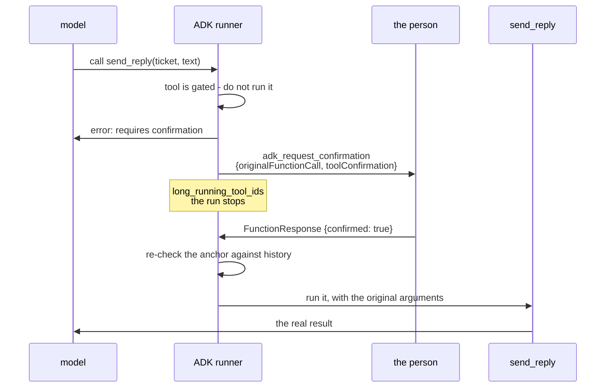

# 2.1 — The gate that returns one bit

## One-line answer

`require_confirmation=True` on a `FunctionTool` turns one tool call into two: the call the
model asked for, which does not run, and a second call named `adk_request_confirmation`
carrying the exact arguments a person must agree to.

## The story

A cheque is handed in at a bank counter. The clerk looks at the amount, and instead of paying
it she carries it to the desk behind her, where someone else reads it, initials the corner,
and hands it back.

Watch what she actually carries. Not a summary. Not "a large cheque". The cheque itself, with
the amount and the name on it, because the whole value of the second signature is that the
second person saw the same piece of paper the first person saw.

And notice what comes back. Not advice, not an amended cheque, not a conversation. A pair of
initials, which mean yes. If the second person disagrees, the initials are absent, and the
clerk does not pay it. There is no third outcome at that counter.

## The idea in plain language

**Approve or reject** is the pattern with the smallest possible answer. The person is shown
something that is about to happen and returns one bit: yes or no.

That smallness is the pattern's strength and its limit. Its strength is that a yes-or-no is
easy to record, easy to audit and impossible to misinterpret. Its limit is that a "no" cannot
carry a reason unless you add one, which is [2.3](2.3-what-a-no-has-to-carry.md)'s subject.

ADK 2.7.1 implements this on the tool. You mark a tool as needing confirmation and the
framework does three things:

1. When the model calls that tool, the tool's own code **does not run**.
2. The framework emits a second function call, `adk_request_confirmation`, whose arguments
   contain the original call — name and arguments, exactly as the model produced them.
3. The framework returns an error as the original tool's result, so the model is told the
   call did not happen rather than being left to assume it did.

The thing being confirmed is therefore not "the agent's intention" or "this ticket". It is a
**specific call with specific arguments**, pinned in the record. That pinning is what makes
the approval mean something later, and section 3 is about what happens when somebody tries
to unpin it.

Two terms, defined here because the rest of the section leans on them:

- A **tool** in ADK is a Python function the model may ask to have run. Day 4 built them by
  hand and Day 16 gave them brakes; the ADK wrapper is `FunctionTool`.
- **`ToolConfirmation`** is the small object the person's answer is packed into. It has three
  fields, and this part uses one of them: `confirmed`. The other two, `hint` and `payload`,
  belong to section 3.

## Why Sutra needs it

The desk's last stage sends a reply to a customer. Day 63 will classify that action as one
that needs a person, and Day 64 will build the gate on it. This part is the mechanism they
will both assume.

More immediately: the desk has more than one dangerous action, and they do not all deserve a
gate. Knowing exactly what `require_confirmation` costs — one extra round trip, one extra
event, one extra thing in the record — is what makes the next part's argument possible.

## The paper behind it

The idea that a valuable action should be approved by a second party, on the same evidence,
is older than software, and the security literature states it as a design rule rather than an
etiquette.

> **The protection of information in computer systems**
> `doi:10.1109/PROC.1975.9939` · 1975 · <https://doi.org/10.1109/PROC.1975.9939>

It sets out complete mediation — every access to every object is checked, with no path that
skips the check — which is exactly why the confirmation is enforced by the framework at the
tool boundary rather than by the tool remembering to ask.

That paper is taught in
[Day 40's paper part](../../../day-40-filtering-and-allowlists/papers/01-protection-of-information.md).

## The mechanism

One tool, one flag, and a full run with no network and no model:

```python
def send_reply(ticket: str, text: str) -> dict:
    """Send the drafted reply to the customer."""
    return _desk.send_reply(ticket, text)


tool = FunctionTool(send_reply, require_confirmation=True)
agent = LlmAgent(name="desk", model=model, tools=[tool])
```

**Line by line:**

- `send_reply` is an ordinary function with an ordinary docstring. Nothing in it knows that it
  is gated, and that is the point: the gate is outside the thing it guards, the same argument
  Day 59 made about containment. A tool that asks for its own permission can be reached by any
  path that does not ask.
- `require_confirmation=True` is a keyword-only argument on `FunctionTool.__init__`. Verified
  against the installed `google-adk==2.7.1` source at `google/adk/tools/function_tool.py`, and
  against `adk.dev/tools-custom/confirmation/`, fetched 2026-09-05.
- `model` here is `ScriptedLlm` from `_scripted.py`, a real `BaseLlm` subclass that reads its
  answers from a list. ADK drives it exactly as it drives Gemini. This is how the day obeys the
  zero-budget rule (Addendum 02) without faking any of ADK's behaviour.

Run it:

```bash
cd days/day-62-human-in-the-loop/lab
uv run python approve.py
```

**Line by line:**

- Turn 1 sends an ordinary user message. The scripted model responds with a `send_reply` call
  whose id is fixed at `fc-send-1`, so the anchor is readable in the output.
- Turn 2 sends a `FunctionResponse` whose `name` is `adk_request_confirmation` and whose `id`
  is the id of the confirmation call, not of the original call. Getting that id wrong is the
  most common mistake with this API, and it fails silently by doing nothing.

Measured on 2026-09-05:

```text
--- turn 1: the agent runs until it needs a human ---
  call     send_reply  id=fc-send-1
  call     adk_request_confirmation  id=adk-2af077dd-7607-45de-bca4-9dba39e35d35
  long_running_tool_ids: ['adk-2af077dd-7607-45de-bca4-9dba39e35d35']
  response send_reply  -> {'error': 'This tool call requires confirmation, please approve or reject.'}
  sent so far: 0

  the pause carries two keys: ['originalFunctionCall', 'toolConfirmation']
  hint:   Please approve or reject the tool call send_reply() by responding with a FunctionResponse with an expected ToolConfirmation payload.
  anchor: {"ticket": "4610", "text": "Your session ends at the identity pr...

--- turn 2: the human answers confirmed=True ---
  response send_reply  -> {'ticket': '4610', 'text': 'Your session ends at the identity provider redirect because the cook

  sent: 1  ['4610']
```

Four things in that output are worth naming.

**`sent so far: 0`.** The tool did not run. `_desk.SENT` is empty after turn 1. This is the
only line that proves the gate is a gate rather than a notification.

**Two calls, not one.** The model asked for `send_reply`; the framework emitted
`adk_request_confirmation` as well. The confirmation call has an ADK-generated id prefixed
`adk-`, and it is that id the answer must quote.

**`long_running_tool_ids`.** The confirmation call is a long-running tool call, which is the
same mechanism [1.1](../01-the-shape-of-the-wait/1.1-four-questions-wearing-one-name.md)
showed for `request_input`. Approve, edit and answer are three uses of one pause.

**The error handed back to the model.** `{'error': 'This tool call requires confirmation,
please approve or reject.'}` goes into the conversation as the tool's result. The model is
told plainly that nothing happened, which is Principle 10 applied inside the framework: the
alternative is a model that believes it sent a reply and says so to the customer.

Here is the whole exchange:



## When it breaks

The failure that costs an evening is answering with the wrong id, because it does not raise.

🎬 **The scene:** you have the confirmation working in a notebook and you wire it into a real
client. The client has the original call's id — it is the one that means something to your
own code — so it sends the answer quoting `fc-send-1`.

😬 **The naive fix:** check the payload shape, check the `confirmed` field, check the spelling
of `adk_request_confirmation`. All correct.

💥 **Why it fails:** ADK looks for confirmation responses whose id matches an
`adk_request_confirmation` **call** id. Your id matches the original `send_reply` call
instead, so no confirmation is found, `confirmations_by_fc_id` is empty, and the processor
returns early. Nothing is raised. The run simply does not continue.

💡 **The insight:** the confirmation is a call in its own right, with its own identity. The
original call is the *subject* of that question, not the question.

The error you *can* reach is worth having, because it is the one that tells you your client
and your session disagree. Point the answer at a call that never asked for confirmation and
ADK refuses to guess:

```text
ValueError: Function call name mismatch for ID 'fc-t-1': history has 'send_reply', confirmation has 'refund'.
```

That is a real `ValueError` from
`google/adk/flows/llm_flows/request_confirmation.py`, reproduced by
[3.2](../03-edit/3.2-approve-one-thing-run-another.md), where it is the subject rather than a
side note.

## In production

**What a professional writes instead.** They do not leave the hint as ADK's default. The
default string — *"Please approve or reject the tool call send_reply() by responding with a
FunctionResponse with an expected ToolConfirmation payload"* — is written for a developer
debugging the protocol, and it is what your reviewer will see if you never override it. A
production gate builds its own card, which is [7.2](../07-what-the-human-sees/7.2-the-card-that-makes-checking-possible.md).

**What degrades at scale or under concurrency.** Every gated call is now a round trip through
a human, which means the conversation is suspended in the session and the session is now
long-lived. That is fine until you notice that `adk.dev/tools-custom/confirmation/`, fetched
2026-09-05, lists a real limitation under *Known Limitations*: **`DatabaseSessionService` and
`VertexAiSessionService` are not supported**. Day 47 gave Sutra database-backed sessions
precisely so that state would survive a restart, so the two features Sutra wants most are
documented as not working together in this version. That collision is
[7.3](../07-what-the-human-sees/7.3-where-adk-confirmation-will-not-go.md), and it is the kind
of thing you want to find before Day 64 rather than during it.

**The failure mode that only appears with real traffic.** The model is told the call was
refused, and the model is free to try again. On a single test that reads as a well-behaved
retry. On a busy day it reads as an agent that asks the same person the same question four
times because each refusal looked to it like a transient error. Nothing in
`require_confirmation` stops that; a rejection has to be turned into an instruction, which is
[2.3](2.3-what-a-no-has-to-carry.md).

**The review comment a senior engineer leaves:** *"The confirmation is on the tool, which is
right. But `send_reply` is also called directly from the escalation path further down, and
that path constructs the tool itself without the flag. The gate is on one of the two doors."*

**The interview question:** *"Where does an approval gate belong — in the tool, or around
it?"* The answer that shows you have built one: *"Around it, enforced by the framework. If the
tool asks for its own permission, any caller that does not go through the tool skips the gate,
and there is always a second caller eventually. In ADK the flag is on the `FunctionTool`
wrapper rather than in the function, so the function itself has no idea it is gated, and the
runtime refuses to execute it without a matching confirmation. It also hands the model an
explicit error rather than silence, which matters, because a model that is not told the call
failed will tell the customer it succeeded."*

## Check yourself

```bash
cd days/day-62-human-in-the-loop/lab
uv run python approve.py
```

Now change the `id` in the `FunctionResponse` from `pending.id` to `"fc-send-1"` and run it
again. Note what happens, and note in particular what does *not* happen.

**Out loud, without scrolling up:** say how many function calls appear in turn 1 and why, and
say what `sent so far: 0` proves that the rest of the output does not.

**Next:** [2.2 — Decided per call, not per wiring](2.2-decided-per-call-not-per-wiring.md).
