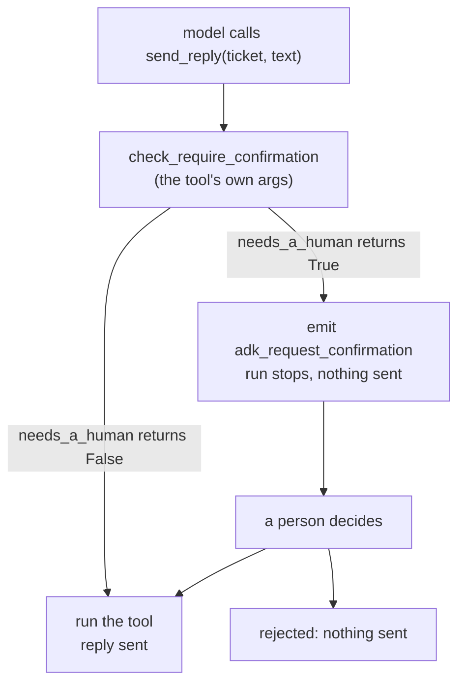

# 2.2 — Decided per call, not per wiring

## One-line answer

`require_confirmation` accepts a function of the tool's own arguments, so the same tool with
the same wiring stops for a person on one ticket and not on another: measured, ticket 4633
with a refund of 2400 stops and sends nothing, while ticket 4610 with no refund goes straight
through.

## The story

At a pharmacy counter most things are handed over without ceremony. Toothpaste, plasters,
lozenges — you point, you pay, you leave.

Then you ask for something behind the counter, and the pharmacist stops. She looks at the box,
looks at you, and asks who it is for and whether you have taken it before.

She has not changed jobs between the two transactions. She is not a cautious pharmacist on
Tuesdays and a relaxed one on Wednesdays. The same person, at the same counter, applies a rule
to the item in front of her, and the rule says that this particular box needs a conversation
and that particular tube does not.

If she stopped for the toothpaste as well, the queue would go out of the door and she would
stop looking properly at the boxes that matter.

## The idea in plain language

There are two places you can decide that something needs a human.

**At wiring time** means the decision is made once, when the tool is constructed, and applies
to every call for the life of the process. `require_confirmation=True` is this.

**At call time** means the decision is made afresh for each call, using that call's own
arguments. Sending a reply that says "we have released the second authorisation" is not the
same act as sending one that promises a refund of 2400, even though both are `send_reply`.

ADK supports both, and the difference is one line: `require_confirmation` takes either a
boolean or a **callable**. When it is a callable, ADK calls it with the tool's own
parameters and gates the call if it returns true.

That matters for a reason that has nothing to do with convenience. An approval gate is a
control, and a control that fires on everything is the same as no control at all — not
because it is annoying, but because the person answering stops reading. That claim is the
whole of [7.1](../07-what-the-human-sees/7.1-the-tick-box-nobody-reads.md), and the arithmetic
behind it is [8.1](../08-in-production/8.1-the-backlog-is-the-real-limit.md). This part is the
mechanism that makes a narrower gate possible at all.

A word for what the predicate is doing: it is a **policy**, expressed as code, evaluated
against the specific act being proposed. Day 63 writes Sutra's policy properly, with reasons
for every row. Today's version is one threshold, so that the mechanism is visible without the
policy argument on top of it.

## Why Sutra needs it

Sutra's desk answers tickets. Most of them are answered with words, and a few of them move
money. If the gate is wired at construction time, those are the same act and the desk stops
for every single ticket.

Day 63's policy table has a column for blast radius, and it will conclude that a reply with no
refund and a reply with a refund of 2400 belong in different rows. Day 64 has to implement
that table, and it can only do so if the framework lets a decision depend on arguments. This
part establishes that it does, and shows exactly what the predicate is handed.

## The mechanism

The predicate is an ordinary function whose parameters match the tool's:

```python
THRESHOLD = 1000


def send_reply(ticket: str, text: str) -> dict:
    """Send the drafted reply to the customer."""
    return _desk.send_reply(ticket, text)


def needs_a_human(ticket: str, text: str) -> bool:
    """True when this particular call is worth stopping for."""
    return _desk.TICKETS[ticket]["refund"] >= THRESHOLD


tool = FunctionTool(send_reply, require_confirmation=needs_a_human)
```

**Line by line:**

- `needs_a_human` takes the **same parameters as the tool**, by name. ADK builds the argument
  dictionary for the tool call and passes it to the predicate through the same
  `_prepare_invocation_args` path it uses for the tool itself, which is why the names have to
  match and why a spelling mistake here is a `TypeError` rather than a silent `False`.
- The predicate reads the ticket rather than the text. That is deliberate: the fact that
  decides whether a person is needed is a property of the **world**, not of what the model
  wrote about it. A predicate that keys off the draft's wording can be talked out of firing by
  a model that words the draft differently.
- `THRESHOLD` is a module constant so that it appears in one place and can be found by
  somebody auditing the gate. Day 63 replaces it with a table.
- Verified against the installed `google-adk==2.7.1`: `FunctionTool.__init__` declares
  `require_confirmation: Union[bool, Callable[..., bool]]`, and
  `FunctionTool.check_require_confirmation` invokes it when it is callable. Also verified
  against `adk.dev/tools-custom/confirmation/`, fetched 2026-09-05, which describes the same
  thing as *"dynamic thresholds"*.

Two tickets, one tool, one wiring:

```bash
cd days/day-62-human-in-the-loop/lab
uv run python perticket.py
```

**Line by line:**

- `run_one` builds a fresh agent and runner per ticket, so neither run can influence the
  other through session state.
- It reports two things per ticket: whether an `adk_request_confirmation` call appeared, and
  how many replies actually reached `_desk.SENT`. The second column is the one that proves
  the gate did something, exactly as in [2.1](2.1-the-gate-that-returns-one-bit.md).

Measured on 2026-09-05:

```text
  threshold: refund >= 1000 stops for a human

  ticket  refund  subject                       stopped  sent
  4610        0   Signed out mid-form           False    1
  4633     2400   Charged twice for one order   True     0
```

Same tool object, same flag, same agent code. One ticket was answered without anyone being
asked; the other stopped and sent nothing. The only input that differed was the ticket id in
the call.



## When it breaks

The predicate is code, and it runs on every call to the tool, which makes it a very easy place
to put something that must never fail.

🎬 **The scene:** the predicate is extended to look the customer up, because a gate on the
account tier is a reasonable thing to want.

😬 **The naive fix:** call the customer service from inside `needs_a_human`.

💥 **Why it fails:** the predicate is now a network call on the path of every tool
invocation, including the ones that will not be gated. When it is slow, every call is slow.
When it raises, the exception surfaces through the tool call — which is correct of ADK
(§5.1 trap #4: 2.x surfaces exceptions rather than letting them be swallowed) and is a
catastrophe for you, because the failure of a *lookup* now looks like the failure of
*sending a reply*.

💡 **The insight:** the predicate decides whether a human is needed. It must therefore be
cheap, total and local — arguments in, boolean out. Anything it needs to know should already
be on the call, which is an argument for putting the refund amount into the tool's parameters
rather than looking it up.

You can watch the exception travel. Point the predicate at a ticket that does not exist:

```bash
uv run python -c "
import _desk, perticket
print(perticket.needs_a_human('9999', 'x'))
"
```

**Line by line:**

- `needs_a_human` is imported directly rather than through a run, because the point is what
  the predicate does on its own, before ADK is anywhere near it.

```text
Traceback (most recent call last):
  File "<string>", line 3, in <module>
  File "C:\Users\nisha_gnzw\OneDrive\Desktop\Projects\sutra\days\day-62-human-in-the-loop\lab\perticket.py", line 35, in needs_a_human
    return _desk.TICKETS[ticket]["refund"] >= THRESHOLD
           ~~~~~~~~~~~~~^^^^^^^^
KeyError: '9999'
```

A `KeyError` inside a gate predicate is a gate that does not decide. Note which way it fails:
the call does not proceed ungated, because the exception aborts it — which is the right
direction, and is not something to rely on by accident. Whether a gate that cannot decide
should fail open or fail closed is a policy question, and Day 63 answers it explicitly rather
than leaving it to whichever exception happens to be raised.

## In production

**What a professional writes instead.** The predicate is a lookup in a table that was loaded
at start-up, not a computation and not a query. The table is Day 63's policy, versioned, with
a row per action and a reason column. The predicate's whole body becomes something like
`return POLICY[tool_name].gate_when(args)`, and the interesting code lives in the policy
rather than scattered across tool definitions where no auditor will find it.

**What degrades at scale or under concurrency.** Thresholds age. A refund threshold of 1000
set when the desk handled small consumer orders becomes a gate on nothing when the business
starts handling larger accounts, and nobody notices, because a gate that stops firing produces
no signal at all. The only defence is to measure the **fraction of calls gated** and alarm when
it moves, which is a metric almost nobody adds until after the first incident.

**The failure mode that only appears with real traffic.** The predicate reads the world, and
the world changes between the predicate running and the person answering. `needs_a_human` may
say true because the refund is 2400, and by the time the approval comes back the refund may
have been recalculated to zero. The approval is then an approval for something that is no
longer the case. That is a genuine failure with a real measurement, and it is
[6.2](../06-nobody-answered/6.2-the-answer-to-a-question-that-no-longer-exists.md).

**The review comment a senior engineer leaves:** *"`needs_a_human` does a dictionary lookup
that can raise, on the path of every call to this tool including the ungated ones. Make it
total — return `True` when you cannot tell — and put the reason in the hint. A gate that
raises is not fail-closed by design, it is fail-closed by accident, and the next refactor will
turn it into fail-open without anybody noticing."*

**The interview question:** *"How do you stop an approval gate from firing on everything?"*
The answer that shows you have run one: *"Make the decision a function of the call, not of the
wiring. In ADK `require_confirmation` takes a callable that gets the tool's own arguments, so
the same tool stops on one ticket and not on another. On our desk that took the gated fraction
from everything to the calls that moved money. The part people skip is measuring that fraction
afterwards — a threshold set two years ago against smaller orders can quietly stop matching
anything, and a gate that has stopped firing looks exactly like a gate with nothing to catch."*

## Check yourself

```bash
cd days/day-62-human-in-the-loop/lab
uv run python perticket.py
```

Change `THRESHOLD` to `0` and run it again. Both tickets should now stop. Then change
`needs_a_human` to read the draft text instead of the ticket — gate on whether the word
"refund" appears in `text` — and say why that version is worse even though it passes the same
test.

**Out loud, without scrolling up:** say what arguments ADK hands the predicate, and why the
predicate should read the ticket rather than the draft.

**Next:** [2.3 — What a "no" has to carry](2.3-what-a-no-has-to-carry.md).
