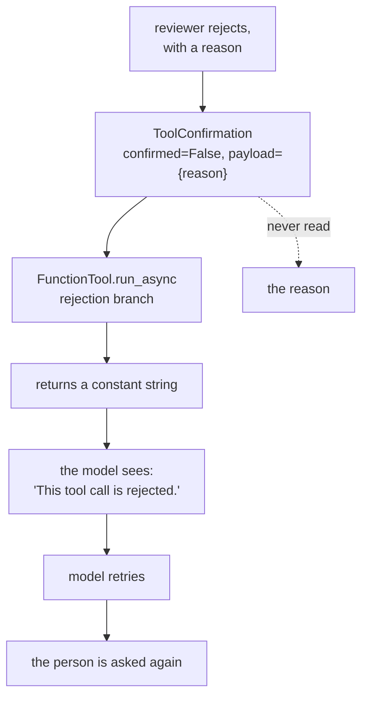

# 2.3 — What a "no" has to carry

## One-line answer

A rejection reaches the model as the fixed string `{'error': 'This tool call is rejected.'}`
and nothing else — measured, a reason attached to the refusal is **discarded**, and the agent
asks the same person the same question a second time.

## The story

You put in for two days off. The reply comes back a week later and says, in full: *not
approved*.

You read it twice looking for the rest of it. There is no rest of it. You do not know whether
the problem is those two days, or the amount of notice, or that someone else is already off,
or that you have no days left. So you do the only thing available: you put in the same request
again, in case the first one was a mistake.

Your manager now has the same form on her desk for the second time. From her side you look
like someone who ignores decisions. From your side you were told *no* and given nothing to act
on.

Neither of you did anything unreasonable. The refusal had one bit in it, and one bit is not
enough to change anybody's behaviour.

## The idea in plain language

An approval gate has two outcomes and people design one of them. The yes path gets a screen, a
record, a resume and a test. The no path gets whatever falls out.

What falls out is a refusal that says nothing. And a refusal that says nothing has two
consequences, one obvious and one not:

- **The obvious one:** nobody can tell later *why* the action was stopped. The audit record
  says `rejected` and the reason lives in the reviewer's memory, which is to say nowhere.
- **The one that costs you:** the agent is still running, and it has been handed a failed tool
  call with no instruction. A failed tool call is the most ordinary thing in the world — a
  timeout, a bad argument, a transient error — and the correct response to most of them is to
  try again. So the agent tries again, and the person gets asked again.

A rejection is therefore not the absence of an approval. It is **an instruction**, and it has
to carry at least three things:

| Part of a "no" | Why it has to be there |
| --- | --- |
| **that it was refused** | so the tool does not run |
| **why** | so the record means something six months later |
| **what to do instead** | so the agent stops rather than retrying |

ADK 2.7.1 gives you the first, and — this is the measured part below — does not give you the
second or third, even when you supply them.

## Why Sutra needs it

Day 64 builds the gate on the desk's send action, and its rejection path is a code path like
any other: it needs a test, and the test needs an expected outcome. "The reply is not sent" is
half of it. The other half is what the run does next, and if the answer is "asks again", the
gate has produced an approval queue that grows every time somebody says no.

Day 65 then measures the whole thing under a kill-and-resume. A run that loops between asking
and being refused is indistinguishable from a run that is making progress, unless somebody
counted the asks.

## The mechanism

The scripted model here does the most ordinary thing a model can do: after its tool call
fails, it calls the tool again with the same arguments.

```python
model = ScriptedLlm(
    model="scripted",
    script=[
        call("send_reply", {"ticket": "4610", "text": draft}, "fc-r-1"),
        call("send_reply", {"ticket": "4610", "text": draft}, "fc-r-2"),
        say("Understood, I will not send this."),
    ],
)
```

**Line by line:**

- The first `call` is the original attempt, which is gated and stopped.
- The second `call` is the retry. It is scripted rather than emitted by a real model, because
  a scripted model is reproducible and free — but the behaviour being scripted is the ordinary
  one. A model handed `{'error': ...}` with no instruction has every reason to retry, and
  scripting it makes the consequence measurable instead of anecdotal.
- The `say` at the end is what a *well-instructed* model would have done on the first refusal.
  Putting it third is the point: it arrives one wasted human interruption too late.

```bash
cd days/day-62-human-in-the-loop/lab
uv run python retry.py
```

**Line by line:**

- `asked` counts every `adk_request_confirmation` call across both turns, which is the number
  of times a person is interrupted for one ticket.
- The rejection is sent as `{"confirmed": False}`, exactly the shape
  [2.1](2.1-the-gate-that-returns-one-bit.md) used for the approval.

Measured on 2026-09-05:

```text
  turn 1: the person is asked  (times asked so far: 1)
  the rejection carries nothing but 'no'
  the model is told: {'error': 'This tool call is rejected.'}
  the model is told: {'error': 'This tool call requires confirmation, please approve or reject.'}

  times the person was asked: 2
  replies sent:               0
```

One ticket, one refusal, **two interruptions**. The second line of output is the retry being
gated all over again.

Now the fix everybody reaches for first: attach the reason to the rejection. `ToolConfirmation`
has a `payload` field, and section 3 is about to use it, so it is entirely reasonable to
expect it to work here.

```bash
uv run python retry.py --reason
```

**Line by line:**

- `--reason` adds `"payload": {"reason": "do not promise a cookie change to this customer"}`
  alongside `"confirmed": False`. Everything else about the run is byte-for-byte identical.

```text
  turn 1: the person is asked  (times asked so far: 1)
  the rejection carries a reason
  the model is told: {'error': 'This tool call is rejected.'}
  the model is told: {'error': 'This tool call requires confirmation, please approve or reject.'}

  times the person was asked: 2
  replies sent:               0
```

**Identical.** The reason the reviewer typed does not reach the model, and the count of
interruptions does not move.

That is not a bug in the lab. It is the rejection branch of `FunctionTool.run_async` in the
installed `google-adk==2.7.1`:

```python
elif not tool_context.tool_confirmation.confirmed:
    return {"error": "This tool call is rejected."}
```

**Line by line:**

- The branch tests `confirmed` and returns a **constant**. `tool_context.tool_confirmation` is
  right there, `payload` is on it, and nothing reads it.
- Compare the approve branch immediately below, which calls the real function with the real
  arguments. The two paths are not symmetrical: one is the whole of your tool, the other is a
  literal.

Verified against the installed package at `google/adk/tools/function_tool.py`, and against
`adk.dev/tools-custom/confirmation/`, fetched 2026-09-05, which documents `payload` as *"the
structure of the data you expect in return"* and does not say that it is dropped on rejection.



## When it breaks

The loop above is bounded here only because the script runs out.

🎬 **The scene:** the gate is live. A reviewer rejects a draft because it promises something
the company has not agreed to.

😬 **The naive fix:** trust the model to take the hint. It was told the call was rejected;
surely it will do something different.

💥 **Why it fails:** it was told a call failed. It was not told the *act* was refused, and it
has no way to distinguish "a human decided against this" from "the tool errored". So it
produces the same call again, and the gate stops it again, and the reviewer is asked again. On
the lab's scripted model that terminates after two attempts because the script ends. On a real
model it terminates when the agent's iteration guard stops it, which is Day 59's containment
work, and until then every iteration costs one human interruption and one model request out of
a free-tier allowance.

💡 **The insight:** the refusal has to change the agent's **input**, not just its outcome. A
result that looks like an error will be treated like an error.

The shape of the fix is to stop relying on the rejection to carry meaning, and put the reason
somewhere the model actually reads — the next user message, or the session state that the
instruction is built from. Day 64 builds that path, and the reason this part exists is so that
Day 64 does not spend an evening discovering that `payload` looked like the obvious place.

## In production

**What a professional writes instead.** They treat "rejected" as a first-class outcome of the
run rather than as a tool error. The pending record gets a `decision` of `rejected`, a
`reason` string, and a `reason_code` from a fixed list, because free text cannot be counted
and the count is what tells you whether the gate is catching a real category of mistake or the
same mistake every day. The agent is then either stopped outright or given the reason as
input — and stopping it outright is the more common production choice, because an agent that
argues with a reviewer is a support burden nobody asked for.

**What degrades at scale or under concurrency.** Retry-after-refusal turns one rejection into
a stream of them. With one reviewer and a handful of tickets it is invisible. With a queue,
the retries interleave with new arrivals, and the reviewer sees the same ticket three times
among forty others without recognising it as the same ticket, because each interruption is
rendered identically. That is the mechanism by which a gate stops being read at all, and it is
measured in [7.1](../07-what-the-human-sees/7.1-the-tick-box-nobody-reads.md).

**The failure mode that only appears with real traffic.** Reason codes go stale in the
opposite direction from thresholds. A team adds `reason_code` with five values, and within
months ninety per cent of rejections are `other`, because the real reasons were never the five
somebody guessed on the first afternoon. The number worth alarming on is the share of `other`,
not the total.

**The review comment a senior engineer leaves:** *"The reject path returns and that is all it
does. Where does the reason go? The reviewer typed one and we throw it away, so the incident
review in six months will say `rejected` with no explanation, and in the meantime the agent
retries because as far as it can tell the tool just failed. Reject should write a record and
end the run."*

**The interview question:** *"What does your system do when the human says no?"* The answer
that shows you have run one: *"It records the reason with a code and ends the run rather than
handing the model an error. We learned that the hard way — in ADK a rejected tool call comes
back to the model as a fixed string, and any reason the reviewer attaches to the confirmation
is dropped before the model sees it. So the model treated the refusal as a transient failure
and called the same tool again, and the reviewer got asked the same question twice on one
ticket. The fix was not to make the string better. It was to stop the run and put the reason
in the record."*

## Check yourself

```bash
cd days/day-62-human-in-the-loop/lab
uv run python retry.py
uv run python retry.py --reason
```

Both print `times the person was asked: 2`. Now change the second entry in the script from a
second `call(...)` to `say("Understood, I will not send this.")` and run it again. Write down
what the count becomes, and say which component you just changed — the framework, the gate, or
the agent's behaviour.

**Out loud, without scrolling up:** say what the model is told when a human rejects a call,
and what happens to a reason attached to that rejection.

**Next:** [3.1 — The human changes the answer](../03-edit/3.1-the-human-changes-the-answer.md).
