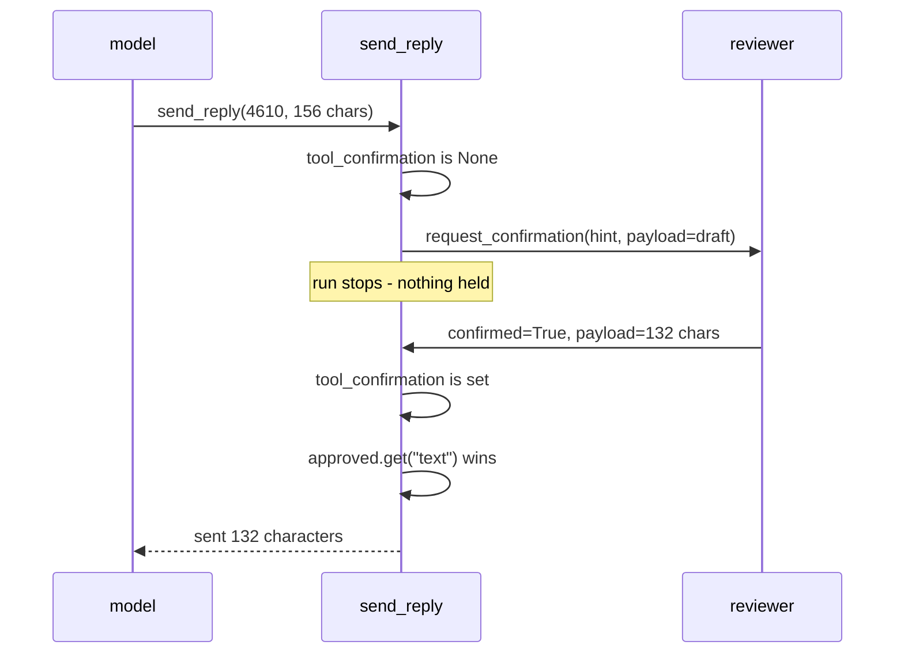

# 3.1 — The human changes the answer

## One-line answer

`tool_context.request_confirmation(hint=..., payload=...)` sends the work itself to the person
and takes back whatever they hand over, so the text that reached the customer was **132
characters the reviewer wrote**, not the **156 characters the agent drafted**.

## The story

You order wedding invitations. The printer sends a proof: one card, on the real paper, in the
real ink, with your names and the date on it.

You read it and you find the road is spelt "Whitfeild". You take a pen, strike the line
through, write the correction in the margin, initial it, and send the proof back.

Notice what you did not do. You did not tell the printer that the proof was rejected. You did
not send a list of instructions and ask him to try again. You sent back a **corrected object**,
and the thing he prints is your corrected object.

Now notice what has quietly happened to the record. There are two versions of that card in
existence. The one the printer set, and the one that went to five hundred guests. They are not
the same, and if anyone later asks *what did we send out?*, the answer is not in the printer's
files.

## The idea in plain language

**Edit** is the third of the four patterns from
[1.1](../01-the-shape-of-the-wait/1.1-four-questions-wearing-one-name.md), and it is the one
that most designs collapse into *approve* by mistake.

The difference is what travels back. In approve or reject
([2.1](../02-approve-or-reject/2.1-the-gate-that-returns-one-bit.md)), the person returns one
bit and the system executes the thing it already had. In edit, the person returns **a new
version of the thing**, and the system executes that instead.

That single change has three consequences, and they are the whole of this section:

1. **The person needs to be shown the object, not a description of it.** You cannot correct a
   spelling in a summary. This is why the confirmation carries a payload.
2. **What executes is not what the agent produced.** Every record that says "the agent sent
   this reply" is now false unless something stored both versions
   ([3.3](3.3-what-the-record-says-the-customer-got.md)).
3. **The gap between showing and executing is now a place where the object can change**, which
   is a security question rather than a bookkeeping one
   ([3.2](3.2-approve-one-thing-run-another.md)).

Two terms, defined once.

A **payload** here is arbitrary structured data attached to a confirmation request — in ADK it
is anything that survives being turned into JSON. It travels out with the question and back
with the answer, and the tool decides what to do with what comes back.

**Dynamic confirmation** is the tool asking for confirmation *from inside its own body*, rather
than the framework asking on its behalf before the body runs. Part 2.1 used the static form,
`require_confirmation=True` on the `FunctionTool`, where ADK builds the question for you from
the call's arguments. Dynamic confirmation is the other door into the same machinery, and it is
the one that lets you choose what the person sees.

## Why Sutra needs it

The desk drafts a reply to a customer. A support team that is handed a draft will not confine
itself to yes and no — the first thing anybody does with a draft is change a word in it, and a
system that only accepts yes or no forces them to reject a good reply because one sentence is
wrong.

Day 63 writes the policy for which actions need a person, and the column that says *which
pattern* is only useful if edit is available as an answer. Day 64 then builds the gate, and the
pending record it designs has to have somewhere to put the returned text. A record built for
approve has a `decision` field and no room for a payload, and retro-fitting one after the
interface has shipped means migrating every historical row.

## The mechanism

The tool asks for confirmation itself, hands over the draft, and uses whatever comes back:

```python
def send_reply(ticket: str, text: str, tool_context: ToolContext) -> dict:
    """Send the drafted reply to the customer, after a human has seen the draft."""
    confirmation = tool_context.tool_confirmation
    if confirmation is None:
        tool_context.request_confirmation(
            hint=f"Read the draft for ticket {ticket}. Edit it or send it as it is.",
            payload={"ticket": ticket, "text": text},
        )
        return {"status": "waiting for a human"}
    if not confirmation.confirmed:
        return {"error": "rejected"}
    approved = confirmation.payload or {}
    return _desk.send_reply(ticket, approved.get("text", text))
```

**Line by line:**

- `tool_context: ToolContext` is what makes this the dynamic form. ADK injects it when the
  parameter is present, and it is the handle through which a tool can reach the run it is part
  of. Verified against `adk.dev/tools-custom/function-tools/`, fetched 2026-09-06, and against
  the installed `google-adk==2.7.1` at `google/adk/tools/tool_context.py`.
- `tool_context.tool_confirmation` is `None` on the first pass and holds the person's answer on
  the second. **The tool body runs twice**, and the `if` is how it tells the two passes apart.
  This is the part that surprises people: there is no separate "on approval" callback.
- `request_confirmation(hint=..., payload=...)` is the ask. `hint` is prose for the person;
  `payload` is the object they are being asked about.
- `return {"status": "waiting for a human"}` after requesting is not a result. The run is
  stopping, and this string is what the model would see if it ever got that far. Returning
  something honest here rather than `None` keeps the transcript readable.
- `approved.get("text", text)` is the whole edit pattern in one expression: **prefer what came
  back, fall back to what we had.** If the payload is missing a `text` key the tool still
  works, which matters because the payload crosses a process boundary and you do not control
  what the other side sends.

Run it with a reviewer who changes the wording:

```bash
cd days/day-62-human-in-the-loop/lab
uv run python edit.py
```

**Line by line:**

- `edit.py` builds a real `LlmAgent`, a real `InMemoryRunner` and a scripted model that reads
  its replies off a list. No provider is called, which is why this day spends nothing.
- The "human" is the script itself: it takes the payload out of the pause, replaces `text` with
  `EDITED`, and hands it back on the `adk_request_confirmation` response.

Measured on 2026-09-06:

```text
  shown to the human:
    ticket 4610, 156 characters
    Your session ends at the identity provider redirect because the cookie i...

  the human returns an edited payload

  sent 1 reply
    132 characters: Your sign-in session is dropped when you are redirected back from your i...

  the draft the agent wrote is NOT what the customer got
```

Read the two character counts. The agent drafted **156** characters. The customer received
**132**. Nothing errored, nothing was rejected, and the run reports success — and the sentence
that went out was written by a person the model never heard from.

Now the same code with a reviewer who changes nothing:

```bash
uv run python edit.py --asis
```

**Line by line:**

- `--asis` hands the payload straight back untouched. Every other line of the run is identical.

```text
  the human returns the same payload

  sent 1 reply
    156 characters: Your session ends at the identity provider redirect because the cookie i...

  the draft the agent wrote is what the customer got
```

The same code path produced both outcomes. That is worth sitting with: **the edit pattern
subsumes approve.** A reviewer who returns the payload unchanged has approved it. A reviewer
who returns one bit and no payload has approved it too, because of the `.get` fallback. There
is no separate approve implementation here, and there does not need to be.

What there does need to be is a record that can tell the two runs above apart, because from the
outside they look identical: one reply sent, no errors, ticket 4610.



## When it breaks

The failure is not that the edit is lost. It is that the edit is **kept and not recorded**, and
the system quietly starts lying about its own behaviour.

🎬 **The scene:** the desk ships with the edit pattern. Reviewers love it — they fix a phrase
and send. Nobody rejects anything any more, and the approval rate goes to a hundred per cent.

😬 **The naive fix:** report the hundred per cent as a success. The gate is working: everything
the agent drafts gets approved.

💥 **Why it fails:** the number is measuring the wrong event. A hundred per cent of drafts were
approved *after being rewritten*, and nothing counted the rewriting. Six months later somebody
proposes removing the gate, because a control that never refuses anything is obviously not
earning its latency, and the argument cannot be answered — the evidence that the gate was doing
work was thrown away every time a reviewer touched a word.

💡 **The insight:** in the edit pattern the useful signal is not *approved versus rejected*. It
is **how much changed**. A gate whose approval rate is a hundred per cent and whose median edit
distance is forty characters is doing more work than a gate that rejects one in twenty.

There is also a mechanical break, and it is worth reaching on purpose. Ask for confirmation
without a `ToolContext` and the framework has no way to route the answer back:

```bash
uv run python -c "
import warnings, json
warnings.filterwarnings('ignore', message=r'.*EXPERIMENTAL.*')
import edit
from google.adk.tools import FunctionTool
d = FunctionTool(edit.send_reply)._get_declaration()
print(json.dumps(d.parameters_json_schema, sort_keys=True))
"
```

```text
{"properties": {"text": {"title": "Text", "type": "string"}, "ticket": {"title": "Ticket", "type": "string"}}, "required": ["ticket", "text"], "title": "send_replyParams", "type": "object"}
```

That is the declaration for the tool written out above — the one whose signature is
`send_reply(ticket, text, tool_context)`. The schema has two properties and requires two. **ADK
removes `tool_context` from what the model sees and injects it itself**, which is why the
parameter can be added to a working tool without changing a single thing about how the model
calls it.

The consequence is the trap. A tool that omits the parameter has an identical declaration, so
nothing about the model's behaviour, the transcript or the schema tells you it is missing.
There is simply no handle to call `request_confirmation` on, and the tool runs straight through
and does the thing. **The pause fails open, silently, and the only evidence is that no
confirmation event was ever emitted.** A gated tool therefore deserves a test that asserts the
pause happened, not merely that the tool returned — a review pass will not catch a missing
parameter that the schema does not show.

## In production

**What a professional writes instead.** They store both versions and a diff. The pending record
carries `proposed` (what the agent wrote), `final` (what the person returned) and an
`edit_distance`, and the last one is a column on a dashboard. That is how you find out which
kinds of ticket the model is reliably wrong about, which is the input to improving the drafting
step rather than the gate. A gate that only produces a boolean produces no such input, and a
team running one has bought supervision without buying learning.

**What degrades at scale or under concurrency.** Edits do not batch. Ten approvals can be
cleared by one person in one sitting; ten edits are ten pieces of writing, and the queue grows
at the rate the agent produces drafts. Worse, the edit pattern has no natural bulk action, so
the "approve all" button that saves an approval queue cannot exist here. The arithmetic of that
is [8.1](../08-in-production/8.1-the-backlog-is-the-real-limit.md), and it is the reason most
production systems gate a small subset with edit and the rest with approve.

**The failure mode that only appears with real traffic.** The payload is a channel, and once it
exists people put things in it. A reviewer pastes formatted text from a document and the payload
arrives with characters your template does not escape. Another reviewer pastes an entire second
draft into a field sized for a sentence. Because the payload is arbitrary JSON, none of this
fails at the boundary — it fails at the customer, in an email with broken markup. **Validate
the returned payload exactly as hard as you would validate a request from outside**, because
that is what it is.

**The review comment a senior engineer leaves:** *"`approved.get("text", text)` means a payload
that comes back with no `text` key silently sends the model's original draft, and the audit row
will say a human approved it. That is the one case where a reviewer's inaction is
indistinguishable from their agreement. Make the payload required on this tool and fail loudly
if it is absent."*

**The interview question:** *"When your reviewer edits the agent's output, what do you store?"*
The answer that shows you have run one: *"Both versions and the distance between them. We
started with a boolean and it was useless — every draft was approved, because reviewers fixed a
word rather than rejecting, so the gate looked like it was catching nothing. Once we stored the
proposed text next to the final text we could see that a third of replies were being rewritten,
and which categories they were in. That number is what justified the gate, and it is also what
told us where the drafting step was weakest."*

## Check yourself

```bash
cd days/day-62-human-in-the-loop/lab
uv run python edit.py
uv run python edit.py --asis
```

Now change `EDITED` in `edit.py` to a much longer string and run it again. Watch which number
in the output moves and which does not, and say what a system that only recorded "approved"
would have known about either run.

**Out loud, without scrolling up:** explain why the edit pattern makes every record that says
"the agent sent this reply" untrue, and name the one field that fixes it.

**Next:** [3.2 — Approve one thing, run another](3.2-approve-one-thing-run-another.md).
