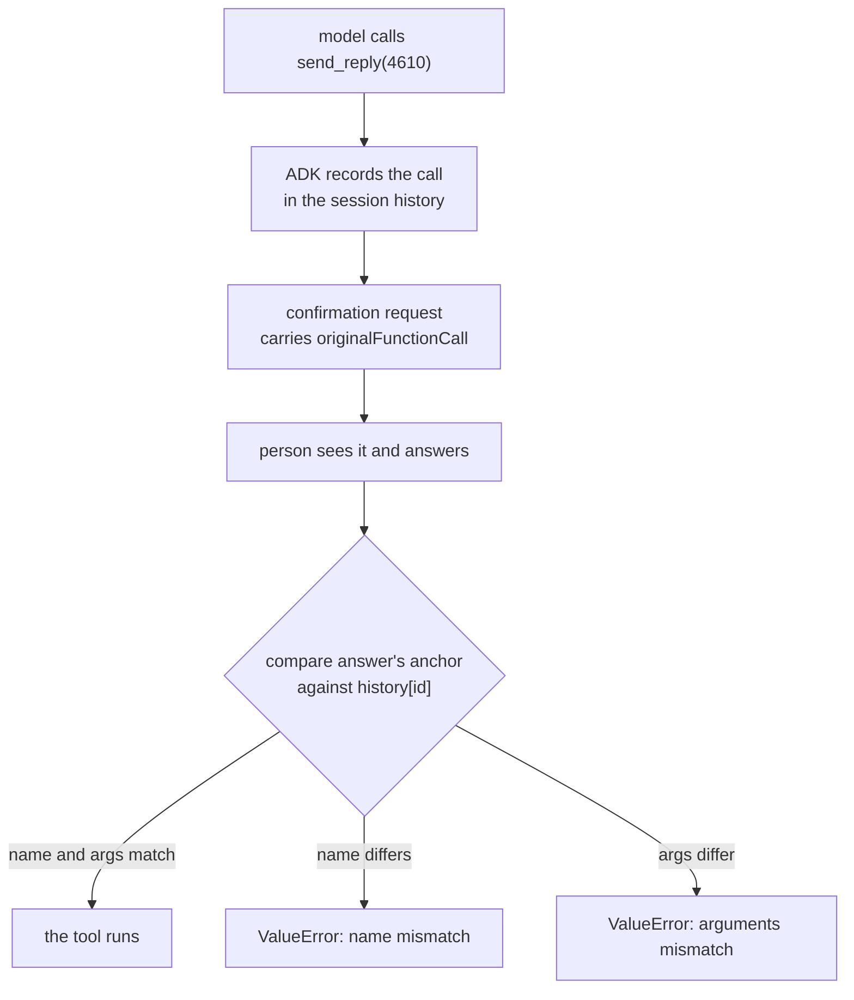

# 3.2 — Approve one thing, run another

## One-line answer

An approval is only worth anything if the call that runs is the call the person saw, and ADK
2.7.1 enforces that by re-reading the session's own history: change the ticket after the ask and
the run raises `ValueError: Function call arguments mismatch for ID 'fc-t-1'.` and sends
nothing.

## The story

You take your car in for a noise. The garage rings: the front brake pads are worn, it will be
this much, shall we go ahead? You say yes.

You collect the car and the bill is for a clutch.

The conversation you now have is not about whether a clutch was needed. It is about the fact
that you said yes to something else. You approved a specific job at a specific price, and the
work that happened was a different job. Your "yes" was carried across from one thing to
another, and once that is possible your approval is not a control at all — it is a formality
that produced a word the garage can quote back at you.

The fix in a real garage is boring and total: the job number. The estimate has one, your
authorisation is recorded against it, and the work is booked to it. If the job changes, it is a
new estimate and a new call.

## The idea in plain language

This part is about the gap. In every one of the four patterns there is a moment when the person
has been shown something and the system has not yet acted, and in that moment the thing they
were shown is sitting somewhere, editable.

The general name for the bug is **time-of-check-to-time-of-use**, usually shortened to TOCTOU:
a system checks a condition, then acts on the assumption that the condition still holds, and
something changed in between. Here the "check" is a person's judgement, which makes it worse in
one specific way — the check is expensive, slow, and cannot be repeated cheaply, so there is a
strong temptation to reuse it.

There are three separate things that could change in the gap, and they are not the same problem:

| What changes | Example | Whose problem |
| --- | --- | --- |
| **The call** | the approved `send_reply(4610)` becomes `send_reply(4633)` | this part |
| **The tool** | the approved `send_reply` becomes `refund` | this part |
| **The world** | the ticket the reply is about gets updated | [6.2](../06-nobody-answered/6.2-the-answer-to-a-question-that-no-longer-exists.md) |

The first two are about the **anchor**: the record of exactly which call the person agreed to.
The third is about the **evidence**: the state they were looking at when they agreed. A system
can get the anchor perfectly right and still send a reply about a refund that no longer exists,
which is why they are two parts rather than one.

An **anchor** in ADK is the `originalFunctionCall` that travels inside the confirmation
request — the tool's name and its exact arguments. Part 2.1 printed it; this part attacks it.

## Why Sutra needs it

Day 64 builds the approval gate on the desk's send step, and the pending record it writes will
live in a store that other code can reach. Day 65 then kills the process between the ask and
the answer and resumes it, which means the anchor will be read back from disk by a process that
did not write it.

Every one of those is a place where the call could differ from the call that was approved. If
the gate does not compare, then the gate's guarantee is "a human said yes to something", and
that is not a guarantee anyone can act on in an incident review.

There is a sharper reason too. Day 66 opens the safety phase with prompt injection, and an
attacker who can influence the agent's next tool call but not the human's decision is exactly
the attacker this check stops.

## The mechanism

The honest round trip first, so there is a baseline:

```bash
cd days/day-62-human-in-the-loop/lab
uv run python tamper.py
```

**Line by line:**

- `tamper.py` gates two tools with `require_confirmation=True` — `send_reply` and `refund` — and
  leaves a third, `note`, ungated. Three tools are needed because two of the attacks below
  redirect the approval from one tool to another.
- With no flag it does nothing dishonest: it asks, answers `confirmed=True`, and lets the run
  finish.

Measured on 2026-09-06:

```text
  the human was shown: send_reply(ticket=4610, 156 chars)

  sent: 1
```

Now change the ticket in the pause after the person has seen it and before they answer:

```bash
uv run python tamper.py --swap
```

**Line by line:**

- The edit reaches into `runner.session_service.sessions[...]` and mutates the stored event in
  place. That detail matters: `get_session` hands back a copy, and editing a copy would prove
  nothing about what the runner will read. This reaches the object the runner itself will use.
- Only one field changes — `originalFunctionCall.args.ticket` goes from `4610` to `4633`. The
  confirmation id, the tool name and the reviewer's answer are all untouched.

```text
  the human was shown: send_reply(ticket=4610, 156 chars)
  between the ask and the answer, the ticket is changed to 4633

  ValueError: Function call arguments mismatch for ID 'fc-t-1'.
  sent: 0
```

ADK refuses, and `sent: 0` is the number that matters — the reply to the wrong customer did not
go out. The framework kept its own copy of the original call and compared the two.

Redirect the approval to a different gated tool:

```bash
uv run python tamper.py --rename
```

**Line by line:**

- This time the name changes rather than the arguments: `send_reply` becomes `refund`, which is
  also gated. If approvals were fungible, a yes to sending a reply would become a yes to paying
  money back.

```text
  the human was shown: send_reply(ticket=4610, 156 chars)
  between the ask and the answer, the tool is changed to refund

  ValueError: Function call name mismatch for ID 'fc-t-1': history has 'send_reply', confirmation has 'refund'.
  sent: 0
```

Note the error text: it names both sides. `history has 'send_reply', confirmation has 'refund'`
is the framework telling you exactly what it compared, which is the difference between an error
you can act on and an error you have to reproduce.

And the version worth trying because you would expect it to be the dangerous one — redirecting
the approval at a tool that was never gated at all:

```bash
uv run python tamper.py --ungated
```

**Line by line:**

- `note()` is registered as a plain `FunctionTool` with no confirmation. The hope of an attacker
  here is that pointing the anchor at an ungated tool skips the comparison entirely, because
  there was nothing to compare against.

```text
  the human was shown: send_reply(ticket=4610, 156 chars)
  the anchor is pointed at note(), which was never gated
  ValueError: Function call name mismatch for ID 'fc-t-1': history has 'send_reply', confirmation has 'note'.
  sent: 0
```

It is refused for the same reason and by the same check. The comparison is against **the call
in the history under that id**, not against a list of gated tools, so whether the target is
gated is irrelevant. That is the right design: a check that consulted a list of gated tools
would have a hole exactly the size of the ungated ones.



## When it breaks

The check above is ADK's, and it protects one specific gap: between ADK emitting the
confirmation and ADK running the tool. Your own pending record is a **second** copy of the same
information, living in your store, and nothing in the framework is comparing that.

🎬 **The scene:** the gate is built the way Day 64 will build it. The pending question goes into
a table with the ticket id and the draft. A reviewer opens it on a queue page, approves, and the
resume path reads the row and calls `send_reply` with the values from the row.

😬 **The naive fix:** trust it, because ADK raised a `ValueError` when the anchor was tampered
with, so the anchor is protected.

💥 **Why it fails:** the resume path is not going through the anchor. It read a row from your
table and made a fresh call. ADK's comparison never runs, because from ADK's point of view this
is a new invocation with a new id. Every guarantee demonstrated above belongs to the path where
the confirmation response is fed back into the same session — and a queue page that reads a row
and calls a function is not that path.

💡 **The insight:** the anchor has to be re-checked **wherever the decision is turned into an
action**, and if you have two such places you need two checks. The framework protects its own
round trip. It cannot protect a round trip you built beside it.

You can see the shape of the missing check by looking at what the honest run compares. Print
the anchor out of a real pause:

```bash
uv run python -c "
import asyncio, json, warnings
warnings.filterwarnings('ignore', message=r'.*EXPERIMENTAL.*')
import tamper
print(json.dumps(asyncio.run(tamper.anchor_only()), indent=2, sort_keys=True))
"
```

That command does not work yet, and that is deliberate: `tamper.py` has no `anchor_only`. It is
the first `TODO(me)` in this day's build brief, because writing it is how you find out what
your own record would have to store to make the same comparison. The two fields are in the
error messages above.

## In production

**What a professional writes instead.** The pending record stores a digest of the call — tool
name plus canonical arguments, hashed — and the resume path recomputes it and compares before
acting. A digest rather than the fields themselves, because the comparison must be
all-or-nothing: a resume that checks the ticket and forgets the amount is a resume that
approves a refund of the wrong size. Day 65's gate criteria include exactly this, phrased as
*the approved payload is the payload that executes*.

**What degrades at scale or under concurrency.** The gap widens. In this lab it is
microseconds; in production it is however long a person takes, and the longer it is the more
likely something legitimate has changed the call. That produces a real operational problem:
mismatches stop being attacks and start being ordinary staleness, and a team that treats every
mismatch as a security event will page somebody every night. The two need different handling —
a mismatch on the anchor means *ask again*, and it belongs on a counter, not a pager.

**The failure mode that only appears with real traffic.** Argument canonicalisation. Two JSON
objects that mean the same thing can serialise differently — key order, a float that came back
as `2400.0` instead of `2400`, whitespace in a draft that a form field trimmed. Compare raw
strings and you will get mismatches on approvals nobody touched, and because they look like
attacks the first response is usually to loosen the comparison, which removes the control. Sort
the keys and normalise the types **before** hashing, and write a test with a float and a
trailing space in it.

**The review comment a senior engineer leaves:** *"The resume handler takes `ticket` and `text`
from the request body. So the thing that executes is whatever the client sends back, and the
approval record is decoration. Read the ticket and the text from the pending row, compare a
digest of them against the digest stored at ask time, and ignore the body entirely."*

**The interview question:** *"How do you know the action you performed is the action the human
approved?"* The answer that shows you have shipped one: *"We hash the tool name and the
canonical arguments at ask time and store the digest on the pending row, then recompute and
compare before the action runs. The framework does its own version of this — in ADK, tampering
with the anchor between the ask and the answer raises a `ValueError` naming both sides and the
tool does not run. But that only covers its own round trip. Our approval came back through a
queue page, which was a second path the framework knew nothing about, and that path had to do
the comparison itself."*

## Check yourself

```bash
cd days/day-62-human-in-the-loop/lab
uv run python tamper.py
uv run python tamper.py --swap
uv run python tamper.py --rename
uv run python tamper.py --ungated
```

Three of those four print a `ValueError` and `sent: 0`. Read the two error messages carefully
and write down, in your own words, what ADK compared and what it compared it against.

**Out loud, without scrolling up:** explain why pointing an approval at an ungated tool is
refused, and why refusing it for *that* reason is better than checking a list of gated tools.

**Next:** [3.3 — What the record says the customer got](3.3-what-the-record-says-the-customer-got.md).
