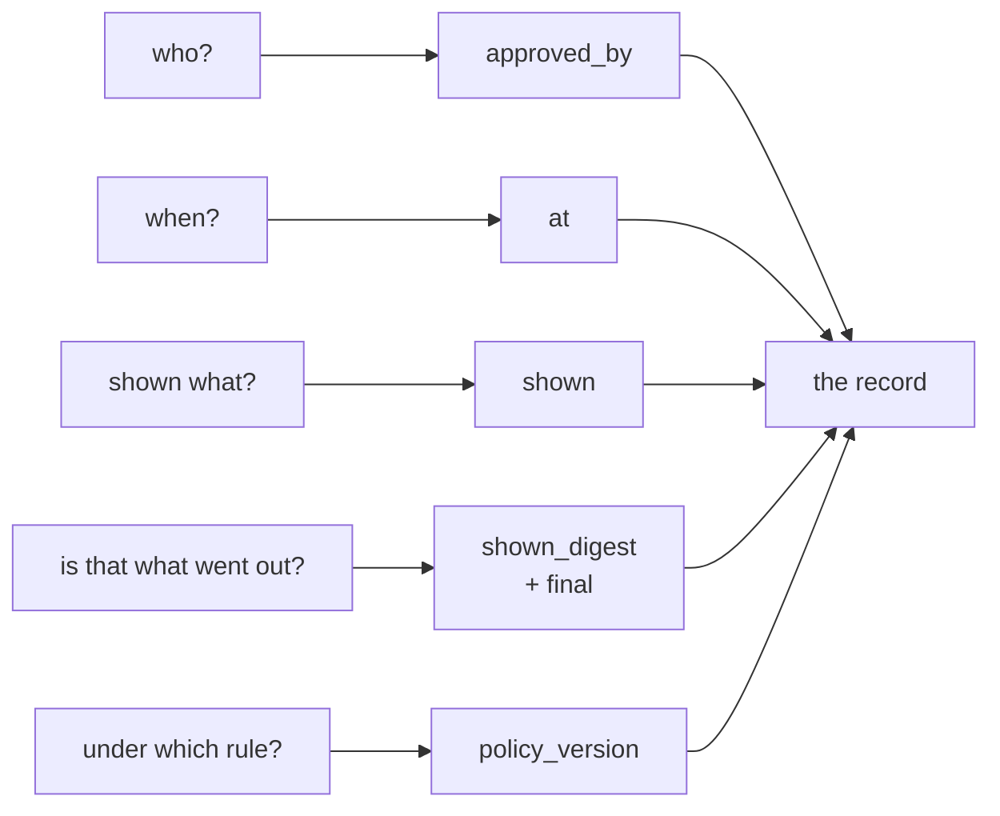

# 3.3 — What the record says the customer got

## One-line answer

An approval record with three fields answers **2 of 5** questions anybody will actually ask
about it later, and the three it cannot answer are the three that decide whether the approval
meant anything.

## The story

You telephone a takeaway. You ask for two curries and a rice, then change your mind halfway
through and swap one curry for a biryani. The person on the phone repeats the order back —
correctly — and you hang up happy.

The bag arrives with two curries and a rice.

You look at the receipt stapled to it. The receipt says two curries and a rice. The kitchen
ticket said two curries and a rice. Every piece of paper in that shop agrees with every other
piece of paper, and all of them are wrong, because the correction happened in a conversation
that nothing wrote down.

The argument you are about to have cannot be settled by anyone's records. There is no version
of the order anywhere that says *biryani*. You know what you asked for and you cannot show it.

## The idea in plain language

Part 3.1 showed that in the edit pattern the thing that executes is **not** the thing the agent
produced. This part is about the consequence: unless something stores both, the system now has
no way to describe its own behaviour.

An **audit record** is what a system writes down about a decision so that the decision can be
examined later by someone who was not there. It is not a log line. A log line is written for
whoever is debugging tonight; an audit record is written for somebody in six months who has a
specific question and no memory of any of this.

The test for an audit record is not "does it contain a lot of fields". It is **which questions
can be answered from it**, and the questions are always some version of these five:

1. **Who approved it?**
2. **When?**
3. **What exactly were they shown?**
4. **Was that the text the customer received?**
5. **Which policy said this needed approving?**

Question 3 is the one that separates a record from a receipt. "Approved by reviewer-3" tells you
that a name was attached to an outcome. It does not tell you whether that person saw a full
draft or a one-line summary, which means it cannot distinguish a considered decision from a
reflex — and [7.1](../07-what-the-human-sees/7.1-the-tick-box-nobody-reads.md) measures how
different those two are.

Question 4 is the one the edit pattern forces. Without it, a record of an edited reply
truthfully says a human approved something and silently implies they approved the text that
went out.

Question 5 exists because policies change. Day 63 writes a policy table and it will have
versions. An approval recorded without the version of the rule that demanded it cannot be
re-examined when the rule turns out to have been wrong, because you no longer know which rule
was in force.

## Why Sutra needs it

Day 64's pending record is the artefact that carries all of this, and it is written once. A
record designed around question 1 and question 2 will need a migration to answer questions 3
to 5, and migrations of audit tables are unpleasant precisely because the historical rows
cannot be back-filled — the evidence was never captured.

Day 65's gate then asks, as an acceptance criterion, *the run's audit record answers who
approved what, on what evidence, when*. That criterion is checkable only if this part decided
what "on what evidence" means before the record was designed.

## The mechanism

Two records for the same approval, scored against the five questions:

```bash
cd days/day-62-human-in-the-loop/lab
uv run python audit.py --thin
```

**Line by line:**

- `audit.py` builds one full record and then filters it down to a field list, so the two arms
  differ only in which fields survive. Nothing about the decision itself changes between them.
- `ANSWERED_BY` maps each of the five questions to the single field that answers it, which is
  what turns "is this a good record?" into something countable.
- `--thin` keeps `ticket`, `approved_by` and `at` — the three fields almost every first
  implementation has, because they are the three that are obvious while you are writing the
  approve button.

Measured on 2026-09-06:

```text
  record kind: thin  (3 fields)
{
  "ticket": "4610",
  "approved_by": "reviewer-3",
  "at": {
    "tick": 41
  }
}

  question                                    answerable
  Who approved it?                            yes
  When?                                       yes
  What exactly were they shown?               NO
  Was that the text the customer received?    NO
  Which policy said this needed approving?    NO

  2 of 5 questions can be answered from this record
```

That record is not obviously deficient. It has a person, a time and a subject, and it would
survive a code review from anybody who had not asked the five questions. It answers two of
them.

Now the full record:

```bash
uv run python audit.py
```

**Line by line:**

- The full arm adds four fields: `shown` (the object the person actually saw), `shown_digest`
  (a short hash of it), `decision`, and `policy_version`.
- `shown_digest` is not redundant with `shown`. The digest is what makes a **comparison**
  cheap — it is the field [6.2](../06-nobody-answered/6.2-the-answer-to-a-question-that-no-longer-exists.md)
  uses to detect that the world moved, and the field 3.2 wanted for the anchor.

```text
  record kind: full  (7 fields)
{
  "ticket": "4610",
  "approved_by": "reviewer-3",
  "at": {
    "tick": 41
  },
  "shown_digest": "41b4d09f1d1b",
  "shown": {
    "draft": "Your session ends at the identity provider redirect because the cookie is dropped on the cross-site hop. Set SameSite=None and Secure on the session cookie.",
    "customer": "acct-2231",
    "refund": 0
  },
  "decision": "approved",
  "policy_version": "day63-policy-v1"
}

  question                                    answerable
  Who approved it?                            yes
  When?                                       yes
  What exactly were they shown?               yes
  Was that the text the customer received?    yes
  Which policy said this needed approving?    yes

  5 of 5 questions can be answered from this record
```

Four extra fields took the record from two answers to five. That ratio is the argument for
designing the record from the questions rather than from the code: the fields are cheap, and
which four you need is not guessable from inside the approve handler.

One nuance worth stating plainly. `shown` here is the draft the reviewer was given. In the
**edit** pattern that is the *proposed* text, and the text that reached the customer is what
came back in the payload. A complete record for an edited reply therefore stores both, and
question 4 is answered by comparing them rather than by reading one field. That is why 3.1's
production note asks for `proposed`, `final` and the distance between them — the record here is
the approve-shaped version of the same idea, and the edit-shaped version has one more field.



## When it breaks

The break is not a missing field. It is a field that is present and means something different
from what the reader assumes.

🎬 **The scene:** an incident. A customer received a reply promising a refund they were not
owed. Somebody pulls the approval record: `approved_by: reviewer-3`, `decision: approved`,
timestamp, ticket id. Five fields, all populated.

😬 **The naive fix:** conclude that reviewer-3 approved a reply promising the wrong refund, and
have a conversation with reviewer-3.

💥 **Why it fails:** the record says a person approved *something*. It does not say what was on
their screen. If the interface showed one line and a ticket number — the screen
[7.1](../07-what-the-human-sees/7.1-the-tick-box-nobody-reads.md) measures at **1 mistake
caught out of 8** — then reviewer-3 could not have seen the refund amount at all, and the
conversation is about the wrong thing entirely. The defect is in the interface, and the record
as designed cannot tell you that.

💡 **The insight:** an audit record that captures the decision but not the evidence turns every
incident into a question about a person. Capturing the evidence turns it back into a question
about the system, which is where the fixable defects are.

The mechanical version of the same failure is quieter. Ask for a field the record does not have:

```text
Traceback (most recent call last):
  File "<string>", line 4, in <module>
KeyError: 'shown'
```

That is `python -c "import audit; audit.build(audit.THIN_FIELDS)['shown']"`, run against the
thin record.

A `KeyError` is the good case, because somebody finds out. The bad case is a report that reads
the record with `.get("shown", "")` and renders an empty evidence panel, so the incident review
sees a record that appears to say the reviewer was shown nothing — and cannot tell that apart
from a reviewer who really was shown nothing.

## In production

**What a professional writes instead.** The evidence is stored **by reference plus digest**,
not inline, once the drafts get long: the record holds `shown_digest` and a pointer to
immutable storage holding the rendered object. Inline is fine at this scale and stops being
fine when the shown state includes attachments. What must never happen is storing only the
pointer, because the thing at the other end can be edited and the digest is the only thing that
proves it has not been.

**What degrades at scale or under concurrency.** Audit records are append-only and never
deleted, so they become the largest table in the system and the one with the longest retention.
That collides with Day 69's subject: the evidence field contains customer text, so the audit
table is now a copy of customer data with a longer retention than the ticket store, and a
deletion request has to reach it. Systems get this wrong by treating audit as exempt.

**The failure mode that only appears with real traffic.** `approved_by` stops being a person.
It becomes a service account, because somebody wired an automatic approval for a low-risk
category and reused the same table. Now the record cannot distinguish a human decision from a
policy decision, and every count of "how often did a human intervene" is wrong. The fix is a
separate field for the *kind* of approver, added before the first automatic approver exists
rather than after.

**The review comment a senior engineer leaves:** *"`decision: approved` and nothing about what
was on the screen. In an incident this record will make it look like a person read a draft and
agreed with it, and I do not believe our approval screen shows the draft. Store the rendered
object and a digest of it, and store the policy version, or this table is going to get somebody
blamed for an interface bug."*

**The interview question:** *"What is in your approval record?"* The answer that shows you have
been through an incident: *"Who, when, the decision, the policy version that demanded the
approval, and — the one people leave out — exactly what the approver was shown, with a digest
of it. We scored our first record against the five questions an incident review actually asks
and it answered two of them. The one that mattered was 'what were they looking at', because
without it every incident turns into a conversation about whether a person was careless, when
half the time the screen did not contain the field they would have needed."*

## Check yourself

```bash
cd days/day-62-human-in-the-loop/lab
uv run python audit.py --thin
uv run python audit.py
```

Now add a sixth question to `QUESTIONS` — *"was this reply edited before it went out?"* — and a
row in `ANSWERED_BY` naming the field that would answer it. Run it again and see what the full
record scores. That missing field is the one 3.1 asked for.

**Out loud, without scrolling up:** name the five questions, and say which one distinguishes a
considered approval from a reflex.

**Next:** [4.1 — A missing fact is not a missing permission](../04-ask-a-question/4.1-a-missing-fact-is-not-a-missing-permission.md).
