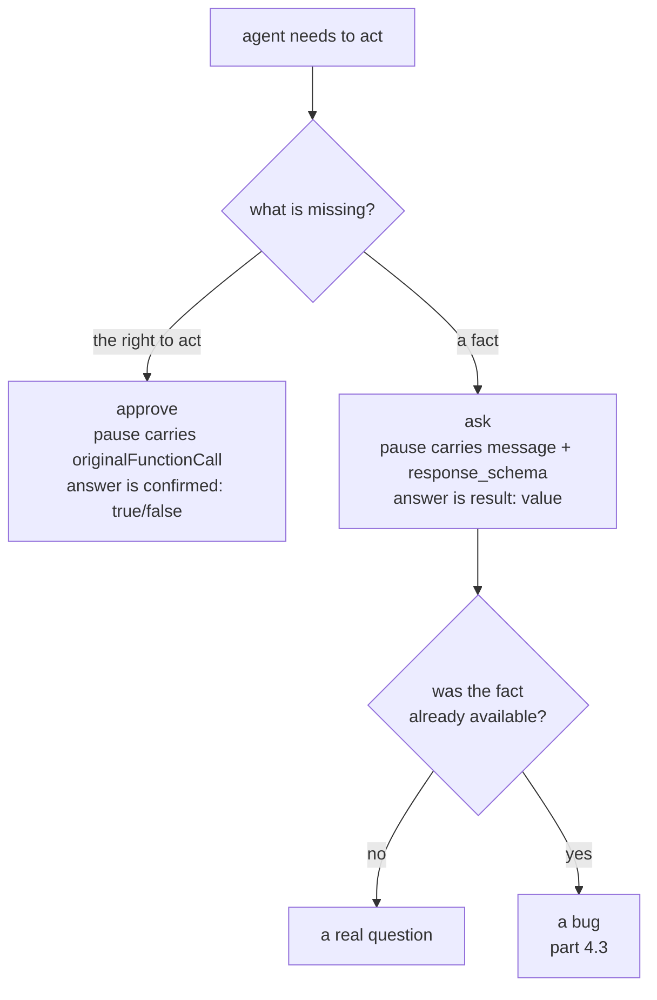

# 4.1 — A missing fact is not a missing permission

## One-line answer

`request_input` stops the run for **information** rather than for **permission**, and the
difference is visible in the pause itself: the call carries a `message` and a
`response_schema` instead of an `originalFunctionCall`, because there is no action waiting to
be allowed.

## The story

Someone gives you the money for a tin of paint and sends you to the shop for the front bedroom.

You get there and realise you do not know the colour.

Now think about what would not help. Being told the money is definitely yours to spend would
not help. Being told again to go ahead and buy the paint would not help. Being handed more
money would not help. You have every permission anybody could give you, and you are standing in
a shop unable to move, because the thing you are missing is not permission.

You ring and ask. They say magnolia. You buy magnolia.

The whole interruption lasted one sentence, and no authority was involved in it at all.

## The idea in plain language

**Ask a question** is the third pattern from
[1.1](../01-the-shape-of-the-wait/1.1-four-questions-wearing-one-name.md), and the reason it
gets its own section is that it is constantly mistaken for approval.

The distinction is exact:

- **Approve** means: I know what to do, I am not allowed to do it alone.
- **Ask** means: I am allowed, and I do not know what to do.

They produce the same visible event — the run stops, a person is interrupted — and they are
opposite in every other respect.

| | Approve or reject | Ask a question |
| --- | --- | --- |
| What is missing | authority | information |
| What the person is shown | a proposed action | a question |
| What they return | one bit, or an edited payload | a value |
| If they say the "wrong" thing | the action does not happen | the agent proceeds on bad data |
| Could the system avoid it? | no, by design | **often yes** ([4.3](4.3-the-question-you-should-not-have-asked.md)) |

The last row is the one with teeth. An approval you can avoid is an approval you should not have
put in the policy. A question you can avoid is a **bug**: the agent had a way to find the answer
and did not take it.

Two ADK terms, defined once.

A **long-running function tool** is a tool whose Python body returns `None` rather than a
result. ADK treats that as "there is no answer yet", marks the call in the event's
`long_running_tool_ids`, and stops the run instead of waiting. Part 1.1 printed that field; this
part is about the two built-in tools that use it.

**Elicitation** is the same idea in the MCP protocol, met on Day 37: a server that cannot
proceed without an input asks the client for one mid-request. If that vocabulary is fresh,
[Day 37, part 3.1](../../../day-37-auth-and-elicitation/parts/03-the-question/3.1-the-job-that-stopped-and-left-a-number.md)
is the introduction, and it matters here because the shape is identical — a job that stopped and
left a way to be resumed.

## Why Sutra needs it

The desk's classify step decides what a ticket is about, and some tickets genuinely do not say.
A duplicate-charge ticket that never states the order number cannot be researched, and the
agent has exactly two honest options: stop and ask, or stop and say it cannot proceed.

Building the approval gate for this would be a category error, and it is one Day 63 has to
avoid making in the policy table. An approval on the classify step would put a person in the
way of every ticket in order to catch the few that are ambiguous, which is the definition of a
control defeated by its own volume.

Day 64 then has to route both kinds of pause through one pending store, and the record needs a
field saying which kind it is — because the resume path for an approval reads a boolean and the
resume path for a question reads a value.

## The mechanism

ADK ships the question as a built-in tool. Offer it, and the model can stop the run by calling
it:

```bash
cd days/day-62-human-in-the-loop/lab
uv run python ask.py
```

**Line by line:**

- `from google.adk.tools import get_user_choice, request_input` — both are instances, not
  classes, and both are `LongRunningFunctionTool`s. Verified against
  `adk.dev/tools-custom/function-tools/`, fetched 2026-09-06, and against the installed
  `google-adk==2.7.1`.
- The agent is given `request_input` and nothing else. There is no `send_reply` in this run at
  all, which is the point: nothing is waiting to be permitted.
- The scripted model calls it with a `message` and a `response_schema`, then — on the second
  turn, after the answer arrives — says one sentence and stops. `model.turns` counts how many
  times the model was consulted.

Measured on 2026-09-06:

```text
  the tool offered to the model: adk_request_input
  call     adk_request_input  args={'message': 'Which order number is the duplicate charge on?', 'response_schema': {'type': 'string'}}
  long_running_tool_ids: ['fc-ask-1']
  -> the run stops here with no response for that call

  the human answers: 'ORD-8874'
  model: Thank you, drafting now.

  model turns used: 2
```

Compare the `args` line with the one part 2.1 printed for an approval. There, the pause carried
`originalFunctionCall` and `toolConfirmation` — a proposed action and a place to put a yes or
no. Here it carries `message` and `response_schema`. **There is no proposed action in this
pause**, because the agent is not asking to be allowed to do anything. It is asking what the
order number is.

`response_schema` is the second thing worth reading. `{'type': 'string'}` is the agent
declaring what shape of answer it can use, which is how the question stays machine-usable — the
value that comes back goes into the agent's reasoning, not onto a screen for a person to
interpret.

The answer travels back as an ordinary function response against the pending call's id:

```python
answer = types.Content(
    role="user",
    parts=[
        types.Part(
            function_response=types.FunctionResponse(
                id=pending.id, name=pending.name, response={"result": reply}
            )
        )
    ],
)
```

**Line by line:**

- `id=pending.id` is what joins the answer to the question. This is the same id that
  [3.2](../03-edit/3.2-approve-one-thing-run-another.md) showed ADK using to catch a tampered
  anchor, and it is the reason an answer cannot be applied to a different pause by accident.
- `name=pending.name` — the tool's own name, `adk_request_input`, not the name of some action.
  On an approval this would be `adk_request_confirmation`.
- `response={"result": reply}` is the value. On an approval the response is
  `{"confirmed": True}`. **Those two shapes are how a resume path tells the patterns apart**,
  and they are what your pending record has to remember.
- `role="user"` — the answer enters the conversation as though the user said it, which is
  literally what happened: a person supplied a fact.

**Two model turns, one question.** That is the cost line for this pattern, and it is worth
noticing that it is *cheaper* than it looks: the first turn produced the question, the second
consumed the answer, and no turn was spent on the waiting. A design that polled a person, or
that re-ran the agent from the start once the answer arrived, would spend more.



## When it breaks

The failure is asking the wrong *kind* of question, and it does not raise anything.

🎬 **The scene:** a ticket arrives with no order number. The agent needs one. Someone has
already built the approval gate, so the pause machinery that exists is
`require_confirmation`, and it gets used.

😬 **The naive fix:** gate the research tool. The person is shown *"look up order ORD-????"* and
two buttons.

💥 **Why it fails:** the person can say yes or no, and neither answer contains an order number.
Say yes and the agent looks up nothing. Say no and the agent learns only that the call was
refused, which — as [2.3](../02-approve-or-reject/2.3-what-a-no-has-to-carry.md) measured — is
the fixed string `{'error': 'This tool call is rejected.'}` with the reviewer's reason
discarded. The information the system needed was never askable through that interface, so it
never arrives, and the interruption spent a person's attention for nothing.

💡 **The insight:** the pause primitive you have shapes the questions you can ask, and if you
only build one you will start bending every need into its shape. Build both before you write the
policy, because the policy's job is to choose between them.

The mechanical break in this pattern is subtler and more dangerous: **an answer is trusted
completely.** An approval that comes back wrong stops an action. A fact that comes back wrong
*starts* one, on bad data, with the system's full confidence:

`ask.py` deliberately has no arm that supplies a wrong answer, because writing one is a
`TODO(me)` in this day's build brief. Add a `--wrong` flag that answers `'ORD-0000'` instead of
`'ORD-8874'`, run it, and notice that **nothing anywhere objects**. There is no schema
violation — `'ORD-0000'` is a string, which is all `{'type': 'string'}` asked for — and there is
no validation step between the person and the agent's next decision. Compare that with the
approval path, where a wrong answer is contained by the fact that the worst it can do is refuse
an action.

The two built-in tools are worth confirming for yourself rather than taking on trust:

```bash
uv run python -c "
import warnings
warnings.filterwarnings('ignore', message=r'.*EXPERIMENTAL.*')
from google.adk.tools import get_user_choice, request_input
for t in (request_input, get_user_choice):
    print(type(t).__name__, '|', t.name, '| is_long_running =', t.is_long_running)
"
```

```text
LongRunningFunctionTool | adk_request_input | is_long_running = True
LongRunningFunctionTool | get_user_choice | is_long_running = True
```

Both are already-constructed instances rather than classes, both carry the flag that makes the
runner stop, and the name the model sees for `request_input` is `adk_request_input` — which is
why the transcript above and your own agent's logs disagree with the import line.

## In production

**What a professional writes instead.** They validate the answer against something more than
its type. `response_schema` gets a pattern, an enum, or a lookup — and where the answer names an
entity, the resume path checks that the entity exists before proceeding. The cheap version is
one line: reject an order number that is not in the orders table and ask again. Skipping it
means a typo from a tired reviewer becomes a research step against a non-existent order, and the
agent's next honest report is that it found nothing.

**What degrades at scale or under concurrency.** Questions are the pattern that scales worst,
because unlike approvals they cannot be delegated to a rota — the person who can answer *"which
order?"* is often the person already handling that ticket. So the queue for questions does not
drain by adding reviewers, which is the assumption every capacity plan makes. The number to
watch is not the queue depth but the share of tickets that generate a question at all, and the
lever is [4.3](4.3-the-question-you-should-not-have-asked.md).

**The failure mode that only appears with real traffic.** The model learns to ask. Given a
question tool and any ambiguity at all, an agent will use it, because asking is always locally
safer than guessing. What starts as a rare interruption becomes the default behaviour on
anything unclear, and the team's first sight of it is a queue that grew without any code change.
The fix is in the instruction and the tool description, not the plumbing: say explicitly what
must be looked up before a question is allowed.

**The review comment a senior engineer leaves:** *"This tool is offered on every turn with no
guidance about when to use it. The model will call it whenever the ticket is vague, which is
most of them. Put the fallback order in the instruction — check the ticket fields, then the
order record, then ask — and log which of those three answered it, so we can see how often the
question was avoidable."*

**The interview question:** *"When does your agent ask a person a question, as opposed to
asking for approval?"* The answer that shows you have built both: *"When it is missing an input
rather than missing authority. They look the same from outside — the run stops and somebody is
interrupted — but the pause carries different things and the answer comes back in a different
shape, so the resume paths are different code. The mistake I have seen is routing a missing
input through the approval gate, because that is the machinery a team has already built. The
person then gets two buttons and no way to supply the thing that was actually needed."*

## Check yourself

```bash
cd days/day-62-human-in-the-loop/lab
uv run python ask.py
uv run python approve.py
```

Read the `args` on the pause in each run. Write down, for each, what the system was missing and
what the person had to supply, and say why swapping the two interfaces would leave the agent
stuck in one direction and unprotected in the other.

**Out loud, without scrolling up:** give the one-sentence difference between approve and ask,
and say which of the two is sometimes a bug in the agent rather than a decision in the policy.

**Next:** [4.2 — A question with edges](4.2-a-question-with-edges.md).
