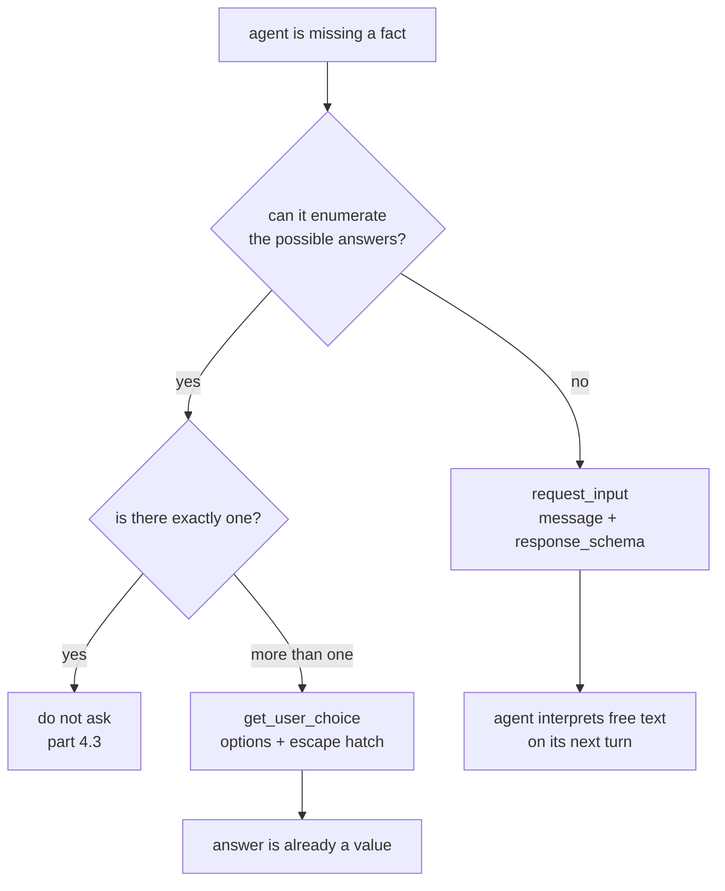

# 4.2 — A question with edges

## One-line answer

`get_user_choice` asks the same question as `request_input` with the answers enumerated
instead of open — the pause carries `{'options': ['ORD-8871', 'ORD-8874', 'neither']}` rather
than a `message` and a `response_schema` — and the choice between them is a choice about who
does the work of interpreting the reply.

## The story

At an eye test the optometrist flips a lens in front of you and says: *better with one, or
two?*

She does not say "how is your vision?" She could. It is a more open question and it would let
you tell her things a pair of numbers cannot capture. And it would be useless, because she
cannot do anything with "a bit blurry on the left in the evenings". What she can act on is
which of two lenses is sharper, so that is what she asks, over and over, narrowing.

Notice she also gives you a way out. If the two look identical you can say so, and she has a
plan for that answer too. She does not make you invent a third option; she has already made
room for it.

That is the whole design. The question is shaped to the set of things she can actually do next.

## The idea in plain language

Part 4.1 established the pattern: the agent is missing a fact and stops for one. This part is
about the **shape** of the question, and ADK gives you exactly two.

**Open** — `request_input`. You supply a message and a `response_schema`, and the person types
whatever they like. The agent then has to interpret it.

**Closed** — `get_user_choice`. You supply a list of options, and the answer is one of them. The
agent does not interpret anything.

The trade is not about politeness or interface design. It is about **where the ambiguity goes**:

| | Open (`request_input`) | Closed (`get_user_choice`) |
| --- | --- | --- |
| What the agent sends | a message and a schema | a list of options |
| What comes back | free text | one of the options |
| Who interprets it | the agent, on its next turn | nobody; it is already a value |
| Can the answer surprise you | yes | no |
| Cost of a bad question | the person answers a different question | the person cannot answer at all |
| Needs the agent to know the answers in advance | no | **yes** |

The last row is the constraint that decides it. `get_user_choice` requires the agent to have
already enumerated the possibilities, which means it can only be used where the agent has
looked something up. In the run below the three options are two real order numbers and an
escape hatch, and the agent could only produce that list because it had already fetched the
customer's orders.

That is the useful way to think about the two tools. **A closed question is an open question
plus a lookup.** If you can do the lookup, do it — and if you can do the lookup, ask yourself
whether you needed the question at all, which is [4.3](4.3-the-question-you-should-not-have-asked.md).

One term, defined once. An **escape hatch** is an option that means *none of these*. Without it
a closed question forces a wrong answer, because the person's only alternatives are to pick
something untrue or to abandon the interruption. Day 37 made the same argument about MCP
elicitation, where the protocol has three outcomes rather than two —
[Day 37, part 3.3](../../../day-37-auth-and-elicitation/parts/03-the-question/3.3-three-answers-not-two.md)
is that argument, and it is the reason `neither` is in the list below.

## Why Sutra needs it

The desk's research step looks up a customer's recent orders. When a duplicate-charge ticket
does not say which order it is about, the agent will typically be holding two or three
candidates — which is precisely the situation `get_user_choice` exists for.

Day 63's policy table needs to record, per pause, which shape is used, because the two have
different failure modes and a reviewer's screen has to render them differently. Day 64 then
resumes from a pending record, and a closed question's record can be validated on the way back
in — the answer must be one of the stored options — while an open one cannot.

## The mechanism

The same turn, the same missing fact, asked the other way:

```bash
cd days/day-62-human-in-the-loop/lab
uv run python ask.py --choice
```

**Line by line:**

- `--choice` swaps `request_input` for `get_user_choice` and swaps the `args` from a message
  and a schema to `{"options": OPTIONS}`. Nothing else in the script changes — same agent, same
  runner, same scripted model, same answer.
- `OPTIONS` is `["ORD-8871", "ORD-8874", "neither"]`: two candidates and the escape hatch.

Measured on 2026-09-06:

```text
  the tool offered to the model: get_user_choice
  call     get_user_choice  args={'options': ['ORD-8871', 'ORD-8874', 'neither']}
  long_running_tool_ids: ['fc-ask-1']
  -> the run stops here with no response for that call

  the human answers: 'ORD-8874'
  model: Thank you, drafting now.

  model turns used: 2
```

Put that beside the open version from [4.1](4.1-a-missing-fact-is-not-a-missing-permission.md)
and three things are identical and one is different.

Identical: `long_running_tool_ids` names the pending call, the run stops with no response for
it, the answer comes back on the same id, and the model uses **two turns**. The pause mechanism
does not care which of the two tools produced it — both are `LongRunningFunctionTool`s that
return `None`, which 4.1 verified.

Different: the `args`. `{'options': [...]}` against
`{'message': ..., 'response_schema': ...}`. That single difference is the entire distinction,
and it is worth seeing that it is *only* a difference in the payload of the question — not in
the machinery, not in the resume, not in the cost.

Now the practical consequence. Here is what the two answers look like arriving:

```python
# open: whatever the person typed, and the agent must make sense of it
open_response = {"result": "the second one I think, 8874"}

# closed: a value the agent can use directly
closed_response = {"result": "ORD-8874"}
```

**Line by line:**

- Both are `{"result": ...}` — the wire shape is the same, which is why the resume path is the
  same code.
- The first is a real sentence a real person would type in answer to *"which order number is the
  duplicate charge on?"*, and it is not an order number. Something has to turn it into one, and
  that something is another model turn on data supplied by a human, which is precisely the class
  of input Day 66 will teach you to distrust.
- The second needs no interpretation because the set it came from was fixed by the agent before
  the question was asked.



## When it breaks

The closed question breaks by being closed around the wrong set.

🎬 **The scene:** the agent lists the customer's orders from the last month and offers them.
The ticket is about a charge from three months ago.

😬 **The naive fix:** the reviewer picks the closest one, because the interface is three
buttons and one of them has to be pressed to make the ticket move.

💥 **Why it fails:** the answer is now confidently wrong, and it is wrong in the way that is
hardest to detect later, because the record shows a human chose it. Every downstream step
treats a chosen option as verified — that is the whole reason for asking a person — so the
wrong order number propagates into the research step, the draft and the reply. The open version
of this question would have produced *"none of these, it was in June"*, which is information.
The closed version produced a valid-looking value.

💡 **The insight:** a closed question transfers confidence, not just data. The person's answer
arrives pre-validated by construction, so **the correctness of the whole interaction rests on
the correctness of the option list** — which the agent built, unsupervised, before anybody
looked at it.

The escape hatch is the cheap defence and it is genuinely cheap. Drop it and watch what the
question becomes:

```text
  call     get_user_choice  args={'options': ['ORD-8871', 'ORD-8874']}
```

That is the `--choice` arm with `neither` taken out of `OPTIONS`, produced by importing `ask`,
overwriting `ask.OPTIONS` with the two-element list and calling `ask.main(True)` — two options,
both of which may be wrong, and no way for the person to say so. The failure is not an error. It is a run that
completes successfully on an answer the person did not believe.

There is one more break worth knowing, and it belongs to the open form. `response_schema` is a
declaration, not a gate. Nothing in the round trip in 4.1 rejected a malformed answer; the
schema travels out with the question so the *client* can render an appropriate input, and what
comes back is whatever the client sent. If you need the answer validated, you validate it on
arrival.

## In production

**What a professional writes instead.** They generate the options from the same query the agent
would have used to answer the question itself, and they store the option list on the pending
record. Storing it is what makes the answer checkable on resume — an answer that is not in the
stored list is rejected rather than acted on, which closes the gap where a client posts
`{"result": "ORD-9999"}` to the resume endpoint and the system treats it as a human decision.
That is the same argument [3.2](../03-edit/3.2-approve-one-thing-run-another.md) made about
anchors, applied to the answer rather than the call.

**What degrades at scale or under concurrency.** Option lists get long. Two orders is a set of
buttons; forty is a search box, at which point you are back to an open question with extra
steps. The threshold is lower than people expect, and the honest move once the list is long is
to stop asking and start ranking — offer the three most likely with an escape hatch, which is a
retrieval problem and was Day 50's subject.

**The failure mode that only appears with real traffic.** `neither` gets pressed, and nothing
handles it. In testing, the escape hatch exists and is never chosen, so the branch that deals
with it is written last or not at all. In production it is chosen constantly, because the real
world contains cases the option list did not, and a run that receives `neither` and has no path
for it either stalls or — worse — treats the string `"neither"` as the answer and researches an
order by that name.

**The review comment a senior engineer leaves:** *"The options come from a query with no
explicit ordering and a limit of three, so which three we offer is whatever the database felt
like returning. Either order them by something defensible or say in the question what the three
are — 'your three most recent orders' — because right now the person cannot tell whether the
absence of their order means it does not exist or that we did not show it."*

**The interview question:** *"Open question or fixed choices?"* The answer that shows you have
built both: *"Fixed choices whenever the agent can enumerate the answers, because then the reply
needs no interpretation and can be validated against the stored list on the way back. Open when
it cannot. The trap with fixed choices is that the person's answer inherits the authority of a
human decision while actually being constrained by a list the agent generated on its own, so if
the list is wrong you get a confident wrong answer with a name attached. We always include a
'none of these' option and we count how often it is pressed, because that count is the only
signal that the list-building is broken."*

## Check yourself

```bash
cd days/day-62-human-in-the-loop/lab
uv run python ask.py
uv run python ask.py --choice
```

Now remove `"neither"` from `OPTIONS` in `ask.py` and run the `--choice` arm again. The run
still succeeds. Write down what a reviewer whose real answer was "neither" would have to do,
and what the audit record from [3.3](../03-edit/3.3-what-the-record-says-the-customer-got.md)
would say they did.

**Out loud, without scrolling up:** say what a closed question requires the agent to have done
before it can ask, and what the person's answer inherits that an open answer does not.

**Next:** [4.3 — The question you should not have asked](4.3-the-question-you-should-not-have-asked.md).
