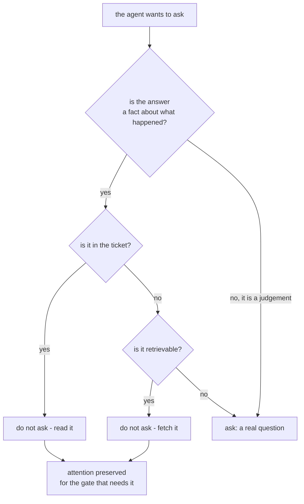

# 4.3 — The question you should not have asked

## One-line answer

Of seven questions the agent asked a person about one ticket, **five had their answers on that
ticket already** — and the two that genuinely needed a person were both judgements about what to
do rather than facts about what happened.

## The story

You apply for a job. The form asks you to attach your CV, and you do.

Then the form asks for your current employer. Then your job title. Then your start date. Then
the same three for the job before that, and the one before that. Then your degree, your
university and the year. All of it is on the document you attached two pages ago.

By the fourth box you have stopped reading the questions. You are copying, and copying is not
reading, so when the form asks something that is *not* on your CV — *why are you applying for
this role?* — you type a sentence of nothing, in the same rhythm as the rest.

The form got its one genuinely useful answer, and it got it from someone it had spent twenty
boxes training not to think.

## The idea in plain language

Every question costs a person's attention. That is not a metaphor — attention is the finite
resource an approval gate spends, and it is the resource
[7.1](../07-what-the-human-sees/7.1-the-tick-box-nobody-reads.md) shows running out.

A question whose answer the system already had spends that resource for nothing. But it is
worse than nothing, and this is the point of the part: **avoidable questions teach the person to
answer without looking.** They are not neutral. Each one is a small piece of training in the
habit that makes the important interruption fail.

So the questions divide in two, and the division is not about difficulty:

- **Facts about what happened.** Which order. Which account. How much. What channel. These are
  in the data, or they are retrievable from it. An agent asking for one has failed to look.
- **Judgements about what to do.** Refund or credit? Is this customer willing to wait? These
  cannot be looked up, because they are not recorded anywhere — they are decisions, and the
  reason a person is being asked is that the decision is theirs.

An agent should ask the second kind and never the first. That sounds obvious stated baldly, and
it is violated constantly, for a reason worth naming: **asking is always locally safer than
looking.** An agent that asks cannot be wrong about the order number. An agent that looks might
read the wrong field. Every individual decision to ask is defensible, and the sum of them is a
person who has stopped reading.

The term for the sum is **interruption budget**: the number of times you can interrupt a person
before the interruptions stop working. It is small, it is not measured by most teams, and it is
spent by the same mechanism whether the interruption was necessary or not.

## Why Sutra needs it

Day 63 writes the policy table that decides which of the desk's actions need a person. That
table's arithmetic is [8.1](../08-in-production/8.1-the-backlog-is-the-real-limit.md)'s: at 100%
of tickets gated the queue grows without limit, and at 25% it stays flat. **Removing avoidable
questions is the cheapest way to move that percentage**, and it is cheaper than adding
reviewers because it does not need anybody's headcount.

There is a second reason, and it is the one that matters for correctness. Day 64's gate exists
to catch the send action going wrong. Its value depends entirely on the reviewer reading the
draft. Every avoidable question asked before that moment is a withdrawal from the same account
the gate needs to draw on.

## The mechanism

Seven questions from one ticket, scored against the ticket itself:

```bash
cd days/day-62-human-in-the-loop/lab
uv run python avoidable.py
```

**Line by line:**

- `TICKET` is one real row from the desk's fixture: id, customer, order, subject, amount,
  channel and attachments. It is the data the agent already had when it asked.
- `ASKED` is a list of `(question, the ticket field that already answered it or None)`. The
  second element is the whole analysis — a question is avoidable exactly when a field answers
  it.
- The script does not model a person, a probability or a cost. It counts, because the finding
  does not need anything more than a count to be uncomfortable.

Measured on 2026-09-06:

```text
  7 questions asked of a human on one ticket

  answered already by the ticket?  question
  yes (order)                      Which order number is the duplicate charge on?
  yes (customer)                   Which account is this?
  yes (amount)                     How much was the charge?
  NO                               Should we refund or credit the account?
  yes (channel)                    How should we reply to them?
  yes (attachments)                Did they send a bank statement?
  NO                               Is the customer willing to wait three working days?

  5 of 7 were already on the ticket:
    order        = 'ORD-8874'
    customer     = 'acct-8874'
    amount       = 2400
    channel      = 'email'
    attachments  = ['statement.pdf']

  2 genuinely needed a person, because they are
  judgements about what to do, not facts about what happened.
```

Read the first line of the table and then the first line of the field dump. The agent asked
*"which order number is the duplicate charge on?"* — the question
[4.1](4.1-a-missing-fact-is-not-a-missing-permission.md) and
[4.2](4.2-a-question-with-edges.md) both used as their example — and the ticket says
`order = 'ORD-8874'`.

That is not a contrived example. It is the same question those two parts spent their mechanism
sections implementing carefully, with the right tool, the right schema and an escape hatch. All
of that engineering was applied to a question that should not have been asked. **A pause
implemented perfectly is still waste if the fact was on the ticket**, and the reason to build
4.1 and 4.2 first is that you cannot see this clearly until you know exactly what a question
costs to serve.

The two survivors are worth reading carefully, because they are the shape of a real question:

- *Should we refund or credit the account?* — nothing in any record says which. It depends on
  policy, on the customer's history and on what the business wants this month.
- *Is the customer willing to wait three working days?* — the customer has not said. Nobody
  can look it up, because the fact does not exist yet.

Neither is answerable by a better agent, a bigger index or another tool. That is the test.



## When it breaks

The failure mode is not that a question is asked. It is that nobody ever counts.

🎬 **The scene:** the desk ships with the question tool. Interruptions are rare at first, and
each one is individually sensible. Nobody objects, because nobody is looking at more than one
at a time.

😬 **The naive fix:** when the queue starts to hurt, add reviewers.

💥 **Why it fails:** five sevenths of the queue is the agent asking things it already knew.
Adding reviewers scales the wrong side of the equation and, worse, hides the defect — the
symptom goes away, the training-people-not-to-read effect does not. Then the gate on the send
action starts missing things, and that looks like an unrelated problem in a different part of
the system.

💡 **The insight:** you cannot see an avoidable question from inside the interruption. Every
single one looks reasonable on its own. The defect is only visible when the questions are
**grouped by what they asked for** and compared against what was already known, which is a
report nobody writes unless they have decided in advance that it matters.

The mechanical break is what an over-asking agent does to the pending store. Each question is a
row, each row has a deadline, and the deadlines fire:

```text
  10 approvals, 6 answered in time, 4 timed out
```

That is `default.py`'s first line, and it is [6.1](../06-nobody-answered/6.1-a-default-is-a-decision-nobody-made.md)'s
subject. Four of ten unanswered is what an over-asked queue looks like from the store's side,
and every one of those four now needs a timeout policy — which means the avoidable questions
have not merely wasted attention, they have created a second design problem that would not
otherwise exist.

## In production

**What a professional writes instead.** The instruction names a **fallback order** and the tool
description enforces it: check the ticket fields, then the order record, then the customer
record, and only then ask. And the pending record carries a `resolved_by` field with those same
values, so the report that groups questions by what answered them writes itself. A team that
cannot say what fraction of its interruptions were avoidable does not have a way to find out,
and that is a monitoring decision made by omission.

**What degrades at scale or under concurrency.** The ratio moves the wrong way as the system
gets better. A more capable model asks more questions, not fewer, because it recognises more
ambiguity — and each recognition is locally correct. Left alone, an upgrade that improves every
individual decision degrades the whole system's throughput, and the team's post-hoc explanation
is usually that the new model is "more cautious", which describes the symptom and not the cause.

**The failure mode that only appears with real traffic.** Question fatigue arrives before queue
fatigue. Long before the backlog is visible on any dashboard, the people answering have adapted
— they answer from the subject line, they batch, they develop a default. By the time the numbers
show a problem, the interruptions have already stopped doing the job they were added for, and
restoring that is much harder than fixing the queue, because it is a habit rather than a
capacity.

**The review comment a senior engineer leaves:** *"Seven interruptions on this ticket and five
of the answers are columns on the ticket row we already loaded. Before we talk about reviewer
capacity, put a `resolved_by` field on the pending record and show me the split for a week. I
expect the fix here is three lines in the instruction, not another person on the rota."*

**The interview question:** *"How do you decide whether the agent should ask a human or work it
out?"* The answer that shows you have measured it: *"Facts get looked up, judgements get asked.
The test is whether a better system could ever have answered it — if yes, asking is a bug, not a
policy. We counted ours on one ticket and five of seven questions had their answers in fields we
had already loaded. The cost is not the reviewer's attention on those five; it is that by the
sixth interruption they were answering without reading, and the sixth was the one where we
needed them to read."*

## Check yourself

```bash
cd days/day-62-human-in-the-loop/lab
uv run python avoidable.py
```

Now add an eighth entry to `ASKED` — a question you can imagine the desk asking — and decide
whether it maps to a `TICKET` field or to `None`. If you find yourself arguing about it, write
down what would have to be true for the agent to answer it alone. That argument is the one Day
63's policy table has to settle for every action.

**Out loud, without scrolling up:** give the test that separates a question worth asking from a
question that is a bug, and say why asking is always locally safer than looking.

**Next:** [5.1 — The pattern with no resume](../05-take-over/5.1-the-pattern-with-no-resume.md).
