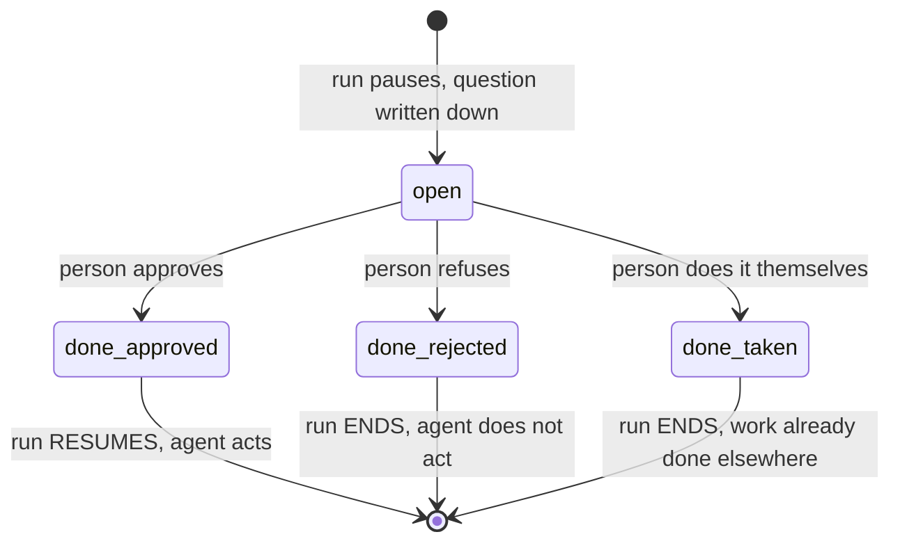

# 5.1 — The pattern with no resume

## One-line answer

Take-over is the only one of the four patterns where the correct next step is for the run to
**end**, and every piece of machinery built for the other three — the answer, the anchor, the
resume — is the wrong shape for it.

## The story

You are at a self-service till with a bag of loose mushrooms. You press the button for loose
items, the screen offers you a list that does not contain mushrooms, and the light on top of the
till goes orange.

An assistant comes over. She does not tell you which button to press. She swipes her card,
weighs the mushrooms herself, keys in the code from memory, and moves to the next till.

What happened to your transaction? It carried on — you still pay, you still take the bag. But
the part of it the machine could not do was not *unblocked*, it was **done by somebody else**,
and the machine was never told how. From the till's point of view a supervisor intervened and
the item appeared.

Now imagine the assistant instead walks over, weighs the mushrooms on the scales behind the
counter, puts them in your bag, tells you to pay for the rest, and walks off. Your transaction
is finished in the world. The till is still sitting there with an orange light on, waiting for
somebody to resolve an item that no longer needs resolving.

## The idea in plain language

The first three patterns share a shape. The run stops, a person supplies something — permission,
a better version, a fact — and the run **continues on what they supplied**.

Take-over does not have that shape. The person does not supply an input to the run. They do the
job the run was doing, outside it, and there is nothing for the run to continue with.

That produces three requirements the other patterns do not have:

1. **There is no answer to store.** The pending record's `answers` list, which
   [1.3](../01-the-shape-of-the-wait/1.3-late-twice-or-never.md) built to hold a decision, has
   nothing to hold here. What needs recording is an **outcome**, not a decision.
2. **The run must terminate, not resume.** Every resume path built for the other three is
   actively wrong: resuming would mean the agent doing work that has already been done by hand,
   which on a send action means the customer gets a second reply.
3. **The system did not observe the work.** Whatever the person did happened somewhere the
   system cannot see — a phone call, another tool, a conversation. So the record cannot describe
   the outcome in any detail, and pretending otherwise produces a record that is worse than an
   honest gap.

The word for what the record needs is an **outcome**: why this run stopped existing. `approved`,
`rejected` and `taken over by a human` are three different outcomes, and a system with a boolean
`decision` field can express the first two and not the third.

There is a fourth requirement that is easy to miss and is the subject of
[5.2](5.2-the-run-nobody-closed.md): **somebody has to actually write the outcome down.** The
other three patterns close themselves, because the answer arriving is the event that moves the
run along. Take-over has no such event. The person's action is invisible to the system by
definition, so the closing is a thing that must be deliberately caused, and if the interface
does not offer it, it does not happen.

## Why Sutra needs it

Support desks work this way. A customer telephones about the ticket the agent is drafting a
reply to, an agent on the phone deals with it, and the drafted reply must not go out. That is
not an exception case in a support system — it is Tuesday.

Day 63's policy table needs take-over as a possible disposition, and its column for *what
happens when the reviewer does not approve* has three values rather than two. Day 64's gate then
has to offer it in the interface, and Day 65's phase gate asks whether any runs are left open —
which is exactly the count this pattern gets wrong when it is missing.

## The mechanism

Two runs are waiting for a person. One is approved; the other the person handles themselves:

```bash
cd days/day-62-human-in-the-loop/lab
uv run python takeover.py
```

**Line by line:**

- `takeover.py` puts two pending records into the store with `state: "open"`, which is the
  shape [1.3](../01-the-shape-of-the-wait/1.3-late-twice-or-never.md) established.
- Ticket 4610 takes the ordinary approval path: `state` becomes `done`, `outcome` becomes
  `approved`, and the reply is sent.
- Ticket 4633 is taken over. The record is updated to `state: "done"` with
  `outcome: "taken over by a human"` and `agent_sent: False` — three fields, and the third is
  the one that stops a later report counting this as a reply the desk sent.
- Nothing here touches ADK. Take-over is not a framework feature; it is a state your own record
  has to be able to express, which is why this script is plain Python.

Measured on 2026-09-06:

```text
  2 runs waiting for a human

  4610: the human approves. The agent sends the reply.
  4633: the human picks up the phone and settles it themselves.
        the run is closed with outcome='taken over by a human'.

  states:      {'4610': 'done', '4633': 'done'}
  still open:  0  []
  replies sent: 1
```

Read the last two lines together, because they are the pair that has to hold. **`still open: 0`
and `replies sent: 1`.** Two runs finished, one reply went out. That is the correct end state
for a day in which one ticket was answered by the desk and one by a person.

A system that models only approve and reject cannot produce those two numbers together. It can
have `still open: 0` by treating the take-over as an approval, in which case `replies sent`
becomes 2 and the customer gets a reply about something already handled. Or it can have
`replies sent: 1` by leaving the run alone, in which case `still open` is 1 for ever — which is
[5.2](5.2-the-run-nobody-closed.md).

The three outcomes side by side, as they appear in the record:

```python
# approved: the run continues and the agent acts
{"state": "done", "outcome": "approved"}

# rejected: the run ends, the agent does not act
{"state": "done", "outcome": "rejected", "reason_code": "wrong_customer"}

# taken over: the run ends, and the work happened somewhere we cannot see
{"state": "done", "outcome": "taken over by a human", "agent_sent": False}
```

**Line by line:**

- All three set `state: "done"`, because from the store's point of view the question is
  resolved and no further answer may be applied to it. That is the guard
  [1.3](../01-the-shape-of-the-wait/1.3-late-twice-or-never.md) measured.
- `outcome` is what distinguishes them, and it is a string from a fixed set rather than a
  boolean. The moment there are three values, a boolean cannot carry it — and this is the
  argument for choosing an enum on the first day rather than after the third case appears.
- `reason_code` appears only on the rejection, because that is the outcome that needs to explain
  itself ([2.3](../02-approve-or-reject/2.3-what-a-no-has-to-carry.md)).
- `agent_sent: False` is the field that keeps the metrics honest. Without it, "tickets resolved"
  and "replies the desk sent" become the same number, and they are not.



Notice the diagram's two different arrows out of the bottom. Only one of the three outcomes
resumes anything. A pending store designed around the assumption that an answer means *carry on*
has hard-coded the left-hand path.

## When it breaks

The break is treating take-over as a rejection, which is the closest available shape and is
wrong in a way that only shows up later.

🎬 **The scene:** the interface has two buttons. A reviewer has just dealt with a customer on
the phone and needs to stop the drafted reply going out. They press **reject**, because it is
the button that stops things.

😬 **The naive fix:** nothing. It worked — the reply did not go out. The ticket is resolved.

💥 **Why it fails:** the record now says the agent's draft was refused. Two counts are wrong
from that moment: the gate's rejection rate goes up, and it is the number the team uses to judge
whether the model's drafting is any good. A model whose drafts are fine but whose tickets keep
being handled by phone will look, in the dashboard, exactly like a model that writes bad
replies. The team will then spend its effort on the drafting step, which was never the problem.

💡 **The insight:** the outcomes are not a scale from good to bad with rejection at the end.
They are **different kinds of ending**, and collapsing two of them destroys the only signal that
told them apart.

Watch what the store looks like when the outcome is missing entirely:

```bash
uv run python takeover.py --naive
```

```text
  states:      {'4610': 'done', '4633': 'open'}
  still open:  1  ['4633']
  replies sent: 1

  4633 is finished in the world and unfinished in the system. Nothing
  will ever close it, and no error was raised to say so.
```

`still open: 1`, and no error. The system is not broken in any way it can detect. It is holding
a record that will sit at `open` until somebody looks at the table by hand, and the deadline
machinery from [6.1](../06-nobody-answered/6.1-a-default-is-a-decision-nobody-made.md) will
eventually fire on it and apply a timeout policy to a question that was answered days ago in a
phone call. That is [5.2](5.2-the-run-nobody-closed.md)'s subject, and it is the failure this
pattern exists to prevent.

## In production

**What a professional writes instead.** The take-over path is a first-class button on the
approval screen, labelled in the reviewer's language — *"I have handled this"* — and it captures
one optional free-text line about what they did. Not because the system can act on the line, but
because the person reading the record in six months needs the only description that will ever
exist. The button also has to be as easy to press as approve, because a reviewer who has just
spent a phone call on a ticket will not go looking for an admin page.

**What degrades at scale or under concurrency.** Take-overs race with the run. A reviewer
settles a ticket by phone at the same moment as another reviewer approves the queued draft, and
both write to the same record. The state field from
[1.3](../01-the-shape-of-the-wait/1.3-late-twice-or-never.md) is what makes one of them win, and
the losing write must be reported to its author rather than dropped — a reviewer who pressed
*"I have handled this"* and got no feedback will assume the reply was stopped, and it was not.

**The failure mode that only appears with real traffic.** Take-over is the outcome that reveals
whether your gate is worth having. A high take-over rate on a category of ticket does not mean
the reviewers are unhelpful; it means the desk should not be drafting that category at all, and
the correct response is to stop routing it rather than to improve the drafts. Nobody discovers
that without counting the outcome separately, and it is the discovery with the largest payoff in
this whole section — the queue shrinks by removing work rather than by clearing it faster.

**The review comment a senior engineer leaves:** *"There is no way in this interface for a
reviewer to say 'I have already dealt with this'. They will press reject, and then our rejection
rate is a mixture of 'the draft was wrong' and 'the customer rang'. Those two need different
responses from us and we will not be able to tell them apart. Add the third outcome now, while
the table has forty rows in it."*

**The interview question:** *"What happens when the human just does the task themselves?"* The
answer that shows you have run a support system: *"The run ends rather than resumes, and it ends
with its own outcome — not a rejection. We got that wrong first: reviewers pressed reject when
they had handled a ticket by phone, so our rejection rate mixed 'bad draft' with 'customer rang
in', and we spent a month trying to improve drafting that was fine. The fix was a third button
and an enum instead of a boolean, plus a flag on the record saying the agent did not send
anything, so the reply count stayed honest."*

## Check yourself

```bash
cd days/day-62-human-in-the-loop/lab
uv run python takeover.py
uv run python takeover.py --naive
```

Both runs send exactly one reply. Write down the two `still open` numbers and say which of the
two runs a nightly report would describe correctly.

**Out loud, without scrolling up:** say why take-over cannot be modelled as a rejection, and
name the field that keeps "tickets resolved" and "replies the desk sent" from becoming the same
number.

**Next:** [5.2 — The run nobody closed](5.2-the-run-nobody-closed.md).
