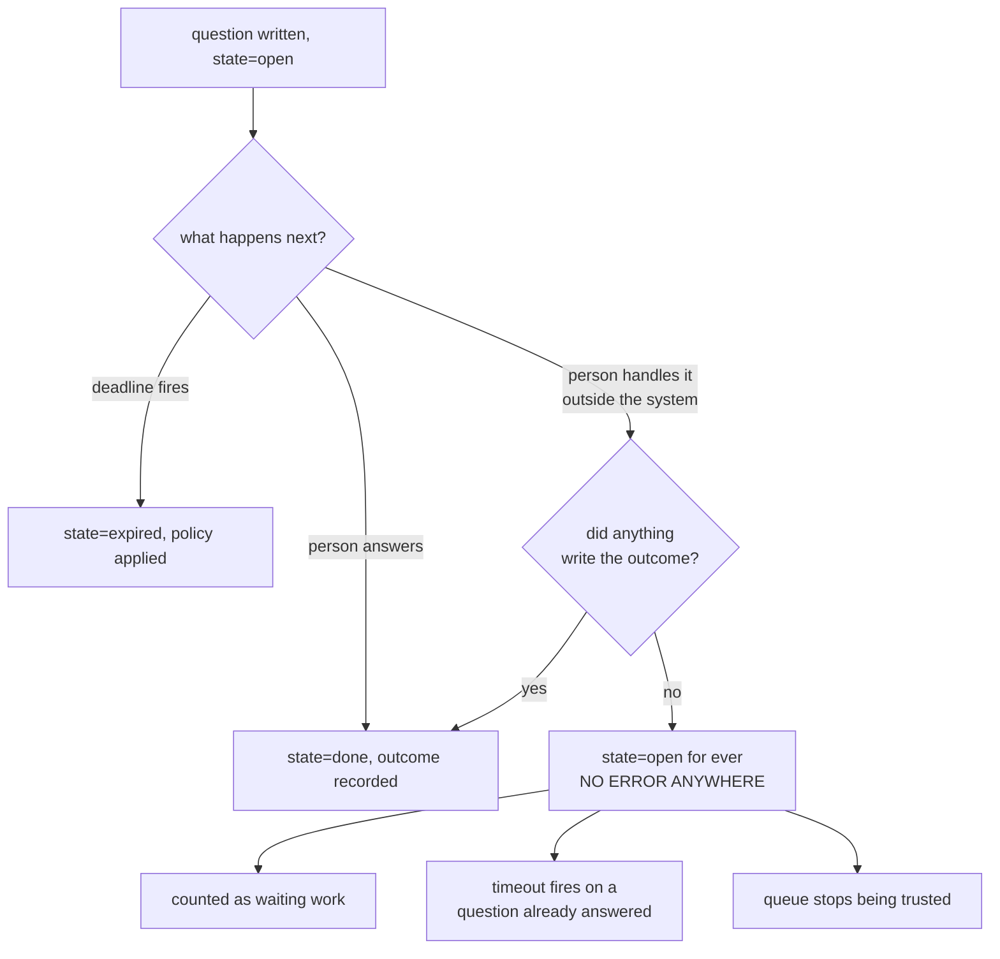

# 5.2 — The run nobody closed

## One-line answer

A take-over that nobody records leaves a run at `state: "open"` with **no error raised anywhere**
— `still open: 1` against `still open: 0` for the same work, the same reply count, and no way
for the system to tell the difference.

## The story

Your kitchen tap starts dripping on a Friday and you book a plumber for Thursday.

On Saturday you have a look at it, find it is the washer, walk to the shop, and fix it yourself
in an afternoon. The tap is fine. You are pleased. You forget the plumber entirely.

On Thursday a van pulls up outside your house.

Nothing went wrong in any system. The booking was made correctly, the plumber turned up on the
right day at the right address, and the job was real when it was created. The only thing that
happened is that the world moved on and nothing told the booking. The booking had no way to find
out on its own, because from its point of view nothing had changed at all.

The cost is not the drip. It is a wasted morning, an awkward conversation, and possibly a
call-out fee for work that did not need doing.

## The idea in plain language

This is the failure mode of the take-over pattern, and it belongs to a category worth naming
because it recurs everywhere in this curriculum: **a failure whose signature is the absence of an
event.**

Every other failure in this day announces itself. A duplicate answer produces two replies. A
tampered anchor raises `ValueError`. A rejection returns a string. Those are all things you can
catch, log, alarm on and test.

An unclosed run produces nothing. No exception, no error log, no failed check. The record simply
stays as it was, and the only way to notice is to go looking for records that have been sitting
too long — which means the detection has to be **a thing you decided to build**, not a thing that
happens to you.

Three consequences follow, and they arrive in this order:

1. **The count of open questions stops meaning anything.** It is supposed to measure work
   waiting for a person. Once it contains runs that no person will ever answer, it measures two
   different things added together, and neither can be recovered.
2. **The timeout machinery fires on them.** Whatever
   [6.1](../06-nobody-answered/6.1-a-default-is-a-decision-nobody-made.md) decides to do when
   nobody answers will be done to a ticket that was answered — in a phone call, days ago.
   Depending on the policy, that is an escalation to somebody who has nothing to do, or a reply
   sent to a customer who has already been helped.
3. **Nobody trusts the queue.** This is the slowest and the worst. A queue with stale entries in
   it trains its readers to skim, and a queue nobody reads carefully is the same failure as
   [7.1](../07-what-the-human-sees/7.1-the-tick-box-nobody-reads.md) arriving by a different
   road.

The term for the state is a **leaked run**: a run that has stopped making progress and that
nothing will ever conclude. Day 60 met the same word from the durability side — a run that
outlived its process and had no one to resume it. Here it outlives its *reason*, which is worse,
because a resume would not help.

## Why Sutra needs it

Day 65 is the Phase 9 gate, and one of its acceptance criteria is a count: are there runs left
open that should not be? A system that leaks runs cannot pass that criterion honestly, and — the
important part — cannot pass it *dishonestly by accident* either, because the number will be
non-zero and visible. That is the whole reason to make the check a count rather than a feeling.

Day 64 builds the gate's interface, and the take-over button is the fix. It has to be there
before the leak exists, because the records that leaked before it shipped cannot be
retrospectively closed — nobody remembers which phone calls happened.

## The mechanism

The same two tickets as [5.1](5.1-the-pattern-with-no-resume.md), with the take-over unrecorded:

```bash
cd days/day-62-human-in-the-loop/lab
uv run python takeover.py --naive
```

**Line by line:**

- `--naive` skips exactly one thing: the `_pending.put` that writes `state: "done"` and
  `outcome: "taken over by a human"` onto ticket 4633's record. Every other line of the script
  is shared between the two arms.
- The reply for 4610 is still sent, so the run that went through the normal path is unaffected.
  That matters: the leak does not break anything visible, which is why it survives.

Measured on 2026-09-06:

```text
  2 runs waiting for a human

  4610: the human approves. The agent sends the reply.
  4633: the human picks up the phone and settles it themselves.
        the run is not told. Nothing writes to its record.

  states:      {'4610': 'done', '4633': 'open'}
  still open:  1  ['4633']
  replies sent: 1

  4633 is finished in the world and unfinished in the system. Nothing
  will ever close it, and no error was raised to say so.
```

Compare that against the recorded arm, which produced `still open: 0` and the same
`replies sent: 1`. **One field's absence is the entire difference**, and the two runs are
indistinguishable on every other measure: same tickets, same person, same phone call, same
customer outcome, same number of replies.

Now the part that makes this hard to find. Look at what the store actually holds:

```bash
uv run python -c "
import json, _pending
print(json.dumps(_pending.get('4633'), indent=2, sort_keys=True))
"
```

**Line by line:**

- `_pending.get` reads the JSON file the previous run left behind. The store is a directory of
  files precisely so that it can be looked at between runs — a production system would be a
  table, and the point would be the same.
- Nothing is deleted between runs, so this is the record as the leak left it.

```text
{
  "state": "open",
  "ticket": "4633"
}
```

That is a perfectly valid pending record. It is well-formed, it has the fields it is supposed to
have, and its state is one of the legal states. **There is nothing wrong with it that any
validator could detect.** The only thing wrong with it is that the world it describes no longer
exists, and no schema can express that.

The detection therefore has to be about **how long a record has been sitting**, not about its
shape:

```python
def stale(records: dict, now_tick: int, older_than: int) -> list[str]:
    """Pending questions that have been open too long to still be waiting for anyone."""
    return [
        question_id
        for question_id, record in records.items()
        if record.get("state") == "open" and now_tick - record["asked_at"]["tick"] > older_than
    ]
```

**Line by line:**

- The filter is `state == "open"` **and** age — both halves are needed. Age alone would flag
  finished runs; state alone would flag every question asked recently.
- `record["asked_at"]["tick"]` is the lab's monotonic stand-in for a clock, from
  `_pending.stamp`. A real implementation reads a timestamp column, and the reason the lab does
  not is that a reproducible transcript cannot contain a wall clock.
- The function returns ids rather than acting on them. That is deliberate: **the correct response
  to a leaked run is a human looking at it**, because the system by definition does not know what
  happened. Anything automatic here would be guessing.
- Note what it is not: it is not a timeout. A timeout answers the question. This finds questions
  that should never have been asked to wait at all.

That function is the third `TODO(me)` in this day's build brief — `takeover.py` has no such
report, and writing it is how you discover that `_pending`'s records do not all carry
`asked_at`. Which record is missing it, and what that says about designing the pending shape
before the first pause ships, is the exercise.



## When it breaks

The leak has a second, nastier form, and it is the one that reaches a customer.

🎬 **The scene:** the leak has been happening quietly for weeks. Somebody adds the timeout
policy from [6.1](../06-nobody-answered/6.1-a-default-is-a-decision-nobody-made.md), and — for
sensible reasons about not leaving customers waiting — sets it to **approve on timeout**.

😬 **The naive fix:** none is thought to be needed. The timeout is a safety net for questions
nobody got to.

💥 **Why it fails:** every leaked run is a question nobody got to, by that definition. So the
net catches them, and each one sends the draft the agent wrote — to a customer whose problem was
settled in a phone call, about a ticket that is closed. The number of these is exactly the
number of take-overs since the leak began, and they all fire at once when the policy ships.

💡 **The insight:** an unclosed run is not an inert record. It is **a live obligation that the
system still intends to discharge**, and any automation added later will discharge it. The leak
is not a reporting inaccuracy; it is a queue of actions waiting for someone to build the trigger.

You can produce that collision in the lab. `takeover.py --naive` leaves 4633 at `open`, and
`default.py` shows what an approve-on-timeout policy does to open questions:

```text
  on timeout  sent  sent wrongly  held back wrongly  still open
  approve        7             2                  0           0
```

Two sent wrongly out of ten, in a run where every unanswered question was genuinely unanswered.
Add leaked runs to that store and the `sent wrongly` column grows by one per leak, deterministic
and silent.

## In production

**What a professional writes instead.** Two things, and the second is the one people skip. The
interface gets the take-over button ([5.1](5.1-the-pattern-with-no-resume.md)), **and** the
system gets a standing report of the oldest open question. Not a count — the *age of the
oldest*, because a count can look stable while its contents rot. That number belongs on the same
dashboard as the queue depth from the day the gate ships, and it is the single most useful
number in this whole day.

**What degrades at scale or under concurrency.** Leaks are self-concealing at volume. With
forty questions a day the stale ones stand out; with four thousand they are a rounding error in
the queue depth, and the queue depth is the number anybody looks at. The age-of-oldest metric is
scale-independent, which is exactly why it is the one to alarm on.

**The failure mode that only appears with real traffic.** The leak is created by the paths you
did not build. Every additional way a ticket can be resolved — a phone call, a chat, a colleague
editing the ticket directly, a bulk close from an incident — is a new source of runs that end
without telling the pending store. You cannot enumerate them in advance, which is the argument
for detecting the state rather than trying to close every hole: **assume runs will leak and
build the report**, rather than assuming they will not and building nothing.

**The review comment a senior engineer leaves:** *"We alarm on queue depth. Queue depth will be
flat while every entry in it rots, because the arrival rate and the clear rate are both fine —
it is the same rows sitting there. Alarm on the age of the oldest open question instead, and put
a hard ceiling on it, because past that ceiling the entry is not waiting for anybody and
something automatic is eventually going to act on it."*

**The interview question:** *"How would you know if a run in your system stopped making progress
and nobody noticed?"* The answer that shows you have been bitten: *"By deciding to look, because
nothing tells you. There is no exception and no failed check — the record is well-formed and its
state is legal, it just describes a world that has moved on. We track the age of the oldest open
pending question rather than the count, because the count stays flat while the contents go
stale. The one that hurt was when we added an approve-on-timeout policy: every run that had
leaked over the previous weeks was, by definition, a question nobody had answered, so the safety
net fired on all of them at once and sent replies about tickets that had been settled on the
phone."*

## Check yourself

```bash
cd days/day-62-human-in-the-loop/lab
uv run python takeover.py --naive
uv run python -c "import json, _pending; print(json.dumps(_pending.get('4633'), indent=2, sort_keys=True))"
uv run python takeover.py
uv run python -c "import json, _pending; print(json.dumps(_pending.get('4633'), indent=2, sort_keys=True))"
```

Two records for the same ticket and the same phone call. Write down every field that differs,
and say which of them a schema validator would have complained about.

**Out loud, without scrolling up:** explain why an unclosed run is more dangerous after somebody
adds a timeout policy than before, and name the one number you would put on a dashboard to find
it.

**Next:** [6.1 — A default is a decision nobody made](../06-nobody-answered/6.1-a-default-is-a-decision-nobody-made.md).
