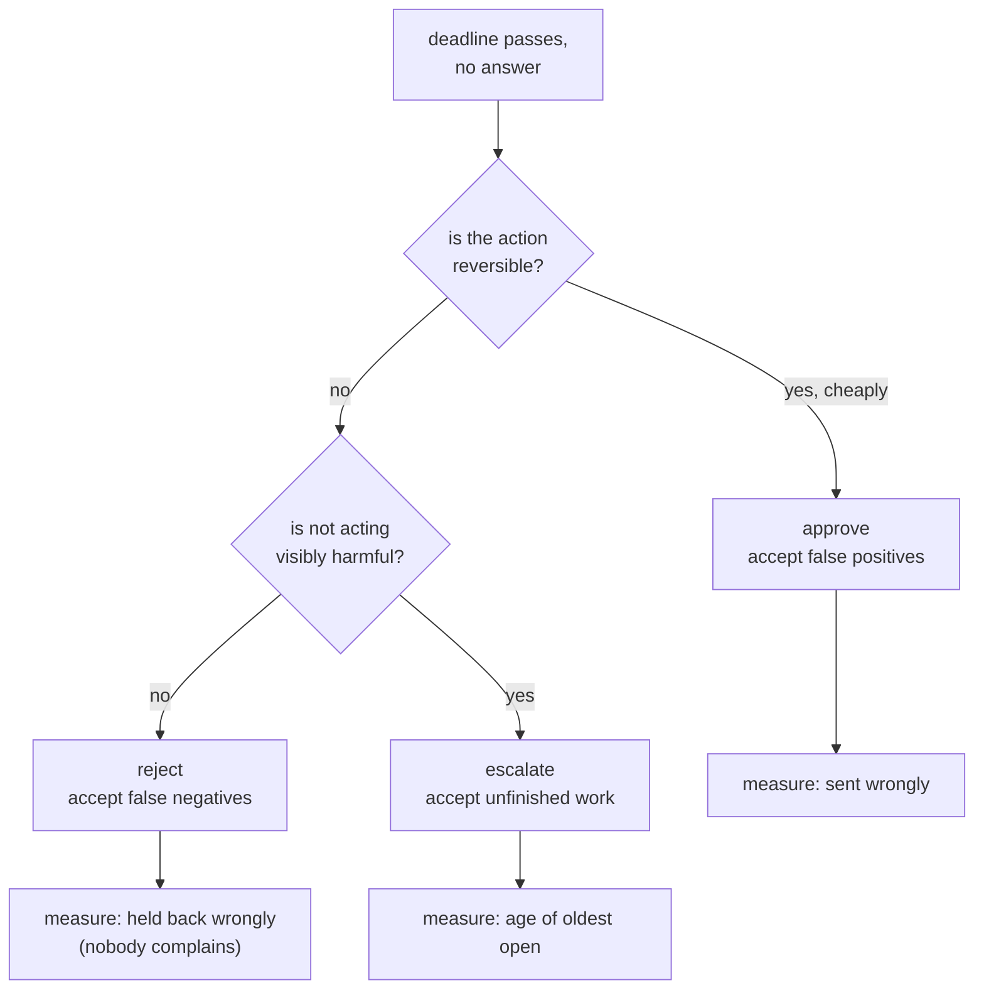

# 6.1 — A default is a decision nobody made

## One-line answer

There is no safe timeout policy: on the same ten approvals with four unanswered, **approve sends
2 wrongly**, **reject holds back 2 that should have gone**, and **escalate gets nothing wrong and
finishes nothing** — leaving 4 still open.

## The story

A letter arrives about your car insurance. It says the policy will renew automatically on the
anniversary at a new price unless you tell them otherwise.

You mean to look at it. You put it on the side. The renewal goes through.

Later you find out you could have paid considerably less elsewhere. And here is the thing: you
never decided to stay. You never weighed anything up, never compared, never chose. The insurer
wrote a rule that turned your silence into a purchase, and the purchase is now real — money has
moved, and you own the outcome of a decision you did not make.

Turn it round and it is no better. If the rule had been *lapse unless you confirm*, the same
silence would have left you driving uninsured. Neither rule is safe. They fail in different
directions, and the letter's author had to pick one.

## The idea in plain language

A **timeout policy** is what the system does with a pending question when nobody answers within
the deadline. It has to exist. A question with no timeout policy does not avoid the problem — it
picks the fourth option, *wait for ever*, which is [5.2](../05-take-over/5.2-the-run-nobody-closed.md)'s
leaked run arriving by design instead of by accident.

There are exactly three things you can do:

| Policy | On timeout | Fails by |
| --- | --- | --- |
| **approve** | do the thing | doing things nobody approved |
| **reject** | do not do the thing | not doing things that should have happened |
| **escalate** | ask somebody else, or a different way | not finishing, and moving the problem |

Two words for what these get wrong, borrowed from anywhere that screens things and used
throughout the rest of this curriculum:

- A **false positive** here is an action taken that should not have been — the reply that goes
  out and should not have. Approve-on-timeout produces these.
- A **false negative** is an action not taken that should have been — the correct reply the
  customer never receives. Reject-on-timeout produces these.

The reason this part exists is that teams pick a policy by asking *which is safer?*, and there
is no answer to that question in general. There is only an answer per action, and it comes from
the same axis Day 63's policy table is built on: **what is the blast radius of each mistake, and
which one is reversible?** A reply sent wrongly can be followed by an apology. A refund paid
wrongly has to be clawed back. A reply not sent leaves a customer waiting, which is a real cost
that nobody logs.

The third row deserves its own sentence, because it looks like a way out and is not.
**Escalation is not a decision, it is a deferral**, and its cost is exactly that the work does
not finish. That cost is real and it is usually invisible, because "still open" is not a column
anybody puts next to "sent wrongly".

## Why Sutra needs it

The desk's gated action is sending a reply to a customer. Day 63 has to write down which policy
applies to it, and Day 64 has to implement it — `gate.py`'s sixth check is literally
`the timeout policy is explicit`, failing until `sutra/hitl.py` exports an `ON_TIMEOUT`
constant. The check exists because a policy that is not named is still a policy; it is just one
that fell out of the control flow.

Day 65 then kills the process mid-run and resumes it. A resume that arrives after the deadline
has to know what already happened, which it cannot if the timeout behaviour was implicit.

## The mechanism

Ten pending approvals, each with a ground truth about whether sending was right. Six get a human
answer in time; four do not. Score all three policies on the same ten:

```bash
cd days/day-62-human-in-the-loop/lab
uv run python default.py
```

**Line by line:**

- `QUESTIONS` is a fixed list of `(id, should the reply have been sent?, did a human answer in
  time?, their answer)`. The second element is the ground truth, which is what makes this
  countable rather than arguable — in a real system you do not have it, which is precisely why
  the policy must be chosen in advance.
- `run(policy)` walks the same ten questions three times. When a human answered, their answer is
  used regardless of policy; the policy only decides the four that timed out.
- `escalate` does not decide at all — it increments `still open` and moves on. Scoring it as a
  cost rather than as a free win is the honest part of this script, and the module docstring says
  so.

Measured on 2026-09-06:

```text
  10 approvals, 6 answered in time, 4 timed out

  on timeout  sent  sent wrongly  held back wrongly  still open
  approve        7             2                  0           0
  reject         3             0                  2           0
  escalate       3             0                  0           4

  the two that `approve` sends wrongly:
    q-8  should never have been sent
    q-9  should never have been sent

  the two that `reject` holds back wrongly:
    q-7  a correct reply the customer never received
    q-10  a correct reply the customer never received
```

Read the three rows as three different bills.

**Approve** clears the queue completely — `still open: 0` — and sends seven replies, two of
which should never have gone out. Those two are the ones a customer complains about, and they
carry a record saying the system approved them on a timeout, which is a sentence no support
manager enjoys reading.

**Reject** sends nothing wrongly. It also silently loses two correct replies, and this is the
column teams forget: `held back wrongly: 2` produces no complaint, no alert and no incident.
Two customers simply never hear back. The policy that looks safe is safe **only against the
failure that is visible**.

**Escalate** has zeroes in both error columns and a 4 in `still open`. It is the only row with
no wrong actions, and it finished six of ten pieces of work. If the four escalations reach
somebody who deals with them, that 4 becomes work done later at higher cost. If they do not,
those four are [5.2](../05-take-over/5.2-the-run-nobody-closed.md)'s leaked runs by another
name.

The shape of the choice, once you stop looking for a safe option:



Note that the diagram's leaves are three *measurements*, not three verdicts. Whichever you pick,
the obligation is to count the thing it gets wrong — and the middle one is the branch where the
counting has to be deliberate, because its failures are silent.

## When it breaks

The break is a default that was never written down, because it fell out of the code instead.

🎬 **The scene:** the gate ships. Nobody discussed timeouts, because in testing somebody always
answered. Weeks later a question is asked on a Friday afternoon.

😬 **The naive fix:** none — there is no timeout at all. The question waits.

💥 **Why it fails:** *wait for ever* is a policy, and it is the escalate row with nobody at the
end of it. The customer does not get a reply. On Monday the run is still open and the reviewer
who eventually sees it has lost all the context, so they approve it — a draft written on Friday,
about a ticket that has moved on, which is exactly the stale approval
[6.2](6.2-the-answer-to-a-question-that-no-longer-exists.md) is about. The absence of a decision
produced the worst of all three outcomes: unfinished work *and* a wrong action.

💡 **The insight:** you cannot decline to have a timeout policy. You can only decline to choose
one, and the one you get by declining is the one nobody would have picked on purpose.

The mechanical version is in the numbers above. Run the policies and compare `sent` across the
rows:

```text
  approve        7
  reject         3
  escalate       3
```

Same ten questions, same six human answers, same agent. The number of replies the customer
actually receives more than doubles depending on a constant. If that constant is not in a named
place — `ON_TIMEOUT`, in one file, with a comment saying why — then nobody reviewing the system
can tell you what it is without reading the control flow, and nobody can change it without
finding every branch.

## In production

**What a professional writes instead.** The policy is **per action, not per system**, and it
lives beside the action in the same table Day 63 builds. Sending a reply and issuing a refund
get different answers, because their blast radii differ, and a single global `ON_TIMEOUT` forces
the more dangerous action's policy onto the safer one or the reverse. The deadline is per action
too — an hour for one and a week for another are different rows, not different systems.

**What degrades at scale or under concurrency.** Timeouts arrive in bursts, because deadlines
are set relative to arrival and arrivals are bursty. A morning's worth of questions expires
together, which for approve-on-timeout means a batch of unreviewed actions firing at once. That
is the pattern that turns a policy choice into an incident, and the defence is a rate limit on
timeout-triggered actions — which is to say, the timeout path needs the same containment Day 59
put around everything else.

**The failure mode that only appears with real traffic.** Reject-on-timeout's cost never shows
up in any system you own. The customer who was never replied to does not appear in your error
budget, your alerts or your incident log; they appear in a churn number somebody else looks at
months later. This is the strongest practical argument for counting `held back wrongly`
explicitly, and it is the count that requires you to sample and check by hand, because the
system cannot know which withheld replies were correct.

**The review comment a senior engineer leaves:** *"What happens to this approval if nobody
clicks anything? I have read the handler twice and I think the answer is that the row sits there
for ever, which means our real policy is 'never finish' and we chose it by accident. Name it,
put it next to the action in the policy table, and make the deadline a column rather than a
constant."*

**The interview question:** *"What does your system do if the approver never responds?"* The
answer that shows you have run one: *"It depends on the action, and it is written down per
action rather than globally. For sending a reply we approve on timeout because the mistake is
reversible with an apology; for anything that moves money we escalate. What I would push back on
is the idea that one of those is safe — I scored our three options against a set of approvals
where we knew the right answer, and approve sent two wrongly, reject held back two correct
replies, and escalate got nothing wrong and finished nothing. The reject column is the one
people forget, because those failures never generate a ticket."*

## Check yourself

```bash
cd days/day-62-human-in-the-loop/lab
uv run python default.py
```

Now change one entry in `QUESTIONS` so that a timed-out question's ground truth flips, and run
it again. Watch which columns move. Then say which policy you would choose for `send_reply` and
which for a refund, and what you would have to measure to know you had chosen wrongly.

**Out loud, without scrolling up:** name the three timeout policies and the cost each one
accepts, and say which of the three costs generates no complaint.

**Next:** [6.2 — The answer to a question that no longer exists](6.2-the-answer-to-a-question-that-no-longer-exists.md).
