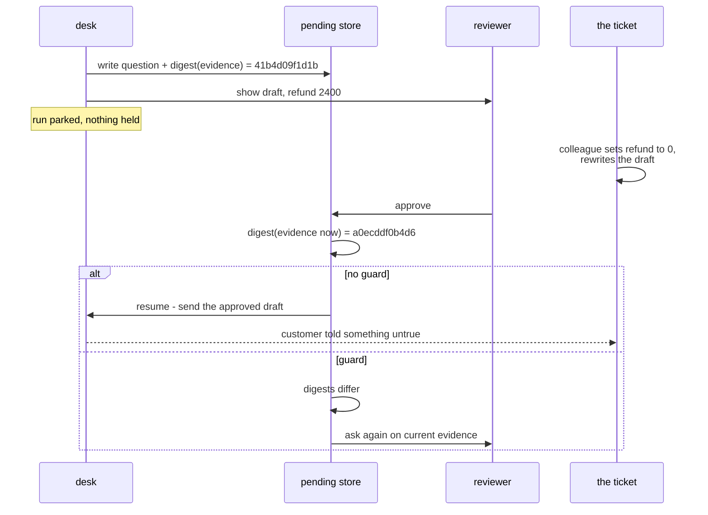

# 6.2 — The answer to a question that no longer exists

## One-line answer

While the question waits, the world moves: the digest of what the reviewer was shown goes from
`41b4d09f1d1b` to `a0ecddf0b4d6`, and a system that does not compare them sends a reply about a
refund of 2400 on a ticket whose refund is now **0**.

## The story

You are heading out and you message a friend: *shall I bring you a coffee?*

No reply. You wait a bit, then order your own and leave.

Twenty minutes later, on the bus, your phone buzzes. *Yes please.*

That is a perfectly good answer. It is polite, it is unambiguous, and it is an answer to a
question that stopped existing when you walked out of the shop. If you act on it now you will
have to go back, and the coffee will not be the one they were imagining when they said yes.

Nobody was careless. The question was reasonable when it was asked and the answer was reasonable
when it was given. The only problem is that they belong to two different moments, and nothing in
the exchange records which moment either of them came from.

## The idea in plain language

[1.3](../01-the-shape-of-the-wait/1.3-late-twice-or-never.md) dealt with an answer arriving
after the deadline — the *question* had been closed. This part is about an answer arriving on
time, against a question still legitimately open, where **the thing the question was about has
changed**.

The distinction matters because the fix is different. A late answer is caught by the question's
state. A stale answer passes every state check there is: the question is `open`, this is the
first answer, the reviewer is authorised, the anchor matches. Everything is in order except that
the evidence they were shown is out of date.

Three terms, defined once.

The **evidence** is the state of the world the person was looking at when they decided — here,
the ticket's draft, refund and customer. Distinct from the **anchor** of
[3.2](../03-edit/3.2-approve-one-thing-run-another.md), which is the call they agreed to. The
anchor can match perfectly while the evidence has moved: nobody edited the call, the world just
changed underneath it.

A **digest** is a short hash of the evidence, computed when the question is asked and stored on
the pending record. Comparing digests is how a system detects a change without storing and
diffing everything.

**Staleness** is the gap between those two: the answer refers to evidence that no longer
describes reality.

The reason this is a production-level problem and not a curiosity is that the window is as long
as a person takes. Every other race in this curriculum is measured in the time a machine takes
to do two things. This one is measured in how long somebody left an email unread, which is the
longest window in the system by a wide margin, and therefore the one where the world is most
likely to have moved.

## Why Sutra needs it

The desk's tickets change while they are being worked. A customer writes again. A colleague
updates the refund after checking with the payment provider. An incident is declared and forty
tickets get a note. All of those are normal, and all of them can happen between the moment a
reviewer is shown a draft and the moment they press approve.

Day 64's gate resumes from a stored record, and the naive resume — read the row, do what it
says — is exactly the code that ships this bug. Day 65's phase gate then kills the process
between the ask and the answer, which stretches the window deliberately and is the test that
finds it.

`gate.py`'s second and fifth checks are both this: *ask() stores a digest of the shown state*
and *resume() re-checks the digest before acting*.

## The mechanism

A ticket changes while its approval is pending:

```bash
cd days/day-62-human-in-the-loop/lab
uv run python stale.py
```

**Line by line:**

- `snapshot()` collects the three things the reviewer is shown — draft, refund, customer — into
  one dict. That dict *is* the evidence, and defining it in one function is what makes it
  possible to hash consistently.
- `fingerprint()` serialises with `sort_keys=True` before hashing, which is the canonicalisation
  point [3.2](../03-edit/3.2-approve-one-thing-run-another.md) warned about: without it, two
  equal dicts can produce two different digests and every approval looks stale.
- Between the ask and the answer the script mutates `_desk.TICKETS[TICKET]` directly — the
  refund goes to `0` and the draft is rewritten. That is standing in for a colleague updating
  the ticket, and it happens in the gap on purpose.
- The unguarded path sends `record["shown"]["draft"]` — the text as it was at ask time — because
  that is the text the human approved. Sending the *current* draft instead would be a different
  bug: acting on something nobody looked at.

Measured on 2026-09-06:

```text
  the human is shown:  refund 2400, 119 characters
  digest at ask time:  41b4d09f1d1b

  while it waits:      refund 0, 126 characters
  digest now:          a0ecddf0b4d6

  the human approves.

  replies sent: 1
  the customer is told: We can see two authorisations against the same order. We have re...
  what is actually true: refund 0, the charge was never taken
```

The reply went out. It tells a customer that a second authorisation has been released and will
clear — and the ticket now says the charge was an authorisation hold that dropped off on its
own, with no refund due. The customer has been told something false, by a system, with a human
approval attached to it.

Nothing in that run failed. The approval was genuine, timely, correctly anchored and correctly
applied. The two digests are the only evidence that anything is wrong, and nothing compared
them.

Now compare them:

```bash
uv run python stale.py --guard
```

**Line by line:**

- `--guard` adds exactly one condition: `if fingerprint(now) != record["digest"]`. Everything
  before it is identical, which is the point — the guard is a comparison, not a redesign.
- On a mismatch it does **not** approve, does not reject, and does not silently re-draft. It
  discards the approval and asks again, because the only honest thing to do with an answer to a
  superseded question is to ask the current one.

```text
  the human approves.
  guard: the ticket changed since the question was asked.
  the approval is discarded and the question is asked again.

  replies sent: 0
```

`replies sent: 0`. The customer is not told something false. The cost is that a reviewer's
attention was spent for nothing and will be spent again — which is a real cost, and is why
[4.3](../04-ask-a-question/4.3-the-question-you-should-not-have-asked.md)'s argument about not
wasting interruptions is load-bearing here too.



## When it breaks

The guard itself has a failure mode, and it is the one that gets guards removed.

🎬 **The scene:** the digest check ships. It works. Then somebody adds a `last_viewed_at`
timestamp to the ticket, updated whenever anybody opens it.

😬 **The naive fix:** include the whole ticket row in the digest, because more evidence is
surely safer.

💥 **Why it fails:** every ticket a reviewer looks at is modified by the act of looking at it,
so every digest changes between ask and answer and **every approval is rejected as stale**. The
gate now refuses everything, the queue stops moving, and the fastest way for anybody to unblock
the morning is to remove the check.

💡 **The insight:** the digest must cover **the evidence the decision depended on and nothing
else**. `snapshot()` returns three fields for that reason, not because the ticket has three
fields. Choosing what goes in the digest is a judgement about what would have changed the
person's mind, and putting everything in is not the cautious option — it is the option that gets
the whole mechanism deleted.

The second break is the opposite direction and is quieter. Leave a field out of the digest and
the guard passes on a change that mattered:

```text
digest at ask time:  01018035448a
digest now:          01018035448a
equal?               True
```

That is `stale.fingerprint` over a snapshot narrowed to `{"customer": ...}`, computed before and
after the same mutation the script performs — the refund goes from 2400 to 0 and the draft is
rewritten, and **the digest does not move**. The guard passes, and the false reply goes out
exactly as in the unguarded run.

A guard that covers the wrong fields is worse than no guard, because it produces a record saying
the freshness was checked. Both of these failures come from the same decision, made once, about
what `snapshot()` returns — and that decision is not visible in the guard, in the resume path,
or in any test that only exercises the happy path.

## In production

**What a professional writes instead.** They version the evidence rather than hashing it ad hoc:
the ticket carries a monotonically increasing revision, the pending record stores the revision
it was asked against, and the resume compares integers. That removes the canonicalisation
problem entirely — no key ordering, no float formatting, no whitespace — and it gives a cheap
answer to *what changed?*, because both revisions can be fetched and diffed for the reviewer
when the question is re-asked. Hashing is the version you write when the underlying store does
not offer revisions.

**What degrades at scale or under concurrency.** The staleness rate is a function of how long
answers take and how often tickets are touched, and both of those get worse with volume. Past a
certain queue depth, a meaningful fraction of approvals will be stale on arrival, and re-asking
all of them doubles the reviewer's work on exactly the busiest day. The mitigation is to make
the re-ask cheap and specific — show the diff, not the whole card again — which is a design
decision that has to be made before it is needed.

**The failure mode that only appears with real traffic.** Bulk updates. One incident touches
four hundred tickets at once, every pending approval against them goes stale in the same
instant, and the entire queue is invalidated by a change that was irrelevant to every decision
in it — an internal note, say. This is where the "which fields" judgement earns its keep, and it
is why the digest should cover the customer-visible evidence rather than the ticket row.

**The review comment a senior engineer leaves:** *"The resume reads `shown.draft` off the
pending row and sends it, which is right — that is what the human read. But nothing checks
whether the ticket still says what it said. Store a digest of the shown fields at ask time and
compare on resume, and when it differs, re-ask with a diff rather than approving or dropping it."*

**The interview question:** *"The human approves half a day after being asked. What could have
changed?"* The answer that shows you have hit it: *"The evidence they were shown. Not the call —
that is anchored, and the framework checks it — but the state the decision rested on. We hash
the fields the reviewer actually sees when we ask, store the digest on the pending row, and
re-check on resume; if it moved we discard the approval and ask again. The subtlety is choosing
which fields go in the hash. We put the whole row in at first and every approval came back stale
because opening a ticket updates a viewed timestamp, and the immediate reaction was to rip the
check out."*

## Check yourself

```bash
cd days/day-62-human-in-the-loop/lab
uv run python stale.py
uv run python stale.py --guard
```

Now widen the digest instead of narrowing it: add a `"subject"` key to `snapshot()` and run
`--guard` again. It still refuses, because the refund and the draft still moved. Then change the
mutation block so that it only rewrites the draft, and decide — before you run it — whether the
guard should fire. Run it and see whether you were right.

**Out loud, without scrolling up:** explain the difference between a stale approval and a late
one, say why the state field that catches the late one does nothing about the stale one, and
give the rule you would hand a colleague for deciding which fields belong in the digest.

**Next:** [6.3 — Where the question goes](6.3-where-the-question-goes.md).
