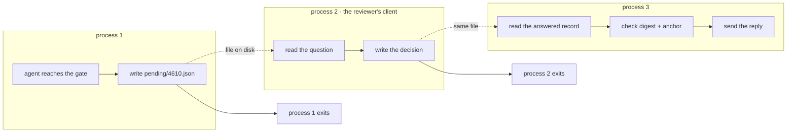

# 6.3 — Where the question goes

## One-line answer

The question, the answer and the resume can each run in a different operating-system process —
measured, **three pids for one run** — and the only thing joining them is the record in the
pending store, which is why that record's fields are a design decision rather than bookkeeping.

## The story

You ask the library for a book they do not have on the shelf. They order it in.

You do not stand at the counter until it arrives. You give them your card number, they write
down what you want, and you leave. Days later a message says it is in, and you collect it — from
a different member of staff, at a different counter, possibly in a different building, and
certainly not the person who took the request.

Notice what makes that work. The librarian who hands you the book does not need to remember your
conversation, because everything needed is written on the hold slip: what you asked for, who you
are, where it is waiting. The slip is the entire connection between the two moments.

Now imagine the slip only said *"a book for the person who asked"*. The book would arrive and
nobody could do anything with it.

## The idea in plain language

[1.2](../01-the-shape-of-the-wait/1.2-waiting-is-a-state-not-a-pause.md) argued that waiting must
be a state rather than a pause in the code, and measured the throughput cost of getting it wrong.
This part is about what that state has to *contain*, and the way to find out is to force the
three steps into three different processes so nothing can be shared by accident.

Three steps, three processes:

1. **Ask.** Some process reaches a point it cannot pass, writes the question down, and exits.
2. **Answer.** A completely different process — the reviewer's client — reads the question and
   records a decision. It knows nothing about the first process and shares no memory with it.
3. **Resume.** A third process picks up the answered record and finishes the work.

If all three can be separate processes, then everything the run needs is in the record, because
there is nowhere else for it to be. That is the test, and it is a much sharper test than reading
the code and asking whether it looks complete.

What the record has to carry, then, is everything each step needs:

| Field | Needed by | Because |
| --- | --- | --- |
| the question id | all three | it is the address |
| `state` | answer, resume | so an answer cannot be applied twice ([1.3](../01-the-shape-of-the-wait/1.3-late-twice-or-never.md)) |
| what was shown | answer | the reviewer has to see the evidence ([7.2](../07-what-the-human-sees/7.2-the-card-that-makes-checking-possible.md)) |
| the digest | resume | to detect that the world moved ([6.2](6.2-the-answer-to-a-question-that-no-longer-exists.md)) |
| the anchor | resume | so the call that runs is the call approved ([3.2](../03-edit/3.2-approve-one-thing-run-another.md)) |
| the decision | resume | what the person said |
| the deadline | a sweeper | so timeouts can fire ([6.1](6.1-a-default-is-a-decision-nobody-made.md)) |
| the outcome | reporting | approve, reject or taken over ([5.1](../05-take-over/5.1-the-pattern-with-no-resume.md)) |

Every row of that table was argued for in an earlier part of this day. This part is where they
become one object, and the reason the object is designed last is that you cannot know its fields
until you know what goes wrong without them.

## Why Sutra needs it

Day 64 builds the gate, and its pending record is exactly this object. Day 65 then kills the
process mid-run and restarts it, which is the three-process test performed with a signal instead
of a subprocess call — and a record that survives the friendly version survives the hostile one.

Day 60 made the general form of this argument for any durable run:
[Day 60, part 1.1](../../../day-60-durable-execution/parts/01-what-a-run-is/1.1-the-run-is-not-the-process.md)
is *the run is not the process*. A human-in-the-loop pause is the case where that stops being a
resilience concern and becomes an ordinary operating condition — the process does not crash, it
simply has nothing to do and should not exist.

## The mechanism

Three real subprocesses, driven by a parent that does nothing but launch them:

```bash
cd days/day-62-human-in-the-loop/lab
uv run python roundtrip.py
```

**Line by line:**

- With no arguments, `roundtrip.py` runs itself three times as a child process, once per step,
  with `subprocess`. These are genuinely separate interpreters — separate memory, separate
  imports, separate everything — which is the whole point.
- `ask` writes `pending/4610.json` with the ticket, the draft, the customer, `state: "open"` and
  its own pid, then exits. Nothing is held.
- `answer` reads the file, records `confirmed=True` and its own pid, and exits. It never sees
  the process that asked.
- `resume` reads the answered record, sends the reply, and appends a line to `sent.log`. It is
  the first process in the sequence that actually performs the action.

Measured on 2026-09-06:

```text
  parent pid 14256

  $ python roundtrip.py ask 4610
    pid 10636  asked, wrote 4610.json, exiting
  $ python roundtrip.py answer 4610 --yes
    pid 4572  answered confirmed=True
  $ python roundtrip.py resume 4610
    pid 19612  resumed and sent 156 characters

  asked by pid    10636
  answered by pid 4572
  state           done
  sent.log        4610 156 pid=19612

  three pids, one run. No process waited for a human.
```

Four different process ids — the parent and three children — and one run that completed. The
pid numbers themselves will differ on your machine; what matters is that there are four of them
and that no two steps share one.

Read `sent.log` in particular: `4610 156 pid=19612`. The reply was sent by the third process,
which never saw the draft being written and never spoke to the reviewer. It reconstructed
everything it needed from a file.

Now the failure that proves the record is the run. Ask for a resume of something that was never
written down:

```bash
uv run python roundtrip.py resume 9999
```

**Line by line:**

- `resume` is invoked directly rather than through the three-step driver, which is what a real
  worker does: it is handed an id and asked to finish it.
- `9999` is not a ticket and was never asked about, so there is no file in `pending/` for it.

```text
    pid 15844  nothing to resume for 9999
```

No traceback, no exception, no work. That is the honest behaviour and it is worth contrasting
with the alternatives: a resume that guessed, or that created a record, would be inventing a
decision nobody made. **The absence of a record is a complete answer** — there is no run here.



## When it breaks

The break is a record that is complete enough for the happy path and short of one field the
resume needs.

🎬 **The scene:** the gate ships with a pending record holding the question id, the state and
the decision. It works in every test, because in every test the same process asks and resumes.

😬 **The naive fix:** deploy it. Two processes is an implementation detail; the record is
obviously sufficient, because the code runs.

💥 **Why it fails:** the tests never separated the steps, so the resume path has been quietly
reading things from memory — the draft it still had in a local variable, the ticket it had
already loaded. In production the resume happens in a worker that was started after the asking
process died, and there is nothing in the record to send. The failure is not a crash. Depending
on the code it is a reply sent with an empty body, or a `KeyError` in a worker whose logs nobody
is watching, or the run silently doing nothing and remaining `open` for ever
([5.2](../05-take-over/5.2-the-run-nobody-closed.md)).

💡 **The insight:** **you cannot find a missing field by reading the code, because the missing
field is supplied by the process you are reading it in.** Force the separation — subprocesses in
the lab, a real worker in production — and the record's gaps become errors instead of luck.

`roundtrip.py` makes that the default rather than an exercise, and the argument for writing a
lab that way is exactly this: the version where all three steps share a process would pass, and
would prove nothing.

## In production

**What a professional writes instead.** The store is a table, not a directory, and the answer
step is a conditional update — `UPDATE pending SET state='answered', decision=? WHERE id=? AND
state='open'` — acting only if a row changed. That is
[1.3](../01-the-shape-of-the-wait/1.3-late-twice-or-never.md)'s guard implemented where it
actually holds under concurrency, and it is the reason the directory in this lab is explicitly
a teaching shape rather than a design. Two processes reading and writing JSON files have no such
guarantee, and the lab says so.

**What degrades at scale or under concurrency.** The resume becomes a queue consumer, and
consumers retry. A resume that is not idempotent will, on a redelivery, send the reply twice —
which is Day 60's problem arriving through this door, and the fix is Day 60's fix: an
idempotency key on the effect, not a check in the handler. The pending record is where that key
lives, which is one more field the table above does not list because it belongs to the action
rather than the question.

**The failure mode that only appears with real traffic.** The three processes drift apart in
version. The asking process writes a record in today's shape; the resuming worker is still
running last week's code and does not know about a field, or expects one that is no longer
written. Nothing about this is visible in a single-process test, and it is the same
schema-versioning problem Day 60 met when a checkpoint outlived the code that wrote it. A
`schema_version` on the record is the cheap defence, and it has to be there from the first
version rather than added when the first mismatch happens.

**The review comment a senior engineer leaves:** *"The resume handler closes over `draft` from
the enclosing scope. That works because we resume in the same process today. The moment
approvals come back through the web tier — which is the entire point of parking them — that
variable does not exist. Everything the resume needs comes off the row or it does not come at
all, and I would like a test that runs the resume in a subprocess so this cannot regress."*

**The interview question:** *"Where does the answer come back to?"* The answer that shows you
have built one: *"Not to the process that asked — that one is gone. The question goes into a
table with everything the resume will need: what was shown, a digest of it, the anchor, the
deadline and the state. Any worker can pick it up. The way we found our missing fields was to
force the three steps into three separate processes in the lab, because in a single process the
resume kept quietly reading things out of memory and the record looked complete when it was
not."*

## Check yourself

```bash
cd days/day-62-human-in-the-loop/lab
uv run python roundtrip.py
cat pending/4610.json
uv run python roundtrip.py resume 9999
```

Now open `roundtrip.py` and delete one field from the record that `ask` writes — `draft` is the
instructive one. Run the three steps again and write down exactly where it fails and what the
failure looks like from the outside.

**Out loud, without scrolling up:** say why running the three steps in one process would have
hidden the bug, and name three fields the record must carry that a single-process implementation
would never miss.

**Next:** [7.1 — The tick box nobody reads](../07-what-the-human-sees/7.1-the-tick-box-nobody-reads.md).
