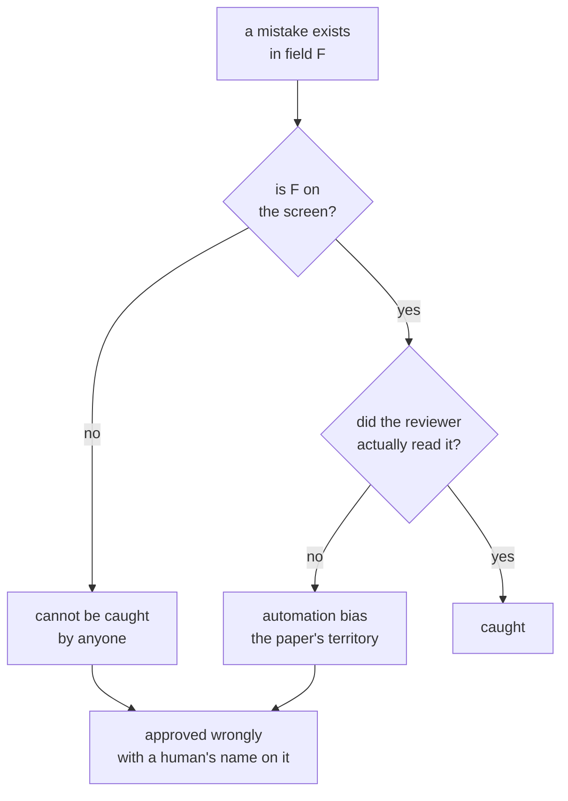

# 7.1 — The tick box nobody reads

## One-line answer

An approval screen cannot catch a mistake in a field it does not display: measured against eight
planted mistakes, the one-line screen catches **1 of 8**, the summary **5 of 8**, and the full
card **8 of 8** — and the reviewer is the same person in all three.

## The story

You install something and a window appears with a wall of text and a box: *I have read and agree
to the terms.*

You tick it. Everyone ticks it. You have ticked it hundreds of times and you have never once
read what was above it, and neither has anybody you know.

Now suppose one of those documents had said something you would genuinely have refused. You
would have agreed to it anyway, not because you are careless but because the interface was built
for a click and not for a decision. The box records your agreement perfectly. It records nothing
whatsoever about your judgement, and the two were never distinguishable to the system.

Somebody could point at the log and say a human approved it. They would be right, and it would
mean nothing.

## The idea in plain language

Every part of this day so far has been about the machinery of stopping: the pause, the record,
the anchor, the digest, the timeout. All of it is in service of one event — a person looking at
something and deciding.

This part is about the fact that **the machinery can be perfect and the event can fail to
happen**, and that whether it happens is decided almost entirely by what is on the screen.

The claim is narrower and harder than "people are careless". It is this: **a mistake in a field
the interface does not show cannot be caught, no matter who is looking.** That is not a
statement about attention or training. It is a ceiling. A reviewer shown a ticket number and two
buttons could be the most careful person in the organisation and still approve a reply
containing another customer's order number, because the reply is not on their screen.

Two terms, defined once.

**Automation bias** is the tendency to accept a machine's output because it is a machine's
output. It is the reason an approval rate drifts towards a hundred per cent over time even when
nothing about the underlying quality changed.

The **ceiling** of an interface is the best a reviewer could possibly do with it — every mistake
in a displayed field caught, every mistake in a hidden field missed. Real reviewers do worse
than the ceiling. Nobody does better. That makes the ceiling measurable without modelling a
person at all, which is what the script below does and why its numbers can be trusted.

## Why Sutra needs it

Day 63 decides which of the desk's actions need a human. That decision is only worth making if
the human's involvement changes outcomes, and this part is where you find out whether it does.

Day 64 then builds the gate, and the temptation at that point is enormous: the one-line screen
is easy to build, easy to fit in a notification, and produces a beautifully fast queue. It also
turns the whole of Phase 9's work into a log entry. Day 65's gate criterion — *the run's audit
record answers who approved what, on what evidence* — is the check that catches it, and the
evidence half of that sentence is this part.

## The paper behind it

> *Ironies of automation* · `doi:10.1016/0005-1098(83)90046-8` · Automatica 19(6), 775–779, 1983
> · <https://doi.org/10.1016/0005-1098(83)90046-8>

Automating the routine part of a task makes the human's remaining part harder, not easier,
because what is left is exactly the cases the automation could not handle — and the practice
that would have made them competent at those cases was in the routine work that was taken away.

Taught in this day's [paper part](../../papers/01-ironies-of-automation.md), which is where the
argument is worked through and where a runnable version of it with an ablation switch lives.

## The mechanism

Eight approval requests, each carrying exactly one planted mistake in one named field. Three
interfaces, differing only in which fields they display:

```bash
cd days/day-62-human-in-the-loop/lab
uv run python stamp.py
```

**Line by line:**

- `REQUESTS` is eight `(id, the field carrying the mistake, what the mistake is)` triples. Each
  mistake is a real thing a support desk sends by accident — a reply to the wrong account, a
  refund with an extra zero, an internal URL quoted to a customer.
- `INTERFACES` maps a name to the list of fields it shows. `one line` shows the ticket, `summary`
  adds customer and amount, `full` adds the body of the reply.
- `review(shown)` is the entire reviewer model, and it is one line: a mistake is caught when its
  field is in `shown`. No probability, no fatigue curve, no invented psychology. That is the
  ceiling, and the module docstring says so explicitly.

Measured on 2026-09-06:

```text
  8 approval requests, each with one planted mistake

  interface   fields shown                        caught  approved wrongly
  one line    ticket                               1/8    7  a-1 a-2 a-3 a-5 a-6 a-7 a-8
  summary     ticket, customer, amount             5/8    3  a-3 a-5 a-8
  full        ticket, customer, amount, body       8/8    0  

  what the one-line screen let through:
    a-1  (customer) reply addressed to acct-8874, ticket belongs to acct-2231
    a-2  (amount  ) refund of 24000 on a ticket worth 2400
    a-3  (body    ) draft quotes an internal runbook URL to the customer
    a-5  (body    ) draft promises a fix date nobody agreed
    a-6  (amount  ) refund of 2400 issued twice on one ticket
    a-7  (customer) reply to the reporter, not the account holder
    a-8  (body    ) draft contains another customer's order number
```

**One of eight.** That is the ceiling on the one-line screen, and the number to hold on to is not
the 1 but the 7 — seven mistakes approved wrongly by a reviewer doing everything right.

Read the list underneath. Every one of those seven is a real incident: a customer told about
another customer's order, a refund with an extra digit, an internal runbook link sent outside the
company. None of them is subtle, and all of them are invisible on a screen showing a ticket
number.

The summary row is the interesting one, because it is what most teams build. Five of eight is a
genuine improvement over one, and it is still three approved wrongly — and all three are in the
`body`, which is to say **in the thing the customer actually receives**. A screen showing every
structured field and not the text is a screen that checks the metadata of a reply and not the
reply.

The full card is 8 of 8 by construction, since every planted mistake is in one of its four
fields. That is the honest limit of this measurement: it says nothing about a mistake in a field
no interface shows. What it does say is that the gap between one and eight is a design decision
somebody makes in an afternoon, usually without knowing they are making it.



The diagram has two paths to the same bad outcome and they need different fixes. The left one is
fixed by putting the field on the screen, which is [7.2](7.2-the-card-that-makes-checking-possible.md).
The right one cannot be fixed by design at all, only reduced — by asking less often, which is
[4.3](../04-ask-a-question/4.3-the-question-you-should-not-have-asked.md), and by making the
check itself easy, which is again 7.2.

## When it breaks

The measurement above is a ceiling, and the ceiling is what makes the real failure worse than it
looks.

🎬 **The scene:** the team ships the summary screen. Someone points out that three of eight
mistakes get through, and the answer is that reviewers are trained to open the full ticket when
anything looks unusual.

😬 **The naive fix:** rely on that. The information is available; it is one click away.

💥 **Why it fails:** the reviewer has to know it looks unusual **before** deciding to look, and
the whole class of mistake in the `body` field is invisible from the summary. There is nothing on
the screen to prompt the click. The escape hatch is only used by someone who has already
suspected something, and suspicion is precisely what the summary screen has removed the input
for.

💡 **The insight:** "the information is one click away" is a statement about the system's
capability, not about the decision. If checking costs a click, checking is optional, and an
optional check performed under a queue is not performed.

There is a measurable version of that, and you can produce it directly:

```bash
uv run python stamp.py --fields ticket,body
```

**Line by line:**

- `--fields` takes an arbitrary comma-separated interface, so a proposed screen can be scored
  before it is built. This one shows the ticket and the reply body, and nothing else.

```text
  8 approval requests, each with one planted mistake

  interface   fields shown                        caught  approved wrongly
  ticket,body  ticket, body                         4/8    4  a-1 a-2 a-6 a-7

  what the one-line screen let through:
    a-1  (customer) reply addressed to acct-8874, ticket belongs to acct-2231
    a-2  (amount  ) refund of 24000 on a ticket worth 2400
    a-3  (body    ) draft quotes an internal runbook URL to the customer
    a-5  (body    ) draft promises a fix date nobody agreed
    a-6  (amount  ) refund of 2400 issued twice on one ticket
    a-7  (customer) reply to the reporter, not the account holder
    a-8  (body    ) draft contains another customer's order number
```

Two fields, four of eight. The summary screen also shows two fields beyond the ticket and scores
five — but look at **which** four this one misses: `a-1`, `a-2`, `a-6`, `a-7`, every one of them
a customer or an amount. The summary screen's three misses were `a-3`, `a-5`, `a-8`, every one of
them in the body.

**The blind spots are disjoint.** Two screens of comparable size, and the mistakes each one
cannot see are entirely different sets. That is the argument for scoring an interface against
**the mistakes you actually ship** rather than counting how many fields it has: field count
predicts almost nothing, and the choice of which fields is the whole design.

(The script always prints the one-line breakdown underneath, whatever `--fields` was given, so
the second half of that output is the same list as before.)

## In production

**What a professional writes instead.** The screen shows the payload verbatim — the exact text
the customer will receive, not a summary of it — plus the structured fields the decision depends
on, plus **any check the system can perform itself**, with its result. That last one is
[7.2](7.2-the-card-that-makes-checking-possible.md)'s subject and it is the highest-leverage
part: a line reading *refund on the ticket 2400 / refund promised in the draft 24000 / they
disagree YES* converts a reading task into a noticing task, and people are far better at
noticing than at reading.

**What degrades at scale or under concurrency.** The approval rate drifts up and nobody
investigates, because a rising approval rate looks like an improving model. It is equally
consistent with reviewers who have stopped reading, and the two are indistinguishable from the
rate alone. The signal that separates them is **time spent on the decision** and the share of
approvals that were preceded by opening the full ticket — both of which have to be instrumented
deliberately, because neither is a natural by-product of the gate.

**The failure mode that only appears with real traffic.** Reviewers develop a heuristic and the
heuristic becomes the control. They learn that tickets from one category are always fine and
approve those without reading, which is locally correct and right up until the day an incident
makes that category the dangerous one. The gate's protection is now conditional on a pattern
nobody wrote down and nobody is monitoring.

**The review comment a senior engineer leaves:** *"This approval screen shows the ticket id and
two buttons. Every mistake we have actually shipped in the last quarter was in the body of the
reply, so as designed this gate would have caught none of them. Put the reply text on the card,
and add the amount comparison as a computed line rather than expecting somebody to hold two
numbers in their head."*

**The interview question:** *"You added a human approval step. How do you know it is doing
anything?"* The answer that shows you have measured it: *"By checking what the screen can
possibly catch, before arguing about whether people are careful. I took eight real mistakes we
had shipped, mapped each to the field it was in, and scored our interfaces: the one-line version
could catch one of the eight, the summary five, the full card all eight. That is a ceiling, not a
prediction — real reviewers do worse. The point is that the gap between one and eight was a
layout decision somebody made in an afternoon, and no amount of training moves a ceiling."*

## Check yourself

```bash
cd days/day-62-human-in-the-loop/lab
uv run python stamp.py
uv run python stamp.py --fields ticket,body
uv run python stamp.py --fields ticket,customer,amount,body,policy
```

The third one adds a field no mistake is planted in. Watch what happens to the score, and say
what that tells you about judging an interface by how much it displays.

**Out loud, without scrolling up:** state the ceiling claim in one sentence, and say why "the
full ticket is one click away" does not raise it.

**Next:** [7.2 — The card that makes checking possible](7.2-the-card-that-makes-checking-possible.md).
