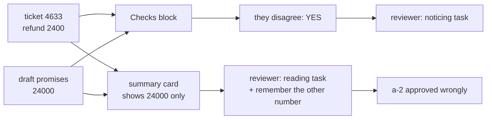

# 7.2 — The card that makes checking possible

## One-line answer

The full approval card does not merely show more fields — it **performs the comparison the
reviewer would otherwise have to do in their head**, printing `refund on the ticket 2400`,
`refund promised in the draft 24000` and `they disagree YES`, which turns reading into noticing.

## The story

The removal van is loaded and the driver hands you a clipboard. On it is an inventory: every box,
every piece of furniture, numbered, with a condition against each one. *Sofa, one, small tear left
arm. Boxes, kitchen, six.* You walk down the list, look at the van, and sign.

Compare that with the other version, which you have also signed at some point: a single line that
says *goods received in good order*, and a space for your name.

Both are signatures. Both are legally your agreement. Only one of them was a decision you could
possibly have made, because only one of them put the thing you were agreeing about in front of
you in a form you could check item by item.

And notice the second column. *Small tear, left arm.* Somebody already looked and wrote down what
they found. You are not being asked to inspect a sofa from scratch; you are being asked whether
you agree with an inspection. That is a much smaller job, and it is a job you can actually do
standing on a pavement.

## The idea in plain language

[7.1](7.1-the-tick-box-nobody-reads.md) established the ceiling: a mistake in a hidden field
cannot be caught. This part is about the space under the ceiling, and the claim is that showing
more is necessary but not sufficient.

A reviewer given the full reply text and the ticket's refund amount *can* catch a mismatch. To
do it they must read a paragraph, remember a number, find the other number, and compare them —
under a queue, forty times. That is a reading task, and reading tasks degrade with volume in a
way that is entirely predictable and entirely unfixable by asking people to be careful.

The alternative is to do the comparison in the system and show its result. The reviewer's job
becomes: *does this computed line look wrong?* That is a noticing task, and noticing survives
volume far better than reading does.

Three properties of an approval card that can actually be used:

1. **The payload verbatim.** Not a summary, not a truncation with an ellipsis. The exact text the
   customer receives, because a summary is a second thing to trust and the whole point is to
   check the first.
2. **The decision fields.** Whatever the policy's condition depends on — here, the refund amount,
   because that is what Day 63's rule tests.
3. **The checks the system can already do**, with their answers. Every comparison the machine can
   perform, performed, with the result on the card.

Point 3 is the one that separates a good card from a long one. It is also the point that
connects this part back to the paper this day teaches: the system is doing the routine work — the
arithmetic, the cross-reference — and leaving the person the judgement. That is automation used
in the direction that helps, and it is the opposite of the arrangement
[the paper part](../../papers/01-ironies-of-automation.md) warns about, where the machine takes
the routine and leaves the human the hard cases with no support.

One term, defined once. A **computed check** is an assertion the system evaluates and displays
rather than enforcing. It does not block. If it blocked, it would be a validation rule and there
would be no reason to show a person at all. It is displayed precisely because the system is not
confident enough to act on it alone.

## Why Sutra needs it

Day 64 builds this card. What goes on it is decided here, and the field list is what makes Day
65's criterion — *the run's audit record answers who approved what, on what evidence* —
answerable, because the rendered card **is** the evidence stored in
[3.3](../03-edit/3.3-what-the-record-says-the-customer-got.md)'s `shown` field.

There is a direct line from this part to the refund mistake in
[7.1](7.1-the-tick-box-nobody-reads.md)'s list. `a-2` is *refund of 24000 on a ticket worth
2400* — a mistake that the summary screen shows both halves of and still lets through, because
showing two numbers is not the same as comparing them.

## The mechanism

The same approval, rendered three ways:

```bash
cd days/day-62-human-in-the-loop/lab
uv run python card.py
```

**Line by line:**

- `card.py` renders one real ticket — 4633, the duplicate-charge one — through three functions
  that return lists of lines. Rendering to text rather than to a web page is deliberate: the
  argument is about content, and a browser would let layout smuggle in.
- `CLAIMED_REFUND = 24000` is the planted mistake. The ticket's own refund is 2400, and the draft
  promises ten times that.
- `full()` builds on `summary()` and then adds the policy line, the verbatim reply text wrapped
  at 68 characters, and the `Checks:` block.

Measured on 2026-09-06:

```text
  --- one line --------------------------------------------------
  | Send reply for ticket 4633?   [approve] [reject]

  --- summary ---------------------------------------------------
  | Ticket    4633  Charged twice for one order
  | Customer  acct-8874
  | Refund    24000
  |                                         [approve] [reject]

  --- full ------------------------------------------------------
  | Ticket    4633  Charged twice for one order
  | Customer  acct-8874
  | Refund    24000
  | Policy    day63-policy-v1: refunds over 1000 need a second person
  | 
  | The customer will receive, exactly:
  |   We can see two authorisations against the same order. We have releas
  |   ed the second one; it clears in three working days.
  | 
  | Checks:
  |   refund on the ticket        2400
  |   refund promised in the draft 24000
  |   they disagree               YES
  | 
  |                                         [approve] [reject]

  Only the last one lets an approver notice that the draft promises 24000
  against a ticket worth 2400. The first two are not shorter versions of
  the same decision. They are a different, easier decision.
```

Look at the summary card first. It shows `Refund 24000`. That is the wrong number, on the screen,
in plain sight — and there is nothing to compare it against. A reviewer would have to already
know what the ticket's refund was, which means holding the state of another record in their head
while reading this one.

Now the `Checks:` block:

```text
  refund on the ticket        2400
  refund promised in the draft 24000
  they disagree               YES
```

Nobody has to remember anything. Nobody has to look anything up. The disagreement is a word on
the card, and the reviewer's remaining job — the part that genuinely needs a person — is to
decide what to do about it. That is the division of labour this part is arguing for: the machine
does the cross-referencing, the human does the judging.

The last three lines of the output make the sharper claim, and it is worth restating: *the first
two are not shorter versions of the same decision. They are a different, easier decision.* A
reviewer on the one-line card is deciding *does ticket 4633 look like the sort of thing we send
replies about?* A reviewer on the full card is deciding *should this specific text go to this
customer given that the numbers disagree?* Those are different questions, and only the second one
is the question the gate was added to ask.



## When it breaks

The full card has its own failure, and it is the one that returns you to
[7.1](7.1-the-tick-box-nobody-reads.md) by a longer route.

🎬 **The scene:** the checks block works. So more checks are added — every comparison anybody can
think of, on every card.

😬 **The naive fix:** keep adding. Each check is individually useful and none of them can hurt.

💥 **Why it fails:** a card with twenty check lines, nineteen of which always say `no` and are
never interesting, is a wall of text with a signature box at the bottom. The reviewer's eye stops
going to the checks block, because the checks block has been overwhelmingly uninformative every
time they have looked at it. The mechanism that made noticing possible has been converted back
into reading, and the card now takes longer to serve no purpose.

💡 **The insight:** a computed check earns its place on the card by **firing sometimes**. A check
that has never once come out `YES` is not evidence of safety; it is a line that has trained the
reviewer to skip the block it lives in. Checks belong on a card the way alerts belong on a
dashboard, and the same rule applies: if it never fires, remove it, and if it always fires, fix
the thing it is telling you about.

You can see the shape of the over-long card by rendering just the full one:

```bash
uv run python card.py --interface full
```

**Line by line:**

- `--interface full` renders one card rather than all three, which is how you would look at a
  proposed layout in isolation.

The card that comes out is at the top end of what a person will read in a queue, and it has
exactly **one** check in it. Count the lines it would have with twenty, and the failure above
stops being hypothetical.

There is a second, quieter break. The verbatim reply is wrapped at 68 characters by
`full()`, splitting `released` across two lines as `releas` / `ed`. That is cosmetic here and it
is not always cosmetic: a card that reformats the payload is showing the reviewer something other
than what the customer receives, and for anything where whitespace or line breaks matter — a
code block, an address, a reference number — the reviewer can approve a rendering that differs
from the thing sent. **Show the payload in a form that cannot be reflowed**, or state on the card
that it has been wrapped for display.

## In production

**What a professional writes instead.** The card is generated from the same object that is stored
in the pending record's `shown` field, so what was displayed and what was recorded cannot drift.
Rendering the card twice — once for the screen and once for the audit trail — is the bug that
makes [3.3](../03-edit/3.3-what-the-record-says-the-customer-got.md)'s evidence field a lie the
first time somebody changes one of the two templates.

**What degrades at scale or under concurrency.** The checks get expensive. A comparison against
the ticket is a field lookup; a comparison against the customer's payment history is a query, and
now rendering the queue is forty queries. Teams respond by computing the checks lazily, at which
point the card that reaches the reviewer sometimes has them and sometimes does not, and the
reviewer cannot tell which. Compute the checks when the question is **asked**, store the results
on the record, and render from the record.

**The failure mode that only appears with real traffic.** The card is right and the queue view is
not. Reviewers work from a list, and the list shows a subject line — so the triage of *which* to
open is done on exactly the one-line screen this part argues against. The card's quality is then
irrelevant for everything nobody opens. If a queue exists, the check results have to be visible in
the list, not only on the card.

**The review comment a senior engineer leaves:** *"The card shows the refund from the draft and
the refund from the ticket in two places twenty lines apart, and expects the reviewer to spot
that they differ. Compute the comparison and print the answer. We already know how to do the
subtraction; making a person do it under a queue is where our mistakes are going to come from."*

**The interview question:** *"What is on your approval screen?"* The answer that shows you have
built one that worked: *"The exact payload, the fields the policy condition depends on, and every
check we can compute, with its result. The third one is what actually changed our numbers — we
were showing the reviewer two amounts in different parts of the card and expecting them to
compare, and once we printed `they disagree: YES` the mistakes stopped. The discipline we had to
add afterwards was removing checks that never fired, because a block of twenty lines that always
say no is a block nobody reads."*

## Check yourself

```bash
cd days/day-62-human-in-the-loop/lab
uv run python card.py
uv run python card.py --interface summary
```

Now change `CLAIMED_REFUND` in `card.py` to `2400` and render the full card again. One line
changes. Write down which one, and say what the reviewer's job is now that it says what it says.

**Out loud, without scrolling up:** explain the difference between a reading task and a noticing
task, and give the rule for when a computed check should be taken off a card.

**Next:** [7.3 — Where ADK confirmation will not go](7.3-where-adk-confirmation-will-not-go.md).
