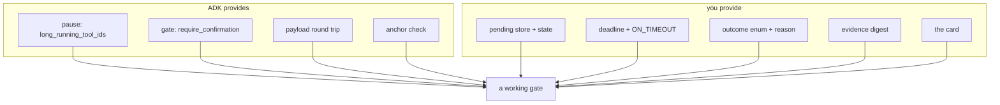

# 7.3 — Where ADK confirmation will not go

## One-line answer

`ToolConfirmation` carries exactly three fields — `hint`, `confirmed`, `payload` — and the
rejection branch of `FunctionTool.run_async` in `google-adk==2.7.1` reads none of them except
`confirmed`, so the deadline, the outcome vocabulary, the pending store and the reason for a
refusal are all yours to build.

## The story

A hotel door has a sign that hangs on the handle. One side says *do not disturb*. The other side
says *please make up the room*.

That covers most mornings. Then you have one where the honest answer is *come back after four*,
and there is no way to say it. The sign has two states, and the thing you need to communicate has
three.

So you improvise. You leave the sign on *do not disturb* and hope somebody comes back later, or
you take it off and accept an interruption you did not want. Both are wrong, and neither is the
sign's fault — it is a two-state device being asked to carry a decision with more than two states
in it.

The mistake is not using the sign. The mistake would be concluding, from the fact that the hotel
provided a sign, that the sign is the whole of the interface.

## The idea in plain language

Everything this day has built sits on a small ADK primitive. It is worth being exact about how
small, because the gap between what the framework gives you and what a working gate needs is
where Day 64's build brief lives — and because a team that assumes the framework covers the whole
problem discovers the gap one field at a time, in production.

What ADK 2.7.1 provides:

| Provided | Where it was met |
| --- | --- |
| a pause that does not hold the process | [1.1](../01-the-shape-of-the-wait/1.1-four-questions-wearing-one-name.md), `long_running_tool_ids` |
| a static gate on a tool | [2.1](../02-approve-or-reject/2.1-the-gate-that-returns-one-bit.md), `require_confirmation=True` |
| a per-call gate decided from the arguments | [2.2](../02-approve-or-reject/2.2-decided-per-call-not-per-wiring.md) |
| a dynamic gate with an arbitrary payload | [3.1](../03-edit/3.1-the-human-changes-the-answer.md), `request_confirmation` |
| an anchor check that refuses a swapped call | [3.2](../03-edit/3.2-approve-one-thing-run-another.md) |
| built-in question tools | [4.1](../04-ask-a-question/4.1-a-missing-fact-is-not-a-missing-permission.md) and [4.2](../04-ask-a-question/4.2-a-question-with-edges.md) |

What it does not provide, and this day had to build in plain Python every time:

| Not provided | Where this day built it |
| --- | --- |
| a place to park the question | `_pending.py`, [1.2](../01-the-shape-of-the-wait/1.2-waiting-is-a-state-not-a-pause.md) |
| a state on that question, so an answer cannot apply twice | [1.3](../01-the-shape-of-the-wait/1.3-late-twice-or-never.md) |
| a reason attached to a refusal | [2.3](../02-approve-or-reject/2.3-what-a-no-has-to-carry.md) |
| an outcome vocabulary wider than yes/no | [5.1](../05-take-over/5.1-the-pattern-with-no-resume.md) |
| a deadline and a timeout policy | [6.1](../06-nobody-answered/6.1-a-default-is-a-decision-nobody-made.md) |
| a freshness check on the evidence | [6.2](../06-nobody-answered/6.2-the-answer-to-a-question-that-no-longer-exists.md) |
| the card the person actually sees | [7.2](7.2-the-card-that-makes-checking-possible.md) |

That second table is not a criticism of the framework. A framework's job here is to make the run
stop and start again correctly, and ADK does that. Everything in the second column is **policy**,
and policy belongs to the application — a library that shipped a timeout default would be making
Day 63's decision on your behalf, for every action, without knowing what any of them do.

The failure mode to avoid is the opposite one: assuming that because `require_confirmation`
exists, human-in-the-loop is a solved feature.

## Why Sutra needs it

This is the part that turns into Day 64's build brief. Every row of the second table is a
component `sutra/hitl.py` has to have, and `gate.py`'s six checks are drawn from exactly that
column: a record that stores what was shown, a digest, a guard against a second answer, an
expiry, a resume that re-checks, and a named `ON_TIMEOUT`.

Day 63 writes the policy those components are configured with. Neither day can be done by
someone who believes the framework already covers it.

## The mechanism

The whole of what comes back from a person, as ADK models it:

```bash
cd days/day-62-human-in-the-loop/lab
uv run python -c "
import warnings
warnings.filterwarnings('ignore', message=r'.*EXPERIMENTAL.*')
from google.adk.tools.tool_confirmation import ToolConfirmation
for name, field in ToolConfirmation.model_fields.items():
    print(f'  {name:<10} {field.annotation}')
"
```

**Line by line:**

- `ToolConfirmation` is the Pydantic model that travels out with the question and back with the
  answer. Reading its fields is the fastest honest way to see the ceiling of the primitive.
- `model_fields` is Pydantic's own registry, so this is the real definition rather than
  documentation about it.

Measured on 2026-09-06 against installed `google-adk==2.7.1`:

```text
  hint       <class 'str'>
  confirmed  <class 'bool'>
  payload    typing.Optional[typing.Any]
```

Three fields. `hint` is prose going out, `confirmed` is the bit coming back, and `payload` is the
arbitrary object that makes the edit pattern possible. There is no `reason`, no `decided_by`, no
`decided_at`, no `expires_at`, and no outcome beyond a boolean.

Now the part that matters more, because a field existing is not the same as a field being read.
Here is the rejection branch of `FunctionTool.run_async`, quoted from the installed package:

```text
      elif not tool_context.tool_confirmation.confirmed:
        return {'error': 'This tool call is rejected.'}
```

`payload` is in scope on that line and is not consulted. That is the source of
[2.3](../02-approve-or-reject/2.3-what-a-no-has-to-carry.md)'s measured finding — attach a reason
to a refusal and it goes nowhere — and it is worth having seen the line rather than only the
behaviour, because it tells you the behaviour is deliberate rather than a bug you might be
holding wrong.

Verified against `adk.dev/tools-custom/function-tools/`, fetched 2026-09-06, and read from
`google/adk/tools/function_tool.py` in the installed 2.7.1.



## When it breaks

The break is reaching for the framework's shape when the decision does not fit in it.

🎬 **The scene:** a refund needs approval, and the desk's policy is that refunds over a threshold
need **two** people rather than one.

😬 **The naive fix:** call `request_confirmation` twice, or gate the tool and require the second
person to approve on the same confirmation.

💥 **Why it fails:** `confirmed` is a boolean on a single `ToolConfirmation`, and the second
answer overwrites the first — there is nowhere in the model for two identities and two decisions.
Worse, ADK's own duplicate protection is not designed to help here: from the runtime's point of
view a second answer to the same call id is either the same answer again or a conflict, not the
second half of a quorum. Whatever you build on top will be a store of your own with two rows in
it, and the framework's confirmation will at best be the last step of it.

💡 **The insight:** the primitive models *one person, one call, one bit*. Any decision that is
not that shape — two approvers, a partial approval, an approval with conditions, an approval that
expires — is an application-level object that happens to end with a framework confirmation. Design
it as such from the start rather than trying to widen the primitive.

The second break is subtler and it is about the `hint`. It is a `str`, it goes to the client, and
it is the only thing ADK will render for you. So a team that puts its approval card into the
`hint` gets a card that is a wall of text, unstructured, unstyleable and unstorable as anything
but a blob. `payload` is the structured channel and the card belongs there — the `hint` is one
sentence saying what is being asked, which is exactly how `edit.py` uses it:

```text
  hint:   Please approve or reject the tool call send_reply() by responding with a FunctionResponse with an expected ToolConfirmation payload.
```

That is ADK's own default hint, printed by `approve.py`. It is a sentence about the protocol,
not about the decision — which tells you what the field is for and how little of the reviewer's
problem it is trying to solve.

## In production

**What a professional writes instead.** They put a thin layer of their own between the agent and
the framework: one module that owns the pending record, the deadline, the outcome vocabulary and
the card, and that calls ADK's confirmation at the end. That is `sutra/hitl.py`. The value of the
layer is not abstraction for its own sake — it is that the policy questions from Day 63 all have
exactly one place to live, and the framework's shape stops leaking into the rest of the
application.

**What degrades at scale or under concurrency.** The mismatch between the framework's model and
yours becomes a synchronisation problem. Your pending row says `answered`; ADK's session says the
call is still awaiting a confirmation, or the reverse. Two sources of truth for one question is
the standing hazard of this design, and the resolution has to be decided rather than discovered:
**your record is the source of truth for the decision, and the framework's session is the source
of truth for the run.** Write that down, because the alternative is a resume path that reads one
and acts on the other.

**The failure mode that only appears with real traffic.** Version drift in the framework. The
rejection string above is not part of any published contract — it is an implementation detail
that this day happens to depend on for its measurements. Code that matches on
`'This tool call is rejected.'` will break on an upgrade, silently, and the failure will be a
rejection treated as a success. Depend on `confirmed` being `False`, never on the string.

**The review comment a senior engineer leaves:** *"This treats `require_confirmation` as the
approval system. It is a pause. There is no deadline, no record of who approved, no place for a
reason, and no state to stop a second answer — I have checked, and `ToolConfirmation` has three
fields. Put a module in front of it that owns those and let the framework do the one thing it
does."*

**The interview question:** *"How much of your human-in-the-loop did the framework give you?"*
The answer that shows you have read the source: *"The pause and the round trip, and they are
genuinely good — the runtime stops without holding a process, and it refuses an answer whose
anchor does not match the call it was asked about. Everything that makes it a control was ours:
the pending store, the state that stops a duplicate, the deadline and what happens at it, an
outcome enum wider than a boolean, a digest to catch staleness, and the card. `ToolConfirmation`
is three fields, and the rejection path does not even read the payload, so a reason attached to a
refusal is dropped before the model sees it. Knowing that early is what stopped us designing
around a field that does nothing."*

## Check yourself

```bash
cd days/day-62-human-in-the-loop/lab
uv run python -c "
import warnings
warnings.filterwarnings('ignore', message=r'.*EXPERIMENTAL.*')
from google.adk.tools.tool_confirmation import ToolConfirmation
print(sorted(ToolConfirmation.model_fields))
"
uv run python retry.py --reason
```

Three fields, and the `--reason` run shows what happens to a fourth thing you wish were there.
Go back to the second table above and, for each row, name the part of this day that built it.

**Out loud, without scrolling up:** name three things a working approval gate needs that ADK does
not provide, and say why it is right that it does not provide them.

**Next:** [8.1 — The backlog is the real limit](../08-in-production/8.1-the-backlog-is-the-real-limit.md).
