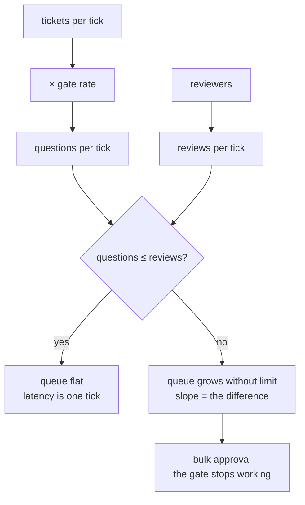

# 8.1 — The backlog is the real limit

## One-line answer

At 100% of tickets gated the queue never levels off — it goes 2, 20, 40, 60 and keeps climbing —
and at 25% gated it stays flat at zero with the same single reviewer, which makes *how much you
gate* a capacity decision rather than a safety preference.

## The story

Three flights land within a few minutes of each other and everybody walks to passport control.

There are eight desks. Four are staffed. The queue does not settle into a steady length; it grows
for as long as people keep arriving faster than the desks can clear them, and it keeps growing
after the last passenger from the third flight has joined it, because the queue is behind by
everything it did not clear earlier.

Nobody in that hall is being slow. Each officer is doing the same careful check they always do,
at the same rate. The arithmetic simply does not work, and no amount of care fixes arithmetic.

The two things that would fix it are opening more desks, or checking fewer people. Airports do
both — that is what the separate channel for one category of passenger is — and the second one is
the interesting choice, because it means deciding that some checks are not worth their capacity.

## The idea in plain language

Every part of this day so far has been about making a single interruption work. This part is about
what happens when there are a lot of them, and the answer is arithmetic that does not care how
good your card is.

Two rates:

- **Arrival rate** — how many questions the agent produces. Set by ticket volume and by *what
  fraction of actions you decided to gate*.
- **Clear rate** — how many a person answers. Set by how many people and how long each decision
  takes.

If arrivals exceed clears, the queue grows without limit. Not "gets long" — **grows without
limit**, for as long as the imbalance holds. There is no equilibrium, and adding a small amount of
capacity does not produce a small improvement; it produces the same unbounded growth at a slower
slope until the rates cross.

The term for the fraction of actions that require a person is the **gate rate**. It is the lever
almost nobody thinks of as a lever, because it is chosen for safety reasons and then never
revisited as a capacity decision. But it multiplies the arrival rate directly, and unlike hiring
it can be changed in an afternoon.

Two consequences worth stating before the measurement:

1. **A gate that cannot keep up is not a slow gate, it is a broken one.** Once the queue is
   longer than a person can work through, the practical behaviour becomes bulk-approving to clear
   it, which is [7.1](../07-what-the-human-sees/7.1-the-tick-box-nobody-reads.md)'s failure
   arriving through capacity rather than through layout.
2. **The queue's cost is paid by the customer.** Every question in it is a ticket not answered
   yet. A gate is latency you have chosen to add, and the arithmetic below says how much.

## Why Sutra needs it

Day 63 writes the policy table, and its most consequential column is not which pattern to use —
it is which actions are gated at all. That column sets the gate rate, and this part is the
arithmetic that says what the desk can afford.

Day 65 then asks whether Phase 9 is finished, and a durable, well-audited, tamper-checked
approval gate that nobody can keep up with has not finished anything. The number below is one
that gate should be reporting.

## The mechanism

Three tickets arrive per tick and every one of them is gated. Three staffing levels:

```bash
cd days/day-62-human-in-the-loop/lab
uv run python backlog.py
```

**Line by line:**

- `TICKS = 30` and `TICKETS_PER_TICK = 3` are fixed, so the two arms below differ only in the
  gate rate.
- `simulate(gate_rate, reviews_per_tick)` is one loop: add the arrivals, clear up to
  `reviews_per_tick`, record the depth. `carried` accumulates the fractional part so a gate rate
  of 0.25 produces a whole number of tickets over time rather than a quarter of one each tick.
- `keeping_up` compares the final depth against the depth at the halfway point. That is a
  deliberately crude test and it is the right one: a queue that is no longer than it was halfway
  through is not growing.

Measured on 2026-09-06:

```text
  3 tickets per tick, 30 ticks, 100% of them gated

  reviews/tick  final queue  peak queue  cleared  keeping up
             1           60          60       30  NO
             2           30          30       60  NO
             3            0           0       90  yes

  with one review per tick the queue goes 2 -> 20 -> 40 -> 60
  it cannot level off: 3 arrive per tick, 1 is reviewed.
```

Read the last two lines first, because they are the whole part. **2 → 20 → 40 → 60.** The queue is
not settling at some large number; it is climbing at a constant slope, and it will keep climbing
for as long as the run goes on. Extending the simulation does not find an equilibrium, it finds a
bigger number.

Now read the middle row. Doubling the reviewers halves the slope — the queue reaches 30 instead
of 60 — and it is still growing. **Two of the three staffing levels do not work at all**, and the
one that works is the one where the clear rate exactly matches the arrival rate, which leaves no
margin for anybody being on holiday.

Now change the lever nobody thinks of as a lever:

```bash
uv run python backlog.py --gate-rate 0.25
```

**Line by line:**

- Everything is identical except that a quarter of tickets are gated instead of all of them. Same
  ticket volume, same reviewers, same decisions on the tickets that are gated.

```text
  3 tickets per tick, 30 ticks, 25% of them gated

  reviews/tick  final queue  peak queue  cleared  keeping up
             1            0           0       22  yes
             2            0           0       22  yes
             3            0           0       22  yes

  with one review per tick the queue goes 0 -> 0 -> 0 -> 0
  it stays flat: 0.75 arrive per tick and 1 can be reviewed.
```

**Zero, with one reviewer.** The peak queue is zero — questions are answered in the tick they
arrive. And the extra reviewers buy nothing at all, which is the shape of the finding: past the
point where the rates cross, capacity is free and useless, and before it, capacity is expensive
and insufficient.

Compare `cleared`: 30 in the first table's first row against 22 here. The gated system with one
reviewer cleared *more* questions — and left a queue of 60 behind it, which means sixty tickets
whose customers are still waiting. The 22 is the whole of the work, done.



## When it breaks

The failure is not the queue growing. It is what people do about it.

🎬 **The scene:** the gate ships at 100% and the queue behaves like the first table. Within a
fortnight it is long enough that nobody can clear it in a sitting.

😬 **The naive fix:** ask the reviewers to work through the backlog.

💥 **Why it fails:** a person facing sixty approvals does not perform sixty decisions. They
perform one decision — *this batch looks routine* — and apply it sixty times. The gate is now
recording sixty human approvals that contain one judgement between them, and the audit trail from
[3.3](../03-edit/3.3-what-the-record-says-the-customer-got.md) will show sixty entries with a
person's name on them. **The control has been converted into a formality without anybody deciding
to remove it**, which is worse than removing it, because the organisation still believes it is
there.

💡 **The insight:** the queue length is not an inconvenience, it is a correctness property of the
gate. Past a threshold, the thing being measured stops being a human decision, and no field on
the record can tell you it has happened.

You can see the collapse threshold in the numbers rather than guessing at it. The queue depth
after 30 ticks at one review per tick:

```text
  reviews/tick  final queue  peak queue  cleared  keeping up
             1           60          60       30  NO
```

Sixty pending questions and one reviewer. Whatever number you believe a person can genuinely
decide in one sitting, sixty is past it, and this is a small simulation — three tickets a tick.
The real system's version of this number is the one to put on a dashboard, and it is
[8.2](8.2-the-three-numbers-to-put-on-a-wall.md)'s subject.

## In production

**What a professional writes instead.** They compute this before shipping the gate, from real
ticket volume and a measured decision rate, and they choose the gate rate to fit the reviewers
they actually have. The policy table therefore has two inputs, not one: what each action's blast
radius is, **and** what fraction of traffic hits it. An action that is dangerous and rare gets
gated. An action that is dangerous and constant needs a different answer entirely — usually
narrowing the condition, as [2.2](../02-approve-or-reject/2.2-decided-per-call-not-per-wiring.md)
does with a threshold, so that the gate fires on the tail rather than on everything.

**What degrades at scale or under concurrency.** Arrivals are bursty and reviewers are not. A
day's tickets do not arrive evenly; they arrive in a morning, and the queue peak is set by the
burst rather than by the average. A system sized on averages is under water every morning and
idle every afternoon, and the averages look fine in the weekly report. Size on the peak, or add
an explicit shedding rule that lowers the gate rate when the queue exceeds a threshold — and if
you do the second one, log it loudly, because it is a safety control being relaxed automatically.

**The failure mode that only appears with real traffic.** The gate rate creeps. Nobody sets it to
100%; it gets there one sensible addition at a time, each one justified on its own, each one
raising the arrival rate a little. There is no moment at which somebody decides to overload the
reviewers. The defence is to treat the gate rate as a number with an owner and a budget, reviewed
when it changes, rather than as a property that emerges from a list of rules.

**The review comment a senior engineer leaves:** *"This gates every outbound reply. We send a few
hundred a day and we have one person on the approval rota. That is not a safety control, it is a
queue with a person standing next to it — by the second week they will be approving in batches
and we will have the audit record of a control we no longer have. Either gate the refund path
only, or staff it properly and say so in the runbook."*

**The interview question:** *"How did you decide what needed approving?"* The answer that shows
you have run one: *"Blast radius first, then arithmetic. The second half is the one people skip:
we worked out the arrival rate our policy implied and compared it against what our reviewers
could actually clear. At a hundred per cent gated the queue grows without limit — adding a second
reviewer just halves the slope — and at a quarter gated one person keeps up with a peak queue of
zero. So the gate rate is a capacity decision as much as a safety one, and the failure it causes
is not a slow queue, it is bulk approval, which leaves you with the audit trail of a control that
has stopped working."*

## Check yourself

```bash
cd days/day-62-human-in-the-loop/lab
uv run python backlog.py
uv run python backlog.py --gate-rate 0.25
uv run python backlog.py --gate-rate 0.5
```

The third one is between the two. Write down whether it keeps up at one, two and three reviews
per tick, and find the gate rate at which one reviewer stops coping.

**Out loud, without scrolling up:** say what happens to a queue when arrivals exceed clears, and
name the thing a reviewer does when the queue gets long that turns the gate into a formality.

**Next:** [8.2 — The three numbers to put on a wall](8.2-the-three-numbers-to-put-on-a-wall.md).
