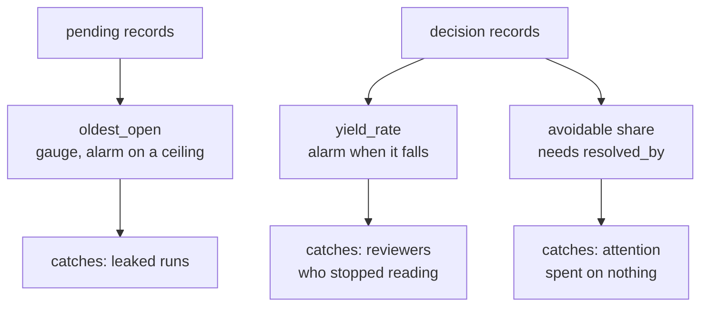

# 8.2 — The three numbers to put on a wall

## One-line answer

A human-in-the-loop gate needs three standing measurements — **the age of the oldest open
question**, **the share of decisions that changed something**, and **the share of interruptions
that were avoidable** — because every failure in this day is invisible to a queue-depth
dashboard.

## The story

In an office block the fire alarm is tested at the same time every month. Somebody presses the
button, the bells ring for a few seconds, and everyone carries on typing.

The test is not there to reassure anybody that there is an alarm — you can see the alarm. It is
there because the ways an alarm stops working are all silent. A dead battery is silent. A
disconnected sounder on the third floor is silent. A panel someone isolated during building work
and forgot to restore is silent. The system gives no indication of any of it, and the building
feels exactly as safe as it did the week before.

So the test does not check whether the alarm exists. It checks whether the alarm still **does
anything**, which is a different question, and it has to be asked on a schedule because nothing
will ever raise it for you.

## The idea in plain language

An approval gate is an alarm. Every failure this day has described is silent:

| Failure | Where | What a queue-depth dashboard shows |
| --- | --- | --- |
| runs leaked, never closed | [5.2](../05-take-over/5.2-the-run-nobody-closed.md) | a flat queue with rotting contents |
| reviewers stopped reading | [7.1](../07-what-the-human-sees/7.1-the-tick-box-nobody-reads.md) | a healthy, rising approval rate |
| the gate is asking avoidable questions | [4.3](../04-ask-a-question/4.3-the-question-you-should-not-have-asked.md) | a busy queue that is being cleared |
| a stale approval acted on | [6.2](../06-nobody-answered/6.2-the-answer-to-a-question-that-no-longer-exists.md) | nothing at all |
| bulk approval under load | [8.1](8.1-the-backlog-is-the-real-limit.md) | a queue that finally came down |

Read the right-hand column. **Three of those five look like good news** on the dashboard most
teams build. That is the argument for choosing the measurements deliberately rather than
instrumenting whatever is easy to count.

Three numbers, and each one is chosen because it is the *only* thing that makes a particular
silent failure loud.

**1. The age of the oldest open question.** Not the count. A count is dominated by arrivals and
stays flat while its contents go stale; the age of the oldest is scale-independent and it is
non-zero exactly when something has stopped moving. This is the number that finds
[5.2](../05-take-over/5.2-the-run-nobody-closed.md)'s leaked runs, and it is the single most
useful number in this day.

**2. The share of decisions that changed something.** A rejection, an edit, a take-over — any
outcome other than "approved unchanged". This is the gate's **yield**, and it is the answer to
*is this control doing anything?* An approval rate near a hundred per cent with a yield near zero
is a gate that has stopped working, and the two are indistinguishable from the approval rate
alone. Note that this needs [3.1](../03-edit/3.1-the-human-changes-the-answer.md)'s edit distance
and [5.1](../05-take-over/5.1-the-pattern-with-no-resume.md)'s outcome enum to exist — you cannot
measure yield with a boolean.

**3. The share of interruptions that were avoidable.** From
[4.3](../04-ask-a-question/4.3-the-question-you-should-not-have-asked.md): questions whose
answers were already available. This is the number that tells you whether the reviewers'
attention is being spent on the decisions you added the gate for, and it is the cheapest lever on
[8.1](8.1-the-backlog-is-the-real-limit.md)'s arithmetic.

None of the three is a by-product of running the system. Each has to be decided on, and the
fields that make it computable have to be on the pending record before the first question is
asked — which is why this part is the last one in the day and the record was designed in
[6.3](../06-nobody-answered/6.3-where-the-question-goes.md).

## Why Sutra needs it

Day 65's phase gate asks whether Phase 9 is finished, and "a human approved the write" is one of
its criteria. A single successful approval demonstrates the mechanism works once. These three
numbers are what would tell you it is still working in a month, and a gate day that checks a
mechanism without checking that it keeps working has audited a demo.

Day 63's policy table also needs number 3 to be revisited. The gate rate it chooses is right for
the traffic it was chosen against, and traffic moves.

## The mechanism

All three numbers are computable from records this day has already built. The first one, from the
pending store:

```python
def oldest_open(records: dict, now_tick: int) -> int:
    """Ticks since the oldest still-open question was asked. 0 when nothing is open."""
    open_ages = [
        now_tick - record["asked_at"]["tick"]
        for record in records.values()
        if record.get("state") == "open" and "asked_at" in record
    ]
    return max(open_ages, default=0)
```

**Line by line:**

- `state == "open"` filters to questions still waiting, which is the state
  [1.3](../01-the-shape-of-the-wait/1.3-late-twice-or-never.md) defined. Answered and expired
  questions are not waiting for anybody.
- `max(..., default=0)` returns zero for an empty queue rather than raising, because this function
  runs on a schedule and a healthy system is the common case.
- `"asked_at" in record` is a guard rather than an assumption, and it is there because
  [5.2](../05-take-over/5.2-the-run-nobody-closed.md) found that not every record in the lab's
  store carries it. In a production store that field is `NOT NULL` and the guard is unnecessary —
  which is itself the argument for a table over a directory.
- It returns a single number, not a list, because this is a gauge. The list of *which* questions
  are old is a separate report for a person to act on.

The second and third are counts over the outcome and `resolved_by` fields:

```python
def yield_rate(decisions: list[dict]) -> float:
    """Share of decisions that changed the outcome: rejected, edited, or taken over."""
    if not decisions:
        return 0.0
    changed = sum(1 for d in decisions if d["outcome"] != "approved" or d.get("edit_distance", 0))
    return changed / len(decisions)
```

**Line by line:**

- `d["outcome"] != "approved"` catches rejections and take-overs, which is why the enum from
  [5.1](../05-take-over/5.1-the-pattern-with-no-resume.md) has to be a string rather than a
  boolean. With a boolean, a take-over is indistinguishable from a rejection and both are
  indistinguishable from a considered refusal.
- `d.get("edit_distance", 0)` catches the approvals that were edited — the case
  [3.1](../03-edit/3.1-the-human-changes-the-answer.md) showed is invisible to an approve/reject
  count. An edited approval is a decision that changed something, and it is the most common form
  of a gate doing its job on a good model.
- `.get` with a default rather than `d["edit_distance"]`, because records written before the edit
  pattern shipped will not have the field, and a metric that crashes on historical rows is a
  metric nobody runs twice.
- Returning `0.0` for an empty list is a deliberate choice and it is the wrong-looking one: an
  empty gate has a yield of zero, which reads as "not working". That is correct. A gate nobody
  used is not a gate that is working.

Both functions are `TODO(me)` in this day's build brief — `sutra/hitl.py` is where they belong,
beside the record they read. The third number needs a `resolved_by` field on the record that this
day's lab does not have, and adding it is part of the same exercise.



## When it breaks

The measurements have their own failure, and it is the one that makes dashboards useless
everywhere.

🎬 **The scene:** all three numbers are on a dashboard. The oldest-open gauge has a threshold and
an alert. For two weeks it is quiet.

😬 **The naive fix:** nothing. Quiet is good.

💥 **Why it fails:** nobody has checked that the alert can fire. The query has a bug, or the
threshold is above any value the system produces, or the alert routes to a rota that no longer
exists. A gauge that has never gone red is indistinguishable from a gauge that cannot go red, and
the whole reason these three numbers exist is that the failures they watch for are silent —
which means a broken watcher is silent too, twice over.

💡 **The insight:** this is Principle 11 pointed at operations. **An alarm that has never fired
is untested**, exactly as an eval that cannot go red is not a test. The fire alarm in the story
is tested on a schedule for precisely this reason, and a gate's monitoring deserves the same:
plant an old open record deliberately, confirm the gauge moves and the alert arrives, then remove
it.

The lab already contains the way to plant one:

```bash
cd days/day-62-human-in-the-loop/lab
uv run python takeover.py --naive
uv run python -c "import json, _pending; print(json.dumps(_pending.get('4633'), indent=2, sort_keys=True))"
```

```text
{
  "state": "open",
  "ticket": "4633"
}
```

That record is a leaked run, produced on purpose. It is what your oldest-open gauge should find,
and if you write the gauge and run it against this store and it reports nothing, you have learned
something about your gauge rather than about your store. Note what is missing from the record —
there is no `asked_at` — which means the naive implementation of `oldest_open` skips exactly the
record it was written to catch. That is the guard clause above earning its place, and it is the
kind of thing you only discover by testing the alarm against a real failure.

## In production

**What a professional writes instead.** The three numbers are computed by a scheduled job that
writes them to the same metrics store as everything else, and each has an owner. The oldest-open
gauge gets a hard ceiling and a page; yield gets a floor and a weekly review rather than a page,
because it moves slowly; the avoidable share gets a report nobody is woken up for. Matching the
urgency to the metric's behaviour is what stops the page becoming noise.

**What degrades at scale or under concurrency.** Averages hide everything at volume. A yield of
twelve per cent across the whole gate can be a healthy twelve per cent everywhere, or forty per
cent on refunds and zero on replies — and the second is a gate that has stopped working on the
larger half of its traffic. Every one of these three numbers wants a breakdown by action type,
which is another reason the policy table from Day 63 should be the thing the record references.

**The failure mode that only appears with real traffic.** The numbers become targets. Somebody
notices the avoidable-question share and it becomes a goal, so the agent stops asking — including
the questions it should have asked, which now become guesses. Yield is worse: a reviewer told
their approval rate is too high will start rejecting things to move it. Measurements of a human
process change the process, and the defence is to treat these three as **diagnostics for the
system's designers**, never as performance indicators for the people answering.

**The review comment a senior engineer leaves:** *"We alarm on pending queue depth and nothing
else. Every failure mode I can think of here leaves the queue depth looking normal — a run that
leaks sits there without changing the arrival or clear rate, and a reviewer who has stopped
reading clears faster. Add the age of the oldest open question with a ceiling, and the share of
decisions that changed something, and please plant a stale record in staging to prove the alert
fires."*

**The interview question:** *"How would you know your approval gate had stopped working?"* The
answer that shows you have run one: *"Not from the approval rate, because that goes up whether
the model got better or the reviewers stopped reading. Three things: the age of the oldest open
question, because runs leak silently and a count stays flat while its contents rot; the share of
decisions that changed something — rejected, edited or taken over — which is the gate's yield and
the only direct evidence it is doing work; and the share of interruptions whose answers we
already had, because that is where the reviewers' attention goes if nobody watches. And I would
test the alerts by planting a failure, because all three of those watch for things that are
silent, and a watcher that has never fired has never been tested."*

## Check yourself

```bash
cd days/day-62-human-in-the-loop/lab
uv run python takeover.py --naive
ls pending/
uv run python backlog.py --gate-rate 0.5
```

You now have a store with a leaked run in it and a queue simulation that does not keep up. Write
`oldest_open` from the mechanism above, run it against `pending/`, and see what it reports for
`4633`. Then decide what you would do about the missing field — fix the record, or fix the
function — and say which of those two is the real bug.

**Out loud, without scrolling up:** name the three numbers, say which silent failure each one
makes loud, and explain why queue depth catches none of them.

**Next:** the day's parts are finished. Read the paper last, as Principle 4 says:
[Ironies of automation](../../papers/01-ironies-of-automation.md).
