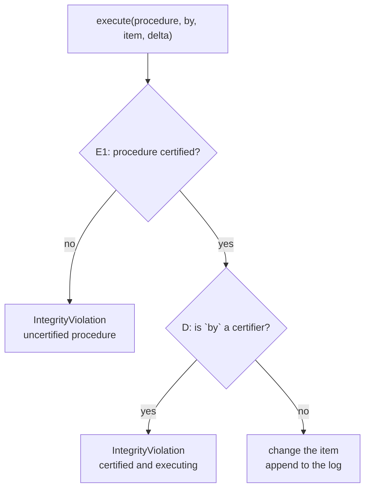

# Paper 01 — Well-formed transactions and separation of duty

## One-line answer

Commercial systems do not mainly care who may **read** data; they care that the data stays
**correct** — and correctness is enforced by two rules, that every change goes through a certified
procedure and that no one person may both certify and execute one.

## The story

A company in the mid-1980s buys a computer security system, and it does not fit.

Everything in the box is about secrets. Files are labelled, people are cleared, and the machine's
whole effort goes into making sure that a person cleared for one level cannot read something from a
higher one. It is a serious piece of engineering and it answers a question the company was not
asking.

What keeps the finance director awake is not that somebody will read the ledger. Anybody in the
accounts office can read the ledger; that is what it is for. What keeps him awake is that the ledger
will say something untrue — an invoice for goods that never arrived, a payment to a supplier that
does not exist, a balance adjusted by the one person who also decides what the balances should be.

He already has controls for this and they are not on the computer. They are the ones the business has
used for a century: only certain procedures may touch the books, and the person who writes the cheque
is not the person who signs it. Nobody in the room can explain those rules in the language the
security system speaks, because the system has no word for them.

## The idea in plain language

The paper's claim is that there are **two different security policies**, they protect different
things, and a mechanism built for one does not implement the other.

- The military policy protects **confidentiality**: information must not flow to someone not cleared
  for it. Its central question is *who may read what*.
- The commercial policy protects **integrity**: the data must remain a correct description of the
  world. Its central question is *how may data be changed*.

Two terms the paper's own model uses, defined here rather than assumed:

- A **constrained data item** is a piece of data whose correctness matters — a balance, an inventory
  count, a ticket's status. It is contrasted with data nobody has an integrity claim about.
- A **transformation procedure** is a program certified to change constrained data items. "Certified"
  means a person has vouched, on the record, that this procedure preserves correctness.

From those, the two enforcement rules this day uses:

- **E1 — well-formed transactions.** A constrained data item may be changed **only** by a certified
  transformation procedure. Nothing writes to it directly. The value of this is not that procedures
  are careful; it is that every change has a name, a shape and a log entry, so change becomes
  something you can reason about at all.
- **D — separation of duty.** The person who **certifies** a procedure may not be a person who
  **executes** it. Correctness is enforced not by trusting a procedure but by requiring two
  independent parties to be involved in any change.

The paper's sharpest observation is about rule D specifically: separation of duty cannot be derived
from access control. Access control asks whether this person may perform this operation, and the
answer here is yes — the certifier is authorised, the executor is authorised, and both operations are
legitimate. What is not legitimate is one person doing **both**, and that is a property of a
*sequence* rather than of a permission, which is why a system of labels and clearances cannot express
it.

## Why Sutra needs it

[4.3](../parts/04-what-the-approver-sees/4.3-separation-of-duty.md) measured this day's version of
rule D. Three arrangements over the same thirteen gated actions: the agent approving itself, a second
party approving from the agent's summary, and a second party approving from the ticket. The first two
caught nothing; the third caught all four wrong actions. That result is rule D discovering, forty
years later, that two signatures on one piece of evidence is one signature.

Rule E1 is the other half of the day, and it is where the paper explains a decision made for
apparently unrelated reasons. [3.2](../parts/03-the-policy-table/3.2-the-table-and-the-argument.md)
insisted that a gate verdict may exist in exactly one module and
[6.1](../parts/06-gates-that-are-decoration/6.1-the-road-the-gate-is-not-on.md) found six tickets
closed through a tool with no row for closing tickets. Both of those are E1 failures: the effect was
reachable by something that was not a certified procedure for it. The paper's answer — put the
constraint on the **data item**, not on the callers — is exactly the "gate at the effect boundary"
conclusion 6.1 reached from the other direction.

Day 64 builds the gate, and Day 68 will take least privilege further.

## The mechanism

The model has more parts than this day uses — integrity verification procedures that audit state,
rules binding users to procedures and procedures to data items — but the two enforcement rules above
are the ones that carry the argument, and they fit in a small amount of code.

```python
def execute(self, procedure: str, *, by: str, item: str, delta: int) -> None:
    certifiers = self.certified.get(procedure)
    if not certifiers:
        raise IntegrityViolation(f"E1: {procedure!r} is not a certified procedure")
    if self.separation_of_duty and by in certifiers:
        raise IntegrityViolation(f"D: {by!r} certified {procedure!r} and may not also execute it")
    self.items[item] = self.items.get(item, 0) + delta
    self.log.append(f"execute   {procedure:<16} by={by} item={item} delta={delta:+}")
```

**Line by line:**

- `certifiers` is the set of people who have vouched for this procedure. E1 is the first check and it
  is a check on the **procedure**, not on the caller: an uncertified procedure cannot change a
  constrained item however senior the caller is.
- The second check is rule D, and note what it compares — the executor against the *certifiers of
  this procedure*. Not a role, not a permission level. The rule is about a person appearing twice in
  one procedure's history.
- `separation_of_duty` guards only the second check, which is what makes it a clean ablation: with it
  off, E1 still holds and every change is still made by a certified procedure and still logged.
- The write happens **after** both checks and is followed by a log entry in the same call. There is no
  path that changes `items` without appending to `log`, which is E1's real product: not safety, but
  an account of every change.



## The paper in one demo

Two files. `cw.py` is the model above; `demo.py` runs four operations through it, twice, with rule D
on and off. Nothing else — no storage, no interface, no framework.

```text
lab/papers/well-formed-transactions/
├── cw.py      # E1 and D, and nothing else
└── demo.py    # four operations, and the ablation switch
```

The four operations are two ordinary ones and then one person paying themselves, done entirely
through certified procedures and fully logged:

```python
OPERATIONS = (
    ("certify", "issue_refund", "alice", None, 0),
    ("execute", "issue_refund", "bob", "customer:8821", 250),
    ("certify", "adjust_balance", "mallory", None, 0),
    ("execute", "adjust_balance", "mallory", "account:mallory", 90000),
)
```

**Line by line:**

- The first pair is the shape the rules are designed for: `alice` certifies the refund procedure and
  `bob` executes it. Two people, one change.
- The third entry has `mallory` certifying `adjust_balance`, which is a completely legitimate act —
  somebody has to certify procedures, and being the person who vouches for one is not wrongdoing.
- The fourth is also legitimate taken alone: executing a certified procedure is what the procedure is
  for. The fraud exists only in the **conjunction**, which is precisely the paper's point about
  sequences.
- The item names are deliberate. `customer:8821` receives a refund; `account:mallory` receives ninety
  thousand.

Run it:

```bash
cd days/day-63-approval-gates-design/lab/papers/well-formed-transactions
uv run python demo.py
```

**Line by line:**

- No arguments means rule D is enforced. The script prints every refusal, the full audit log, the
  final state, and `mallory`'s balance, which is the number the whole demo exists to report.
- It exits non-zero if `mallory` ended up with anything, so the demo is also a test.

```text
separation of duty: ON

REFUSED   D: 'mallory' certified 'adjust_balance' and may not also execute it

audit log:
  certify   issue_refund     by=alice
  execute   issue_refund     by=bob item=customer:8821 delta=+250 -> 250
  certify   adjust_balance   by=mallory

final state:
  customer:8821      250

operations refused: 1
mallory's balance:  0
```

Now the ablation. One flag removes rule D and changes nothing else:

```bash
uv run python demo.py --no-separation
```

**Line by line:**

- `--no-separation` sets `System(separation_of_duty=False)`. E1 is untouched: every change still goes
  through a certified procedure and still lands in the log.
- Same four operations, same order, same people.

```text
separation of duty: OFF (ablated)


audit log:
  certify   issue_refund     by=alice
  execute   issue_refund     by=bob item=customer:8821 delta=+250 -> 250
  certify   adjust_balance   by=mallory
  execute   adjust_balance   by=mallory item=account:mallory delta=+90000 -> 90000

final state:
  account:mallory    90000
  customer:8821      250

operations refused: 0
mallory's balance:  90000
```

Ninety thousand, zero refusals, exit code `1` because the assertion at the end of the demo fails.

The line worth staring at is in the audit log:

```text
  execute   adjust_balance   by=mallory item=account:mallory delta=+90000 -> 90000
```

That is a **complete and honest record of a fraud**. The procedure was certified. The execution was
logged. Nothing was bypassed, no permission was violated, and a log-based audit would show a properly
formed transaction. E1 gave a perfect account of what happened and had no opinion about whether it
should have. Only rule D — a constraint on *who appears twice* — refuses it, and that is the paper's
claim made runnable: the two rules are not two degrees of the same protection, they stop different
things.

## When it breaks

The model assumes things the 1987 paper could reasonably assume and a 2026 agent system cannot.

**It assumes users are distinguishable.** Rule D compares a name against a set of names, and its power
comes from those names belonging to different people with different interests. In an agent system the
"users" are often the same service account, or an agent and a second agent from the same deployment,
in which case the comparison passes and the control does nothing. That is
[4.3](../parts/04-what-the-approver-sees/4.3-separation-of-duty.md)'s middle row again: the rule was
satisfied and the property was not.

**It assumes certification is meaningful work.** A certifier who vouches for a procedure without
reading it turns rule D into bookkeeping. The paper does not — and cannot — say how much scrutiny a
certification represents, which is exactly the gap
[1.1](../parts/01-the-gate-that-means-nothing/1.1-a-control-that-fires-on-everything.md) measured with
an attention budget.

**It is a policy model, not a mechanism.** The paper argues that commercial integrity needs these
properties; it does not deliver an operating system that has them, and the follow-up literature spent
years on whether the model was implementable as stated, and on how it compares with role-based access
control, which arrived later and absorbed much of the practical demand.

**Nothing in it addresses a machine acting as the proposer.** The model's two parties are people
choosing to act. An agent proposing thousands of changes an hour satisfies every rule here while
creating the volume problem that
[2.4](../parts/02-sorting-the-actions/2.4-defeated-by-its-own-volume.md) shows will defeat the human
half of the arrangement. The rules are necessary and the paper never claimed they were sufficient
against an untiring proposer, because there were none.

## In production

**What survived.** The vocabulary and one rule.

*Separation of duty* survived completely and is now unremarkable — it is in change-management
processes, in deployment pipelines that will not let an author approve their own merge, in payment
systems where initiating and releasing are different permissions, and in every compliance regime that
asks who approved a change. Most people using it have never heard of the paper, which is the strongest
form of survival available to an idea.

*Well-formed transactions* survived as a **design instinct** rather than as a labelled mechanism.
"Changes go through the API, not through the database" is E1, restated by people who have never seen
the original. So is a repository pattern, and so is
[3.2](../parts/03-the-policy-table/3.2-the-table-and-the-argument.md)'s insistence that a gate verdict
lives in one module.

**What did not.** The full model — constrained data items formally labelled, procedures certified with
recorded certifiers, integrity verification procedures auditing state on a schedule — was not adopted
as a system. Almost nothing implements it as specified. **Role-based access control** took the
practical ground: RBAC is easier to administer, and it can express separation of duty as constraints
on role assignment, which is the part organisations actually wanted.

So the honest summary is that the paper's *diagnosis* is what lasted. The observation that commercial
security is about integrity rather than confidentiality reframed a field that had been building
confidentiality mechanisms and calling them security. The specific machinery is a historical artefact;
the two-party rule and the "changes go through procedures" instinct are in everything.

And there is a modern reason to read it that did not exist when it was written. An LLM agent is a
proposer that never tires, and the argument that correctness comes from **structural constraints on
who may act** rather than from the quality of any single actor is the argument this whole day rests
on. The paper is about clerks and ledgers. The rule transfers unchanged.

## Check yourself

```bash
cd days/day-63-approval-gates-design/lab/papers/well-formed-transactions
uv run python demo.py; echo "exit: $?"
uv run python demo.py --no-separation; echo "exit: $?"
```

Now edit `OPERATIONS` so that a fourth person, `dave`, executes `adjust_balance` instead of `mallory`,
and run the default arm. Write down whether the fraud is prevented, and what that tells you about
which of the two rules is doing the work.

**Out loud, without scrolling up:** *what did this paper actually claim, and what do we do
differently now?* Name the rule that survived into everyday engineering practice and the one that was
replaced, and say what replaced it.
