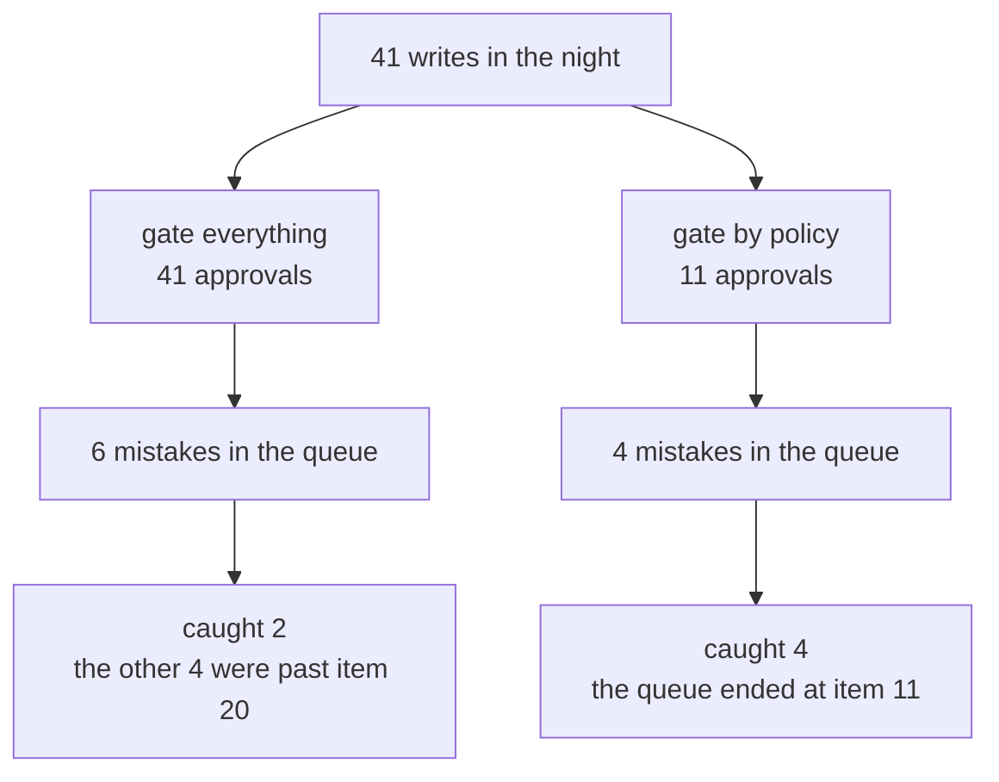

# 1.1 — A control that fires on everything

## One-line answer

An approval gate spends a finite amount of human attention, so a gate that fires on every write
spends it on the safe ones and has none left for the dangerous ones: over one recorded night,
asking a human **41** times caught **2** of 6 mistakes, and asking them **11** times caught **4** of
the 4 that mattered.

## The story

There is a shop near the bus stand that sells phone cards, and it has a hand-written sign taped to
the counter: **ID REQUIRED**.

The first week, the owner checked. He looked at the card, he looked at the face, he handed over the
SIM. It took a moment and nobody minded.

By the second month there is a queue to the door. Every person buying a ten-rupee top-up is holding
out a card. The owner is doing this two hundred times a day for a purchase that could not possibly
matter, and he has stopped looking. He takes the card, he glances at the plastic, he hands it back.
His eyes go to the card and register that a card exists.

One afternoon somebody buys a connection with a card that has a different person's photograph on
it. He hands it back without a pause.

He did not get careless. He got asked two hundred times a day, and there is no version of a person
who looks properly two hundred times a day. The sign was written for the one purchase where the
check mattered, and then it was applied to every purchase, and applying it to every purchase is
what stopped it working for the one.

## The idea in plain language

An **approval gate** is a point in a system where an action stops and waits for a person to decide
whether it should happen. The person can say yes, and the action proceeds; or no, and it does not.

That is the mechanism. The thing that is easy to miss is what the gate is *made of*. It is not made
of code. The code is a few lines and it always works. The gate is made of **somebody's attention**,
and attention is a supply with a fixed size that runs out during the shift.

This gives approval gates a property that no other control in this curriculum has. A rate limit
does not get tired. An allowlist does not stop reading at four in the morning. Day 40's tool filter
([the filter is on your side](../../../day-40-filtering-and-allowlists/parts/01-the-list-you-agreed-to/1.3-the-filter-is-on-your-side.md))
checks the ten thousandth call exactly as carefully as the first. A gate does not, because the gate
is a person, and the number of times you ask them is a number you chose.

So the design question for a gate is not the one people ask. People ask *"should a human approve
this?"*, and the honest answer to that question is almost always yes — of course a human should
look at anything important. The question that produces a working system is:

> **Which** actions, on **what** evidence, decided by **whom**, and what happens when they say no?

This part is about the first word. The rest of the day is about the other three.

Two terms this day uses constantly, defined once:

- **A write** is any action that changes something. Reading a ticket is not a write. Closing one is.
  Only writes can be wrong in a way a gate could catch, so only writes are candidates.
- **Attention budget** is the number of items a person will genuinely read in one sitting before
  they start approving without reading. It is not a number you get to choose. It is a number you
  discover, usually from an incident.

## Why Sutra needs it

Day 58 built the triage graph, and it ends by writing: it closes tickets, it records notes, it
pages people. Tomorrow, Day 64, wires an approval gate into that write step and Day 65 tries to
break it. Both of those days need a *list* of what the gate fires on, and the list has to come from
somewhere.

The tempting answer, and the one almost every first version ships, is "every write". It sounds
responsible. This part exists to show, with the numbers from one night of Sutra's own batch, that
it is the least safe of the available options — and to make that concrete before
[3.2](../03-the-policy-table/3.2-the-table-and-the-argument.md) asks you to decide row by row.

## The mechanism

The lab holds one recorded overnight batch: twenty-seven tickets triaged between two and three in
the morning, the actions each one produced, and — written down in advance, the way Day 50 wrote its
answer key before tuning anything — which of those actions were **wrong**.

Two candidate policies run over the same batch:

```bash
cd days/day-63-approval-gates-design/lab
uv run python everything.py
```

**Line by line:**

- `everything.py` builds two approval queues from the same recorded night. The `everything` arm
  puts every write in front of a human; the `policy` arm applies the table this day is going to
  write, in [3.2](../03-the-policy-table/3.2-the-table-and-the-argument.md).
- It then walks each queue with `_runs.review()`, which models an approver who reads properly for
  the first twenty items of a sitting and waves the rest through. That number is an **assumption**,
  not a measurement, and it is a single named constant so you can change it and watch everything
  move — which is what [6.4](../06-gates-that-are-decoration/6.4-the-sweep-nobody-runs.md) does.
- The default of twenty is deliberately generous. It says the approver is perfect for twenty items
  and then completely blind, which is kinder than a real person, and the argument survives anyway.

Measured on 2026-09-05:

```text
one overnight batch: 149 actions, 41 of them writes, 6 of those wrong
approver reads properly for the first 20 items of the sitting

  everything  asked  41   wrong in queue 6   caught 2   missed 4
  policy      asked  11   wrong in queue 4   caught 4   missed 0

wrong writes the policy never shows a human, by design:
  ticket:4607  record_triage          severity P1 recorded as P3
  ticket:4618  record_triage          duplicate of 4610, noted as new
```

Read the two arms as two shifts worked by the same person.

**The `everything` shift is asked 41 times.** Six of those 41 are mistakes, so in principle every
mistake was on their screen. Four of the six were past the twentieth item, so four of the six went
through. The gate fired on all of them and stopped none of those four.

**The `policy` shift is asked 11 times.** Only four of the six mistakes were in that queue at all —
the other two were internal notes the policy deliberately does not gate. All four were caught,
because eleven items is a queue a person actually finishes.

Now the sentence that matters, and it is not "the policy is better". It is:

> The `everything` policy had **more** information available and used **less** of it.

Both wrong closes were on both screens. The difference is that on one screen they were items 27 and
38 of 41, and on the other they were items 6 and 9 of 11.

And the day owes you the honest other half, which is what the last three lines print. The policy
lets two mistakes through **on purpose**. Two internal triage notes were wrong and nobody was asked
about either. That is not an oversight to be fixed later; it is the price paid for the attention
that caught the four, and [3.3](../03-the-policy-table/3.3-the-rows-that-are-not-gated.md) argues
it row by row.



## When it breaks

The way this argument breaks is that somebody says *"then hire a second approver"*, and they are
not wrong. Attention is finite per person, not per organisation.

So run the arm where attention is not the constraint:

```bash
uv run python everything.py --careful 41
```

**Line by line:**

- `--careful 41` says the approver reads all forty-one items properly. It is the tireless approver:
  a large enough rota, a quiet enough night, or a shift that has just started.
- Everything else is identical — same batch, same mistakes, same two queues.

```text
one overnight batch: 149 actions, 41 of them writes, 6 of those wrong
approver reads properly for the first 41 items of the sitting

  everything  asked  41   wrong in queue 6   caught 6   missed 0
  policy      asked  11   wrong in queue 4   caught 4   missed 0
```

**Gating everything now wins, six to four.** That is the true statement and this part will not
pretend otherwise: if attention were free, you would gate everything, and every argument in this
day would be unnecessary.

It is not free. But notice what this second run actually tells you, because it is more useful than
a slogan: the policy's advantage is **entirely** a consequence of the attention budget. Change the
budget and the answer changes. That means the policy is not a permanent truth about which actions
are dangerous — it is a design fitted to a specific team on a specific rota, and it has to be
re-argued when the rota changes. A policy table with no note about the attention it assumed is a
policy nobody can revisit.

## In production

**What a professional writes instead.** They do not write a gate first. They write the **inventory**
first — every action, what it changes, who it touches — and only then argue about which rows get a
human, because a gate designed before the inventory is a gate designed around whichever action
somebody happened to be scared of that week. That is [3.1](../03-the-policy-table/3.1-the-write-inventory.md),
and it is the step that gets skipped.

**What degrades at scale.** The failure is not linear and it does not announce itself. Approval
queues degrade the way the phone-card shop degraded: the check keeps happening, the log keeps
filling, the dashboard keeps saying "100% of writes reviewed", and the *quality* of the review
falls to zero somewhere in the middle without a single error being raised. There is no alert for
this. The only instrument that sees it is a measurement of catch rate against known-bad items, and
almost nobody has one, because it means writing down which past decisions were wrong.

**The failure mode that only appears with real traffic.** In a demo the queue has three items and
the gate looks excellent. Twenty-seven tickets a night is still small. The batch that eventually
runs against a real archive is the one where the queue reaches four hundred, and four hundred is
past the point where anybody reads anything — but the *code* is identical, so nothing in testing
will ever show it. The number that predicts this failure is not in your test suite; it is
`per_shift`, and [2.4](../02-sorting-the-actions/2.4-defeated-by-its-own-volume.md) measures it.

**The review comment a senior engineer leaves:** *"This gates every write, and the PR description
says that is the safe default. What is the expected queue depth per night? If it is over about
twenty, this design has converted a safety control into a throughput tax and we will find out the
hard way. Give me the count per action before I approve the approach."*

**The interview question:** *"You added human approval to an agent's writes. How do you know it is
working?"* An honest answer: *"Because I measured the catch rate, not the coverage. Coverage was
never the problem — my first version reviewed one hundred per cent of writes, forty-one a night. I
had a set of known-bad actions from the batch and I checked how many a reviewer actually stopped:
two out of six, because four of them were past the twentieth item and nobody reads item thirty-eight
at three in the morning. Cutting the queue to eleven by gating only the customer-visible and
irreversible actions took it to four out of four. The two it now misses are internal notes we can
overwrite ourselves, and that trade is written in the policy table with the reason. The number I
watch is catch rate against known-bad, and the number I watch second is queue depth per night,
because that is the one that predicts the first going bad."*

## Check yourself

```bash
cd days/day-63-approval-gates-design/lab
uv run python everything.py
uv run python everything.py --careful 41
```

Now run `uv run python everything.py --careful 10` and write down both rows. Then answer: at
`--careful 10`, which arm catches more, and is that a fact about the policy or a fact about the
approver?

**Out loud, without scrolling up:** explain why a gate that fires on every write can be *less* safe
than one that fires on a quarter of them, without using the word "fatigue".

**Next:** [1.2 — A permission is not a gate](1.2-a-permission-is-not-a-gate.md).
