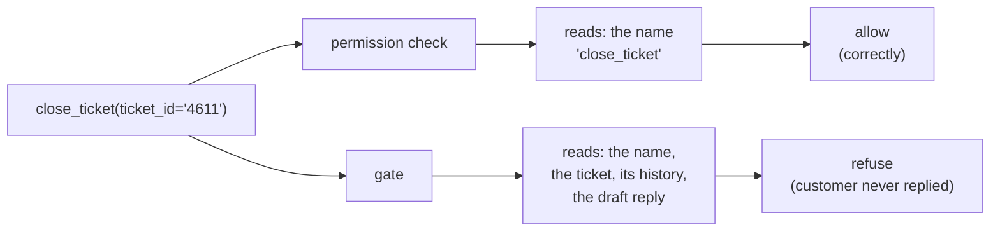

# 1.2 — A permission is not a gate

## One-line answer

A permission is decided once and sees only the **name** of an action; a gate is decided per call
and sees the **arguments** — which is why a permission system that correctly allows all nine closes
in the batch also correctly allows the three that were wrong.

## The story

Your building has a watchman, and he has a list. The list says which flats may receive deliveries
and which delivery companies are known. It is a good list. It was argued about at a residents'
meeting and it is taped inside his register.

A man arrives in the uniform of a company on the list, carrying a parcel for a flat on the list.
The watchman waves him through, correctly. The list was consulted, the list said yes, and the list
was right: that company does deliver to that flat, most weeks.

The parcel is for a flat whose family left for a wedding four days ago and told the watchman so
himself, on Tuesday, in a conversation he remembers.

Nothing about the list is wrong. The list answers *"may this company deliver to that flat?"* and
the answer really is yes. It has no room to hold the fact that the flat is empty this week, because
the list was written in a meeting last year and the family left on Tuesday. The information that
mattered was in the watchman's head and was never a question the list asked him.

## The idea in plain language

Two mechanisms get used interchangeably in conversation and they are not the same thing.

A **permission** is a standing grant. Somebody decides once, in advance, that a particular actor
may perform a particular kind of action. It is stored as a set of names. When the action happens,
the system checks whether the name is in the set. That check is fast, it is total, and it is made
without ever looking at what the action is about.

A **gate** is a decision taken at the moment of the action, by somebody who can see the action's
**arguments** — which ticket, what text, how much money — and who is allowed to answer differently
for two calls that have exactly the same name.

Put the two signatures side by side and the difference is visible before you read a word of the
bodies:

- `permission(actor, action_name) -> bool`
- `gate(actor, action_name, arguments, context) -> bool`

The second one has more parameters, and every mistake this day is about lives in those parameters.

This is not a ranking. A permission is the better mechanism for the question it answers, because it
is cheap, it never tires, and it can be reviewed as a list. Day 68 is about permissions properly —
least privilege, and why the right place to remove a capability is usually to not grant it. Today
is about the class of wrongness that survives a perfectly correct permission check, because that is
the class an approval gate exists for.

The one-sentence version, and it is worth memorising because interviewers ask it:

> **A permission answers "may this kind of thing happen?" A gate answers "should this particular
> one?"**

## Why Sutra needs it

Day 40 gave Sutra a real allowlist over MCP tools — the
[policy module with one door](../../../day-40-filtering-and-allowlists/parts/04-the-policy-module/4.1-one-door-and-a-check-there-is-one.md)
— and it works. The triage agent may call `close_ticket`, and that grant was decided deliberately.

So a reasonable reader arrives at Day 63 and asks why anything more is needed. The allowlist is
already the door; why build a second one? This part answers that with the batch: the allowlist is
doing its job perfectly on all nine closes, and three of those nine should not have happened. If
that distinction is not clear before [3.1](../03-the-policy-table/3.1-the-write-inventory.md) starts
sorting actions, the policy table gets written as a second allowlist and inherits the blind spot.

## The mechanism

Both mechanisms, asked about the same nine closes:

```bash
cd days/day-63-approval-gates-design/lab
uv run python permission.py
```

**Line by line:**

- `permission_allows(step)` is the entire permission check, and its body is
  `return step.action in GRANTED`. The argument is a whole `Step` and the function reaches into it
  for exactly one field: the name. That is not a simplification for the demo — that is what a
  permission is.
- `gate_allows(step)` stands in for a human who reads the payload and is right. It is idealised on
  purpose: this script is about **what information is available**, not about how much attention
  there is. [1.1](1.1-a-control-that-fires-on-everything.md) already measured the attention.
- `GRANTED` holds eight names and is honestly derived: every action the curriculum has actually put
  in the triage agent's hands by today.

Measured on 2026-09-05:

```text
9 closes in the batch, 3 of them wrong

  ticket        permission   gate      what the gate could see
  --------------------------------------------------------------------
  ticket:4602   allow        allow     nothing wrong with this one
  ticket:4606   allow        allow     nothing wrong with this one
  ticket:4609   allow        allow     nothing wrong with this one
  ticket:4611   allow        REFUSE    customer never replied
  ticket:4615   allow        allow     nothing wrong with this one
  ticket:4617   allow        allow     nothing wrong with this one
  ticket:4621   allow        allow     nothing wrong with this one
  ticket:4623   allow        REFUSE    root cause not fixed
  ticket:4627   allow        REFUSE    reply was never sent

  wrong closes let through by the permission: 3
  wrong closes let through by the gate:       0

  The permission is not broken. It answered the question it was asked -
  'may this agent close tickets?' - and the answer really is yes.
```

Look at the permission column. It is nine identical words, and it is **correct nine times**. There
is no configuration of that column that could have been better, because the column is computed from
`"close_ticket" in GRANTED`, and every one of those rows has the same value for that expression.

The third column is the one to sit with. `customer never replied`, `root cause not fixed`,
`reply was never sent` — none of those three facts is about closing tickets. They are facts about
*ticket 4611*, *ticket 4623* and *ticket 4627*. A mechanism whose input is a tool name cannot hold
any of them, no matter how carefully it is configured, because they were never in its input.

The practical consequence, and it is the reason this part exists before the policy table: **you
cannot fix a permission system by adding rows to it.** The failure is not that the list is missing
an entry. There is no entry that says "close_ticket, but not when the customer has not replied",
because the list has nowhere to put "when".



## When it breaks

The way this breaks in a real codebase is that somebody *does* try to fix the permission system by
adding rows, and the rows grow arguments.

It starts reasonably. `close_ticket` becomes `close_ticket:resolved_only`. Then somebody needs
`close_ticket:resolved_only:not_p1`. Then a scope with a wildcard in it. Each step is a small,
defensible change, and the end state is a permission string that is a small programming language
nobody designed, evaluated by a `split(":")` and a chain of `if`s.

The tell that you are in this failure is that you cannot answer a simple question about your own
system. Ask: *which tickets could this agent close right now?* With a permission list the answer is
"all of them" and you can prove it. With `close_ticket:resolved_only:not_p1:*` the answer is a
paragraph and nobody is quite sure, which means the control is no longer reviewable — and a control
nobody can review is a control nobody is checking.

There is a second and quieter break, and it belongs to the gate rather than the permission. A gate
that is handed the arguments but shows them badly degrades into a permission check *in practice*
while remaining a gate in the code. If every approval screen renders as
`close_ticket(ticket_id='4623')` then the human is looking at a name and four digits, which is
exactly the input the permission had. The mechanism is a gate; the information is a permission.
That failure has its own part, [4.2](../04-what-the-approver-sees/4.2-the-request-and-the-diff.md),
and it is the most common way a correctly built gate turns out to be worth nothing.

## In production

**What a professional writes instead.** They keep both, and they keep them apart. The permission
layer stays a flat, boring, reviewable list of names — that is Day 68's subject and its whole
virtue is that you can read it in one screen and say what the agent can reach. The gate layer holds
the per-call judgement and is keyed on **effects**, not names. Where the two get merged, the merged
thing is worse at both jobs: too dynamic to review as a list, too coarse to catch a bad argument.

**What degrades at scale.** Permission checks are free and stay free. Gates are not: every gated
call becomes a round trip to a human with a queue in front of it, which means the gate layer has a
throughput and the permission layer does not. When traffic grows, the permission list is unchanged
and the gate queue is the thing that breaks, which is why the growth rate of `per_shift` per action
is the number to watch and not the size of the allowlist.

**The failure mode that only appears with real traffic.** With ten tickets a night, gating and
permitting look equally fine, because ten of anything gets read. The divergence shows up at the
volume where the gate's queue outruns the rota, and at that moment the system quietly reverts to
being permission-only: everything is still technically gated, and every gate is answered yes. You
have paid for a gate and you are running a permission.

**The review comment a senior engineer leaves:** *"This adds a scope string with three colons in
it. Which tickets can the agent close under this rule? If it takes you more than one sentence, this
belongs in the approval policy where a human reads arguments, not in the permission list where a
machine matches names."*

**The interview question:** *"What is the difference between a permission and an approval gate?"*
An honest answer: *"A permission is decided in advance and it can only see the name of the action.
A gate is decided per call and it can see the arguments. That sounds academic until you count: our
overnight batch made nine ticket closes, the permission check correctly allowed all nine, and three
of them should not have happened — one where the customer had not replied in two weeks, one where
the linked bug was still open, one where the reply it claimed to have sent did not exist. None of
those three facts is about closing tickets, so no permission entry could ever have held them. The
mistake I watch for is teams trying to fix that by growing scope strings until the permission list
is an undesigned rule engine. Keep the list flat and reviewable, and put the judgement in the gate."*

## Check yourself

```bash
cd days/day-63-approval-gates-design/lab
uv run python permission.py
```

Open `permission.py` and read the body of `permission_allows`. It is one line. Now write down, in
one sentence, what would have to change about that line for it to catch `ticket:4623` — and then
say why the thing you wrote is a gate and not a permission.

**Out loud, without scrolling up:** give the two function signatures and name the parameter that
every mistake in this day lives inside.

**Next:** [1.3 — The four questions](1.3-the-four-questions.md).
