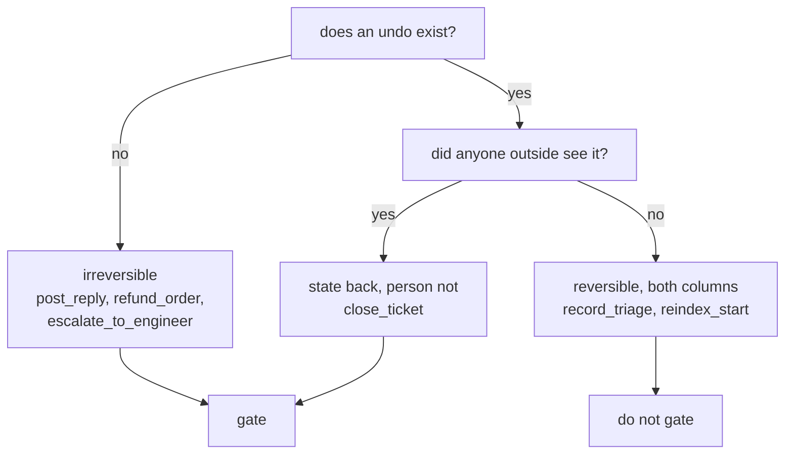

# 2.1 — Reversible, and the cost of the undo

## One-line answer

"Reversible" is two questions wearing one word — can the *state* go back, and is the *person* whole
again — and `close_ticket` is the action where they disagree: `reopen` restores the row perfectly
and restores nothing the customer cares about.

## The story

A tailor is making a kurta and you have asked for the sleeves shorter.

He pins them first. You put it on, look in the mirror, decide it is too short, and he takes the pins
out. Nothing happened. There is no trace of the decision you just changed your mind about, and he
does not mind, because pinning is the step that exists so that changing your mind is free.

Then he cuts.

Now the cloth is shorter. He can still fix a great deal — he can add a facing, he can rework the
cuff, he can do something clever at the hem that you would not notice unless you were told. In the
narrow sense the mistake is recoverable. But you are not standing in front of the mirror any more
having a free opinion. You are having a conversation about a repair, on a kurta you were going to
wear to a wedding, and the tailor is doing extra work he is not being paid for.

The pin and the scissors are both reversible if you fill in the word generously enough. They are not
remotely the same decision, and every tailor in the world knows exactly which one to slow down for.

## The idea in plain language

**Reversibility** is the first thing to sort actions by, because it is the closest thing to a
mechanical test in this whole day: does an operation exist that puts the world back?

The trouble is that the word answers a narrower question than people hear. It asks whether the
*state* can be restored. It does not ask whether the *situation* can be, and those come apart
whenever an action is observed by somebody outside your systems.

So split the word into two columns and keep them apart:

- **State reversible** — an operation exists that restores the previous values. `reopen` puts a
  ticket's status back to `open`. This is a property of your database and you can check it by
  looking at the code.
- **Situation reversible** — the person affected is back where they were. This is a property of the
  world and you cannot check it by looking at anything you own.

Most actions agree on both columns, which is why the distinction stays invisible until it bites. An
internal note is reversible both ways: you overwrite it, nobody outside ever saw the old one, and
there is no residue. Sending money is irreversible both ways. Neither of those teaches you anything.

The actions that teach you something are the ones where the two columns **disagree**, and the day's
sorting exists mostly to find them.

A third term this part needs, and it will recur:

- **The cost of the undo** is what the undo takes from the person it happened to, not from you.
  Reopening a ticket costs your system nothing. It costs the customer a second explanation of a
  problem they already explained once, and an afternoon.

## Why Sutra needs it

[3.2](../03-the-policy-table/3.2-the-table-and-the-argument.md) writes a verdict for every action
Sutra can take, and reversibility is the axis that decides most of them. If the sort uses the
narrow reading of the word, `close_ticket` comes out reversible — `reopen` exists, it is one line —
and lands in the ungated half of the table. That single mis-sort would put the three wrong closes
from [1.1](../01-the-gate-that-means-nothing/1.1-a-control-that-fires-on-everything.md) beyond any
gate in the system, and the table would look complete while doing it.

## The mechanism

Every action in Sutra's inventory, with the word split in two:

```bash
cd days/day-63-approval-gates-design/lab
uv run python undo.py
```

**Line by line:**

- `INVENTORY` comes from `_actions.py` and carries the facts about each action. `reversible` there
  is the narrow, checkable column: does an undo operation exist in the code?
- `RESTORES_SITUATION` is the second column, and it is a separate dict on purpose. It is a
  **judgement** about the world, it cannot be derived from the codebase, and putting it in the same
  dataclass as the mechanical facts would let a reader think it was checked the same way.
- The script's whole output is the comparison, plus the list of rows where the two disagree. That
  list is short by design — if it were long, the distinction would already be obvious.

Measured on 2026-09-05:

```text
  action                  state back?  person whole?  what the undo actually does
  --------------------------------------------------------------------------------------------
  lookup_ticket           yes          yes            nothing happened
  search_kb               yes          yes            nothing happened
  search_tickets          yes          yes            nothing happened
  load_memory             yes          yes            nothing happened
  record_triage           yes          yes            we overwrite the note; nobody outside saw the old one
  reindex_start           yes          yes            the index is rebuilt; the old one was not evidence of anything
  escalate_to_engineer    no           no             the colleague is already awake
  close_ticket            yes          no             reopening restores the row, not the customer's morning
  post_reply              no           no             the customer has read it
  refund_order            no           no             the money moved; clawing it back is a second event, not an undo

  actions where the two columns disagree: 1
    close_ticket

  A reversibility check reads the first column. The complaint arrives about
  the second. Where they disagree, the first column is the one that lies.
```

**One row disagrees, and it is the busiest write in the batch.** Nine closes a night, every one of
them `state back? yes`, every one of them `person whole? no`.

Sit with why `close_ticket` is the one. It is the only action in the list whose effect is
**observed from outside while being stored inside**. The storage is yours and it reverses cleanly.
The observation is the customer's and it does not reverse at all — a person who has been told their
problem is resolved has been told that, and `UPDATE tickets SET status='open'` does not untell them.

Compare the two neighbours to see that this is a real category and not a special case:

- `record_triage` also stores something, and also reverses cleanly. The difference is that nobody
  outside ever saw the note, so there is no observation to un-make. Both columns say yes.
- `post_reply` is also observed from outside. The difference is that it stores nothing you could
  reverse, so the narrow column says no too and nobody is tempted. Both columns say no.

`close_ticket` sits between them, and it is the only kind of action that can be mis-sorted: it has
enough state to look reversible and enough audience to not be.



## When it breaks

The failure is not that somebody argues `close_ticket` is irreversible. It is that a policy is
written from a schema.

Somebody writes a script that walks the tools, finds which have a compensating operation in the
codebase, and produces the reversibility column automatically. It is a good script. It is exactly
the kind of thing you should want, because it removes an opinion from the process. And it produces
`close_ticket: reversible`, correctly, because `reopen_ticket` is right there in the same module
with a test next to it.

The output is a table that is fully derived, fully consistent, and wrong in the row that matters.
Nobody will catch it in review, because reviewing a generated table means checking that the
generator is right, and the generator *is* right about the question it was asked.

There is a second break, less dramatic and more common: the undo exists and is never called. That
one is [2.3](2.3-the-undo-nobody-asks-for.md), and it is the reason `reopen` has been in Sutra
since Day 37 with, as far as the batch shows, no invocations at all.

And there is a genuine over-correction to guard against. If you decide that everything with an
audience is irreversible, `record_triage` starts looking risky — the morning shift is an audience,
after all — and you end up back at gating all forty-one writes, which
[1.1](../01-the-gate-that-means-nothing/1.1-a-control-that-fires-on-everything.md) measured as the
worse option. The question is not whether anybody sees it. It is whether the person who sees it is
somebody you can simply tell, or somebody whose belief about your company just changed.

## In production

**What a professional writes instead.** They record the undo as an **operation with a cost**, not as
a boolean. The field is not `reversible: true`; it is `undo: reopen_ticket` plus `undo_cost:` in the
units of the person it happened to. That shape forces the second column to be written down, because
you cannot fill in a cost without asking who pays it. The `_actions.Action` dataclass in the lab has
exactly this shape, and it is why `undo_cost` is a string like `"reopen"` rather than a flag.

**What degrades at scale.** Undos that are cheap for one become expensive in aggregate, and the
policy written at low volume does not know it. Reopening one ticket is free. Reopening four hundred
after a bad batch is a support incident: every one of those customers gets a second notification,
and the notification says the thing they were told last week was wrong. The undo did not get more
expensive per row. There were just a lot of rows, and the cost was never per-row in the first place.

**The failure mode that only appears with real traffic.** The undo path is the least-tested code
you own, because it runs only after a mistake and mistakes are rare in testing. `reopen` has existed
since Day 37 and there is no evidence in the batch that it has ever run against a ticket that was
closed by the agent. The first time it does will be during an incident, at speed, on a ticket with
a state nobody anticipated — and if it fails then, the action you sorted as reversible was
irreversible the entire time and you had no way to know.

**The review comment a senior engineer leaves:** *"`reversible: true` for close_ticket — reversible
by whom? We can put the row back. The customer got an email saying their issue was resolved. Either
add a column for whether the undo is visible to the person affected, or write the compensating
action in the field so the next reader has to think about what it actually costs."*

**The interview question:** *"How do you decide whether an agent's action needs human approval?"*
An honest answer: *"Reversibility first, but split into two columns, because the word hides a
second question. Can the state go back, and is the affected person actually whole again? Most
actions agree — an internal note reverses completely, sending money reverses not at all — and the
interesting ones disagree. Closing a customer's ticket is our case: `reopen` is one line and works
perfectly, and the customer has still been told their problem was solved when it was not. Exactly
one action in our inventory of ten disagrees between those columns, and it is the one we run nine
times a night. If I had sorted on the boolean I would have left it ungated and the table would have
looked complete."*

## Check yourself

```bash
cd days/day-63-approval-gates-design/lab
uv run python undo.py
```

Take an action from a system you have worked on and fill in both columns for it. Then answer: if the
two disagree, what is the undo's cost, and who pays it?

**Out loud, without scrolling up:** state the two questions the word "reversible" hides, and name the
one action in Sutra where they give different answers.

**Next:** [2.2 — Blast radius, counted in people](2.2-blast-radius-counted-in-people.md).
