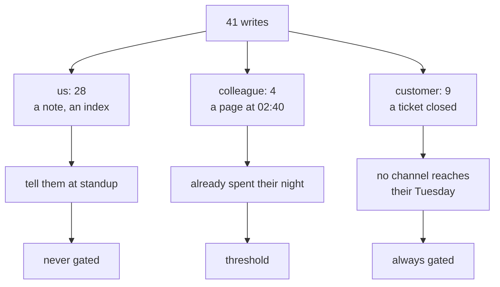

# 2.2 — Blast radius, counted in people

## One-line answer

"High impact" is an adjective two engineers can disagree about for an hour; "nine customers a night,
none of whom agreed to be triaged by software" is a count, and the batch produces it — 28 writes
touching only us, 4 touching a colleague, 9 reaching outside the company.

## The story

A school sends a notice home in every child's bag: *"Sports day is moved to the 14th."*

Six hundred families read it. Some of them change leave plans, one grandmother rebooks a train,
several parents tell other parents. Then it turns out the date was wrong — somebody read the draft
calendar instead of the final one.

The correction goes out the next morning, and it is a good correction, and it does not undo the
train booking.

Now the same mistake in the other direction. The head writes the wrong date on the staff-room
whiteboard. A teacher walks past, says "that's not right, it's the 21st", and rubs it out.

The mistake was identical. The number of people holding it was three, and one of them could fix it
by picking up a duster.

## The idea in plain language

**Blast radius** is who is affected if this action is wrong.

The word is borrowed from demolition and it invites an adjective — big, small, high, low — which is
exactly what makes design meetings go in circles. Two engineers who both care about safety will
argue about whether closing a ticket is "high impact" and neither can win, because the sentence has
no units.

So give it units. Blast radius is a **count of people, sorted by how much say they had in being
there**:

| Radius | Who that is | Can they be simply told? |
| --- | --- | --- |
| `none` | nobody; the world is unchanged | — |
| `us` | the team, who read our own notes | yes, and they will read it anyway |
| `colleague` | one engineer, asleep, who did not choose this | yes, but you have already spent their night |
| `customer` | a person outside the company who never agreed to any of this | no |

The ordering is not by *number* of people, and this is the part that gets missed. Twenty-seven
internal notes touch more rows than nine ticket closes. They are still the smaller radius, because
the twenty-seven are read by people who work here, who can be told, and who will assume a note might
be wrong. The nine are read by people who assume a company that says "resolved" has resolved it.

The axis is really **distance from the correction**. Can you reach everybody who now believes the
wrong thing, in the time before believing it costs them something? Inside the team, yes, by saying
so at standup. Outside, no — you do not have a channel that reaches the customer's Tuesday.

This is the second sorting axis, and it is deliberately *second*.
[2.1](2.1-reversible-and-the-cost-of-the-undo.md) asked whether the world can go back; this asks who
is standing in it if it cannot. An action needs both answers before it can be sorted, because a
small radius makes an irreversible action survivable and a large radius makes a reversible one
serious.

## Why Sutra needs it

The triage graph writes to three different audiences and the code does not distinguish them. A node
that calls `record_triage` and a node that calls `close_ticket` look alike: both take a ticket id,
both return a dict, both log a line. From inside the graph they are the same kind of step.

They are not the same kind of event, and [3.2](../03-the-policy-table/3.2-the-table-and-the-argument.md)
has to write a different verdict for each. This part supplies the number that makes that defensible
rather than a preference, and it is the number a reviewer will ask for first.

## The mechanism

The recorded night, sorted by who it touched:

```bash
cd days/day-63-approval-gates-design/lab
uv run python radius.py
```

**Line by line:**

- The script walks `_runs.writes_only()` — the 41 write steps of the batch, reads excluded, because
  a read has no radius and including it would inflate the count with actions nobody could get wrong.
- For each write it looks up `BY_NAME[step.action].radius`, the fact recorded in the inventory, and
  tallies both the number of writes and the number of **distinct tickets**. The second count is the
  one that matters for a customer radius: nine closes on nine different tickets is nine people; nine
  closes on one ticket would be one person and a bug.
- `MEANS` renders the radius as a sentence about a person rather than a category name, because the
  whole point of the axis is to stop the argument being about categories.

Measured on 2026-09-05:

```text
  radius      writes  distinct tickets  gate(s)             who that is
  ------------------------------------------------------------------------------------------------
  us              28                28  never               the team, who can read the note and fix it
  colleague        4                 4  threshold           one engineer, asleep, who did not choose this
  customer         9                 9  always              a person outside the company who never agreed to be triaged by software

  writes whose effect leaves the building: 9 of 41
  Those are the ones where an apology is the only undo, and an apology is
  not something the system can perform.
```

**Twenty-eight against nine, and the twenty-eight are the ones nobody gates.** Read that pair
carefully, because it is the shape of every sensible policy and it looks backwards at first glance:
the bulk of the writes, more than two thirds of them, are the ones the policy leaves entirely alone.

That is not laxity. It is what the radius column is for. The twenty-eight `us` writes are notes and
an index rebuild — things read by people who work here, correctable by the person who notices, and
correctable *before* anybody outside is affected. Spending an approver's attention on them is the
[1.1](../01-the-gate-that-means-nothing/1.1-a-control-that-fires-on-everything.md) mistake in slow
motion.

The `colleague` row is the one worth arguing about, and it is why that row's gate says `threshold`
rather than `always` or `never`. Four writes, four different people woken. The radius is small in
count and the harm is real and irreversible — you cannot un-wake somebody at 02:40. But the harm of
*not* paging when it matters is larger, so this row cannot be decided by radius alone. It is the
one action in Sutra whose gate needs a condition rather than a verdict, and
[5.1](../05-when-nobody-answers/5.1-fail-closed-or-fail-open.md) works out which way it should fail.

The last line is the one to remember. **Nine of forty-one writes cross the boundary out of the
company.** For those nine there is no correction the system can issue — only an apology, and an
apology is a thing a person does, not a thing a service performs.



## When it breaks

Blast radius breaks when the count is taken per action instead of per **effect**, and the effect
travels.

The clean example is in Sutra and it is one day away. `record_triage` has radius `us` — an internal
note, correctable, read by the morning shift. Perfectly true. Now recall that Day 48 wired triage
notes into memory and Days 49 and 50 built retrieval over the archive. A wrong note is not only read
by the morning shift; it is **indexed**, and it will be retrieved and shown as prior context the
next time a similar ticket arrives. The wrong severity on `ticket:4607` becomes evidence in a
future triage, which produces a future action, which may well have radius `customer`.

The radius of the note is `us`. The radius of the note's *consequences*, three weeks later, is not,
and nothing in the table says so. This is the same shape as
[2.1](2.1-reversible-and-the-cost-of-the-undo.md)'s failure — a column that is correct about the
question it was asked — and it is why the two wrong `record_triage` calls the policy deliberately
ignores are the least comfortable decision in this whole day.
[3.3](../03-the-policy-table/3.3-the-rows-that-are-not-gated.md) makes that argument explicitly
rather than hoping nobody notices.

The second break is arithmetic. Somebody sorts by *number of rows touched* rather than by distance
from the correction, gets 28 > 9, and concludes that the internal notes are the bigger risk. The
number is right. The ordering is meaningless, because rows are not the unit — people who now
believe something false are the unit, and twenty-eight of those people are sitting in your office.

## In production

**What a professional writes instead.** They record the radius as **the audience of the effect, not
the audience of the call**, and they write a second field for anything that gets stored and re-read
later. A note that feeds a retrieval index has a radius today and a different one in three weeks,
and a table with one column cannot say that. The cheap version of this — cheap enough that there is
no excuse — is a `feeds:` field naming what downstream system consumes the write, so that a reviewer
following the chain can see where the radius grows.

**What degrades at scale.** The `customer` count scales with traffic and the rota does not. Nine
closes a night is one approver's queue; the same system at ten times the volume is ninety, and
ninety customer-visible decisions per night cannot be reviewed by a human under any arrangement you
would want to defend. The design response is not more approvers. It is to reduce what reaches the
radius in the first place — a classifier confident enough to auto-close the easy third, so that the
gate sees the hard two thirds. That is a modelling problem masquerading as a policy problem, and
recognising which one you have is most of the job.

**The failure mode that only appears with real traffic.** Radius is measured on the happy path and
one bad batch changes it. A classifier regression that mislabels a category does not close nine
tickets wrongly; it closes every ticket in that category wrongly, on one night, to nine different
customers who all write back on the same morning. Blast radius per action is not the number that
hurts. Blast radius per *incident* is, and it is the product of the radius and the correlation
between failures — which is exactly what nobody measures.

**The review comment a senior engineer leaves:** *"radius=us on record_triage. This note goes into
the memory index, so it will be retrieved as context on a future ticket and could steer a customer-
visible decision weeks from now. I am not saying gate it. I am saying the table should record that
it feeds something, because right now a reader sorting by radius has no way to see that this row has
a second life."*

**The interview question:** *"How do you rank which agent actions are risky?"* An honest answer:
*"Not by adjectives. I count people, sorted by whether I can still reach them. Our batch does
forty-one writes a night: twenty-eight touch only the team, four wake one engineer, nine reach a
customer. The twenty-eight are the majority and they are the ones we leave alone, because anyone
affected works here and can be told. The nine are the ones where the only available undo is an
apology, and a service cannot perform an apology. The mistake I have made before is counting rows
instead of people — twenty-eight is a bigger number than nine and it is the smaller radius, because
the axis is distance from the correction, not volume."*

## Check yourself

```bash
cd days/day-63-approval-gates-design/lab
uv run python radius.py
uv run python undo.py
```

Put the two outputs beside each other and find the action with the largest radius that is also
state-reversible. Then say what its gate should be, and which of the two columns decided it.

**Out loud, without scrolling up:** explain why 28 internal writes are a smaller blast radius than
9 customer-visible ones, in one sentence, without using the word "important".

**Next:** [2.3 — The undo nobody asks for](2.3-the-undo-nobody-asks-for.md).
