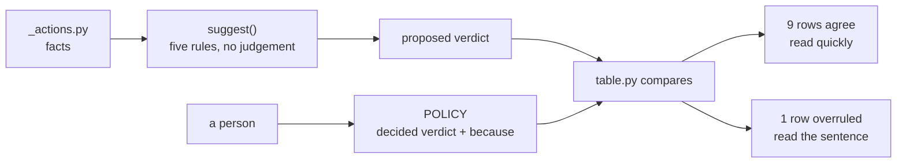

# 3.2 — The table and the argument

## One-line answer

The policy is data with a sentence per row, and the sentence earns its place on exactly the rows
where the written decision **overrules** the arithmetic — which for Sutra is one row out of ten:
`escalate_to_engineer`, where the facts say `always` and the policy says `threshold`.

## The story

The medicine box at home has a strip of paper stuck to the lid, in your mother's handwriting.

Not a list of the medicines. A line for each one saying what it is for and who it belongs to.
*Yellow packet — grandfather's blood pressure, morning only.* *Small bottle — for the child's cough,
not the adult one.*

The medicines are labelled already, by the company, in small print. The handwriting is not
duplicating that. It is holding the thing the printed label cannot: the decision this household
made about this medicine, so that the person who reaches for it at eleven at night is not
reconstructing a reason from a leaflet.

The line that matters most is on the one that looks obvious. *Blue strip — NOT for fever, it is the
other one, this one thins the blood.* Somebody nearly got that wrong once. That is why it is written
down, and it is why nobody has got it wrong since.

## The idea in plain language

The policy is **data**: one row per action, each row carrying a verdict and a sentence.

Three verdicts, and no more, because a fourth is where policies start becoming programs:

| Verdict | Means | In Sutra |
| --- | --- | --- |
| `never` | the action runs alone | reads, internal notes, the reindex |
| `threshold` | a stated predicate decides | `escalate_to_engineer`, on severity |
| `always` | a human decides, every time | anything customer-visible |

And every row carries a `because` — a sentence a reviewer reads. Not a restatement of the verdict.
`"close_ticket is gated because it is risky"` is a row with nothing in it. The sentence has to
contain the **argument**, so that somebody who disagrees can disagree with something specific.

Then the piece that makes this more than a list, and it is the design idea worth taking away from
this part. There are two things in the lab, and they are not the same thing:

- **`suggest()`** reads the facts from the inventory and proposes a verdict. It is arithmetic. It
  has five rules, applied in order, and no judgement anywhere in it.
- **`POLICY`** is the decision a person wrote, and it is allowed to disagree with the suggestion.

Why keep both? Because each catches the other's failure mode:

- A table written entirely by hand has no way to show which rows were thought about and which were
  copied from the row above. Every row looks equally considered.
- A table generated entirely by arithmetic is a table nobody thought about at all, and it will be
  confidently wrong in exactly the cases the arithmetic cannot see — which is
  [2.1](../02-sorting-the-actions/2.1-reversible-and-the-cost-of-the-undo.md)'s failure, where a
  generator correctly derives `close_ticket: reversible` from a codebase that really does contain
  `reopen`.

Putting them side by side turns review into a short, bounded task. Rows that agree needed no
argument and can be read quickly. Rows that **disagree** are where a person overruled the model, and
those are the rows that need the sentence and the reviewer's attention. A table with no
disagreements did not need a scoring function; a table with disagreements and no reasons is a
preference wearing a table's clothes.

## Why Sutra needs it

This is the artefact. Day 64 builds the gate, and what it builds is an implementation of this table
— which is the reason the plan splits design and build across two days at all. A gate designed while
building is a gate shaped like whatever was easiest to code.

It is also the answer to a question Sutra has never had one answer to. Day 40 established
[one door for MCP tool policy](../../../day-40-filtering-and-allowlists/parts/04-the-policy-module/4.1-one-door-and-a-check-there-is-one.md);
this is the same discipline for approvals. Without it, "does this need a human?" gets answered by a
`require_confirmation=` here, a prompt paragraph there, and a condition in a node somewhere, each
with its own opinion and no way to see them together.

## The mechanism

The arithmetic first, on its own, so it can be judged before it is overruled:

```bash
cd days/day-63-approval-gates-design/lab
uv run python table.py --suggest
```

**Line by line:**

- `--suggest` prints the four facts each rule reads, then the verdict those rules produce. The facts
  are shown so that a reader disagreeing with a suggestion can see whether they disagree with the
  rule or with the fact.
- The five rules in `suggest()` run in order: no change means never gate; effect leaves the building
  means gate; irreversible means gate; nobody notices within a day means gate; otherwise run alone.
- Frequency is not among them, deliberately, for the reason
  [2.4](../02-sorting-the-actions/2.4-defeated-by-its-own-volume.md) gives.

Measured on 2026-09-05:

```text
  action                  reversible  outside  detect   radius     suggests
  ----------------------------------------------------------------------------
  lookup_ticket           True        False        0h  none       never
  search_kb               True        False        0h  none       never
  search_tickets          True        False        0h  none       never
  load_memory             True        False        0h  none       never
  record_triage           True        False      0.5h  us         never
  reindex_start           True        False        1h  us         never
  escalate_to_engineer    False       False      0.2h  colleague  always
  close_ticket            True        True        72h  customer   always
  post_reply              False       True        72h  customer   always
  refund_order            False       True       168h  customer   always
```

Note `close_ticket`: `reversible True`, and the arithmetic gates it anyway, because rule 2 fires on
`outside` before rule 3 ever looks at reversibility. That is
[2.1](../02-sorting-the-actions/2.1-reversible-and-the-cost-of-the-undo.md)'s lesson encoded — the
rule ordering is what stops the generated column being wrong in the one row that matters.

Now the decision, against the suggestion:

```bash
uv run python table.py
```

**Line by line:**

- Each row prints the suggested verdict, the decided verdict, and the wrapped `because`. Rows where
  the two agree are prefixed with two spaces; rows where they differ are prefixed with `->`, so the
  disagreements are findable by eye in a long table.
- The tail re-derives the disagreements from `disagreements()` rather than from what was printed, so
  the summary cannot drift from the rows.

Measured on 2026-09-05, the tail of that output:

```text
-> escalate_to_engineer   suggested=always    decided=threshold
     wakes a colleague, and cannot be un-woken; but at P1 the delay of asking is the
     larger harm, so severity decides and the rule is stated once, here

   close_ticket           suggested=always    decided=always
     customer-visible and detected only when the customer complains; reopen exists, the
     customer's belief that we read their ticket does not

   post_reply             suggested=always    decided=always
     words leave the building and cannot be recalled; the row exists before the tool does

   refund_order           suggested=always    decided=always
     moves money out; Day 44 already refuses to retry it blind, and the same reasoning gates it

rows where the decision overrules the arithmetic: 1
  escalate_to_engineer: facts say always, policy says threshold
```

**One row out of ten disagrees**, and it is the only row in this table that required a human to
think.

The arithmetic is right about `escalate_to_engineer` on its own terms: the action is irreversible,
you cannot un-wake somebody, so rule 3 fires and says gate it. What the arithmetic cannot see is the
cost of the *other* choice. Holding a P1 page until somebody approves it means an outage runs
unattended, and that harm is larger than the harm of a colleague woken unnecessarily. The rules have
no way to represent "the harm of not doing this", and adding one would mean encoding a judgement
about outages into a scoring function — at which point the function is making the decision and
hiding it in arithmetic, which is exactly what this arrangement exists to prevent.

So the row is overruled, in the open, with the reason attached. That is what the `->` is for.

The other nine rows are quick to read precisely because they agree, and that is the point of the
arrangement: a reviewer's attention goes to one row instead of ten.



## When it breaks

The policy breaks when the `because` column becomes a restatement.

It happens gradually and it is easy to miss in review, because the table still looks like a table
with reasons in it. The rows drift from *"internal, overwritable, and read by us within the hour;
gating it would spend the approver's attention 27 times a night to protect a note we can correct
ourselves"* to *"low risk"*. Both are sentences. Only one of them can be argued with, and only one
of them survives its author leaving.

The test is mechanical and worth applying: **can a reader disagree with this sentence without
knowing anything you have not written down?** "Low risk" fails — to disagree you would have to guess
what the author meant by risk. The long version passes: you could reply *"the morning shift stopped
reading those notes six weeks ago"* and the row would have to change. A `because` that cannot be
contradicted is not a reason.

The second break is that the two files fall out of step. Somebody adds an action to `_actions.py`
and not to `POLICY`. `gate_for()` fails closed so nothing dangerous happens — that is
[3.4](3.4-the-tuesday-a-tool-arrives.md) — but the *table* is now incomplete while looking finished,
and `inventory.py`'s two difference lists are the only thing that says so. If that check is not run
by something automatic, it is not a check.

And a third, which is specific to having a scoring function at all: somebody tunes `suggest()` until
it agrees with the table. It is a natural instinct — the disagreement looks like a bug — and it
destroys the value of the arrangement. Once the arithmetic is fitted to the decisions, it is no
longer an independent opinion, and the `->` marker stops meaning anything.

## In production

**What a professional writes instead.** They keep the policy as data in one module, they never let a
gate verdict appear anywhere else, and they enforce that last part with a test rather than a
convention. The lab's `gate.py` does exactly that: it greps `sutra/` for `require_confirmation=True`
outside the policy module and fails if it finds one. A policy that is authoritative by agreement is
authoritative until somebody is in a hurry.

**What degrades at scale.** The `because` column is what degrades, and it degrades by turnover
rather than by traffic. The rows are written by people who were in the conversation; they are read,
two years later, by people who were not. Rows whose reasons name a *measurable* thing — twenty-seven
a night, seventy-two hours, the morning shift — survive that transition, because a new reader can go
and check whether the number is still true. Rows whose reasons name a feeling do not, and they get
either blindly obeyed or blindly deleted, which are the same failure.

**The failure mode that only appears with real traffic.** The table is written against measured
facts, and the facts move. `detect_hours: 0.5` on `record_triage` was true when the morning shift
read every note; at ten times the volume they skim. Nothing in the policy notices, because the
policy reads the fact and the fact is a constant somebody typed. The row is still `never`, its
reason still cites a half-hour window, and the window is now a day. A policy is a set of claims about
the world with no expiry date on any of them.

**The review comment a senior engineer leaves:** *"Nine of these ten rows agree with the scoring
function, so the only row I actually need to review is escalate_to_engineer — and its reason is the
right shape, it names the competing harm. Two asks. Do not tune `suggest()` to make that arrow go
away; the arrow is the feature. And put a date on each row, because `detect_hours` is a claim about
how people behave and I want to know when somebody last checked it."*

**The interview question:** *"Where does the decision about what needs approval actually live in
your system?"* An honest answer: *"In one module, as data, with a sentence per row — and there is a
test that fails the build if a gate verdict appears anywhere else, because the alternative is
finding out during an incident that a node had its own opinion. The part I would defend hardest is
that we keep two columns: a scoring function that proposes a verdict from the facts, and the verdict
a person actually wrote. Nine of our ten rows agree, so review is fast. One disagrees — we gate
paging by severity rather than always, because holding a P1 page is worse than sending it — and that
row is where the argument lives. A generated table is confidently wrong where the arithmetic cannot
see; a hand-written one gives no way to tell a considered row from a copied one. Keeping both is
what makes the disagreements findable."*

## Check yourself

```bash
cd days/day-63-approval-gates-design/lab
uv run python table.py --suggest
uv run python table.py
```

Pick any row whose verdict is `never` and apply the disagreement test to its `because`: write down a
fact about the world that, if true, would force the row to change. If you cannot, the sentence needs
rewriting.

**Out loud, without scrolling up:** explain why the table keeps both a suggested and a decided
verdict, and what would be lost by tuning the suggestion until they always match.

**Next:** [3.3 — The rows that are not gated](3.3-the-rows-that-are-not-gated.md).
