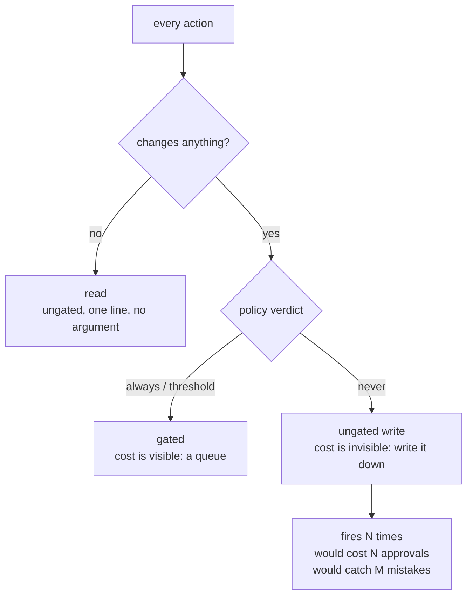

# 3.3 — The rows that are not gated

## One-line answer

An ungated action is a decision somebody made, not an action somebody forgot, so each `never` row
has to carry its price in the open: Sutra's two ungated writes cost **28 approvals a night** that
nobody is asked for and let **2** wrong writes through, and that is the trade the table is buying
attention with.

## The story

Two weeks before a wedding, the shopping list is four pages long and it is on the fridge.

What makes it useful is not the items. It is the three lines that have been struck through, each
with a few words next to them in a different pen. *Second set of curtains — no, the hall has its
own.* *Sweets from the far shop — no, we are not driving there twice.* *Extra chairs — no, the
neighbours are lending.*

An aunt arrives, looks at the list, and starts to say *"but what about the chairs"* — and then sees
the line and stops. She may still disagree. She can say *the neighbours only have eleven*, and then
the line changes. What she cannot do is assume that nobody thought about chairs.

Take the struck-through lines off and you have the same list, and it is a worse document. Every
question that was already settled comes back, and it comes back from a different person each time.

## The idea in plain language

Every policy names what it protects. Half of them stop there, and that half is unreviewable.

The reason is simple. When a reviewer reads a policy table and an action they were expecting is not
in it, there are exactly two possibilities and the table gives them no way to tell which:

1. Somebody weighed that action and decided a human should not be asked about it.
2. Nobody has ever thought about that action.

These are opposite situations. The first is a design. The second is a hole. They look identical from
outside, and the reviewer's only options are to re-open a settled argument or to assume competence.
Both are bad, and the second is worse, because assuming competence is how holes survive.

So a `never` row is not an absence. It is a row, and it carries the same `because` sentence as an
`always` row — with one extra obligation. A gated row's cost is obvious: somebody gets asked. An
**ungated** row's cost is invisible by construction. Nothing appears in a queue, nothing shows on a
dashboard, and the mistakes it lets through are indistinguishable from mistakes nobody could have
caught. If that cost is not written down, it is not being weighed; it is being ignored and called a
decision.

Two words this part uses, defined once:

- A **read** is an action with no effect. `radius: none` in the inventory from
  [3.1](3.1-the-write-inventory.md). It cannot be wrong in a way a human could catch, so it is
  ungated without argument — there is nothing to argue about.
- An **ungated write** is an action that genuinely changes something and that the policy has
  decided to let run alone. This is the interesting category, and it is the one that owes a price.

## Why Sutra needs it

[1.1](../01-the-gate-that-means-nothing/1.1-a-control-that-fires-on-everything.md) ended on a number
this part has to face. Gating by policy caught four wrong writes out of six. The other two were
internal triage notes, and nobody was asked about either of them.

That was stated there as a price and not defended. Here it gets defended, or it does not, and the
table changes. Day 64 implements whatever this section decides, so this is the last part of the day
where a row can still move.

There is also a Sutra-specific reason the ungated rows matter more here than in most systems. The
desk's highest-volume write is `record_triage`, and it fires on every single ticket. If that row
ever flips to `always`, the queue triples and
[2.4](../02-sorting-the-actions/2.4-defeated-by-its-own-volume.md)'s failure arrives the same night.
The argument for leaving it alone is therefore load-bearing, and a load-bearing argument should be
written down where the person who wants to change it will read it.

## The mechanism

`free.py` takes the rows the policy leaves alone and prices each one from the recorded batch:

```bash
cd days/day-63-approval-gates-design/lab
uv run python free.py
```

**Line by line:**

- `free.py` walks `POLICY`, keeps the rows whose verdict is `never`, and splits them in two: the
  reads, which are ungated without argument, and the writes, which owe one.
- For each ungated write it prints three things — how often it actually fired, how many approvals
  gating it *would* have cost, and how many known-wrong actions gating it *would* have caught.
- The counts come from `_runs.counts()` and the wrong-flags from the recorded batch's ground truth,
  so the price is counted rather than estimated. `per_shift` is a property on the action, not a
  number typed into a table, which is the same discipline
  [3.1](3.1-the-write-inventory.md) applied to the inventory.

Measured on 2026-09-05:

```text
  ungated actions that actually fire, and what leaving them alone costs

  record_triage
    fires            27 times a night
    would have cost  27 approvals a night
    would have caught 2 mistake(s)
    because          internal, overwritable, and read by us within the hour; gating it would spend
                     the approver's attention 27 times a night to protect a note we can correct
                     ourselves

  reindex_start
    fires            1 times a night
    would have cost  1 approvals a night
    would have caught 0 mistake(s)
    because          internal and re-runnable; it is rate-limited for quota, which is a budget
                     control and not a safety one

  read-only actions, ungated without argument: 4
    lookup_ticket, search_kb, search_tickets, load_memory
    108 calls a night, zero possible wrong outcomes

  mistakes the ungated rows let through, per night: 2
  That number is not zero and the policy does not pretend it is. It is the
  price of the attention that caught the ones on the other side of the table.
```

Read the two ungated writes as two separate arguments, because they are.

**`record_triage` is the real one.** Gating it costs twenty-seven approvals a night and buys two
catches. Put that beside the whole policy queue, which is eleven items: adding this row would take
the queue to thirty-eight, which is past the point
[1.1](../01-the-gate-that-means-nothing/1.1-a-control-that-fires-on-everything.md) measured the
approver's attention running out. So gating `record_triage` does not add two catches to four. It
adds two catches and removes some of the existing four, because it pushes the customer-visible items
down a queue nobody finishes. The arithmetic is not "four plus two"; it is closer to the
`everything` arm, which caught two.

That is the argument, and it is checkable rather than felt. It also names its own expiry date: the
row's reason says the notes are *"read by us within the hour"*. The day that stops being true, the
row is wrong.

**`reindex_start` is the easy one**, and it is worth including precisely because it is easy. It
fires once, it costs one approval, it catches nothing, and the reason names something people
routinely confuse: it *is* rate-limited, and the rate limit is a **budget** control, not a safety
one. Somebody will eventually point at the rate limit and say the action is already protected. It is
protected from spending quota. Nothing about that stops it being wrong.

**The four reads get one line between them** and no argument, and that asymmetry is deliberate.
Writing four paragraphs about why reading a ticket does not need approval is how a policy document
becomes unreadable, and an unreadable policy is one nobody checks. One hundred and eight calls a
night, no possible wrong outcome, one line.



## When it breaks

The break is not that the reasons are wrong. It is that the ungated rows stop being counted, and
they stop being counted the moment somebody deletes them for being noise.

Here is the shape. A reviewer looks at the table, sees six rows saying `never`, and observes that
four of them are reads that obviously do not need a human. They tidy the table down to the rows that
do something. The next reader sees a policy with four rows in it and no way to know whether
`record_triage` was considered.

The other break is more interesting and it is visible in the output above: `would have caught 2`.
Somebody will read that as a bug to be fixed. It is not a bug, it is a bill, and the way it breaks
is when a person who was not in this conversation reads two mistakes a night and gates the row —
producing a queue of thirty-eight and, on the numbers from
[1.1](../01-the-gate-that-means-nothing/1.1-a-control-that-fires-on-everything.md), fewer catches
overall. The change looks strictly safer in the diff and is strictly worse in the batch. That is why
the reason has to contain the number twenty-seven rather than the word "frequent".

There is also a real error you can reach here, and it is worth reaching once. Ask the policy for a
threshold on an action that has none:

```python
from _policy import threshold_allows

threshold_allows("record_triage", severity="P1")
```

**Line by line:**

- `threshold_allows` is the single place the day's one threshold rule is written, so nothing else
  may restate it.
- Its first act is to check that the caller is asking about the only action that *has* a threshold.
  Anything else is a bug in the table, not a question with a default answer.

```traceback
Traceback (most recent call last):
  File "<string>", line 3, in <module>
  File ".../days/day-63-approval-gates-design/lab/_policy.py", line 135, in threshold_allows
    raise ValueError(f"no threshold rule for {action!r}; POLICY says {gate_for(action).gate}")
ValueError: no threshold rule for 'record_triage'; POLICY says never
```

It raises rather than returning `True`. A threshold nobody wrote is not a threshold that defaults to
yes, and the error names the verdict the table actually holds so the caller can see they asked the
wrong question.

## In production

**What a professional writes instead.** They keep the `never` rows and add one column the teaching
version does not have: **who last checked**, with a date. An ungated row is a standing claim that an
action is safe to run alone, and standing claims rot. The rows that rot fastest are the ones whose
reason cites human behaviour — *"read by us within the hour"* is a claim about a shift, and shifts
change without anybody editing a policy file.

**What degrades at scale.** The ungated writes are the ones whose cost grows with traffic while
their visibility stays at zero. At twenty-seven tickets a night, two wrong notes is a number
somebody can hold in their head. At ten times the volume it is twenty wrong notes, the reason still
says the morning shift catches them, and the morning shift is now skimming. Nothing in the system
raises anything. The failure is that a policy's reasons are evaluated once, at writing time, against
a load that then changes underneath them.

**The failure mode that only appears with real traffic.** An ungated write that is individually
harmless can be collectively harmful, and no per-action policy can see it. Twenty-seven internal
notes are twenty-seven small corrections. Twenty-seven *thousand* internal notes, all slightly
wrong, are a memory store that returns confident nonsense, which is exactly the failure
[Day 49 measured when the nearest row is not a near one](../../../day-49-retrieval-and-embeddings/parts/05-when-retrieval-lies/5.1-nearest-is-not-near.md) —
and the gate was never asked, because each individual note really was correctable.

**The review comment a senior engineer leaves:** *"Good — the `never` rows have reasons. Two asks.
The `record_triage` reason cites 'within the hour' and that is a claim about the morning shift, so
put a date and a name on it; I want to know when somebody last watched them do it. And `free.py`
should be in the gate, not a script somebody runs when they remember: if the ungated cost ever
doubles I want the build to tell me, not a person who happened to look."*

**The interview question:** *"How do you decide what does not need approval?"* An honest answer:
*"The same way as what does, and I write it down in the same table. The rows that say no-gate carry
a reason and a price — for our highest-volume write, gating it would cost twenty-seven approvals a
night and catch two mistakes, and our whole approval queue is eleven items, so adding it would push
the customer-visible actions past the point anyone reads. That trade is in the table. The reason I
insist on it is that a missing row and a considered row look identical, and if you cannot tell them
apart your reviewer either re-litigates settled decisions or assumes somebody thought about it. The
one thing I would change in what we have is a date on each no-gate row, because those reasons are
claims about how people behave and they expire quietly."*

## Check yourself

```bash
cd days/day-63-approval-gates-design/lab
uv run python free.py
uv run python table.py
```

Now change `record_triage`'s verdict in `_policy.py` from `never` to `always`, run
`uv run python everything.py`, and write down what happens to the `policy` row. Then put it back.

**Out loud, without scrolling up:** explain why a policy that lists only the actions it gates is
harder to review than one that lists the actions it does not, and give the price of Sutra's
highest-volume ungated write.

**Next:** [3.4 — The Tuesday a tool arrives](3.4-the-tuesday-a-tool-arrives.md).
