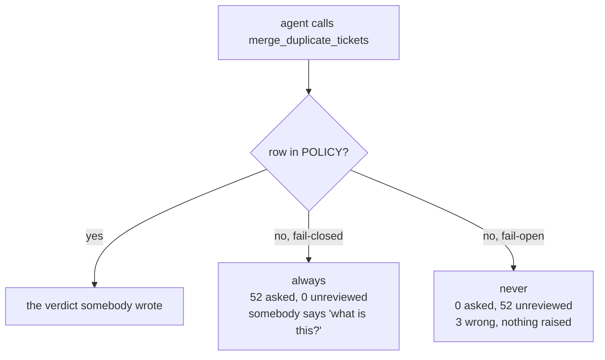

# 3.4 — The Tuesday a tool arrives

## One-line answer

The only property of a policy that matters on the day somebody adds a tool is what it does with a
name it has never seen: over one week, fail-closed asked for **52** approvals and let **0** merges
run unreviewed, while fail-open asked for **0** and ran all **52** — three of them wrong, with no
error raised anywhere.

## The story

The electrician comes to fix a fan and, while the board is open, adds a switch.

He is not being careless. There was a spare slot, the wiring for the back room was already there,
and it is genuinely better than the extension lead everyone was tripping over. He finishes, tests
it, and leaves. The switch is white, like the other five.

Three weeks later somebody wants the back-room light and stands in front of six identical switches.
Five of them are known. The sixth does something, and the only way to find out what is to flip it.

In this house nobody flips it. Somebody asks, and asking is slightly annoying, and the annoyance is
the entire reason anybody remembers to write on the board with a marker. In the flat downstairs
they flip it, because a switch that is there is presumably fine, and one evening it turns out to be
the geyser that has been on since Tuesday.

Nothing about the switch is different in the two flats. What is different is what each household
does with a switch it does not recognise.

## The idea in plain language

A policy table has one entry per action, and actions arrive after the table is written. That is not
an edge case; it is the normal life of a system. Somebody adds a tool because a ticket needed it.
The tool works. It is reasonable. Nobody opens the policy file, because opening the policy file was
not part of the task.

So the question that decides whether the policy is real is:

> **What does the gate do with a name it has never seen?**

There are exactly two answers, and they are called defaults:

- **Fail-closed** — an action with no row is treated as `always`. A human is asked. The system is
  more annoying and nothing runs unwatched.
- **Fail-open** — an action with no row is treated as `never`. The action runs alone. The system is
  smooth and the policy silently stopped covering the thing it exists to cover.

The important thing about this choice is *when* it takes effect. It is not made on the Tuesday the
tool arrives. It was made months earlier, by whoever wrote one line of lookup code, and quite
possibly without noticing they were making it. A dictionary lookup with a default is a security
decision written in the syntax of a convenience.

One term, defined once: an **unclassified action** is an action the agent can perform for which
`POLICY` has no row. It is not a rare state. Every tool is unclassified for the window between
being added and being classified, and that window is as long as it takes somebody to notice.

## Why Sutra needs it

Sutra's toolset has been growing for sixty days and will keep growing. Day 39 gave the agent
database tools, Day 46 gave it memory, Day 49 gave it retrieval — each of those was a Tuesday, and
each added something the agent could *do*. Day 71 adds a browser.

The policy table in [3.2](3.2-the-table-and-the-argument.md) covers ten actions. It will be wrong
about the eleventh, and the only design question available today is whether being wrong means
*asking unnecessarily* or *acting unwatched*. Day 64 builds the lookup, and it builds whichever
default this part argues for, in one function, so the decision is in one place instead of at every
call site.

## The mechanism

`unknown.py` replays a week in which somebody adds `merge_duplicate_tickets` on the Tuesday, and
runs the same week under both defaults:

```bash
cd days/day-63-approval-gates-design/lab
uv run python unknown.py
```

**Line by line:**

- The script asks `gate_for("merge_duplicate_tickets")` — the policy's real lookup function — and
  prints the row it gets back, including the `because`, so the default is shown as a *row* rather
  than as behaviour you have to infer.
- It then walks seven nights. The tool does not exist on nights one and two, and fires on the other
  five, with the counts taken from the recorded batch rather than invented.
- The two columns that matter are `approvals asked` and `ran unreviewed`. Their sum is always the
  number that fired, which is the point: every action is either watched or not, and there is no
  third column.

Measured on 2026-09-05:

```text
  default: fail-closed
  merge_duplicate_tickets -> gate=always
  because: unclassified: no row in POLICY, so it does not run alone

  night  fired  approvals asked  ran unreviewed
  ------------------------------------------------
      1      0                0               0
      2      0                0               0
      3      6                6               0
      4     11               11               0
      5      9                9               0
      6     14               14               0
      7     12               12               0

  total fired:        52
  approvals asked:    52
  ran unreviewed:     0

  Somebody was asked to approve the first one and said 'what is this?'.
  That question is the whole value of the default. The friction is the alarm.
```

Fifty-two approvals for a tool nobody classified is genuinely irritating, and on night three
somebody is going to ask what this thing is. **That question is the mechanism.** The policy has no
way to detect that a tool was added — it is a dictionary, not a watcher — so the only thing that can
notice is a person meeting unexpected friction. Fail-closed converts an invisible omission into an
annoying one, and annoying omissions get fixed.

Now the same week the other way:

```bash
uv run python unknown.py --open
```

**Line by line:**

- `--open` changes exactly one thing: the row returned for an unknown name is `never` instead of
  `always`. The nights, the counts and the tool are identical.
- The `because` string changes with it, and it is worth reading, because it states the assumption
  the default is actually making rather than the one people think it is making.

```text
  default: fail-open
  merge_duplicate_tickets -> gate=never
  because: unclassified: assumed safe because nobody said otherwise

  night  fired  approvals asked  ran unreviewed
  ------------------------------------------------
      1      0                0               0
      2      0                0               0
      3      6                0               6
      4     11                0              11
      5      9                0               9
      6     14                0              14
      7     12                0              12

  total fired:        52
  approvals asked:    0
  ran unreviewed:     52

  3 of those merges were wrong, and nobody was asked about any of them.
  Nothing failed. No error was raised. The policy simply had no opinion,
  and 'no opinion' was spelled 'yes'.
```

Three wrong merges. No exception, no log line, no alert, nothing in a dashboard. The policy behaved
exactly as written; it simply had nothing written about this action, and in a fail-open system the
absence of a rule **is** a rule.

Compare the two `because` strings side by side, because they are the whole part:

| Default | The row it produces | What it actually claims |
| --- | --- | --- |
| fail-closed | `unclassified: no row in POLICY, so it does not run alone` | we do not know, so we ask |
| fail-open | `unclassified: assumed safe because nobody said otherwise` | silence is consent |

Nobody would write the second sentence into a design document. Plenty of systems ship it, because it
is what `POLICY.get(action, NEVER)` means, and that expression does not look like a claim.



## When it breaks

Fail-closed breaks in a way this part has to be honest about, because it is the reason people choose
the other one.

Fifty-two spurious approvals in a week is not free. It arrives in the same queue as the eleven real
ones, and [1.1](../01-the-gate-that-means-nothing/1.1-a-control-that-fires-on-everything.md) already
measured what a queue that size does to attention. So the honest statement is not *"fail-closed is
safe"*. It is: **fail-closed converts an unnoticed correctness problem into a visible attention
problem**, and an attention problem is one you can see and fix in an afternoon by writing a row.

It also breaks outright if nobody is *there*. A fail-closed default on an overnight batch with no
approver awake does not ask anybody; it stops the batch. Whether that is right depends entirely on
the action, which is [5.1](../05-when-nobody-answers/5.1-fail-closed-or-fail-open.md)'s subject, and
it is why "fail-closed" is a default for *unknown* actions and not a blanket policy for known ones.

The failure that is genuinely bad, and the reason `gate_for` is a function rather than a dictionary
access, is this:

```python
from _policy import POLICY

row = POLICY["merge_duplicate_tickets"]
```

**Line by line:**

- A plain subscript has no default at all, which sounds like the safest option and is not.
- It raises `KeyError` at the call site, deep inside a node, at whatever moment the new tool first
  fires — and the caller that catches it has no idea it just caught a policy question.

```traceback
Traceback (most recent call last):
  File "<string>", line 3, in <module>
KeyError: 'merge_duplicate_tickets'
```

That traceback is Principle 10 working by accident. It surfaces, which is better than fail-open, but
it surfaces as a crash in an unrelated place rather than as an approval request, and the first
person to meet it will fix it with `POLICY.get(action, ...)` and a default chosen at three in the
morning. `gate_for()` exists so that the choice is made once, in the policy module, with its reason
attached.

## In production

**What a professional writes instead.** Two things the teaching version does not have. First, the
lookup emits a structured warning the first time it returns an unclassified row, with the action
name — so the omission reaches a log and not only a queue. Second, and more important, the
**registration of a tool and the classification of a tool are the same commit**: a test walks the
live toolset, compares it against `POLICY`, and fails the build on any tool with no row. That
converts the Tuesday problem from a runtime default into a merge-time error, and a merge-time error
is the only kind that gets fixed before it matters.

`inventory.py` already computes both difference lists. Today they are a script somebody runs;
in production they are a test.

**What degrades at scale.** With ten actions, an unclassified name is obvious the moment anybody
looks at the queue. With two hundred actions across four services, nobody looks at the queue as a
whole, and a fail-closed default degrades into *"the approvals dashboard always has some noise in
it"*. At that point the friction has stopped being an alarm and become weather, and the same
omission that was loud at ten actions is silent at two hundred. The property that saves you is not
the default; it is the build-time check, which does not care how many actions there are.

**The failure mode that only appears with real traffic.** The tool that arrives is rarely a
dangerous-sounding one. Nobody adds `delete_all_tickets` without thinking about approvals. They add
`merge_duplicate_tickets`, which sounds like tidying, and which — in the run above — closed tickets
as a side effect. The name is reassuring and the effect is not, and a fail-open default is a bet
that nobody will ever name a dangerous action reassuringly.

**The review comment a senior engineer leaves:** *"`gate_for` failing closed is right and I would
not change it. What I want before this ships is the test: walk the agent's actual toolset, diff it
against POLICY, fail the build. Without that, the default is doing the job of a code review, and
we will find out how well it does that job on a Tuesday. Also log the unclassified name the first
time it fires — the approver's confusion should not be the only signal."*

**The interview question:** *"Somebody adds a tool and forgets to update your approval policy. What
happens?"* An honest answer: *"A human gets asked about it, every time, until somebody classifies
it. That is deliberate and it is the only property of the policy I would refuse to trade. We ran it
both ways over a week: fail-closed asked fifty-two times and let nothing through unwatched, and
somebody asked what the tool was on the first night, which is how the omission got found. Fail-open
asked nothing, ran all fifty-two unwatched, and three were wrong — with no exception raised
anywhere, because 'no opinion' had been spelled 'yes' in a `dict.get` default. The friction is the
alarm. I would still add a build-time check that diffs the toolset against the policy table, because
relying on the default means relying on somebody noticing, and at two hundred tools nobody
notices."*

## Check yourself

```bash
cd days/day-63-approval-gates-design/lab
uv run python unknown.py
uv run python unknown.py --open
uv run python inventory.py
```

Now add an action to `_actions.py` — a name, and any plausible facts — without adding a row to
`POLICY`, and run `uv run python inventory.py`. Write down which of its two difference lists your
new action appears in, and what would have caught it if that script were never run.

**Out loud, without scrolling up:** state what `POLICY.get(action, NEVER)` claims about an action
nobody has classified, in a sentence you would be willing to put in a design document.

**Next:** [4.1 — Approving bytes, not pointers](../04-what-the-approver-sees/4.1-approving-bytes-not-pointers.md).
