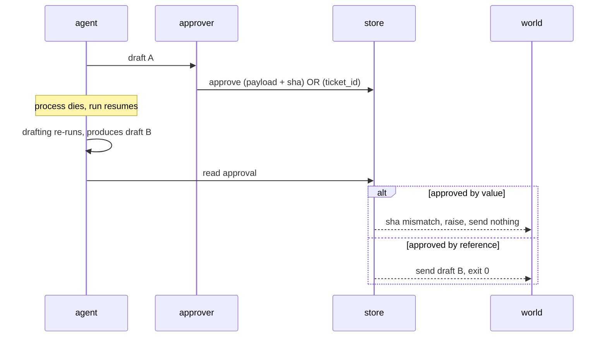

# 4.1 — Approving bytes, not pointers

## One-line answer

An approval that records a ticket number has approved a **name**, and the thing behind that name can
change before it executes: pinning the payload raises
`ApprovalMismatch: approved 80c7b07b645d but about to execute cbbb396abd33`, while approving the
pointer sends a reply the human never read and reports nothing at all.

## The story

The wedding cards come back from the press as a proof, one single card, and everyone crowds round
the table to read it.

Somebody spots that the venue line has the old address. It is corrected, and the corrected proof is
read again, slowly, by three people. The date is right, the names are right, the address is right.
Fine, says the father of the bride. Print it.

Five hundred cards arrive, and the venue line has the old address.

Nobody did anything wrong exactly. The press had two files. The corrected one was the one shown on
the screen; the one in the print queue was the earlier one, and both were called *card final*. The
approval that was given was a spoken sentence about a piece of paper, and by the time it reached the
machine it had become an instruction to print whatever was in the folder.

If somebody had written the corrected proof's reference number on the back and said *print this
number*, the press would have caught it. Not because they would have been more careful — because the
approval would have named the thing rather than the place the thing was kept.

## The idea in plain language

An approval is a decision about a **specific thing**. The mistake is recording it as a decision about
where that thing lives.

Two ways to write the same approval record:

- **By reference.** *"ops-1 approved the reply for ticket:4611."* The record holds a pointer:
  a ticket id, a run id, a row key. To find out what was approved, you follow the pointer and read
  whatever is there **now**.
- **By value.** *"ops-1 approved this exact text, whose fingerprint is `80c7b07b645d`."* The record
  holds the content itself, plus a short fingerprint of it. To find out what was approved, you read
  the record.

These are identical as long as nothing changes between the approval and the execution. They stop
being identical the moment something does, and in an agent something does, routinely and for good
reasons.

One term, defined once. A **fingerprint** (or content hash) is a short string computed from some
bytes, such that different bytes almost always give a different string. It is not encryption and it
hides nothing; its only job is to let two people, or two moments in time, agree on whether they are
looking at the same thing. `80c7b07b645d` above is the first twelve characters of one.

The reason this matters here and not in an ordinary web form is Day 60. A durable run is **resumed**,
and a resumed run re-executes work. That is not a bug — it is at-least-once delivery behaving exactly
as designed. But re-executing the drafting stage means the draft is produced again, and a language
model asked the same question twice does not have to give the same answer. So the sequence is:

1. The agent drafts a reply.
2. A human reads it and approves.
3. The process dies. The run resumes.
4. The drafting stage runs again and produces different words.
5. Something sends a reply.

Step five is the whole part. What gets sent is whatever the approval was *about*, and that depends
entirely on which of the two record shapes you chose in step two.

## Why Sutra needs it

Sutra is a durable system by Day 60 and a human-gated one by Day 64, and this part is the seam where
those two facts collide.

The triage graph's write step is `post_reply` and `close_ticket`, both `always` in the policy table
from [3.2](../03-the-policy-table/3.2-the-table-and-the-argument.md). Both are customer-visible and
neither can be un-sent. Day 64 has to store a pending approval somewhere, and the shape of that
stored record is a decision it will make in about four lines of code. This part exists so those four
lines are chosen rather than typed.

It is also why [4.4](4.4-the-four-facts-a-record-must-hold.md) insists the record carries the payload
*and* its fingerprint rather than deriving the fingerprint later. A hash computed at the moment
somebody gets suspicious is a hash of whatever is there when they got suspicious.

## The mechanism

`bind.py` runs the sequence above, once with the payload pinned and once with a pointer:

```bash
cd days/day-63-approval-gates-design/lab
uv run python bind.py
```

**Line by line:**

- The script prints the draft the approver read, then the keys of the approval record it wrote, so
  you can see what was stored rather than being told.
- It then resumes the run. The drafting stage runs a second time and produces a different reply —
  this is a scripted second draft, not a live model, so the difference is deterministic and you get
  the same output every time.
- `execute()` compares the fingerprint in the record against the fingerprint of what is about to be
  sent, and raises if they differ. The comparison is the entire safety property; everything else is
  bookkeeping.

Measured on 2026-09-05:

```text
  approver read: 'Set SameSite=None and Secure on the session cookie; the sign-in redirect then keeps the session. Sorry for the delay in getting back to you.'
  record keys:   ['approved', 'by', 'payload', 'sha']
  ... run is resumed, the drafting stage runs again ...
  now drafted:   'Closing as resolved - no reply from customer.'

Traceback (most recent call last):
  File ".../days/day-63-approval-gates-design/lab/bind.py", line 95, in <module>
    sys.exit(main(sys.argv[1:]))
             ^^^^^^^^^^^^^^^^^^
  File ".../days/day-63-approval-gates-design/lab/bind.py", line 90, in main
    execute(record, DRAFT_B)
  File ".../days/day-63-approval-gates-design/lab/bind.py", line 69, in execute
    raise ApprovalMismatch(
ApprovalMismatch: approved 80c7b07b645d but about to execute cbbb396abd33: the payload changed after approval
```

Read what the two drafts actually are, because the example is not a subtle rewording.

The approver read a real answer: set `SameSite=None` and `Secure`, apologise for the delay. That is
the fix from the archive's own sign-out ticket. What the resumed run produced is *"Closing as
resolved - no reply from customer."* — a different message with a different meaning, going to a
customer whose problem has not been fixed.

The run **crashed**, and the crash is the good outcome. Nothing was sent. Somebody has to look at it
in the morning. That is Principle 10 doing its job: the system stopped rather than doing something
nobody authorised, and the error names both fingerprints so the person looking at it can find the
two versions.

Now the same run with a pointer:

```bash
uv run python bind.py --by-reference
```

**Line by line:**

- `--by-reference` changes one thing: the record stores `ticket_id` where the other arm stored
  `payload` and `sha`. Everything else — the drafts, the resume, the send — is identical.
- `execute()` still runs. It has nothing to compare against, so it proceeds.

```text
  approver read: 'Set SameSite=None and Secure on the session cookie; the sign-in redirect then keeps the session. Sorry for the delay in getting back to you.'
  record keys:   ['approved', 'by', 'ticket_id']
  ... run is resumed, the drafting stage runs again ...
  now drafted:   'Closing as resolved - no reply from customer.'

  executing without a fingerprint - nothing to compare against
  sending: 'Closing as resolved - no reply from customer.'
```

Exit code zero. A customer receives a message the approver never saw and would not have approved. The
audit trail is complete and accurate: `ops-1 approved ticket:4611`. Every word of that is true, and
it describes a decision about a different piece of text.

Compare the two record shapes, which differ by two keys:

| Record | Keys | What it can prove |
| --- | --- | --- |
| by reference | `approved`, `by`, `ticket_id` | somebody said yes about this ticket |
| by value | `approved`, `by`, `payload`, `sha` | somebody said yes about **these bytes** |



## When it breaks

The check breaks when the fingerprint is computed over the wrong thing, and it breaks silently in
both directions.

**Too narrow**, and it passes when it should not. `bind.py` hashes the whole call — `ticket_id`,
`action` and `resolution` together, with `sort_keys=True` so key order cannot matter — and that is
deliberate. Narrow it to the reply text alone and the recipient stops being covered: approve a
message, resume, and the same words go to a different customer under the same hash. The rule is that
the fingerprint has to cover **everything that would change the approver's answer**, which in
practice means the whole call rather than the part of it a human happened to read.

**Too wide**, and it fails when it should not. Include a timestamp, a run id, or anything else
regenerated on resume, and every single resume raises `ApprovalMismatch` for a payload nobody
touched. That failure is loud and self-inflicted, and the fix people reach for at three in the
morning is to delete the check.

There is a third break which is not about hashing at all. If the approval record and the executing
code disagree about **encoding** — one holds a `str`, the other hashes UTF-8 bytes with a different
normalisation — the fingerprints differ for identical text. The symptom looks exactly like a genuine
tamper, which makes it an expensive hour. Hash bytes, decide the encoding once, and write it down
next to the function.

## In production

**What a professional writes instead.** They store the fingerprint alongside the payload rather than
deriving it on demand, and they hash a **canonical serialisation** of the whole call — action name,
sorted arguments, target — not just the human-readable body. They also write the fingerprint into the
event log at approval time, so the log alone can answer *"was the thing that ran the thing that was
approved?"* without reading the store. Day 60 made the log the source of truth; this is one more fact
that belongs in it.

**What degrades at scale.** Nothing about the hash degrades. What degrades is the *diagnosis*. At one
approval a night, `ApprovalMismatch` means somebody looks at two strings. At a thousand a night, the
same exception is a page, and the on-call person has two hex strings and no way to see what changed.
The production version stores enough to render a difference — usually the approved payload itself —
because an alert that cannot be investigated becomes an alert that gets muted.

**The failure mode that only appears with real traffic.** Resumes are rare in testing and common in
production, and the drafts that differ after a resume are not random: they cluster on the tickets
where the model was least certain in the first place. So the approvals most likely to be invalidated
by a resume are exactly the ones where the human's judgement mattered most. A system that approves by
reference does not merely lose some approvals — it loses them where they were doing the most work.

**The review comment a senior engineer leaves:** *"The record stores `ticket_id`. That means the
approval survives a re-draft, which is the one thing it must not do — our runs resume, and resume
re-runs the drafting node. Store the payload and a hash of the canonical call, compare before
execute, and raise. And hash the recipient too; right now a re-target would pass a body-only hash."*

**The interview question:** *"Your run pauses for human approval and then resumes. What exactly did
the human approve?"* An honest answer: *"Bytes, and I can prove it, because the approval record holds
the payload and a hash of the whole call and we compare it immediately before executing. The reason I
care is that our resume is at-least-once, so a stage can legitimately run twice and produce different
output — I have watched an approved reply become 'closing as resolved, no reply from customer' after
a resume. With the hash the run raises `ApprovalMismatch` and sends nothing, which is a crash
somebody has to look at. Without it the send succeeds, exit zero, and the audit log truthfully says a
named person approved that ticket. The thing I would tell anyone building this is that the hash has
to cover everything that would have changed the approver's mind, including the recipient, and nothing
that regenerates on resume, or you get a check that either misses tampering or fails every time."*

## Check yourself

```bash
cd days/day-63-approval-gates-design/lab
uv run python bind.py; echo "exit: $?"
uv run python bind.py --by-reference; echo "exit: $?"
```

Now open `bind.py` and change the second draft to be **identical** to the first, then run the default
arm again. Write down whether it raises, and say in one sentence why that is the correct behaviour
rather than a missed detection.

**Out loud, without scrolling up:** explain why an approval that records a ticket number is not an
approval, using the words *resume* and *at-least-once*.

**Next:** [4.2 — The request and the diff](4.2-the-request-and-the-diff.md).
