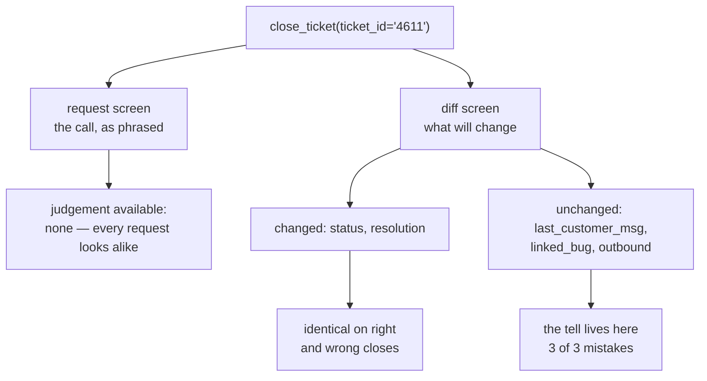

# 4.2 — The request and the diff

## One-line answer

A screen showing what was **asked for** and a screen showing what will **change** are two different
documents, and only one of them contains the mistake: over the batch's wrong closes, the request
screen makes **0 of 3** detectable and the diff screen makes **3 of 3**.

## The story

You are sending money on your phone. The screen says:

> **₹5,000** to **A/C 88210043921**
> Confirm?

You check the number against the message your cousin sent. Digit by digit, all eleven of them. It
matches. You confirm.

The money goes to a stranger, because your cousin copied the number wrong when he sent it to you, and
you have just very carefully verified that two identical mistakes are identical.

Now imagine the same screen with one more line on it:

> **₹5,000** to **A/C 88210043921** — *R. MEHTA*

Your cousin's name is not Mehta. You would have stopped, and you would have stopped instantly,
without checking anything digit by digit. The extra line is not more information in the sense of more
work. It is the *only* information on the screen you could have judged, and it took no effort at all
because you were not verifying it — you were recognising it.

The bank added that line because people kept sending money to strangers while reading the account
number very carefully.

## The idea in plain language

An approval screen can show two different things about the same action.

- **The request** is what the agent asked to do: the call, as it phrased it.
  `close_ticket(ticket_id='4611')`.
- **The diff** is what will change in the world if that call runs: `status: 'open' -> 'closed'`, a
  resolution text appearing where there was none, and — crucially — the surrounding state that is
  **not** changing but that determines whether the change is right.

The request is what the system has, so it is what gets displayed. It requires no extra work, it is
obviously relevant, and it is nearly useless, for a reason that is easy to see once stated: **every
request of the same kind looks the same.** Four closes in a night differ by four digits. A person
approving them is not exercising judgement; they are comparing strings that they have no independent
knowledge of. That is not review, it is transcription.

The diff is more work to build, because the system has to know what the action *will do*, not just
what was called. It has to look up current state and describe the change. In exchange, the screen now
contains things a human can actually judge: that the last customer message was fourteen days ago,
that the linked bug is still open, that no outbound message exists on a ticket whose resolution
claims a reply was sent.

Two terms, defined once:

- **The tell** is the field on the diff screen that makes a wrong action obviously wrong. It is
  usually *unchanged* state rather than the change itself, which is why a diff that shows only
  modified fields is a worse diff.
- **Recognition** versus **verification**: recognising a wrong name takes no effort and no reference
  material; verifying an account number requires both. Approval screens work when they ask for the
  first and fail when they ask for the second.

## Why Sutra needs it

[1.1](../01-the-gate-that-means-nothing/1.1-a-control-that-fires-on-everything.md) put a number on
the attention available: about twenty items before quality collapses. That number is not a constant
of nature. It is a property of **how hard each item is to judge**, and a screen that requires
verification burns attention several times faster than one that supports recognition.

So the two halves of this day's argument are connected. Section 2 shortened the queue; this part
makes each remaining item cheaper to decide. Day 64 has to render something into the pending-approval
record it stores, and if it renders the request, the eleven-item queue this day fought for will still
produce approvals that mean nothing.

## The mechanism

`diff.py` takes the four `close_ticket` calls from the recorded batch — one correct, three wrong —
and renders both screens for each:

```bash
cd days/day-63-approval-gates-design/lab
uv run python diff.py
```

**Line by line:**

- For each close, the script prints the request exactly as the agent phrased it, then the diff: every
  field the action touches, plus the ticket state a reviewer would need in order to disagree.
- Unchanged fields are printed with `(unchanged)` rather than omitted. That is the design decision
  this part is really about — a diff of only the changes hides the evidence.
- For the wrong ones it prints `the tell`, naming the single field that makes it wrong. That line is
  the script's own answer key, written in advance, the same discipline
  [3.1](../03-the-policy-table/3.1-the-write-inventory.md) used for the inventory.

Measured on 2026-09-05:

```text
  what the two screens contain, for the same four closes

  ticket:4602  [ok   ]
    request screen:
      close_ticket(ticket_id='4602')
    diff screen:
      status: 'open' -> 'closed'
      last_customer_msg: '2h ago'  (unchanged)
      linked_bug: 'closed'  (unchanged)
      resolution: (unset) -> 'Cache cleared; confirmed working.'

  ticket:4611  [WRONG]
    request screen:
      close_ticket(ticket_id='4611')
    diff screen:
      status: 'open' -> 'closed'
      last_customer_msg: '14d ago'  (unchanged)
      linked_bug: 'none'  (unchanged)
      resolution: (unset) -> 'Closing as resolved - no reply.'
    the tell: last_customer_msg='14d ago' - nobody confirmed anything

  ticket:4623  [WRONG]
    request screen:
      close_ticket(ticket_id='4623')
    diff screen:
      status: 'open' -> 'closed'
      last_customer_msg: '1d ago'  (unchanged)
      linked_bug: 'BUG-221 open'  (unchanged)
      resolution: (unset) -> 'Fix deployed.'
    the tell: linked_bug='BUG-221 open' - the fix is not deployed

  ticket:4627  [WRONG]
    request screen:
      close_ticket(ticket_id='4627')
    diff screen:
      status: 'open' -> 'closed'
      last_customer_msg: '3d ago'  (unchanged)
      outbound: 'none sent'  (unchanged)
      resolution: (unset) -> 'Reply sent; closing.'
    the tell: outbound='none sent' - the reply it claims to have sent does not exist

  wrong closes detectable from the request screen: 0/3
  wrong closes detectable from the diff screen:    3/3
```

Look at the four request screens stacked together. They are:

```text
close_ticket(ticket_id='4602')
close_ticket(ticket_id='4611')
close_ticket(ticket_id='4623')
close_ticket(ticket_id='4627')
```

One of these is right and three are wrong, and there is nothing on the screen that could tell you
which. An approver looking at this list is not making four decisions; they are pressing a button four
times. The script's closing line says it plainly: *an approver reading them is not approving, they are
counting.*

Now look at where each tell lives, because there is a pattern and it is the design rule of this part:

| Ticket | The tell | Is it a field the action changes? |
| --- | --- | --- |
| 4611 | `last_customer_msg: '14d ago'` | no — unchanged |
| 4623 | `linked_bug: 'BUG-221 open'` | no — unchanged |
| 4627 | `outbound: 'none sent'` | no — unchanged |

**Every tell is in unchanged state.** Not one of the three mistakes is visible in the fields being
modified. A diff implementation that shows only what changes — which is the obvious implementation,
and what the word "diff" suggests — would render three screens containing `status: open -> closed`
and a resolution string, and would catch nothing.

The resolution text is worth a second look too. For 4627 it says *"Reply sent; closing."* while
`outbound` says `'none sent'`. The screen contains a claim by the agent and a fact about the system,
side by side, and they contradict each other. That contradiction is only visible because both are on
the same screen. This is the first appearance of an idea [4.3](4.3-separation-of-duty.md) is built
on: the approver must see the **evidence**, not the agent's account of the evidence.



## When it breaks

The diff screen breaks by growing.

The rule *"show the state a reviewer needs to disagree"* has no natural stopping point, and the
honest version of this part has to say so. A ticket has forty fields. Show all of them and the tell is
still on the screen, technically, in the same sense that a wrong account digit is technically on the
screen. Attention is what you are spending, and a forty-line diff spends more of it than a
four-line request.

So the diff is a **curated** thing, and curation is a judgement that can be wrong. Somebody chose
`last_customer_msg`, `linked_bug` and `outbound` for `close_ticket`. That choice is a claim about how
this action goes wrong, it is exactly as fallible as the policy table's `because` column, and it will
be incomplete in the way nobody predicted. The mitigation is not to show everything; it is to treat
the field list as policy — reviewed, dated, and updated when an incident shows a tell that was not on
the screen.

The second break is that the diff is **computed from state that can move**. The screen says
`linked_bug: 'BUG-221 open'`, the reviewer takes an hour, and by execution time the bug is closed.
Now the approval was given against a world that no longer exists. [4.1](4.1-approving-bytes-not-pointers.md)
solved the payload half of this with a fingerprint; the evidence half is harder, because you do not
want to refuse an approval merely because unrelated state moved. The production answer is to
fingerprint the *decision-relevant* fields alongside the payload and re-render rather than refuse —
which is a real design cost, and it is a cost of showing evidence at all.

Third, and most common: the diff is generated by asking the agent to describe its own action. That
looks like a shortcut and it removes the entire value, because the contradiction in 4627 —
*"Reply sent"* against `outbound: none sent` — exists precisely because the second half did not come
from the agent. A self-described diff would have said *"reply sent; closing"*, and it would have been
consistent, and it would have been wrong.

## In production

**What a professional writes instead.** The diff is rendered by the same code path that will execute
the action, from live state, immediately before the approval is requested — not reconstructed
afterwards for display. That removes the class of bug where the preview and the execution disagree.
They also render the diff into the **approval record itself**, so what the approver saw is stored
rather than re-derived: [4.4](4.4-the-four-facts-a-record-must-hold.md) shows why an incident review
that cannot answer *"what exactly did they see?"* has nothing to work with.

**What degrades at scale.** The diff requires reading current state, which means the act of asking for
approval now costs a query per pending item. At eleven a night that is free. At the volume where the
approval queue is a product surface, rendering diffs for a queue page becomes a real load pattern, and
the tempting fix — cache the rendered diff — reintroduces the staleness the diff existed to remove.

**The failure mode that only appears with real traffic.** The curated field list is tuned on the
mistakes you have already seen. Real traffic supplies a new one: a ticket closed correctly, on a
customer account that was merged into another account last week, where the tell would have been an
account status field nobody put on the screen. The diff screen looks complete right up until the
first incident that proves it is a snapshot of last year's failure modes.

**The review comment a senior engineer leaves:** *"The preview only lists changed fields. Every one of
our known-bad closes is invisible in the changed fields — the signal is in `last_customer_msg` and
`linked_bug`, which do not change. Render the unchanged decision-relevant state too, and generate it
from the execution path rather than from the agent's summary, or we are asking a human to check the
agent's homework using the agent's own handwriting."*

**The interview question:** *"What goes on an approval screen?"* An honest answer: *"Not the request.
I have a batch of four ticket closes where three are wrong, and on the request screen all four read
`close_ticket(ticket_id=...)` with four different digits — zero of the three are detectable. On a diff
screen all three are, and here is the part that surprised me: every single tell was in state the action
does **not** change. One had a last customer message from a fortnight ago, one had its linked bug still
open, one claimed in its resolution text that a reply had been sent while the outbound log was empty.
So a diff that shows only modified fields would have caught none of them. I render unchanged
decision-relevant state as well, I generate it from the execution path rather than from the agent's own
summary, and I treat the field list as reviewed policy, because it is a claim about how the action
fails and it will be incomplete."*

## Check yourself

```bash
cd days/day-63-approval-gates-design/lab
uv run python diff.py
```

Now open `diff.py` and delete `"linked_bug": "BUG-221 open"` from `ticket:4623`'s `before` dict.
Re-run it. The diff screen for that ticket no longer shows the tell — and the summary still reports
`3/3`. Write down why, then say what `from_diff` would have to be computed from in order to be a
measurement rather than a restatement of the answer key.

**Out loud, without scrolling up:** name the three tells from the batch and say, for each, whether it
was in a field the action changed.

**Next:** [4.3 — Separation of duty](4.3-separation-of-duty.md).
