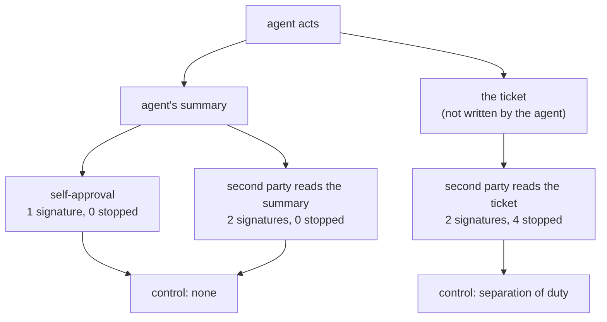

# 4.3 — Separation of duty

## One-line answer

Two signatures on the same evidence is one signature written twice: over thirteen gated actions, an
approver reading the agent's own summary stopped **0** of 4 wrong ones, and an approver reading the
ticket stopped **4**.

## The story

The college store keeps a register, and every item that leaves it needs an indent slip with two
signatures: the person requesting, and the person authorising.

For years the store clerk has been filling in the indent slips himself, because the lab staff write
them badly and it saves everyone an argument. He fills them in, he takes them to the head of
department, and the head signs them. He has never once written down anything that was not asked for.

There are two names on every slip. There has been one pair of eyes on every slip for years, because
the head of department is signing a description of a request rather than a request, and the person
who wrote the description is the person the second signature exists to check.

When the audit finally happens, nobody has done anything dishonest and nothing can be verified. The
register is complete, the slips are all signed, and every one of them says exactly what the store
clerk understood at the time.

## The idea in plain language

**Separation of duty** means the party that proposes an action and the party that authorises it are
different parties.

Almost everybody implements the first half of that sentence and misses the second. Two different
names on the record is easy. What the control actually requires is that the second party has an
**independent basis** for their decision — evidence that did not come through the first party.

This gives a three-step ladder, and only the top step is the control:

1. **Self-approval.** The agent decides, and the agent approves. One party, one signature, and the
   approval adds nothing at all.
2. **Two parties, one evidence source.** A second reviewer approves, reading the agent's summary of
   what it did and why. Two names, and still one pair of eyes, because the summary was written by the
   thing being checked. This is the store clerk's indent slip, and it is what most approval screens
   ship as.
3. **Two parties, independent evidence.** The reviewer reads the ticket. Now the approval can
   disagree with the agent, because it is looking at something the agent did not author.

The distinction between step two and step three is not organisational and it is not about trust. The
agent is not lying in step two. It is summarising, and a summary is exactly the operation that
removes the information that would contradict it. An agent that has convinced itself a customer
confirmed a fix will write *"customer confirmed the workaround"*, and every word of that is what it
sincerely concluded.

This is also the sharpest version of a point [4.2](4.2-the-request-and-the-diff.md) started: the
approver must see the evidence, not an account of the evidence. There, the account was the request
line. Here it is a whole paragraph of reasoning, which is more persuasive and therefore worse.

## Why Sutra needs it

Day 57 built the Writer↔Critic pattern, and Day 58 wired a review stage into the triage graph. It is
tempting to point at that stage and call the gate satisfied — there is already a second party looking
at the draft.

That reviewer is step two. It reads what the drafting stage produced, and both stages are working
from the same retrieved context. Everything downstream inherits whatever the classification stage got
wrong. So the review node improves quality and is not a separation-of-duty control, and this part
exists so that Day 64 does not accidentally claim it is one.

The other reason is the audit story. Day 65 asks whether a human approved the write, and the honest
version of that question is *"approved it against what?"* An approval record whose evidence pointer
leads back to the agent's own summary answers the letter of the gate and none of its purpose.

## The paper behind it

> **A Comparison of Commercial and Military Computer Security Policies**
> `doi:10.1109/SP.1987.10001` · 1987 · 1987 IEEE Symposium on Security and Privacy
> <https://doi.org/10.1109/SP.1987.10001>

It argued that commercial systems care less about who may *read* data and almost entirely about
whether the data stays correct, and that correctness is enforced by two rules — every change goes
through a certified procedure, and no single person may both certify and execute one.

The full treatment, with the paper's own model and a runnable demo of the rule being removed, is in
[papers/01 — Well-formed transactions](../../papers/01-well-formed-transactions.md). Read it after
the parts.

## The mechanism

`duty.py` runs the thirteen gated actions from the recorded batch through all three arrangements:

```bash
cd days/day-63-approval-gates-design/lab
uv run python duty.py
```

**Line by line:**

- Each arrangement gets the same batch and the same four wrong actions. The only thing that changes
  is what the approving party is allowed to read.
- `self` reads its own decision; `same evidence` reads the agent's summary; `independent` reads the
  ticket. The `signatures` column counts names on the record, so you can see that it stops
  distinguishing the arrangements after the first one.
- For the independent arm it then prints, per stopped action, the agent's sentence beside the
  ticket's fact — which is the only way to see that the two are not in conflict about *facts*, they
  are in conflict about what was looked at.

Measured on 2026-09-05:

```text
  13 gated actions in the batch, 4 of them wrong

  arrangement       signatures  wrong ones stopped  what the approver reads
  ----------------------------------------------------------------------------------------
  self                       1                   0  its own decision
  same evidence              2                   0  the agent's summary of the ticket
  independent                2                   4  the ticket

  the four the independent reviewer stopped, and what it read:

  ticket:4611
    agent says:  customer confirmed the workaround; safe to close
    ticket says: last customer message: 14 days ago. No reply since our question.
    verdict:     REFUSE (customer never replied)

  ticket:4623
    agent says:  fix deployed and verified; safe to close
    ticket says: linked bug BUG-221 is still open, status: in progress
    verdict:     REFUSE (root cause not fixed)

  ticket:4625
    agent says:  database timeout; routing to the database team
    ticket says: error originates in the payment gateway client, owned by the payments team
    verdict:     REFUSE (wrong team)

  ticket:4627
    agent says:  reply sent to customer; safe to close
    ticket says: outbound message log for this ticket: empty
    verdict:     REFUSE (reply was never sent)
```

The middle row is the finding. **Two signatures, zero catches.**

An organisation with that arrangement has a genuine second reviewer, a real approval queue, a
complete audit trail and a control that does nothing. Nobody is asleep. The reviewer reads *"customer
confirmed the workaround; safe to close"*, has no reason to doubt it, and approves — correctly, given
what is in front of them. Every approval in that row is a reasonable decision made on the available
evidence, and the available evidence was chosen by the party being reviewed.

Now read the four pairs. In each one the agent's sentence and the ticket's fact are not contradictory
claims about the world; the agent's sentence is a **conclusion** and the ticket's line is an
**observation**, and the conclusion is wrong. *"Customer confirmed the workaround"* against *"last
customer message: 14 days ago"*. Nothing in the first sentence is detectably false on its own. It
becomes false the moment it is placed beside something the agent did not write.

`ticket:4625` is worth a separate look because it is not a close. It is an escalation to the wrong
team, and the tell is domain knowledge — the error comes from the payment gateway client, which
payments owns. The independent reviewer catches it because they are reading the error, not the
routing decision. A reviewer reading *"database timeout; routing to the database team"* would approve
it, and the page would go to a team who would spend the night finding out it was not theirs.



## When it breaks

Independent evidence is expensive, and the way this breaks is that the expense gets optimised away by
somebody who is not doing anything wrong.

The reviewer has to read the ticket. That is slower than reading a summary, and it is slower in
precisely the way [1.1](../01-the-gate-that-means-nothing/1.1-a-control-that-fires-on-everything.md)
warned about: it consumes more of a fixed attention budget per item. So a well-meaning improvement
appears — *"let us put a short summary at the top of the approval screen so the reviewer has
context"* — and it is genuinely helpful, and within a month the reviewer reads the summary and skims
the ticket, and the arrangement has decayed from row three to row two without a single line of policy
changing.

That decay is invisible in every metric an approval system normally has. Signatures: still two.
Approval rate: unchanged. Time per item: *improved*. The only instrument that sees it is a catch rate
against known-bad items, which is the same instrument
[1.1](../01-the-gate-that-means-nothing/1.1-a-control-that-fires-on-everything.md) needed and which
almost nobody has.

The second break is subtler and it is worth naming because agent systems make it easy. If the
"independent" evidence is retrieved **by the agent** — the agent fetches the ticket and puts it on the
approval screen — then the agent chose which ticket, which fields, and how much of the thread. The
reviewer is now reading a selection made by the reviewed party, which is step two wearing step
three's clothes. The evidence has to be fetched by the approval path, from the source, or the
independence is decorative.

Third: two humans who work the same rota, on the same shift, with the same training and the same
incentive to clear the queue are two signatures with strongly correlated judgement. Separation of
duty is a structural control and it degrades smoothly, not sharply, as the two parties become more
alike.

## In production

**What a professional writes instead.** The approval payload carries a **pointer to the source**, and
the approval interface fetches from it rather than displaying a snapshot the agent supplied.
Where the summary is shown at all, it is labelled as the agent's claim and placed *below* the
evidence, not above it. Some teams go further and record, per approval, which evidence the reviewer
actually opened — not to police anybody, but because that is the only signal that distinguishes row
three from row two six months later.

**What degrades at scale.** Independence is the first thing traded away under load. When the queue is
long, the summary is what gets read, and every system that has an approval queue eventually grows a
summary. The structural defence is not exhortation; it is keeping the queue short enough that reading
the evidence is affordable, which is the entire argument of section 2 and the reason this day put the
queue-length work before the evidence work.

**The failure mode that only appears with real traffic.** The four catches above all came from a
single field being checkable. Real tickets have threads, attachments, and history that no approval
screen renders in full, and the independent reviewer's evidence is therefore always a *subset*. The
failures that survive are the ones whose tell is in the part of the source nobody put on the screen —
which is the same limit [4.2](4.2-the-request-and-the-diff.md) hit, arriving from the other side.

**The review comment a senior engineer leaves:** *"There are two names on this approval and they are
both reading a field the agent populated. That is not separation of duty, it is the agent's summary
with a countersignature. Fetch the ticket in the approval path, render the agent's reasoning
underneath it and label it as a claim, and give me a catch-rate number against the known-bad set —
signature count is not evidence that this control works."*

**The interview question:** *"You have a human approving the agent's writes. What makes that a control
rather than a formality?"* An honest answer: *"That the human is reading something the agent did not
write. I measured all three arrangements on the same batch of thirteen gated actions with four known
bad ones. Self-approval caught nothing, obviously. A second reviewer reading the agent's own summary
also caught nothing — two names on the record, one pair of eyes, and every approval was reasonable
given what was on the screen. The same reviewer reading the ticket caught all four, because 'customer
confirmed the workaround' only becomes visibly wrong next to 'last customer message: fourteen days
ago'. The trap I watch for now is the helpful summary creeping onto the approval screen, because that
converts the third arrangement back into the second and nothing in the metrics moves — signature
count is identical and time-per-item actually improves."*

## Check yourself

```bash
cd days/day-63-approval-gates-design/lab
uv run python duty.py
```

Pick any one of the four pairs above and write the agent's sentence and the ticket's line side by
side. Then answer: is the agent's sentence false, or is it a conclusion drawn from less than the
reviewer had?

**Out loud, without scrolling up:** explain why two signatures can be one pair of eyes, and say what
has to be true of the second party's evidence for the count to mean anything.

**Next:** [4.4 — The four facts a record must hold](4.4-the-four-facts-a-record-must-hold.md).
