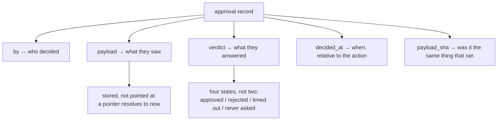

# 4.4 — The four facts a record must hold

## One-line answer

An incident review asks four questions and accepts no guesses, so an approval record is scored by how
many it answers: a boolean answers **0 of 4**, a boolean with a name answers **1**, adding a timestamp
and a session pointer answers **2**, and only a record holding the payload itself answers **4**.

## The story

The parcel was delivered. The tracking page says so, with a green tick and the word *Delivered*.

You did not receive it. You ring the courier company and they read out what they have: delivered, and
a signature. You ask whose signature. They say it is a squiggle. You ask what was delivered — was it
the large box or the envelope, because you were expecting both. They have one entry. You ask when,
because you were at home all morning and the gate was locked. They have the date.

Nobody at the company is being obstructive. The record they kept genuinely contains everything their
system was built to store, and it cannot answer a single one of the questions that arise the moment
something goes wrong. It was designed to say *the delivery finished*, which is the one fact nobody is
disputing.

The company that gets this right is the one whose driver's app takes a photograph, records the name
as typed, stamps the time, and puts all three on the same screen. Not because they distrust their
drivers. Because the day somebody asks, an answer exists.

## The idea in plain language

An approval record is written on a good day and read on a bad one. That asymmetry is the whole design
constraint, and it is why the shape that feels sufficient while you are building is almost never
sufficient later.

The natural first version is a boolean. `approved: true`. It is exactly what the code needs — the
executing branch checks it and proceeds — and it is what most systems store, because the record's
author was thinking about the *execution* and the record's reader will be thinking about an
**incident**.

An incident review asks four questions, in this order, and does not accept "we think so" for any of
them:

1. **Who decided?** Not which service, which *person*. Somebody has to be available to be asked what
   they were thinking, and somebody has to be accountable.
2. **What exactly did they see?** Not which ticket — what was on the screen. This is the question
   that separates a real record from a plausible one, and it is the one that gets skipped, because
   storing it means storing bytes rather than an identifier.
3. **What did they answer?** A record that stores only successful approvals cannot distinguish a
   rejection from a timeout from a question nobody ever asked.
4. **When?** Specifically, in relation to the action. An approval recorded after the effect is a
   ratification, and the two are not the same thing.

There is a fifth question nobody asks until it matters, and
[4.1](4.1-approving-bytes-not-pointers.md) already answered it: **was the thing that executed the
thing that was approved?** That is what the stored fingerprint is for, and it is stored rather than
computed later for a simple reason. A hash calculated at the moment somebody becomes suspicious is a
hash of whatever is in the store at the moment somebody becomes suspicious.

## Why Sutra needs it

Day 65 is the Phase 9 gate, and one of its criteria is that the run's audit record answers *who
approved what, on what evidence, when*. That criterion is unpassable unless the record shape is
decided here.

There is also a direct line back to Day 22, which established
[structured logging](../../../day-22-structured-logging/parts/01-a-line-you-can-query/1.1-a-print-is-not-a-log.md)
and the principle that a log line is written for the person reading it under pressure. An approval
record is the same argument applied to a decision instead of an event, and it fails in the same way:
the fields that feel redundant while writing are the fields that carry the whole answer while
reading.

## The mechanism

`record.py` takes four record shapes people actually write and asks all four questions of each:

```bash
cd days/day-63-approval-gates-design/lab
uv run python record.py
```

**Line by line:**

- The four shapes escalate: a bare boolean, a boolean with a name, one with a timestamp and a pointer
  to the session, and the full record.
- Each question is a check against the fields present, and a failure prints the **specific
  unanswerable question** rather than a score. A missing column should cost something nameable, not
  a vague feeling of incompleteness.
- The third shape is the interesting one and is deliberately not a straw man — a timestamp and a
  session id is a genuinely reasonable record, and it is what a careful engineer writes on the first
  attempt.

Measured on 2026-09-05:

```text
  'a boolean': answers 0/4
    fields: ['approved']
      who decided?                 NO  - nobody can be asked what they were thinking, and nobody is accountable
      what exactly did they see?   NO  - the approver says the draft was different, and there is no way to check
      what did they answer?        NO  - a rejection and a timeout look identical in the log
      when?                        NO  - you cannot tell whether the approval preceded the action

  'a boolean and a name': answers 1/4
    fields: ['approved', 'by']
      who decided?                 yes
      what exactly did they see?   NO  - the approver says the draft was different, and there is no way to check
      what did they answer?        NO  - a rejection and a timeout look identical in the log
      when?                        NO  - you cannot tell whether the approval preceded the action

  'with a pointer to the session': answers 2/4
    fields: ['approved', 'by', 'decided_at', 'session_id']
      who decided?                 yes
      what exactly did they see?   NO  - the approver says the draft was different, and there is no way to check
      what did they answer?        NO  - a rejection and a timeout look identical in the log
      when?                        yes

  'the record': answers 4/4
    fields: ['by', 'decided_at', 'payload', 'payload_sha', 'verdict']
      who decided?                 yes
      what exactly did they see?   yes
      what did they answer?        yes
      when?                        yes

  The last shape also carries `payload_sha`, which answers a fifth question
  nobody thinks to ask until it matters: was the thing that executed the thing
  that was approved? That is bind.py, and it is the reason the hash is stored
  next to the payload rather than derived when somebody wonders.
```

Two things in that output are worth reading slowly.

**The third shape scores two out of four, and it contains a `session_id`.** That looks like it should
answer question two — follow the pointer, find the session, see what was rendered. It does not, and
the reason is [4.1](4.1-approving-bytes-not-pointers.md)'s reason arriving in a different costume: a
pointer resolves to whatever is there **now**. If the run resumed and the drafting stage produced
different words, the session now holds the second draft, and the record cheerfully leads the
investigator to the wrong text with no indication that it has done so. A pointer is worse than
nothing here, because nothing prompts you to doubt it.

**The fourth shape has no `approved` field at all.** It has `verdict`. That is not cosmetic. A boolean
has two states and the real world has at least four — approved, rejected, timed out, never asked —
and collapsing them loses exactly the distinction an incident cares about. *"Why did this go out
without approval?"* has completely different answers depending on whether a human said no and was
overridden, or nobody was asked. In a boolean log those are the same absent row.

Here are the four shapes side by side, which is the form worth remembering:

| Shape | Answers | The question it cannot answer |
| --- | --- | --- |
| `approved` | 0/4 | all of them |
| `approved`, `by` | 1/4 | what was on the screen |
| `approved`, `by`, `decided_at`, `session_id` | 2/4 | what was on the screen — the pointer moved |
| `by`, `decided_at`, `payload`, `payload_sha`, `verdict` | 4/4 | — |



## When it breaks

The record breaks by containing customer text, and it breaks quietly.

`payload` is the whole point of the fourth shape, and for Sutra the payload is a reply written to a
customer about their account. That means the approvals table is now a second copy of customer
correspondence, sitting in a different store, with a different retention policy, and almost certainly
outside whatever deletion path the ticket archive has. Day 69 makes this a subject of its own; here it
is enough to say that "store what they saw" and "keep as little customer data as possible" are two
correct rules that point in opposite directions, and a design that has not noticed the tension has
resolved it by accident.

The second break is `decided_at` in a system that resumes. Day 60 established that a resumed run
re-executes work, and a naively written record can be **rewritten** on resume with a fresh timestamp
— at which point the record says the approval happened after the action it authorised, or worse,
looks correct while being a re-derived guess. The record must be written once, at decision time, and
be immutable afterwards. If it can be updated, question four has no answer, whatever the field says.

Third, and the one that hits fastest in review: nobody ever writes the `rejected` and `timed_out`
rows. The approve path is the path that gets built, because it is the path with a next step. The
reject path returns early and logs nothing, and six weeks later the only evidence that a human said no
is that nothing happened.

## In production

**What a professional writes instead.** The approval record is an **append-only event**, not a row
that is updated — same discipline as Day 60's event log, for the same reason: an updatable record
cannot answer a question about the past. They store `verdict` as an enum with all four states, they
store the rendered evidence alongside the payload, and they emit the record from the same code path
that suspends the run, so an approval cannot exist without the suspension that produced it.

**What degrades at scale.** The payload. Storing what the approver saw means the approvals store grows
with traffic and never shrinks, and it grows in the most sensitive possible bytes. The usual
production answer is a split: keep the fingerprint and the metadata for the full retention period,
keep the payload for a much shorter one, and accept that after that window question two degrades from
*"here is exactly what they saw"* to *"here is proof that what ran matched what they saw"*. That is a
real loss and it is a deliberate one, which is the difference between a policy and an accident.

**The failure mode that only appears with real traffic.** Volume turns the record from a document into
a dataset, and the questions change. The interesting query stops being *"what happened on this one"*
and becomes *"which approver approves fastest"*, *"which action is never rejected"*, *"what fraction
of our approvals were answered by a timeout"* — and that last one is the number that reveals
[5.2](../05-when-nobody-answers/5.2-the-answer-nobody-gave.md)'s failure. None of those queries are
possible against a boolean, and none of them occur to anybody until the table has a year in it.

**The review comment a senior engineer leaves:** *"`approved: bool` plus a session id. Two problems.
The session pointer will resolve to the post-resume draft, so it does not tell us what was on the
screen — store the payload and its hash. And make the field a verdict, not a boolean: right now a
rejection, a timeout and a request nobody ever saw are all the absence of a row, and the first
incident question will be which of those it was."*

**The interview question:** *"What is in your approval record?"* An honest answer: *"Five fields, and
each one is there because an incident review asks a question I could not otherwise answer. Who —
a person, not a service. What they saw — the payload itself, stored, not a session pointer, because a
pointer resolves to whatever is there now and our runs resume and re-draft. What they answered — a
verdict with four states, because a rejection, a timeout and never-asked are different events and a
boolean makes them the same missing row. When, written once at decision time and immutable, so it
cannot be re-stamped by a resume. And the payload hash, so we can prove the thing that executed was
the thing that was approved. The cost I would flag is that storing the payload means storing customer
text in a second place with its own retention, and I would rather argue about that explicitly than
discover it during a deletion request."*

## Check yourself

```bash
cd days/day-63-approval-gates-design/lab
uv run python record.py
uv run python bind.py; echo "exit: $?"
```

Now take the third shape — `approved`, `by`, `decided_at`, `session_id` — and write down which of the
four questions it answers and which it does not. Then say, in one sentence, what a `session_id`
actually proves after a resume.

**Out loud, without scrolling up:** name the four questions in the order an incident review asks them,
and say why `verdict` beats `approved`.

**Next:** [5.1 — Fail closed or fail open](../05-when-nobody-answers/5.1-fail-closed-or-fail-open.md).
