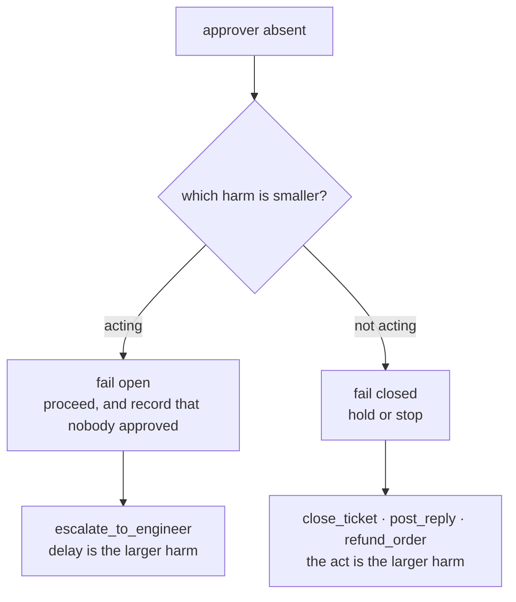

# 5.1 — Fail closed or fail open

## One-line answer

"Fail closed" is a slogan and not a policy, because the safer half is a property of the **action**:
of Sutra's four gated actions, three fail closed and exactly **one** fails open —
`escalate_to_engineer`, the only one whose harm comes from the delay rather than from the act.

## The story

A woman comes into a chemist's shop without a prescription and asks for a strip of antibiotics.

The chemist says no. This is the right answer, and it is right for a reason that has nothing to do
with the shop: the harm of handing over antibiotics that were not prescribed is real and lasting, and
the harm of making her come back tomorrow with a prescription is a wasted trip. Refusing is the
smaller harm.

An hour later a man comes in, breathing badly, asking for an inhaler. He does not have the
prescription with him.

If the rule is *no prescription, no medicine*, the chemist refuses, and the refusal is the larger
harm. Every chemist in the world knows this, and the good ones do not know it as an exception to a
rule. They know that the rule was never *"refuse when in doubt"*. It was always *"choose the smaller
harm when in doubt"*, and refusing happens to be the smaller harm nearly all the time — which is
exactly what makes the cases where it is not so easy to get wrong.

## The idea in plain language

Every gated action needs an answer to a question that only arises at three in the morning: **the
approver is not there. Now what?**

There are two answers.

- **Fail closed**: the action does not happen. The run holds, or stops.
- **Fail open**: the action happens without approval, and the fact that it did is recorded.

Security writing has a strong default here, and it is a good default: fail closed. It is right for
locks, for permissions, for [3.4](../03-the-policy-table/3.4-the-tuesday-a-tool-arrives.md)'s
unclassified tools, and for most gates most of the time. It is also, applied without thought, a way
of pretending that inaction has no cost.

The honest rule underneath the default is: **fail towards the smaller harm.** To use it you have to
write down two costs per action rather than one:

- the cost if it **proceeds** without approval, and
- the cost if it is **held** until somebody wakes up.

Almost always the first is larger, which is why the default is what it is. The interesting actions
are the ones where it is not, and they are interesting because a policy that has not identified them
will hold a page during an outage and call that safe.

One distinction that gets muddled, and it is worth pinning: **being gated and failing open are two
separate decisions about the same action.** An action can be gated — a human is asked, every time —
and still fail open when nobody answers. Gating is about whether the question gets asked. The default
is about what happens to the silence.

## Why Sutra needs it

Sutra's batch runs overnight, on purpose, because that is when the free-tier quota is uncontended.
The rota reads the queue in the morning. So the state this part describes is not an emergency for
Sutra; it is **every single night**. [5.2](5.2-the-answer-nobody-gave.md) counts exactly how many of
the night's approvals are answered by a person and how many by a constant.

That makes the per-action default a load-bearing part of the policy table rather than a footnote.
Day 64 implements it, and the difference between implementing it as a global constant and as a column
is the difference between a system that holds a P1 page until morning and one that does not.

## The mechanism

`absent.py` puts the two costs side by side for each gated action and lets the pair pick the default:

```bash
cd days/day-63-approval-gates-design/lab
uv run python absent.py
```

**Line by line:**

- For every action whose policy verdict is not `never`, the script prints the cost of proceeding
  unapproved and the cost of holding, in that order, as sentences rather than scores. There is no
  arithmetic here on purpose: the comparison is a judgement, and a number would hide that.
- The `default` column is the decision, and the radius from `_actions.py` is printed beside it so a
  reader can see which fact the decision is leaning on.
- The final lines separate two things people merge: what fails open, and what is ungated.

Measured on 2026-09-05:

```text
  the approver is asleep. every gated action has to do something.

  action                  default  if it proceeds unapproved
                                   if it is held
  ----------------------------------------------------------------------------------------
  escalate_to_engineer    open     proceeds: a colleague is woken for something that could have waited
                                   held:     a P1 outage runs unattended until the morning
                                   (gate=threshold, radius=colleague)

  close_ticket            closed   proceeds: a customer's unresolved ticket is closed and they may not come back
                                   held:     the ticket stays open and somebody closes it in the morning
                                   (gate=always, radius=customer)

  post_reply              closed   proceeds: words the company cannot retract reach a customer
                                   held:     the customer waits longer for a reply
                                   (gate=always, radius=customer)

  refund_order            closed   proceeds: money leaves without a second pair of eyes
                                   held:     the customer waits for money they are owed
                                   (gate=always, radius=customer)

  actions that fail OPEN: ['escalate_to_engineer']
  One of four. It is the only action here whose harm is caused by the delay
  rather than by the act, and that is the whole rule: fail towards the
  smaller harm, which is usually but not always inaction.

  Note what fails open is not the same as what is ungated. escalate_to_engineer
  is gated at P2 and below and fails open at P1 - the threshold and the default
  are two separate decisions about the same action.
```

Read the pairs, not the verdicts.

`close_ticket`: proceeding closes a real customer's unresolved problem and they may not come back;
holding means a ticket stays open for a few hours and somebody closes it after breakfast. Those are
not close. Fail closed.

`refund_order` is the same shape and it is worth stating because the reflex here is sometimes wrong.
Holding a refund makes a customer wait for money they are owed, which is a genuine harm and it is the
one people feel most acutely. Proceeding sends money out of the company with nobody checking. The
asymmetry is that the wait is recoverable and the payment is not, which is
[2.1](../02-sorting-the-actions/2.1-reversible-and-the-cost-of-the-undo.md)'s axis doing the work.

`escalate_to_engineer` is the one that inverts, and it inverts for a reason you can state in one
sentence: **the harm of the act is small and recoverable — somebody is woken unnecessarily and goes
back to sleep — while the harm of the delay is an outage running unattended for hours.** Nothing
about the action's reversibility says this. `_actions.py` records it as irreversible, and it is: you
cannot un-wake a person. Reversibility is the wrong axis for this decision entirely.

The last note in the output is the one to carry forward. `escalate_to_engineer` is `threshold` in the
policy table — at P1 it does not ask at all, and at P2 and below it does. And *separately*, when it
does ask and nobody answers, it proceeds. Those are two different rules about one action, and
collapsing them is how a system ends up either paging on everything or holding pages until morning.



## When it breaks

Fail-open breaks by being convenient, and it breaks in the direction of spreading.

The moment one action fails open, there is a working code path that performs a gated action with
nobody's approval, and that path is now available to anyone with a reason. The reasons are always
good: the batch is backing up, the customer has been waiting since Friday, this one is obviously
fine. What began as a single argued exception for paging becomes the way the system behaves under
pressure, and nothing in the policy file records that it happened.

The defence is not to refuse fail-open. It is that **a fail-open action must be louder than a
fail-closed one.** If proceeding without approval produces the same log line as proceeding with it,
you have not built a default; you have built a hole with a comment above it. That is
[5.3](5.3-the-key-with-the-neighbour.md)'s subject.

The second break is that "held" is not actually a state unless somebody built one. A run that fails
closed has to **wait**, and waiting is only free if the run is durable — which is precisely why this
day sits after Day 61. In a system without checkpoints, "fail closed" means the process blocks until
it is killed, and then the work is lost and the ticket is neither closed nor open but half-processed.
Fail-closed without durability is not safe; it is a different failure with better branding.

Third: the pair of costs is written once and both sides move. *"The customer waits longer for a
reply"* is a small harm when the rota reads the queue every morning. It is a different harm when the
rota is one person who is on leave, and nothing in the table notices that the rota changed.

## In production

**What a professional writes instead.** The default is a column in the policy table, per action,
sitting next to the verdict — not a global setting and not a parameter at the call site. They also
give the fail-open path its **own verdict value**, so that
[4.4](../04-what-the-approver-sees/4.4-the-four-facts-a-record-must-hold.md)'s record can distinguish
*approved* from *proceeded unapproved*. An action that ran because nobody answered must never be
indistinguishable in the log from one a person authorised, and the only way to guarantee that is to
make it a different value rather than a missing field.

**What degrades at scale.** Fail-closed actions accumulate. One held write is a pending item; a
thousand held writes is a backlog with a shape — and the backlog itself becomes an incident, usually
at the worst moment, because it clears all at once when somebody finally arrives and approves in
bulk. Bulk approval of a fail-closed backlog is where the attention argument from
[1.1](../01-the-gate-that-means-nothing/1.1-a-control-that-fires-on-everything.md) reappears at its
very worst: a long queue, time pressure, and every item already labelled as blocked-and-waiting.

**The failure mode that only appears with real traffic.** The pair of costs is written for the single
action, and real traffic supplies correlated absences. The night the rota does not answer is usually
the night something is wrong — a major incident, a holiday, an outage that is itself keeping people
busy. So the absence is not random with respect to the batch: the approvals that go unanswered are
disproportionately the ones from an unusual night, which are disproportionately the ones where the
default's judgement is being applied to a situation nobody had in mind when they wrote it.

**The review comment a senior engineer leaves:** *"`fail_closed = True` as a module constant. Make it
a column. Paging has to fail open — holding a P1 escalation until the morning is the one case where
our safe default is the unsafe answer — and if it is a constant, the day somebody flips it for paging
they flip it for refunds too. And give the unapproved path its own verdict in the record; I do not
want to find out from a customer that a write nobody approved looks exactly like a write somebody
did."*

**The interview question:** *"Your approver is unavailable at 3am. What does your system do?"* An
honest answer: *"It depends on the action, and that is a column in the policy table rather than a
setting. Three of our four gated actions fail closed — closing a ticket, replying to a customer,
sending money — because in each of those the act is irreversible or customer-visible and the wait is
merely annoying. Paging an engineer fails open, because the harm there is the delay: waking somebody
unnecessarily costs an hour of sleep and holding a P1 page costs an unattended outage. Reversibility
is the wrong axis for that one — you genuinely cannot un-wake a person, and it still fails open. Two
things I insist on around it: the fail-open path writes a different verdict in the approval record so
it can never be mistaken for an approval, and fail-closed only works because our runs are durable —
without checkpoints, 'hold' means a blocked process and lost work rather than a waiting run."*

## Check yourself

```bash
cd days/day-63-approval-gates-design/lab
uv run python absent.py
uv run python table.py
```

Now pick `refund_order` and write both halves of its pair in your own words — the cost of proceeding
and the cost of holding — then name the property that decides between them. It is not the size of
the harm.

**Out loud, without scrolling up:** explain why "fail closed" is a default rather than a rule, and
give the one Sutra action that fails open and the reason.

**Next:** [5.2 — The answer nobody gave](5.2-the-answer-nobody-gave.md).
