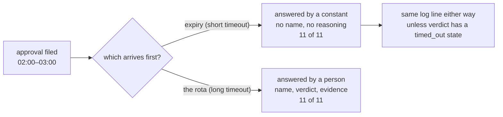

# 5.2 — The answer nobody gave

## One-line answer

A timeout shorter than the gap between filing an approval and reading it makes the timeout the
decider, and Sutra's overnight batch is exactly that shape: **11 of 11** approvals answered by a
constant, and every one of them leaving the same log line a human decision would leave.

## The story

The outpatient department calls your number and you are not in the chair.

You had gone to find water, or the queue had not moved in an hour and you stepped outside, or the
display was showing a number four ahead of the one being called. The nurse calls twice, waits, and
calls the next number. When you come back your slip is still valid and your turn is gone, and the
board has moved on by six.

Nobody decided that you should be seen later. The rule decided, and the rule is a perfectly
reasonable one — a clinic that waits indefinitely for each absent patient stops working by eleven in
the morning. The rule was written for the patient who has left, and it is applied to the patient who
stepped out for two minutes, and the department cannot tell those apart because the only thing it
observes is the empty chair.

What makes it feel unfair is not the rule. It is that afterwards there is no record of a decision
having been made at all. The register says you were called. It does not say that the thing which
answered for you was a stopwatch.

## The idea in plain language

Every pending approval needs a **timeout**: a point after which the system stops waiting and does
whatever [5.1](5.1-fail-closed-or-fail-open.md)'s default says. Without one, a pending item is a leak
— it sits there for ever, holding a run, and nothing ever resolves it.

So a timeout is necessary. The problem is what it silently becomes.

When the timeout is **shorter than the time it actually takes a human to arrive**, the timeout is not
a safety net for the unusual case. It is the normal path. Every approval expires before anybody looks
at it, the default fires every time, and the gate has become an expensive way of applying a constant.
The queue still exists. The screens still render. Nobody sees any of it.

Two things make this hard to notice, and both are worth naming:

- **A default answer is a decision nobody made.** It is not the absence of a decision — the action
  either happened or it did not, and something chose. But there is no person to ask, no reasoning to
  read, and no name on it. It has all the consequences of a decision and none of the accountability.
- **A timeout leaves the same trace whether it was right or wrong.** The action proceeded, or it did
  not; the log line looks like the log line. This is why
  [4.4](../04-what-the-approver-sees/4.4-the-four-facts-a-record-must-hold.md) insists that `verdict`
  has four states rather than two. Without a distinct `timed_out` value there is no query that can
  ask *"what fraction of our approvals were answered by a constant?"* — and that query is the only
  way this failure is ever discovered.

## Why Sutra needs it

The overnight batch is not an unusual case for Sutra. It is the design: the batch runs when the free
tier is uncontended, and the people are asleep. So the gap between filing an approval and a human
reading it is not an outage — it is the normal operating condition, every night.

That means Sutra is the exact system where a thoughtlessly chosen timeout replaces the entire
approval gate, and where nobody would notice, because a queue that is empty by morning looks like a
queue that was worked.

Day 64 will store a pending approval with an expiry. This part decides what that number has to be
compared against, and the answer is not "a sensible-sounding duration" — it is a measurement of when
the rota actually reads the queue.

## The mechanism

`timeout.py` files the night's eleven approvals and asks, for each, whether the human or the constant
answered it:

```bash
cd days/day-63-approval-gates-design/lab
uv run python timeout.py
```

**Line by line:**

- The batch files its approvals across the small hours, and the rota reads the queue in the morning.
  Both of those are facts about Sutra's schedule, not parameters chosen to make the point.
- For each approval the script prints when it was filed, when it expires, and which of the two
  arrived first — the rota or the expiry.
- The clock is a plain number of hours rather than a real timestamp, so the arithmetic is visible
  and there is no timezone in the way of the argument.

Measured on 2026-09-05:

```text
  batch files 11 approvals between 2:00 and 3:00
  rota reads them at 9.50
  timeout: 4 hours

  filed   expires  answered by
  ----------------------------------------------
   2.00     6.00  the timeout   ticket:4602 close_ticket
   2.10     6.10  the timeout   ticket:4606 close_ticket
   2.20     6.20  the timeout   ticket:4609 close_ticket
   2.30     6.30  the timeout   ticket:4611 close_ticket
   2.40     6.40  the timeout   ticket:4613 escalate_to_engineer
   2.50     6.50  the timeout   ticket:4615 close_ticket
   2.60     6.60  the timeout   ticket:4617 close_ticket
   2.70     6.70  the timeout   ticket:4621 close_ticket
   2.80     6.80  the timeout   ticket:4623 close_ticket
   2.90     6.90  the timeout   ticket:4625 escalate_to_engineer
   3.00     7.00  the timeout   ticket:4627 close_ticket

  answered by a human:   0
  answered by a constant: 11
```

Eleven out of eleven. The approval gate this day has spent five sections designing did not run once.

And look at what it cost to get here. Somebody chose a number that sounds careful — long enough that
a person on shift would comfortably answer, short enough that nothing hangs about. It is a reasonable
number in the abstract, and it is wrong here by a single fact that lives nowhere near it: the rota
starts in the morning, and the batch runs in the night.

Note which tickets are in that list. `ticket:4611` and `ticket:4623` are two of the wrong closes from
[4.2](../04-what-the-approver-sees/4.2-the-request-and-the-diff.md), the ones whose tells are a
customer who never replied and a bug still open. Both are `close_ticket`, which
[5.1](5.1-fail-closed-or-fail-open.md) established fails **closed** — so the timeout holds them and
the mistakes do not go out. That is the good case, and it is worth being precise about why it is
good: the wrong closes were stopped by the *default*, not by the gate. Nobody caught anything.
Eleven decisions were made by a number in a config file, and two of them happened to be right for
reasons no person supplied.

Now move the number past the rota:

```bash
uv run python timeout.py --hours 12
```

**Line by line:**

- `--hours 12` is the only change. Same batch, same filing times, same rota.
- The expiry column now lands after the rota arrives, so the `answered by` column flips wholesale.

```text
  batch files 11 approvals between 2:00 and 3:00
  rota reads them at 9.50
  timeout: 12 hours

  filed   expires  answered by
  ----------------------------------------------
   2.00    14.00  the rota   ticket:4602 close_ticket
   2.10    14.10  the rota   ticket:4606 close_ticket
   2.20    14.20  the rota   ticket:4609 close_ticket
   2.30    14.30  the rota   ticket:4611 close_ticket
   2.40    14.40  the rota   ticket:4613 escalate_to_engineer
   2.50    14.50  the rota   ticket:4615 close_ticket
   2.60    14.60  the rota   ticket:4617 close_ticket
   2.70    14.70  the rota   ticket:4621 close_ticket
   2.80    14.80  the rota   ticket:4623 close_ticket
   2.90    14.90  the rota   ticket:4625 escalate_to_engineer
   3.00    15.00  the rota   ticket:4627 close_ticket
```

Zero to eleven, from one constant. Nothing else in the system changed — not the policy, not the
screens, not the evidence, not the record shape. The entire value of five sections of design work was
sitting behind a number somebody typed once.



## When it breaks

The obvious repair — make the timeout long — breaks in its own way, and the honest version of this
part has to say how.

A long timeout means pending approvals live longer, and a pending approval is a **held run** holding
a checkpoint. The failure is not the waiting; Day 61 made waiting cheap. The failure is that the
evidence goes stale underneath it. The diff screen from
[4.2](../04-what-the-approver-sees/4.2-the-request-and-the-diff.md) said `linked_bug: 'BUG-221 open'`
at two in the morning, and by early afternoon the bug is closed and the close was correct after all.
The approver is now reading a photograph of a world that has moved.

So "long enough that a human answers" and "short enough that the evidence is still true" are two
constraints pulling in opposite directions, and when they cannot both be met the answer is not a
cleverer number. It is to **re-render the evidence at decision time** and let the human see it is
fresh — which is a real engineering cost and the reason this constraint deserves a design discussion
rather than a config value.

The break that costs the most, though, is the one that hides all of this: a timeout that leaves no
distinct record. If the approvals table has `approved: false` for both a rejection and an expiry, the
query that would have revealed eleven-out-of-eleven cannot be written. The failure is not that the
timeout is wrong; it is that the system has no way to report on itself.

## In production

**What a professional writes instead.** The timeout is derived from an observed number — when the
queue is actually worked — rather than chosen, and it is per action, because a page and a refund do
not deserve the same window. They emit a **distinct `timed_out` verdict** and put one number on a
dashboard: the fraction of approvals answered by expiry rather than by a person. That single ratio is
the health metric for an approval gate, and a gate without it can be entirely inert for months while
every other indicator looks normal.

**What degrades at scale.** Timeouts interact badly with backlogs. When the queue is long the rota
works it in order, so the *oldest* items are answered first and the newest sit closest to their
expiry — meaning that under load the approvals most likely to be decided by a constant are the most
recent ones, which is precisely backwards from what anybody would choose. A queue that is worked
in arrival order and expires in arrival order is fine; a queue worked in arrival order under load
quietly hands its newest decisions to the clock.

**The failure mode that only appears with real traffic.** Weekends, holidays and the day of the
incident. The timeout is tuned against ordinary mornings, and it is applied on the mornings when
nobody arrives — which are the mornings when the batch is most likely to have produced something
unusual. The same correlation [5.1](5.1-fail-closed-or-fail-open.md) named: absence is not random with
respect to the work.

**The review comment a senior engineer leaves:** *"What is this timeout compared against? Our batch
files at 02:00 and the rota reads at 09:50, so with this value every approval in the nightly run
expires before anybody sees it, and the gate is decorative. Either move the number past the rota or
tell me the gate is only for daytime runs. And emit a `timed_out` verdict — right now I cannot even
write the query that would have caught this."*

**The interview question:** *"How long do you wait for a human approval?"* An honest answer: *"Longer
than it takes our rota to actually read the queue, and I know that number because I measured it
rather than guessing. Our batch files approvals around two in the morning and the queue is worked
after nine, so the value we started with expired every single one of them — eleven out of eleven
answered by a constant, with the gate rendering screens nobody ever opened. What makes it dangerous
is that a timeout leaves the same trace as a decision, so the dashboard looked fine. I emit a
separate `timed_out` verdict now and watch the ratio of expiries to human answers, because that is
the only number that tells you the gate is alive. The tension I would flag is that a longer window
means the evidence on the screen goes stale, so past a point the answer stops being a bigger number
and starts being re-rendering the diff at decision time."*

## Check yourself

```bash
cd days/day-63-approval-gates-design/lab
uv run python timeout.py
uv run python timeout.py --hours 12
```

Now find the smallest `--hours` value for which at least one approval is answered by the rota, and
write it down. Then say what real-world fact that number is a measurement of.

**Out loud, without scrolling up:** explain why a timeout is a decision nobody made, and name the
single field in the approval record that makes the failure discoverable.

**Next:** [5.3 — The key with the neighbour](5.3-the-key-with-the-neighbour.md).
