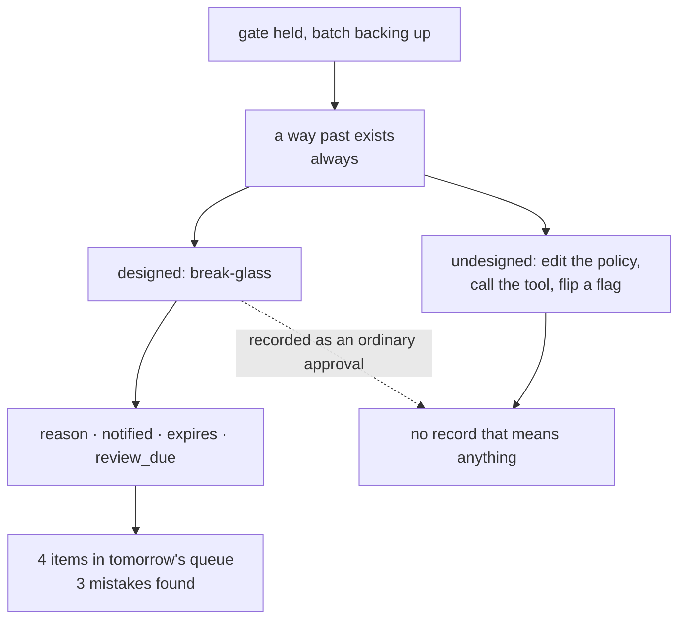

# 5.3 — The key with the neighbour

## One-line answer

Every gate needs a way past it, and the only thing separating a break-glass path from a hole is
whether using it is louder than not using it: the same four overrides recorded as break-glass events
create **4** review items, and recorded as ordinary approvals create **0** and make the operator look
diligent.

## The story

The spare key to your flat is with the neighbour across the landing.

This is not a weakness in your lock. It is the reason the lock is usable at all: the day you shut the
door with the keys inside, there is a way in that does not involve a locksmith at midnight. Everyone
who has ever locked themselves out understands why the key exists.

What makes the arrangement safe is not the key. It is that using it involves ringing a doorbell,
being seen, and having a short conversation about why. You cannot take the spare key quietly. The
neighbour knows you took it, knows roughly when, and will mention it to your mother on Sunday.

Now imagine the same key under the mat instead. The same access, the same convenience, the same
reasonable purpose. Nobody ever knows it was used, and by the second month you have stopped even
noticing that you are using it, because it is simply how you get in when your bag is full.

Same key. The difference between a safety measure and a hole is entirely in whether using it is
visible.

## The idea in plain language

**Break-glass** is a path that lets somebody perform a gated action without the normal approval. The
name comes from the little glass panel over an emergency lever: you can always get through it, and
you cannot get through it quietly.

Every real gate has one, whether or not anybody designed it. If it was not designed, it is a database
update, a feature flag, a config change, or somebody running the tool by hand — and those all work
and none of them leave a record that means anything.

The design question is therefore never *"should there be a way past the gate?"* There is one. The
question is what using it costs, and the answer has four parts, each of which turns the key on the
mat back into the key with the neighbour:

- **A reason**, typed by the person, at the moment. Not a category from a dropdown — a sentence. An
  override with no reason is indistinguishable from a habit.
- **A notification** to somebody who did not authorise it, immediately. This is the doorbell. The
  whole mechanism rests on it: a record nobody reads at the time is an archive, not a control.
- **A scope**, and specifically a narrow one. The override covers *this action*, not this operator,
  not this shift, not this week. An override that grants a mode is a policy change performed by
  whoever is on duty.
- **A review**, scheduled, that creates work for somebody the next day. This is the conversation on
  Sunday, and it is what makes a fifth override in a month get noticed as a pattern rather than as
  four separate reasonable nights.

The last one matters most and is skipped most, because it is the only one that costs somebody else
time.

## Why Sutra needs it

[5.1](5.1-fail-closed-or-fail-open.md) established that three of Sutra's four gated actions fail
closed, and [5.2](5.2-the-answer-nobody-gave.md) established that the overnight batch will routinely
have nobody to ask. Put those together and you get a predictable night: the batch backs up behind
held approvals, somebody notices in the small hours, and they need a way to release it.

That night will happen. If there is no designed path, the person on shift will find an undesigned one
— and Sutra's policy is a Python dict, which means the undesigned path is editing `_policy.py`, or
calling the tool directly, or setting a verdict at a call site, which is the exact thing
[3.2](../03-the-policy-table/3.2-the-table-and-the-argument.md)'s single-door rule exists to prevent.

Day 64 builds the gate. It has to build this too, or the first hard night will build it instead.

## The mechanism

`breakglass.py` records four overrides on one night, first as break-glass events and then as ordinary
approvals:

```bash
cd days/day-63-approval-gates-design/lab
uv run python breakglass.py
```

**Line by line:**

- Each override carries the four fields above — reason, notified, expires, review_due — and the
  script prints them as they would be stored, so what is being argued for is a record shape rather
  than a policy sentence.
- `expires: this action only` is printed on every row deliberately. It is the field people most often
  widen, and seeing it repeated four times makes the alternative obvious.
- The tail counts the review queue, because that number is the only output of this mechanism that
  another person has to act on.

Measured on 2026-09-05:

```text
  four gate overrides on one night, recorded as break-glass events

  02:14  BREAK-GLASS by ops-1: close_ticket ticket:4611
           reason: rota unreachable, batch backing up
           notified: on-call lead, immediately
           expires: this action only
           review_due: next working day
  02:31  BREAK-GLASS by ops-1: close_ticket ticket:4623
           reason: same
           notified: on-call lead, immediately
           expires: this action only
           review_due: next working day
  02:44  BREAK-GLASS by ops-1: close_ticket ticket:4627
           reason: same
           notified: on-call lead, immediately
           expires: this action only
           review_due: next working day
  02:58  BREAK-GLASS by ops-1: escalate_to_engineer ticket:4625
           reason: same
           notified: on-call lead, immediately
           expires: this action only
           review_due: next working day

  Four overrides is not a problem. Four overrides that nobody reviews is a
  policy that has quietly been replaced by whoever is on shift.

  review queue for the next working day: 4 item(s)
```

Read the second, third and fourth rows: `reason: same`.

That is not the script being lazy. It is the mechanism working, and it is the most useful thing in
the output. The first override had a real reason typed at 02:14. By 02:31 the operator is dealing
with the same situation and writes *same*, and by 02:58 it is muscle memory. **A reason that becomes
"same" is a signal**, and it is a much better one than any individual reason, because it says the
override has stopped being a judgement and become a workflow.

Now note *which* tickets these are. `ticket:4611`, `ticket:4623` and `ticket:4627` are the three wrong
closes from [4.2](../04-what-the-approver-sees/4.2-the-request-and-the-diff.md). The break-glass path
released all three. This is the honest half of the part: **break-glass does not make the outcome
safe.** Three wrong closes went out. What it makes is the outcome *findable* — there are four items in
a review queue tomorrow morning, each naming an action and a ticket, and the person who looks at them
will find three mistakes.

Now the same four overrides recorded as ordinary approvals:

```bash
uv run python breakglass.py --quiet
```

**Line by line:**

- `--quiet` changes nothing about what happened. The same operator overrides the same four gates at
  the same times.
- The only difference is the record, which now has the shape of a normal approval — an operator name
  and an action.

```text
  four gate overrides on one night, recorded as ordinary approvals

  02:14  approval by ops-1: close_ticket ticket:4611
  02:31  approval by ops-1: close_ticket ticket:4623
  02:44  approval by ops-1: close_ticket ticket:4627
  02:58  approval by ops-1: escalate_to_engineer ticket:4625

  In the approvals table these four rows are identical in shape to the
  eleven the rota answered. A month later, counting approvals by operator
  shows ops-1 as a diligent reviewer. Nothing in the record is false and
  nothing in the record is the truth either.

  missing from every row:
    reason       an override with no reason is indistinguishable from a habit
    notified     somebody who did not authorise it learns that it happened, tonight
    expires      the override covers this action, not this operator, not this week
    review_due   a use of the break-glass path creates work for somebody the next day
```

Four rows, all true, and the review queue is empty.

The sentence to sit with is the one about the monthly count. Somebody pulls approvals-by-operator to
see who is carrying the load, and `ops-1` appears as a conscientious reviewer with fifteen approvals.
Every row is accurate. The metric is measuring the opposite of what it is being read as, and there is
no field anywhere that would let a reader tell.



## When it breaks

Break-glass breaks by widening, and the widening is always an efficiency argument.

`expires: this action only` means four overrides need four uses of the path, and four notifications,
and four review items. Somebody will point out that this is silly when the situation is obviously one
situation, and propose an override that covers the operator for the shift. That is a completely
reasonable request and it converts the mechanism into its opposite: one notification, one review item,
and an unbounded number of unreviewed actions inside a window nobody is watching.

The second break is notification fatigue, which is
[2.4](../02-sorting-the-actions/2.4-defeated-by-its-own-volume.md)'s failure arriving on a different
channel. If the on-call lead is notified for every override and overrides are common, the
notification becomes noise and the doorbell stops ringing even though the code still sends it. The
defence is the same as this whole day's defence: overrides must be rare, and if they are not rare the
answer is to fix whatever makes them necessary, not to quieten the alert.

The third break is the one that actually happens most: **the review queue has no owner.** `review_due:
next working day` is a field in a record. If no person's morning includes working that queue, the
field is a promise the system cannot keep, and it is worse than absent because it looks like a
control. A review queue with no name attached to it is a to-do list nobody has.

## In production

**What a professional writes instead.** The break-glass path is a **different code path with a
different verdict value**, not a flag on the ordinary one — so it can never be mistaken for an
approval by a query, a dashboard, or a person counting rows. The notification goes to somebody who
cannot themselves use the path, which is
[4.3](../04-what-the-approver-sees/4.3-separation-of-duty.md)'s independence applied to the override
rather than to the action. And the review queue is owned: a named rota, with the items appearing in
the same place that person already looks.

**What degrades at scale.** Overrides scale with incidents, and incidents cluster. The month with one
override is fine; the month with forty has forty review items arriving in the same week that
everybody is busy with the thing that caused them. That is exactly when the review gets deferred, and
a deferred review of an override is functionally an unreviewed override. The production answer is to
alert on the **rate** rather than the event: five in a week is a different fact from five in a year,
and only the rate can say which one you have.

**The failure mode that only appears with real traffic.** The path gets used for its designed purpose
first, and then for a purpose that resembles it. *"Rota unreachable"* becomes *"rota is slow"*, which
becomes *"this one is obviously fine"*. Nothing in the record objects, because the reason field is
free text and every one of those is a true sentence. The only instrument that catches the drift is a
human reading a month of reasons in one sitting, which is why the review queue is the part of the
mechanism that must not be optional.

**The review comment a senior engineer leaves:** *"This override writes an ordinary approval row with
the operator's name. That means our approvals table cannot distinguish 'a person reviewed this' from
'a person bypassed the gate', and the first time anybody counts approvals per operator they will draw
exactly the wrong conclusion. Separate verdict value, mandatory free-text reason, notify the on-call
lead rather than the person who used it, and tell me whose morning includes the review queue —
`review_due` is not a control until it is somebody's job."*

**The interview question:** *"How does someone get past your approval gate at 3am?"* An honest answer:
*"Through a break-glass path we built on purpose, because if we had not built one they would have
edited the policy module or called the tool directly and left no trace at all. Using it costs four
things: a typed reason, an immediate notification to the on-call lead, a scope of exactly one action,
and a review item for the next working day. It does not make the outcome safe — the night I look at,
the path released three wrong ticket closes — it makes the outcome findable, and there were four items
in the morning queue that led straight to them. The detail I would defend hardest is that it writes a
different verdict from an ordinary approval. Recorded the other way, those four rows are
indistinguishable from real reviews, and the operator shows up in the monthly count as our most
diligent approver."*

## Check yourself

```bash
cd days/day-63-approval-gates-design/lab
uv run python breakglass.py
uv run python breakglass.py --quiet
```

Now look at the three `close_ticket` overrides and check their ticket numbers against the wrong
closes in [4.2](../04-what-the-approver-sees/4.2-the-request-and-the-diff.md). Write down what the
break-glass path did and did not prevent.

**Out loud, without scrolling up:** name the four things that make an override a path rather than a
hole, and say which one is most often skipped and why.

**Next:** [6.1 — The road the gate is not on](../06-gates-that-are-decoration/6.1-the-road-the-gate-is-not-on.md).
