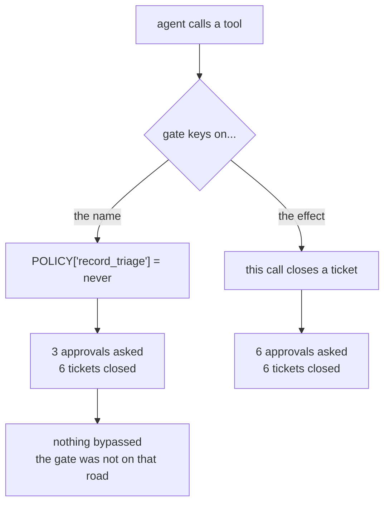

# 6.1 — The road the gate is not on

## One-line answer

A gate keyed on the **name** of an action does not protect the **effect** of that action, so when a
second path to the same effect appears, six tickets get closed and only three approvals are asked
for — with nothing bypassed, nothing failing, and no error anywhere.

## The story

The toll booth on the highway works exactly as designed. Every vehicle stops, pays, and goes on.
Nobody has ever got through it without paying.

There is a village road that leaves the highway a kilometre before the booth, runs behind the fields,
and rejoins it a kilometre after. It was there long before the booth. It is not a secret and it is not
a hole in a fence; it is a road, and it goes where it goes.

At first only tractors use it, because it is slow and unpaved. Then somebody in a car tries it. Then
the shopkeeper at the junction starts telling people. Nobody involved has done anything wrong, the
booth has not failed, and the barrier still goes up and down correctly for every vehicle that arrives
at it. Fewer and fewer vehicles arrive at it.

The booth was placed where the traffic was. The traffic moved.

## The idea in plain language

A policy table has one row per **action name**. `close_ticket` is gated; `record_triage` is not. The
gate looks up the name, finds the row, and does what it says. Every part of that is correct and every
part of it is about names.

The thing the policy is actually trying to protect is not a name. It is an **effect**: a customer's
ticket moving to `closed`. A name is a convenient handle on an effect, and the two agree right up
until the moment a second name acquires the same effect.

That moment is not sabotage and it does not look like a security event. It looks like this: somebody
adds a `status` field to `record_triage`, because triage notes were already saying *"this is a
duplicate, closing"* in their text and it was silly to make the agent call two tools. The change is
reasonable, small, tested, and reviewed. It also creates a second road to a gated effect, and nothing
in the policy file knows the effect has moved, because the policy file is a dictionary of names.

This is different from [3.4](../03-the-policy-table/3.4-the-tuesday-a-tool-arrives.md)'s Tuesday, and
the difference is worth being precise about:

| | A new tool arrives | An existing tool gains a new effect |
| --- | --- | --- |
| What the policy sees | a name it has never seen | a name it has a row for |
| What the default does | fires — `always`, fail-closed | nothing; the row already says `never` |
| How it is noticed | friction: somebody asks what this is | nobody notices |

The fail-closed default from [3.4](../03-the-policy-table/3.4-the-tuesday-a-tool-arrives.md) is the
best mechanism this day has, and it does not fire here at all. The name is known. The row is correct
for the action as it was when the row was written.

## Why Sutra needs it

`record_triage` is Sutra's highest-volume write and
[3.3](../03-the-policy-table/3.3-the-rows-that-are-not-gated.md) argued at length for leaving it
ungated. That argument was correct **for an action that writes an internal note**, and every word of
its `because` is about internal notes: overwritable, read by us within the hour, correctable
ourselves.

Nothing in the policy re-reads that sentence when the tool changes. The row will still say `never`,
its reason will still be about notes, and the tool will be closing tickets. This part exists so that
Day 64 builds the check that notices, and so that Day 65's gate audit has something specific to test
rather than a general hope that nobody did anything odd.

## The mechanism

`around.py` runs one night of calls through two gates: one keyed on the action name, one keyed on the
effect the call actually produces.

```bash
cd days/day-63-approval-gates-design/lab
uv run python around.py
```

**Line by line:**

- Each row is one call the agent made. The `effect` column is what the call actually does to the
  world, computed from the call rather than from its name — `record_triage` with a `status` field
  closes a ticket, and the column says so.
- `by name` asks the policy table for the tool's row, which is the gate Sutra has today.
- `by effect` asks whether the *effect* is one that requires approval, which is the gate this part
  argues for. The two columns are the entire experiment.

Measured on 2026-09-05:

```text
  call                                          effect                 by name  by effect
  --------------------------------------------------------------------------------------------
  close_ticket(ticket_id='4602')                ticket 4602 -> closed  ASK      ASK
  close_ticket(ticket_id='4606')                ticket 4606 -> closed  ASK      ASK
  record_triage(ticket_id='4612', note='dup...  note written           -        -
  record_triage(ticket_id='4614', note='dup...  ticket 4614 -> closed  -        ASK
  record_triage(ticket_id='4620', note='sta...  ticket 4620 -> closed  -        ASK
  close_ticket(ticket_id='4609')                ticket 4609 -> closed  ASK      ASK
  record_triage(ticket_id='4622', note='no ...  ticket 4622 -> closed  -        ASK
  record_triage(ticket_id='4624', note='han...  note written           -        -

  tickets actually closed:        6
  approvals asked, keyed on name:  3
  approvals asked, keyed on effect:6
```

Six tickets closed. Three approvals.

Every single thing in this system behaved correctly. `close_ticket` was gated and asked three times.
`record_triage` was ungated and did not ask, exactly as
[3.3](../03-the-policy-table/3.3-the-rows-that-are-not-gated.md) decided it should. The policy file
was not edited. No default was hit. No exception was raised, no warning logged, and the approvals
dashboard shows three approvals for a night with three `close_ticket` calls, which is precisely
correct and completely misleading.

Look at the third row and the fourth row, which are the whole part:

```text
  record_triage(ticket_id='4612', note='dup...  note written           -        -
  record_triage(ticket_id='4614', note='dup...  ticket 4614 -> closed  -        ASK
```

Same tool. Same arguments in shape. One writes a note and one closes a customer's ticket, and the
difference is a field in the payload. A policy that keys on the tool name has no vocabulary for that
distinction; the two calls are the same row.

The `by effect` column is not free, and this part is not going to pretend the fix is a one-liner.
Computing the effect of a call before making it means the policy needs a model of what each tool does
with each argument shape — which is more code, more to keep in step, and one more thing that can be
wrong. What the column proves is that the *information* was available. The gate did not lack data; it
was asking the wrong question of it.



## When it breaks

The obvious repair is to gate `record_triage` as well, and it is worth walking through why that is
not the lesson, because it is the fix everybody reaches for first.

Gating `record_triage` puts twenty-seven items into an eleven-item queue.
[3.3](../03-the-policy-table/3.3-the-rows-that-are-not-gated.md) already priced this: it costs
twenty-seven approvals a night to catch two internal-note mistakes, and it pushes the customer-visible
items past the point where anybody reads them. So the repair that closes this road makes the gate
worse overall. That is not an argument for leaving it; it is an argument that the unit of policy is
wrong.

The genuine repair is that **the effect is what gets classified**, and it costs something real: the
gate must be able to answer *what will this call do* before the call runs, which is the same capability
[4.2](../04-what-the-approver-sees/4.2-the-request-and-the-diff.md) needed to render a diff. If you
have built the diff, you have most of the effect model already, and this is the argument for building
it.

The break in the effect-keyed version is that the effect model drifts from the tools. It is a second
description of what each tool does, maintained by hand, and the day it disagrees with the code you
have a gate that is confidently wrong instead of quietly absent — which is worse, because it looks
like it is working.

There is also a way this goes wrong that no gate can catch, and it should be said plainly: an effect
can be reached by a **sequence** of individually harmless calls. Nothing in a per-call policy, keyed
on names or on effects, sees a sequence. That is a real limit of this whole design and it is where
Day 66's threat modelling picks the problem up.

## In production

**What a professional writes instead.** The gate sits at the **effect boundary** rather than at the
tool boundary — in the one function that writes ticket status, not in the ten tools that might want
to. That is the same argument Day 40 made about
[having one door for tool policy](../../../day-40-filtering-and-allowlists/parts/04-the-policy-module/4.1-one-door-and-a-check-there-is-one.md),
moved one layer down: if the check is at the door, every road leads through it, and a new tool cannot
create a new road because there is only one way to reach the effect.

**What degrades at scale.** Roads multiply faster than policies. Every new tool, every new argument on
an existing tool, every integration is a candidate path to an existing effect, and the policy is
reviewed when somebody remembers. At ten tools a person can hold the mapping in their head. At a
hundred, the mapping is only true if something computes it, which means the effect model has to be
derived from the code rather than written beside it.

**The failure mode that only appears with real traffic.** The second road opens gradually. On the
first day, `record_triage` with a `status` field is used once, by the person who added it, for a case
they had in mind. The agent picks it up because it is in the tool schema and it is cheaper than two
calls. Within a fortnight it is the ordinary way duplicates get closed, and the approvals count has
been drifting down the whole time — which reads, on a dashboard, as the agent getting better.

**The review comment a senior engineer leaves:** *"This PR adds a `status` field to `record_triage`.
That tool's policy row says `never`, and its reason is a paragraph about internal notes being
correctable. With this field it can close a customer ticket, so the row's reason is now false and
nothing will tell us. Either put the gate on the status write itself, or the policy row and its
`because` change in this PR."*

**The interview question:** *"Someone adds a field to an existing tool. Does your approval policy
still hold?"* An honest answer: *"Not automatically, and that is the failure I would look for first
in anybody's design, including mine. Our policy keys on tool names, and I have a night where six
tickets were closed and three approvals were asked for — because a note-writing tool had grown a
status field. Nothing was bypassed. No default fired, because the name was known and its row said
'never'. The unclassified-tool default that saves us on a new tool is exactly the thing that cannot
save us here. The real answer is to put the check on the effect — on the one function that writes
ticket status — so there is a single door regardless of which tool wants through it. The honest cost
is that you then need to know what a call will do before you run it, which is the same machinery the
approval diff needs, so I would build them together. And I would still say out loud that a per-call
gate cannot see an effect assembled from a sequence of harmless calls."*

## Check yourself

```bash
cd days/day-63-approval-gates-design/lab
uv run python around.py
```

Now count, by hand from the printed rows, how many `record_triage` calls closed a ticket and how many
wrote a note. Then say what single field in the call decided which, and where a gate would have to
sit to see it.

**Out loud, without scrolling up:** explain the difference between a gate that is bypassed and a gate
that is not on the road, and say which one raises an error.

**Next:** [6.2 — The field the agent writes](6.2-the-field-the-agent-writes.md).
