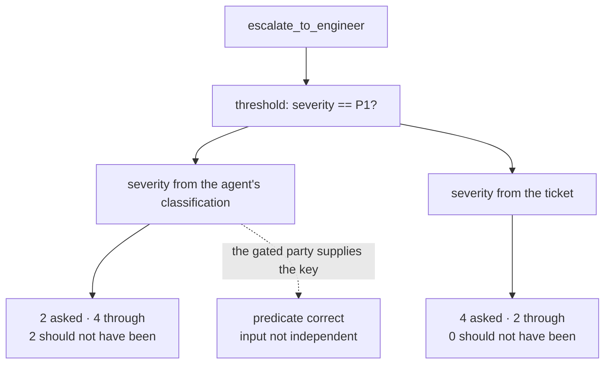

# 6.2 — The field the agent writes

## One-line answer

A threshold is only as independent as the value it reads, and Sutra's reads `severity` from the
agent's own classification: **2** pages went out that should have been asked about, and reading
severity from the ticket instead takes that to **0** with nothing else changed.

## The story

The bank has a priority counter. The sign lists who may use it: senior citizens, people with
disabilities, and emergencies.

The first two are checkable. The third is not, and it is not meant to be — the whole point of the
category is that nobody can anticipate what an emergency looks like, so the customer declares it.
Somebody says *my mother is in hospital and I need this today*, and the guard waves them through,
because interrogating that sentence would be worse than occasionally being wrong about it.

Most people never use it. Some people are having genuine emergencies. And some people are in a hurry
and have noticed that the word works, and they are not lying exactly — it *is* urgent, to them, and
the definition was never written down anywhere.

The counter is not being abused. It is doing precisely what it says. The category it depends on is
supplied by the person it is deciding about, and the guard has no second source for it.

## The idea in plain language

A **threshold** is the middle verdict in the policy table from
[3.2](../03-the-policy-table/3.2-the-table-and-the-argument.md): not *always ask*, not *never ask*,
but *a stated predicate decides*. Sutra has exactly one:
`escalate_to_engineer` proceeds without asking when the severity is P1, and asks otherwise.

The reasoning behind it is sound and it was argued in
[5.1](../05-when-nobody-answers/5.1-fail-closed-or-fail-open.md): at P1 the delay of asking is the
larger harm, because an outage running unattended costs more than a colleague woken unnecessarily.
The predicate is correct. The rule is defensible. A reviewer reading `threshold_allows` would approve
it.

The problem is one layer below the predicate: **where does `severity` come from?**

It comes from the triage agent's classification stage. So the gate on the agent's paging asks the
agent how urgent the agent's page is, and proceeds if the agent says *very*. The gate is reading a
field written by the party being gated.

This is not an attack and it is important to say so clearly. Nothing here is adversarial. The agent's
job includes assigning a severity; it does that job honestly; and severity happens also to be the key
to a door. The failure is entirely structural, and it survives the agent being completely
well-intentioned — which is what makes it different from anything Day 66 will cover.

One term, defined once. **Independent evidence** is a value that did not originate with the party the
decision is about. [4.3](../04-what-the-approver-sees/4.3-separation-of-duty.md) applied this to
approvers reading the agent's summary; a threshold predicate is the same idea reduced to a single
field, and it is easier to miss because a field does not look like an opinion.

## Why Sutra needs it

Sutra has exactly one threshold and this is it, so the entire question of whether the middle verdict
is trustworthy rests on this one row.

It also matters because the threshold is the row
[3.2](../03-the-policy-table/3.2-the-table-and-the-argument.md) flagged as the single place where the
written decision overrules the arithmetic. That row is the one a person thought hardest about. It is
worth knowing that the row somebody thought hardest about is the one with the structural hole,
because the hole is not in the reasoning — it is in the input.

Day 64 implements `threshold_allows`. This part decides what it is allowed to read.

## The mechanism

`talkpast.py` runs six escalations, comparing the severity the agent claimed against the severity the
ticket supports:

```bash
cd days/day-63-approval-gates-design/lab
uv run python talkpast.py
```

**Line by line:**

- `claimed` is the agent's classification, which is what the threshold currently reads. `actual` is
  the severity the ticket's own contents support, written down in advance as ground truth.
- `asked?` shows whether the gate stopped to ask a human. A blank means the threshold let it through.
- The last column is the ticket text, so a reader can judge the two severity values rather than
  being told which is right.

Measured on 2026-09-05:

```text
  threshold: proceed without asking when severity == P1
  severity read from: the agent's classification

  ticket        claimed  actual  asked?  what the ticket says
  ------------------------------------------------------------------------------------
  ticket:4604   P1       P1      -       checkout down for all users
  ticket:4613   P2       P2      ASK     one account cannot upload
  ticket:4619   P1       P1      -       payments failing since 02:10
  ticket:4625   P3       P3      ASK     slow report export
  ticket:4631   P1       P3      -       customer says it is urgent; one user, cosmetic
  ticket:4632   P1       P2      -       intermittent for one team since last week

  approvals asked:              2
  proceeded without asking:     4
  proceeded that should not have: 2
```

Two pages went out that should have been asked about, and they are the last two rows.

Read what those tickets actually say. `ticket:4631` is *"customer says it is urgent; one user,
cosmetic"* — and the agent classified it P1. That is not a wild misjudgement; a customer said the
word urgent, and a classifier that weights customer language will pick it up. `ticket:4632` is
*"intermittent for one team since last week"*, classified P1, which is defensible right up until you
notice that a week-old intermittent problem is by definition not the thing that needs waking somebody
at three in the morning.

Both are ordinary classification errors of exactly the kind Day 58 measured on the classify stage.
What makes them different from an ordinary classification error is that this one **spends the
approval gate**. A wrong severity on a ticket that gets approved anyway costs a mislabelled ticket. A
wrong severity here costs a page that nobody was asked about.

Now change the source of the field and nothing else:

```bash
uv run python talkpast.py --independent
```

**Line by line:**

- `--independent` reads the severity from the ticket instead of from the agent's classification. The
  predicate, the threshold value, the tickets and the agent's claims are all identical.
- Nothing about the gate's logic changes. `severity == "P1"` is still the rule.

```text
  threshold: proceed without asking when severity == P1
  severity read from: the ticket

  ticket        claimed  actual  asked?  what the ticket says
  ------------------------------------------------------------------------------------
  ticket:4604   P1       P1      -       checkout down for all users
  ticket:4613   P2       P2      ASK     one account cannot upload
  ticket:4619   P1       P1      -       payments failing since 02:10
  ticket:4625   P3       P3      ASK     slow report export
  ticket:4631   P1       P3      ASK     customer says it is urgent; one user, cosmetic
  ticket:4632   P1       P2      ASK     intermittent for one team since last week

  approvals asked:              4
  proceeded without asking:     2
  proceeded that should not have: 0
```

Two to four approvals, and two wrong pages to zero. The gate did not get stricter — the two genuine
P1s still go straight through, which is the whole reason the threshold exists. What changed is that
the key to the door is no longer held by the thing being let through.

The cost is honest and small here: two extra approvals a night. It will not always be small, and
where it is not, the trade is the same one section 2 kept making.



## When it breaks

The repair has a cost that is easy to underestimate, and it is not the two extra approvals.

Reading severity "from the ticket" means somebody or something has to determine severity from the
ticket *outside* the agent — and in a real system that is either a human triage step, which is the
work the agent was built to remove, or a second classifier, which is another model with its own
errors. The second classifier is the tempting option and it is worth being precise about what it
buys: it is independent of *this* agent's reasoning, which genuinely helps, but two classifiers
trained on similar data make correlated mistakes, so the independence is partial rather than clean.
That is still better than none. It is not the same as none, and a design that claims full
independence from a second model is overclaiming.

The cheapest real improvement is often neither: **read a field the agent cannot write.** In Sutra's
case, the number of affected accounts, whether the linked bug is open, whether the error came from a
payment path — these are facts in the system rather than judgements about it, and a threshold built
on them cannot be talked past by a classification. It is a narrower predicate and it is a sturdier
one.

The other break is subtler. Once severity is known to be load-bearing for a gate, it stops being a
neutral classification. Everything downstream — dashboards, routing, metrics — is now reading a field
that has an incentive attached to it, and any future change to how severity is assigned is silently
also a change to the approval policy. A field that gates something should be marked as such where it
is defined, or somebody will tune it for a completely unrelated reason.

## In production

**What a professional writes instead.** The predicate reads from a source the agent does not write,
and the policy row says which source, explicitly, as part of the rule rather than as a comment. Where
that is impossible, the threshold is **inverted**: instead of *proceed when the agent says it is
urgent*, the rule becomes *proceed when an independent fact holds* — the alert is firing, the error
rate is above a line, the linked incident exists. A self-declared value can lower the bar for asking;
it should not be allowed to raise the bar for acting.

**What degrades at scale.** Thresholds accumulate, and each new one is a new field with a new source
that somebody has to check the provenance of. With one threshold you can hold this in your head. With
twenty, the question *"who writes this field?"* is a code-reading exercise nobody performs, and the
answer changes over time without anybody deciding it has. The production discipline is that a policy
row naming a field also names its writer, and a check fails if the writer changes.

**The failure mode that only appears with real traffic.** Classification errors are not uniformly
distributed. A classifier over-calls severity exactly where the language is emphatic, and customers
are emphatic when they are frustrated — which correlates with tickets that have been open a while,
which correlates with tickets where somebody has already been paged once. So the pages that slip
through the threshold cluster on the accounts that have already had attention, and the on-call rota
experiences it as *"we keep getting woken for that customer"* rather than as a gate problem.

**The review comment a senior engineer leaves:** *"The threshold reads `severity` and severity is set
by the classify node. That means the agent decides whether the agent needs permission. The predicate
is fine; change the input. If we cannot get severity from outside the agent, gate on something the
agent does not write — affected account count, or whether the linked incident is open — and say in
the policy row which field it is and who writes it."*

**The interview question:** *"You have a rule that lets some actions skip approval. What could go
wrong with the rule itself?"* An honest answer: *"That the value it reads is written by the thing it
is gating. Ours proceeds without asking when severity is P1, which is right — holding a P1 page is
worse than sending it — but severity came from our own classification stage. Over six escalations,
two went out that should have been asked about, and both were ordinary classification errors: a
customer using the word urgent about a cosmetic issue, and a week-old intermittent problem. Nothing
adversarial, and that is the point — the agent was doing its job honestly and its job happened to
include holding the key. Reading severity from the ticket instead took the wrong pages to zero and
cost two extra approvals a night, and the genuine P1s still went straight through. What I would push
for beyond that is gating on a fact rather than a judgement, like whether the linked incident is
open, because a second classifier is only partially independent of the first."*

## Check yourself

```bash
cd days/day-63-approval-gates-design/lab
uv run python talkpast.py
uv run python talkpast.py --independent
```

Now take `ticket:4631` and write down, in one sentence each, why the agent's P1 is a reasonable
mistake and why the gate should not have accepted it. Then name a field in Sutra the agent does not
write that could have decided the same case.

**Out loud, without scrolling up:** explain why a correct predicate can still be a broken gate, and
say what has to be true about a threshold's input.

**Next:** [6.3 — Ask until somebody says yes](6.3-ask-until-somebody-says-yes.md).
