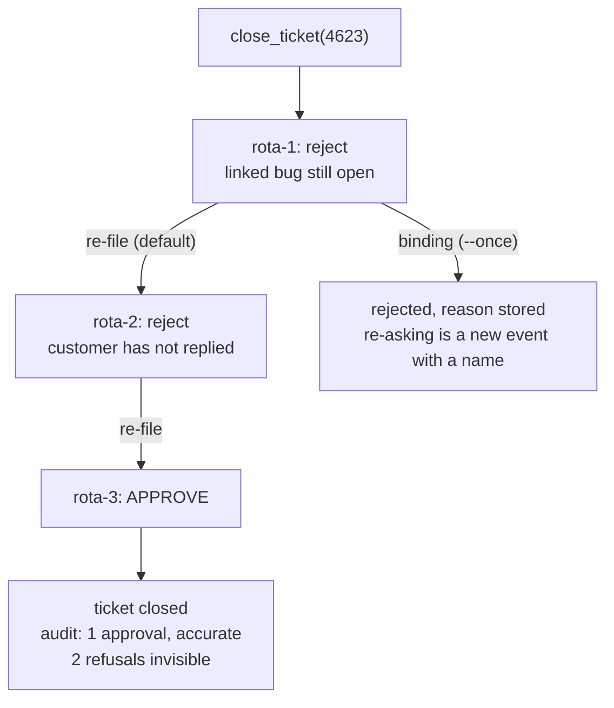

# 6.3 — Ask until somebody says yes

## One-line answer

A rejection that only ends one attempt is a delay, not a decision: re-filing after a refusal closed a
ticket that **two** approvers had refused, and the audit trail records one approval, accurately, and
nothing about the two refusals.

## The story

A child wants to go to the fair on a school night.

She asks her mother, who says no, there is a test on Thursday. She does not argue. She goes and asks
her father, who is watching something and says no, ask your mother. She does not mention that she
already has.

Then she asks her grandmother, who says *of course, go, you are young once* — and she goes to the
fair, holding a permission that is completely genuine. Nobody was deceived. Every one of the three
adults answered honestly and independently, and two of them said no.

If any one of them had known about the other two answers, the third would have been different. The
grandmother is not a soft touch; she is the only one who was asked without context. What decided the
evening was not anybody's judgement. It was the order the questions were asked in and the fact that
the answers did not travel.

## The idea in plain language

An approval is a question with two possible answers, and most systems build only one of them.

The **approve** path gets built because it has a next step: the run continues, the action fires, there
is code to write. The **reject** path returns early. It stops the run, and stopping is the absence of
work, so it tends to be one line and no thought.

That asymmetry produces a specific bug: nobody decides what a rejection *means*, and the default
meaning turns out to be *not this time*. If the run can re-file the same request — because it retried,
because a resume re-executed the stage, because a supervisor loop noticed the action had not happened
yet — then the question goes back into the queue and a different person answers it.

At that point the gate's answer is no longer the verdict of a reviewer. It is the verdict of
**whichever reviewer happens to be most tired**, and a system that can ask repeatedly will find them.
This does not require anybody to be adversarial and it does not require a bug: an agent that
retries is doing what it was built to do, and a queue with three people on it will eventually route a
resubmission to the third.

Two terms:

- **Approver shopping** is the pattern above: the same request answered by different parties until one
  of them approves. The name comes from the human version, and the mechanism is identical.
- A **binding rejection** is a refusal that ends the question rather than the attempt. Re-asking it
  requires a new, deliberate act by a person — which is a different event, with a name on it and a
  reason.

## Why Sutra needs it

Sutra resumes. Day 60 established at-least-once execution and Day 61 established that a run picks up
from a checkpoint, and both of those are why the desk survives a crash.

They are also exactly the mechanism that re-files a request. A run that was rejected, checkpointed and
resumed will reach the approval step again, and if the store holds no memory of the refusal, the
resumed run files a fresh pending item that looks new to everybody who sees it. So Sutra does not
need a malicious agent to reach this failure. It needs a restart.

Day 64 stores pending approvals. Whether a rejection is a row that persists, or an early return that
leaves nothing behind, is a decision it makes in a few lines — and this part is where the argument for
one of them lives.

## The mechanism

`shopping.py` takes one request that has already been refused and re-files it:

```bash
cd days/day-63-approval-gates-design/lab
uv run python shopping.py
```

**Line by line:**

- The request is `close_ticket(ticket_id='4623')` — one of the batch's known-wrong closes, the one
  whose linked bug is still open.
- Each attempt goes to the next approver on the rota. The reviewers are scripted, so the outcome is
  deterministic, and their reasons are printed so you can see that the refusals are substantive rather
  than arbitrary.
- The default policy on rejection is `re-file to the next approver`, which is not a policy anybody
  writes down. It is what you get when the reject path returns early and the run retries.

Measured on 2026-09-05:

```text
  request: close_ticket(ticket_id='4623')
  policy on rejection: re-file to the next approver

  attempt 1: rota-1   reject   the linked bug is still open
  attempt 2: rota-2   reject   customer has not replied
  attempt 3: rota-3   APPROVE  approved

  attempts: 3
  outcome:  approved

  2 people said no and the ticket was closed anyway.
  The audit trail records one approval by rota-3 and is entirely accurate.
  It does not record that the question had been answered twice already,
  because from the store's point of view those were different requests.
```

Read the two refusals. `rota-1` says the linked bug is still open; `rota-2` says the customer has not
replied. Those are **two different correct reasons** — the reviewers noticed different things, and
between them they had a complete picture of why this close is wrong.

Then `rota-3` approves, and there is nothing wrong with `rota-3`. They were shown a request, they
looked at it, and they made a judgement. They were not shown the two refusals, because the store had
no concept of a refusal to show them.

The line about the audit trail is the part that should be uncomfortable. Everything in the record is
true. `close_ticket(4623)` was approved by `rota-3`, at a time, with a name. If Day 65 audits this run
and asks *"did a human approve the write?"*, the answer is yes, and the answer is useless, because the
system's actual verdict on this request was *no, twice*.

Now make the rejection binding:

```bash
uv run python shopping.py --once
```

**Line by line:**

- `--once` changes one rule: a rejection ends the question. There is no second attempt, and the
  refusal is recorded with its reason.
- Nothing else moves — same request, same rota, same first reviewer.

```text
  request: close_ticket(ticket_id='4623')
  policy on rejection: final

  attempt 1: rota-1   reject   the linked bug is still open

  attempts: 1
  outcome:  rejected

  The rejection is recorded with its reason and the run ends. If the reason
  is wrong, a person re-files it deliberately - which is a different event,
  with a name on it.
```

One attempt, one answer, and — the part that matters most — a stored reason. *"The linked bug is still
open"* is now a fact in the system that the next person to touch this ticket can read.

The last sentence is the honest counterweight. Making a rejection binding does not mean a wrong
refusal is permanent. It means re-asking is a **deliberate act by a person**, which produces a record
with a name on it, rather than a side effect of a retry that produces nothing.



## When it breaks

Binding rejections break on the wrong refusal, and the failure is a real cost rather than a
theoretical one.

An approver refuses because they misread the ticket, or because they did not have context somebody
else has. Under a re-file policy that mistake self-corrects: the next reviewer sees it properly and
approves. Under a binding policy it stops the work, and somebody has to notice and act. If nobody
notices, a correct action never happens — and *"the reply never went out"* is a real harm to a real
customer, which is the same cost [5.1](../05-when-nobody-answers/5.1-fail-closed-or-fail-open.md)
weighed on the held side of its pairs.

So the argument is not that re-filing is wrong. It is that re-filing must be **visible and
attributed** rather than automatic and anonymous. A resubmission with the previous refusal and its
reason displayed on the screen is a perfectly good mechanism; that is a reviewer overruling a
colleague with their eyes open, and it is a normal thing for an organisation to do. What is not
acceptable is the same question arriving as though it were new.

The second break is that this failure hides inside features that are individually correct. Retries are
correct. Resume is correct. A supervisor loop that notices an action did not happen is correct. Each
one, on its own, re-files a request, and none of them is the bug — the bug is that the store has no
memory of the answer, so every re-file looks like a first ask.

Third, and worth watching for: even with binding rejections, a **slightly different** request is a new
question. Reject `close_ticket(4623)` and the run can file `close_ticket(4623)` with a different
resolution string, or reach the same effect through the second road in
[6.1](6.1-the-road-the-gate-is-not-on.md). Binding by exact payload is the easy half; binding by
*effect* is the same unsolved problem, arriving again.

## In production

**What a professional writes instead.** A rejection is a **stored verdict on the request**, not a
control-flow branch — the same append-only shape
[4.4](../04-what-the-approver-sees/4.4-the-four-facts-a-record-must-hold.md) argued for, with its
reason. Before a pending approval is created, the store is checked for a prior verdict on the same
request, and if one exists the new item is rendered **with the previous refusal on it**. Nobody is
prevented from overruling; everybody is prevented from doing it accidentally.

**What degrades at scale.** With one approver, shopping is impossible. With three it needs three
attempts and looks unlikely. With a rota of twenty across time zones, a request that is re-filed on
every resume will meet a fresh reviewer every time, and the probability of eventual approval
approaches one. This failure gets strictly worse as the team gets bigger, which is the opposite of
what people assume about adding reviewers.

**The failure mode that only appears with real traffic.** The requests most likely to be re-filed are
the ones on runs that keep failing — and a run that keeps failing is often failing *because* the
action is wrong. So the resubmission pressure is highest exactly on the requests that most deserve to
stay refused, and the reviewer who eventually approves is the one furthest from the original context.

**The review comment a senior engineer leaves:** *"The reject branch returns and logs nothing. That
means a resume re-files the same request as a fresh pending item, and with a rota this size it will
eventually find someone who approves. Store the verdict against the request, check for a prior verdict
before creating a pending item, and if there is one, render the earlier refusal and its reason on the
screen. I am not asking you to block resubmission — I am asking that nobody does it without seeing
that it is a resubmission."*

**The interview question:** *"What happens when a human rejects an agent's action?"* An honest answer:
*"In our first version, nothing that lasted — the branch returned early, and because our runs resume
and re-execute, the same request came back as a new pending item. I have a run where two approvers
refused a ticket close for two different correct reasons, the third approved, and the audit trail
shows one accurate approval and no trace of the refusals. Nobody did anything wrong; the third
reviewer was simply the only one asked without context. So a rejection is now a stored verdict with a
reason, and before we create a pending item we check for a prior verdict on the same request and
render it on the screen. I deliberately did not make it impossible to re-file, because a wrong refusal
stops real work and somebody has to be able to overrule it — but overruling should be a person's act
with their name on it, not a side effect of a retry. The part I would still flag as unsolved is that
binding on the exact payload does not bind a slightly different request that has the same effect."*

## Check yourself

```bash
cd days/day-63-approval-gates-design/lab
uv run python shopping.py
uv run python shopping.py --once
```

Now write down the two refusal reasons from the first run and say, for each, whether the reviewer who
eventually approved could have known it. Then name the mechanism in Sutra — not an attacker, a
feature — that would re-file this request on its own.

**Out loud, without scrolling up:** explain why adding more approvers to a rota can make a gate
weaker, and say what has to be stored for a rejection to be a decision.

**Next:** [6.4 — The sweep nobody runs](6.4-the-sweep-nobody-runs.md).
