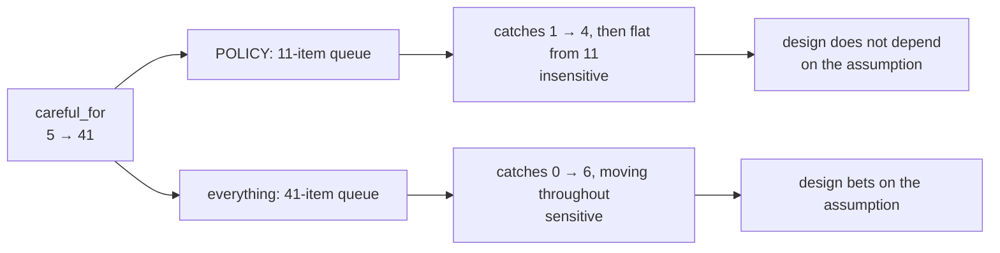

# 6.4 — The sweep nobody runs

## One-line answer

Approval fatigue is agreed by everyone and measured by nobody, so it never changes a design: sweeping
the one assumption shows the policy's catch rate flat at **4 of 4** from an attention budget of eleven
upwards, while gating everything runs from **0** to **6** across the same range — one policy is
betting on a good night and the other is not.

## The story

The dal has been on the stove for an hour and somebody has to decide about the salt.

The cook lifts the ladle from the top, tastes, and says it needs more. That is one point in a pot that
has thick sediment at the bottom, a thin layer at the top, and onions that went in late on one side.
The taste at the top is a real measurement of the top.

The cook who has done this for thirty years does something different, and it takes no longer. She
stirs from the bottom, tastes, stirs again, tastes from a different depth. She is not tasting more
carefully. She is tasting in more than one place, because what she needs to know is not *how salty is
this spoonful* but *how much does the answer change depending on where I put the spoon*.

If two spoonfuls from different depths taste the same, the pot is even and she is done. If they do not,
the salt is not the problem — the stirring is, and adding salt on top of that makes it worse.

## The idea in plain language

Every argument in this day has rested on one number: how many items an approver reads properly before
they start approving without reading.
[1.1](../01-the-gate-that-means-nothing/1.1-a-control-that-fires-on-everything.md) set it at twenty
and said plainly that it is an **assumption about attention**, not a measurement of a person.

That is honest, and on its own it is not enough. A design resting on an assumed constant has a
question hanging over it that nobody usually asks: **how much does the conclusion change if the
constant is wrong?**

The technique is a **sweep**. Instead of arguing about the right value, run the whole comparison at
every plausible value and look at the shape of the results. What comes back is not a better estimate
of the constant — it is a measurement of something more useful:

- A design whose outcome is **flat** across the range is a design that does not depend on the
  assumption. You can stop arguing about the number.
- A design whose outcome **swings** across the range is a design that is betting on the assumption,
  and now you know which way it loses.

This is the difference between saying *"approval fatigue is real"* — which everybody agrees with, and
which therefore changes nothing — and saying *"our catch rate is unchanged from eleven items upward,
and the alternative loses two thirds of its catches below thirty"*. The second sentence can decide an
argument. The first is a sentiment.

One term, defined once. **Sensitivity** is how much a result moves when an input moves. It is a
property of the design, not of the input, and it is the thing a sweep measures. A policy can be right
*and* highly sensitive, which means it is right on the days the assumption holds.

## Why Sutra needs it

The whole of section 1 rests on `careful_for = 20`. If that number is wrong, the argument for a short
queue might be wrong, and Day 64 would be about to implement a policy chosen on a bad premise.

Nobody can measure the real number without watching a real rota over months. What can be done today —
and what this part does — is establish whether it **matters**, which turns an unmeasurable input into
a bounded one. That is also the honest thing to hand Day 65, whose gate has to state what the design
assumed.

## The mechanism

`stamp.py` runs both policies at every plausible attention budget:

```bash
cd days/day-63-approval-gates-design/lab
uv run python stamp.py
```

**Line by line:**

- The sweep runs the same comparison as
  [1.1](../01-the-gate-that-means-nothing/1.1-a-control-that-fires-on-everything.md) at eight values
  of `careful_for`, from a distracted approver to a tireless one.
- Both columns are printed at every row, so the comparison is like-for-like rather than one policy
  measured under favourable conditions.
- The batch, the mistakes and the queues are identical throughout. `careful_for` is the only thing
  that moves.

Measured on 2026-09-05:

```text
  careful_for is the number of items an approver reads properly before waving
  the rest through. The batch contains 6 wrong writes.

  careful_for   gate-everything (41 asked)   POLICY (11 asked)
  --------------------------------------------------------------
            5   caught 0, missed 6                 caught 1, missed 3
           10   caught 1, missed 5                 caught 3, missed 1
           11   caught 1, missed 5                 caught 4, missed 0
           15   caught 1, missed 5                 caught 4, missed 0
           20   caught 2, missed 4                 caught 4, missed 0
           25   caught 2, missed 4                 caught 4, missed 0
           30   caught 3, missed 3                 caught 4, missed 0
           41   caught 6, missed 0                 caught 4, missed 0

  The right-hand column stops moving at careful_for=11, because the queue is
  only eleven items long. A policy that asks for less attention than a person
  has is a policy whose behaviour does not depend on how tired they are.

  The left-hand column is the honest counter-argument: at careful_for=41 the
  gate-everything policy catches all six, two more than POLICY does. If
  attention were free, gating everything would win. It is not free, and the
  whole table is the price list.
```

Read the right-hand column downwards. It rises to four and then stops, and it stops for a reason that
is almost too simple to notice: **the queue is eleven items long.** Once the approver's attention
covers eleven items, giving them more attention changes nothing, because there is nothing left to
read. Every value from eleven upwards produces the same answer.

That is the finding. The policy's outcome does not depend on the assumption everyone was worried
about. The argument in [1.1](../01-the-gate-that-means-nothing/1.1-a-control-that-fires-on-everything.md)
survives being wrong about `careful_for`, provided the real number is at least eleven — and eleven is
a low bar for a person reading eleven items.

Now read the left-hand column, which does not have that property. It moves the whole way: zero, one,
one, one, two, two, three, six. Every single value of the assumption produces a different answer, and
the answer at the top of the range is the opposite of the answer at the bottom. **Gating everything is
a design whose safety is a function of how tired somebody is**, and that is the sharpest statement of
this day's argument that the numbers will support.

Notice also the bottom row of the right-hand column, because it is the honest edge. At
`careful_for = 5` the policy catches one and misses three. A short queue does not make the gate
immune; it makes it insensitive above a threshold. Below that threshold both designs fail, and the
policy simply fails less.

And the top row is the counter-argument stated in full: at `careful_for = 41`, gating everything
catches all six and the policy catches four. If attention were free, gating everything would be
better. The whole table is the price of it not being free.



## When it breaks

A sweep measures sensitivity to **one** input, and it is easy to mistake that for having checked the
design.

`careful_for` is not the only assumption in this batch. The six wrong writes were labelled by hand.
The queue length depends on the policy table, which depends on the inventory's `detect_hours`, which
is a number somebody typed about how quickly a shift notices a bad note. The model of an approver —
perfect for N items, then blind — is a caricature; real attention decays rather than falling off a
cliff, and a decaying model would give a smoother curve and possibly a different threshold. Sweeping
one variable while the others sit at their assumed values shows you one line through the space, not
the space.

The second break is more likely in practice: the sweep gets run once, at design time, and the result
becomes a remembered fact. *"Our catch rate is flat above eleven"* is true of an eleven-item queue.
The day the policy gains a row and the queue is nineteen, the flat region starts at nineteen, and
nobody re-runs the sweep because the conclusion is already known. A sensitivity result has the same
expiry problem as the policy's `because` sentences, and for the same reason: both are claims about a
configuration that has since changed.

Third, and worth saying because it is the failure this part exists to prevent in the first place: the
sweep is cheap and it is still the thing that does not get done. It is one script, it runs in no time,
and it converts an unresolvable argument about human attention into a table. The reason it does not
get run is that nobody thinks of the constant as a variable, because it was typed once, in a helper
module, with a comment above it.

## In production

**What a professional writes instead.** The sweep is a **test**, not a script. It asserts the property
rather than printing the table: *the policy's catch rate is constant for all attention budgets at or
above the queue length*. That assertion fails the day somebody adds a gated action that lengthens the
queue past the assumed budget, which is exactly the change that should require a conversation. A
printed table informs whoever happens to look; an assertion informs whoever breaks it.

**What degrades at scale.** The flat region is a property of the queue length, and the queue length
grows with the number of gated actions and with traffic. So the design's insensitivity is not
permanent — it is a headroom, and it is consumed silently by ordinary growth. The number worth putting
on a dashboard is not the catch rate; it is the **queue length against the assumed attention budget**,
because that ratio is what says whether the flat region still contains you.

**The failure mode that only appears with real traffic.** Real attention is not a step function and it
is not one number. It varies by time of night, by how long the shift has run, by whether the person is
also handling an incident. What that means for the sweep is that a system does not sit at one point on
this table — it moves across it during a shift, and it moves furthest in the direction of low
attention exactly when the batch is largest. A design that is only safe in the flat region needs the
flat region to start well below the *worst* attention available, not the average.

**The review comment a senior engineer leaves:** *"Good — this is the first version of this argument
with a sensitivity analysis in it, and the flat-from-eleven result is what convinces me rather than
the single-point comparison. Two things. Make it a test that asserts flatness above the queue length,
so the next person who adds a gated row finds out. And put queue-length-over-attention-budget on the
dashboard rather than catch rate; catch rate needs known-bad labels and that ratio does not."*

**The interview question:** *"You assumed a number about human attention. How do you know your design
is not built on it?"* An honest answer: *"Because I swept it instead of defending it. The whole
argument for a short approval queue rested on an approver reading about twenty items properly, and I
had no way to measure that, so I ran both policies at every plausible value. Our policy's catch rate
rises to four and then goes flat from eleven upwards — flat because the queue is eleven items, so
extra attention has nothing left to read. Gating everything moves across the entire range, zero to
six, which means its safety is a function of how tired somebody is. That reframed the result for me:
the point is not that our number is better at twenty, it is that ours does not depend on the number
and theirs does. I would add that this only sweeps one assumption, the ground-truth labels and the
step-function model of attention are both still assumptions, and the flat region shrinks as soon as
the queue grows — so the thing I watch is queue length against the assumed budget, not the catch
rate."*

## Check yourself

```bash
cd days/day-63-approval-gates-design/lab
uv run python stamp.py
uv run python everything.py --careful 10
```

Now find, in the sweep, the smallest `careful_for` at which the policy column reaches its maximum, and
compare it with the length of the policy queue. Then say what would happen to that value if
`record_triage` were gated.

**Out loud, without scrolling up:** explain the difference between a design being right and a design
being insensitive, and say which one this sweep was measuring.

**Next:** [7.1 — The door on the tool](../07-the-two-doors/7.1-the-door-on-the-tool.md).
