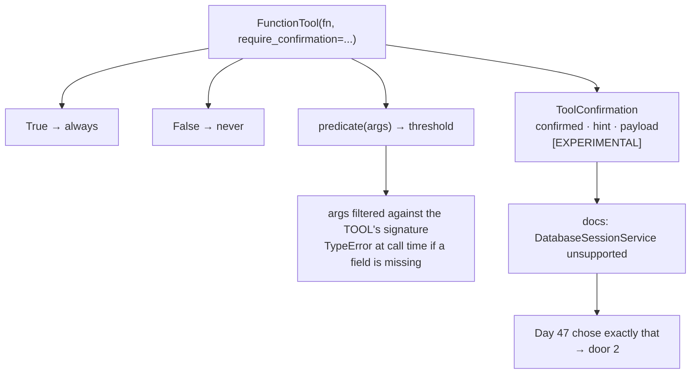

# 7.1 — The door on the tool

## One-line answer

ADK 2.7.1 puts an approval flag on the tool itself — `FunctionTool(fn, require_confirmation=...)`,
taking `True`, `False` or a predicate over the tool's arguments — and its own documentation names it
experimental and lists `DatabaseSessionService` as unsupported, which is the session service Day 47
gave Sutra.

## The story

The hardware shop has a wall of locks, and one of them is exactly what you want: heavy, well made,
the right size for the gate.

You ask for one and the shopkeeper says that one is a display sample. It works — you can turn the key
in it, the bolt slides, everything about it is real. It is just not something he will sell you for the
gate, because the manufacturer has not released it properly yet, and the ones he has cannot be
re-keyed and there is no warranty.

You could take it anyway. It would hold the gate closed. You would find out in a year whether the
things he mentioned mattered.

The honest version of the conversation is not *"that lock is bad"*. It is *"that lock is real, and
here is the specific list of what it does not do, and one of them applies to your gate."*

## The idea in plain language

ADK offers approval in two different places, and this part is about the first: **on the tool**.

The idea is simple and it is the one most people expect. When you wrap a Python function as a tool,
you say whether calling it needs a human's confirmation. The runtime handles the rest: the model asks
to call the tool, the runtime notices the flag, and instead of executing, it surfaces a confirmation
request.

The flag takes three shapes, and they map exactly onto the three verdicts in the policy table from
[3.2](../03-the-policy-table/3.2-the-table-and-the-argument.md):

| Policy verdict | `require_confirmation` |
| --- | --- |
| `never` | `False` |
| `always` | `True` |
| `threshold` | a predicate over the tool's arguments |

That correspondence is neat enough to be suspicious of, and this part's job is to establish two
things about it: exactly how the predicate reads its arguments, and the documented limitation that
decides whether Sutra can use this door at all.

One term, defined once. A **session service** is the component that stores a session's history and
state; Day 47 replaced the in-memory one with
[a database-backed service](../../../day-47-persistent-sessions/parts/02-reaching-the-service/2.4-handing-the-runner-a-store.md)
so that a conversation survives a restart. Which session service you run is normally invisible to
feature choices. Here it is not.

## Why Sutra needs it

ADK-47 is the framework half of this day, and a design day that never touches the framework has
produced a policy nobody can implement.

More specifically, Day 64 has to choose a door, and the choice is not a matter of taste. If it picks
this one, Sutra's overnight gate is built on a feature whose own documentation excludes Sutra's
session service. Discovering that on Day 64 costs a rewrite; discovering it here costs a paragraph.

## The mechanism

`doors.py` builds four tools and asks the installed package what it does with them. Nothing here calls
a model.

```bash
cd days/day-63-approval-gates-design/lab
uv run python doors.py
```

**Line by line:**

- Four `FunctionTool` objects are constructed over two stand-in functions: `close_ticket(ticket_id,
  resolution)` and `escalate(ticket_id, severity)`. The bodies never run; only the gating is
  inspected.
- `check_require_confirmation(args, tool_context)` is the runtime's own method, called directly with
  a plain dict of arguments, so the answers below are ADK's answers and not a re-implementation.
- The fourth tool attaches the `by_severity` predicate to `close_ticket`, which has no `severity`
  parameter. That is the deliberate mistake, and it is there because the way it fails is the useful
  part.
- `ToolConfirmation` is constructed inside `warnings.catch_warnings` so its own warning can be
  printed as evidence rather than paraphrased.

Verified against `https://adk.dev/tools-custom/confirmation/`, fetched 2026-09-05. Measured against
installed `google-adk==2.7.1` on the same day:

```text
  door 1 - tool confirmation (FunctionTool.require_confirmation)
    require_confirmation=True   -> True
    require_confirmation=False  -> False
    predicate on escalate(ticket_id, severity), severity=P1 -> False
    predicate on escalate(ticket_id, severity), severity=P3 -> True
    predicate on close_ticket(ticket_id, resolution) -> TypeError: by_severity() missing 1 required positional argument: 'severity'
    constructing ToolConfirmation warns: [EXPERIMENTAL] feature FeatureName.TOOL_CONFIRMATION is enabled.
    ToolConfirmation fields: ['confirmed', 'hint', 'payload']
    default confirmed:       False
```

Three things in that output are worth reading carefully.

**The predicate works, and it maps onto the threshold row exactly.** `severity=P1` returns `False` —
no confirmation required, the page goes straight out — and `severity=P3` returns `True`. That is
Sutra's one threshold rule, expressed in the framework, with the same meaning it has in
`threshold_allows`.

**The predicate's arguments come from the tool's signature, not the predicate's.** The fourth line is
the evidence: attaching `by_severity` to `close_ticket` raises

```text
TypeError: by_severity() missing 1 required positional argument: 'severity'
```

because ADK filters the call arguments against the **tool's** parameters before invoking the
predicate, so a predicate asking for a field the tool does not declare receives nothing. The
consequence for design is concrete: a threshold can only read values that are arguments of the gated
tool. If the policy wants to gate on something that is not a parameter — a fact about the ticket, a
count of affected accounts, the very independence
[6.2](../06-gates-that-are-decoration/6.2-the-field-the-agent-writes.md) argued for — this door cannot
express it without changing the tool's signature.

Note also **when** it fails: at the call, not at construction. `FunctionTool(close_ticket,
require_confirmation=by_severity)` is accepted quietly, and the mismatch surfaces the first time the
tool is actually invoked. That is a real trap and it is the shape of plan §5.1's trap #4 in reverse —
the error does surface rather than being swallowed, which is correct, but it surfaces at run time on a
gated action rather than at wiring time.

**`ToolConfirmation` announces itself as experimental**, in a warning the library emits on
construction: `[EXPERIMENTAL] feature FeatureName.TOOL_CONFIRMATION is enabled.` The object carries
three fields — `confirmed`, `hint`, `payload` — and `confirmed` defaults to `False`, which is the
right default and is worth noticing: an unanswered confirmation object is a refusal, not a blank.

Then the documented limitation, which is not in the package and has to come from the page:

```text
  what the docs say about door 1, fetched 2026-09-05:
    'The Tool Confirmation feature is experimental and has some known limitations.'
    DatabaseSessionService and VertexAiSessionService are listed as unsupported.
```

Day 47 put Sutra's sessions in a database on purpose, so that a run survives a restart — which is the
whole reason Phase 9 exists. That single sentence is therefore not a caveat for Sutra; it is a
disqualification, and it points at the second door.



## When it breaks

The break that costs the most is the one above, and it is worth stating as a general habit rather than
as a fact about one feature: **a framework feature's compatibility list is part of its API.** The
symbols imported cleanly. The tools constructed. The predicate returned correct answers. Every
signal available from the code said this works, and the thing that decides whether it works for Sutra
was a sentence on a documentation page. Principle 8 says verify the API against adk.dev on the day you
use it; this is why the rule says the page and not the package.

The second break is the predicate's argument filtering, and it will be met by somebody who has read
this part and forgotten it. The failure is a `TypeError` at call time, on a gated action, in
production, and the tempting fix is to loosen the predicate signature — `def by_severity(**kwargs)` —
which makes the error go away and silently produces a predicate that reads nothing and returns
whatever its default branch says. That is a gate that has stopped gating and left no trace, which is
this day's section 6 in a single line of code.

Third: `require_confirmation` lives on the tool. That means the verdict is now written at the place
the tool is constructed, and if tools are constructed in more than one place, the policy is in more
than one place — which is exactly what
[3.2](../03-the-policy-table/3.2-the-table-and-the-argument.md) forbade. Using this door safely means
constructing tools *from* the policy table rather than typing a flag beside each one. The lab's
`gate.py` already greps for `require_confirmation=True` outside the policy module for this reason.

## In production

**What a professional writes instead.** They do not type `require_confirmation` at each tool
construction site. They build the toolset in a loop over the policy table, so the flag is derived from
the row and there is exactly one place a verdict can come from. They also pin the ADK version and
record it, because a feature the library labels experimental is a feature whose shape can change on a
minor upgrade — `docs/PACKAGES.md` has `google-adk==2.7.1` and the pin is doing real work here rather
than being ceremony.

**What degrades at scale.** Per-tool flags scale with the number of tools and the number of
construction sites, and the second number is the one that grows unexpectedly. A tool built once in
`agent.py` is easy; the same tool built again in a test fixture, a script and a second agent is four
copies of a verdict. Nothing in the framework checks that they agree.

**The failure mode that only appears with real traffic.** An experimental feature is a moving one. The
version of this that bites is not a crash on upgrade — it is a *semantic* change: a default flipping,
a predicate signature widening, the confirmation object gaining a field. Tests that assert on
`check_require_confirmation` catch it. Tests that only assert the agent runs do not, and the first
sign is an action that stopped asking.

**The review comment a senior engineer leaves:** *"Two things before this goes near the overnight
batch. The docs say tool confirmation does not support DatabaseSessionService and that is what we run,
so this door is out for the batch regardless of how well it works locally — say so in the design note
rather than leaving the next person to find it. And if we use it anywhere, build the tools from the
policy table in a loop; a `require_confirmation=True` typed next to a tool is a second place where a
gate verdict lives."*

**The interview question:** *"How does your framework express 'this tool needs approval'?"* An honest
answer: *"In ADK 2.7.1 it is a flag on the tool — `FunctionTool(fn, require_confirmation=...)` — and it
takes `True`, `False`, or a predicate over the tool's arguments, which maps cleanly onto our
always/never/threshold table. Two things I checked rather than assumed. The predicate's arguments are
filtered against the *tool's* signature, so a threshold can only read values that are parameters of
the gated tool, and attaching a predicate that wants a field the tool does not declare raises a
`TypeError` at call time rather than at construction. And the feature is labelled experimental — the
library emits a warning when you construct a `ToolConfirmation` — with `DatabaseSessionService` listed
as unsupported, which is exactly the session service we run for durability. So for our overnight batch
we use the graph interrupt instead. The general lesson I took is that a feature's compatibility list
is part of its API, and it is only on the docs page, not in the package."*

## Check yourself

```bash
cd days/day-63-approval-gates-design/lab
uv run python doors.py
```

Now open `doors.py` and change `by_severity` to take `resolution` instead of `severity`, then re-run.
Write down which of the two predicate tools now raises and which succeeds, and what that tells you
about where the predicate's arguments come from.

**Out loud, without scrolling up:** state the three values `require_confirmation` accepts and the one
documented limitation that rules this door out for Sutra's overnight batch.

**Next:** [7.2 — The door in the graph](7.2-the-door-in-the-graph.md).
