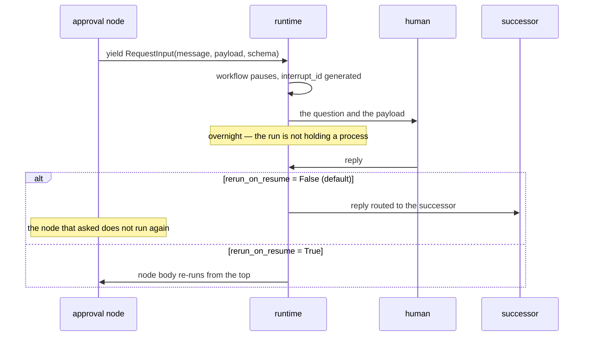

# 7.2 — The door in the graph

## One-line answer

The second door is a node yielding `RequestInput`, which pauses the workflow and carries
`message`, `payload`, `response_schema` and a generated `interrupt_id` — and its default resumption
routes the human's reply to the node's **successor**, bypassing the node that asked, which is the
same behaviour Day 60 measured for crash resumes.

## The story

The train stops before the station, in the middle of nowhere, at the outer signal.

Nothing is wrong. The platform is occupied, or the line ahead is not clear yet, and the signal is red.
The driver does not decide this and cannot argue with it. The train waits, engine running, doors shut,
in a place with no platform, and everyone on board can see the station roof a few hundred metres
ahead.

Then the signal changes and the train moves in. The wait was not a fault; it was the system working.
What makes it bearable, on a good railway, is that the stop happens at a **designed place**. There is
a signal there. Somebody chose the spot, the track can hold a stopped train there, and the control room
knows a train is standing at that signal. On a bad railway the train stops wherever it happens to be
when the problem appears, which is also a stop, and is a completely different thing.

## The idea in plain language

[7.1](7.1-the-door-on-the-tool.md) put the approval on the tool. This door puts it in the **graph**:
a node reaches a point where it needs a person, and it yields a `RequestInput`. The workflow pauses,
the client is handed the question, and the run resumes when an answer arrives.

The difference is not cosmetic and it is not about ergonomics. It is about *where the stop happens*:

| | Door 1 — on the tool | Door 2 — in the graph |
| --- | --- | --- |
| Where the pause is | inside the tool-calling machinery | at a node boundary in the workflow |
| What the policy attaches to | a tool's construction | a node's own logic |
| What the run does while waiting | depends on the confirmation flow | the workflow is paused; Day 61's checkpoint holds it |
| Session services | `DatabaseSessionService` unsupported | no such restriction documented |

The last row is why Sutra ends up here, and the third row is why it is the better fit anyway. Sutra's
approval is not really a property of a tool call — it is a **stage** in the triage graph, sitting
between drafting and writing, and it has to survive a night with nobody awake. That is a pause in a
workflow, which is precisely what this door is.

Two terms, defined once:

- An **interrupt** is a pause that the running thing initiates itself, at a place it chose, rather
  than something imposed on it from outside. The node decides to stop; the framework records that it
  stopped.
- The **`interrupt_id`** is the generated handle for one such pause. It is the address the answer
  comes back to, and it is the reason two pending approvals cannot be confused with each other.

## Why Sutra needs it

Sutra runs a batch overnight, against a database-backed session service, on a graph, and pauses for a
human who is asleep. Every one of those four facts points at this door.

But there is a specific reason this part exists beyond "pick door two", and it is the resumption
behaviour. Day 60 measured that on a crash resume, ADK 2.7.1 **skips the node that was running** and
continues to its successor unless `rerun_on_resume=True`. This door has the same shape: the
documentation says the reply is routed to the successor and the interrupted node is bypassed. That is
a deliberate design and it is exactly the thing that will surprise somebody building an approval node
who assumes their node body runs again with the answer in hand.

Day 64 will write that node. If it assumes the wrong resumption mode, the approval arrives and the
code that was supposed to act on it never runs.

## The mechanism

The same `doors.py` constructs a `RequestInput` and asks the installed package what it carries:

```bash
cd days/day-63-approval-gates-design/lab
uv run python doors.py
```

**Line by line:**

- `RequestInput` is imported from `google.adk.events.request_input` — the import path is itself
  informative, because it says this is an **event**, not a tool concept.
- It is constructed with the two fields an approval needs: the question, and the payload the approver
  has to see. That payload is where
  [4.2](../04-what-the-approver-sees/4.2-the-request-and-the-diff.md)'s diff and
  [4.1](../04-what-the-approver-sees/4.1-approving-bytes-not-pointers.md)'s fingerprint will travel.
- The script prints the model fields, the generated id's length, and that the payload survives
  unchanged, so nothing about the object's shape is being taken on trust.

Verified against `https://adk.dev/graphs/human-input/`, fetched 2026-09-05. Measured against installed
`google-adk==2.7.1` on the same day:

```text
  door 2 - the graph interrupt (RequestInput)
    RequestInput fields: ['interrupt_id', 'message', 'payload', 'response_schema']
    interrupt_id is generated: 36 chars
    payload survives as given: 4611
```

Four fields, and each one lines up with something this day has already argued for:

| Field | What section 4 called it |
| --- | --- |
| `message` | the question the approver is answering |
| `payload` | what exactly they saw — [4.4](../04-what-the-approver-sees/4.4-the-four-facts-a-record-must-hold.md)'s second question |
| `response_schema` | the shape of the verdict, which is why it can have four states rather than two |
| `interrupt_id` | the address the answer returns to |

`interrupt_id` is generated and is thirty-six characters, which is a UUID. It is worth noticing that
the framework generates it rather than accepting one: the identity of a pending approval belongs to
the runtime, so two approvals raised on the same ticket in the same night are still distinct
questions. That matters directly for
[6.3](../06-gates-that-are-decoration/6.3-ask-until-somebody-says-yes.md) — the framework will happily
give you two ids for the same request, which is the mechanism of approver shopping and not a defence
against it. Binding a rejection to a *request* rather than to an `interrupt_id` is Day 64's problem to
solve, and this is where it becomes visible.

Now the behaviour that is not visible in the object, from the documentation page:

> When a node yields `RequestInput`, the workflow pauses. With the default `rerunOnResume: false`,
> *"the reply is routed to the node's successor as input, bypassing the interrupted node"*; with
> `rerunOnResume: true`, *"the node body re-runs from the top"*.

Read that against Day 60's measured crash-resume behaviour and they are the same rule. The framework
has one model of resumption and applies it to both kinds of pause: **by default, the node that stopped
does not run again.** For an approval node this has a concrete consequence. If the node's job is
*"raise the request, then, when the answer comes, check it against the policy and execute"*, the
second half of that sentence never happens by default — the answer goes to whatever comes next in the
graph.

There are two correct designs and it is worth naming both, because Day 64 has to pick one:

- **Successor executes.** The approval node's only job is to ask. The next node receives the reply as
  its input and performs the write. The graph reads clearly and matches the default.
- **`rerun_on_resume=True`.** The node body runs again from the top, sees that an answer is available,
  and proceeds. Fewer nodes, and it requires the node to be written so that re-running its first half
  is harmless — which is [Day 60's idempotency argument](../../../day-60-durable-execution/LESSON.md)
  arriving in a new place.

Note the spelling: the documentation writes `rerunOnResume` and the installed Python is
`rerun_on_resume`. Day 60 recorded the same discrepancy.



## When it breaks

The break is the default, and it breaks by producing a run that looks successful.

Write the approval node the way it reads in your head — ask, then act on the answer — and the answer
goes to the successor instead. The node does not error. The workflow does not fail. The successor
receives something it may or may not know what to do with, and if the successor is the node that
performs the write, it may perform it without the policy check the approval node was going to run.
Every log line is normal.

That is the same failure Day 60 found on crash resumes, and the fact that it appears twice, in two
different pause mechanisms, is the useful generalisation: **in this runtime, a paused node is not a
node waiting to continue.** Assuming otherwise is a category error the framework does not correct.

The second break is the documented limitation on the reply itself. The page is explicit that a
`response_schema` is not enforcement:

> *"A response schema does not reformat a human reply to fit the specified structure. The reply must
> already be in that format."*

So the schema describes what you want and validates nothing on its own. An approval reply arriving in
a different shape is not rejected by the framework; it is handed on. Anything relying on the verdict
being one of four values has to check that itself, which means
[4.4](../04-what-the-approver-sees/4.4-the-four-facts-a-record-must-hold.md)'s verdict field needs a
validation step rather than a type annotation.

Third, and quieter: the payload travels through the interrupt, and the payload is the customer's
draft reply. It is now in the event stream, in whatever the client stores, and in the checkpoint.
[4.4](../04-what-the-approver-sees/4.4-the-four-facts-a-record-must-hold.md) flagged this as a
retention problem for the approval record; the interrupt is a second copy of the same bytes in a
second place, and Day 69 will have to account for both.

## In production

**What a professional writes instead.** The approval node yields the interrupt and **nothing else** —
it does not also write, and it does not assume it will be re-entered. The write lives in the successor,
which receives the reply, re-checks the policy verdict, compares the payload fingerprint from
[4.1](../04-what-the-approver-sees/4.1-approving-bytes-not-pointers.md), and only then acts. That
arrangement is honest about the framework's default rather than fighting it, and it has the side
benefit of making the graph readable: a reviewer can see the gate as a node between drafting and
writing rather than as a branch inside one.

**What degrades at scale.** Pending interrupts are pending runs, and pending runs are checkpoints on
disk. One night's eleven approvals is nothing; a backlog of unanswered interrupts across many nights
is storage that grows and never self-clears, because an interrupt with no reply and no timeout has no
terminal state. That is [5.2](../05-when-nobody-answers/5.2-the-answer-nobody-gave.md)'s timeout
arriving as an operational cost rather than a correctness one.

**The failure mode that only appears with real traffic.** `interrupt_id` is generated per pause, so a
resumed run that re-raises the same approval produces a **new** id. Under real traffic — retries,
resumes, a supervisor loop — the same question can exist in the queue several times with different
ids, and a client that keys its UI on `interrupt_id` will show them as separate items. Two approvers
can then answer what is really one question, which is
[6.3](../06-gates-that-are-decoration/6.3-ask-until-somebody-says-yes.md) with the framework's help.

**The review comment a senior engineer leaves:** *"The approval node yields `RequestInput` and then
has code after the yield that checks the verdict. With the default resume mode that code does not run
— the reply goes to the successor. Either move the write and the check into the successor node, or set
`rerun_on_resume=True` and make the first half of this node idempotent. And do not key the pending-item
UI on `interrupt_id`; a resume will give you a second id for the same question."*

**The interview question:** *"Where does a human approval physically pause your agent?"* An honest
answer: *"At a node in the graph, by yielding `RequestInput` — which carries the message, the payload
the approver has to see, a response schema and a generated interrupt id. We use that rather than the
tool-level confirmation flag for two reasons: the flag's docs list `DatabaseSessionService` as
unsupported and that is what we run for durability, and an approval in our system is really a stage
between drafting and writing rather than a property of one tool call. The behaviour I would make sure
anybody knows before they build this is the default resumption: the reply is routed to the node's
**successor** and the interrupted node is bypassed. That is the same rule the runtime applies to crash
resumes, so code written after the yield silently never runs, and nothing errors. We put the write in
the successor rather than setting rerun-on-resume, because then the node that asks only asks."*

## Check yourself

```bash
cd days/day-63-approval-gates-design/lab
uv run python doors.py
```

Now add a `response_schema` to the `RequestInput` in `doors.py` — any dict — re-run, and confirm the
field appears. Then write down, in one sentence, what the framework will do if a human's reply does
not match it.

**Out loud, without scrolling up:** name the four fields `RequestInput` carries, and say where the
human's reply goes by default.

**Next:** [7.3 — What Day 64 is handed](7.3-what-day-64-is-handed.md).
