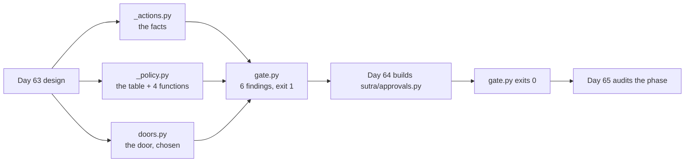

# 7.3 — What Day 64 is handed

## One-line answer

A design day ends by writing down what "built" means, so the handover is not a document but a failing
check: `gate.py` reports **6 findings** and exits `1` today, and Day 64 is finished when the same
command exits `0`.

## The story

The mason arrives on site and the architect gives him a drawing.

The drawing is not the useful half. Anybody can draw a wall. What the mason actually reads is the
sheet clipped behind it: brick size, the mix for the mortar, where the damp course goes, how many
courses before the lintel, and — the line that ends every argument — that the wall is checked with a
plumb line and a spirit level at each stage.

Without that sheet, "is the wall built?" is a conversation, and it is a conversation held between two
people with different interests at the end of a long day. With it, the question has an answer that
neither of them owns: put the level on it.

The architect's real job was never the drawing. It was deciding, in advance and in writing, what
would count as finished.

## The idea in plain language

This is the last part of a design day, and design days have a characteristic way of failing: they
produce a document that everybody agrees with and nobody can be held to.

The defence is that the design must end in something **executable**. Not a summary, not a list of
principles — a check that runs, that is **red now**, and that goes green exactly when the thing has
been built as designed. That is Principle 11 applied to a design decision rather than to code: an eval
that can go RED.

What makes this more than a slogan is what the check is allowed to assert. A check that merely says
*"the file `sutra/approvals.py` exists"* is a check on effort. The interesting assertions are the ones
that encode the **arguments** this day made, so that a Day 64 implementation which quietly abandons one
of them fails:

- every action in the inventory has a policy row — the pair from
  [3.1](../03-the-policy-table/3.1-the-write-inventory.md), so a tool cannot be unclassified silently;
- the lookup fails closed on an unknown name — [3.4](../03-the-policy-table/3.4-the-tuesday-a-tool-arrives.md)'s
  Tuesday, asserted rather than hoped for;
- every row carries a non-empty `because` — [3.2](../03-the-policy-table/3.2-the-table-and-the-argument.md)'s
  argument column, which is the first thing to rot;
- the threshold rule is stated exactly once — so
  [6.2](../06-gates-that-are-decoration/6.2-the-field-the-agent-writes.md)'s one predicate cannot be
  restated somewhere else with a different opinion;
- no gate verdict is hard-coded outside the policy module — the single-door rule, enforced by grep
  rather than by convention.

Each of those is a sentence from an earlier part turned into something a machine refuses.

## Why Sutra needs it

Day 64 builds `sutra/approvals.py` and wires the gate into the triage graph. Day 65 is the Phase 9
gate and asks whether a human approved the write. Between the two there is a gap where "we added
approvals" can be true and worthless, and this part is what closes it.

There is also a plain repo-discipline reason. The learner writes every line of `sutra/` themselves;
this day writes none of it. So the only thing this day can hand forward is the **specification and its
test**, and if the test is vague the specification was decoration.

## The mechanism

`gate.py` is the day's eval. It is red now, on purpose:

```bash
cd days/day-63-approval-gates-design/lab
uv run python gate.py; echo "exit: $?"
```

**Line by line:**

- The first check is for `sutra/approvals.py`, which does not exist yet — the learner writes it on
  Day 64 from the hub's build brief.
- The five checks after it are reported as `cannot check` rather than as passes. That distinction is
  the point: a check that cannot run has not succeeded, and a gate script that counted them as green
  would report five passes for a file that does not exist.
- The exit code is `1`, so this is usable in `./m check` from Day 64 onwards without anybody having to
  read the output.

Measured on 2026-09-05:

```text
gate: 6 finding(s)
  - sutra/approvals.py does not exist (build brief step 1)
  - cannot check: POLICY covers every action in the inventory
  - cannot check: gate_for() fails closed on an unclassified action
  - cannot check: every row carries a non-empty `because`
  - cannot check: the threshold rule is stated exactly once
  - cannot check: no gate verdict is hard-coded outside the policy module
exit: 1
```

Six findings and exit `1`. That is the honest state of this day: the design is complete and nothing is
built.

Look at the five `cannot check` lines rather than the first one. Each names a claim from an earlier
part, and each will become a real assertion the moment there is a module to assert against. That is
what distinguishes this from a to-do list — the checks were derived from arguments that were made and
measured, not from a wish list written at the end.

The last one is worth singling out because it is enforced by grep rather than by structure:

**no gate verdict is hard-coded outside the policy module.** There is no language feature that stops
somebody writing `require_confirmation=True` next to a tool, and
[7.1](7.1-the-door-on-the-tool.md) showed how natural that is to do. A convention will not survive a
hurried afternoon. A check that fails the build will.

The lab already holds the design in a form Day 64 can read rather than re-derive:

| Artefact | What Day 64 does with it |
| --- | --- |
| `_actions.py` | the inventory: ten actions with their facts |
| `_policy.py` | `POLICY`, `suggest()`, `gate_for()`, `threshold_allows()` — the table and its four functions |
| `gate.py` | the acceptance test, red until the module exists |
| `doors.py` | which ADK door, and why the other one is out |

And the decisions that are not code, each argued in a part rather than asserted here:

- **Which door**: the graph interrupt, because tool confirmation lists `DatabaseSessionService` as
  unsupported and Day 47 chose exactly that ([7.1](7.1-the-door-on-the-tool.md),
  [7.2](7.2-the-door-in-the-graph.md)).
- **Where the write goes**: in the **successor** node, because the default resumption bypasses the
  node that asked ([7.2](7.2-the-door-in-the-graph.md)).
- **What the record holds**: `by`, `decided_at`, `payload`, `payload_sha`, `verdict` with four states
  ([4.4](../04-what-the-approver-sees/4.4-the-four-facts-a-record-must-hold.md)).
- **What the approver sees**: the diff, including unchanged decision-relevant state, fetched
  independently of the agent ([4.2](../04-what-the-approver-sees/4.2-the-request-and-the-diff.md),
  [4.3](../04-what-the-approver-sees/4.3-separation-of-duty.md)).
- **What happens on silence**: per-action, three closed and one open
  ([5.1](../05-when-nobody-answers/5.1-fail-closed-or-fail-open.md)), with a timeout past the rota
  ([5.2](../05-when-nobody-answers/5.2-the-answer-nobody-gave.md)).
- **What happens on refusal**: binding, stored with its reason
  ([6.3](../06-gates-that-are-decoration/6.3-ask-until-somebody-says-yes.md)).



## When it breaks

An acceptance check breaks by being satisfiable in the wrong way, and this one has a specific hole
that should be named rather than left for somebody to find.

Every assertion above is about the **policy module**. None of them says the gate is actually reached
at run time. A Day 64 implementation could produce a perfect `sutra/approvals.py` — complete table,
fail-closed lookup, single threshold, no stray verdicts — wire it into nothing, and pass all six
checks. The triage graph would write without asking and the eval would be green.

That is not a flaw to apologise for; it is the boundary between a design day's test and a build day's
test. What it means is that Day 64 owes a check this day cannot write: an end-to-end assertion that
the write path is unreachable without an approval record. Day 65's kill-it-mid-run gate is where that
gets exercised for real, and the reason this part says so out loud is
[6.1](../06-gates-that-are-decoration/6.1-the-road-the-gate-is-not-on.md) — a check on names is not a
check on effects, and that applies to the tests as much as to the gate.

The second break is that `cannot check` is easy to misread as neutral. It is not: it is a **failure**
in this script, counted in the six, and the script says so by exiting non-zero. A future version of
this that reported five passes and one failure would be lying in the most ordinary way a test suite
lies, which is by counting unrunnable checks as satisfied.

## In production

**What a professional writes instead.** The acceptance checks live with the code they check, run in
CI, and fail the build — not in a lab folder somebody runs by hand. The five assertions here become
tests in `tests/`, the grep for stray verdicts becomes a lint rule, and the inventory-versus-policy
diff becomes the build-time check
[3.4](../03-the-policy-table/3.4-the-tuesday-a-tool-arrives.md) argued for. A design that is only
enforced by a script in a teaching folder is enforced by whoever remembers.

**What degrades at scale.** Handover documents rot faster than code, and the parts of a design that
survive are exactly the parts something executes. Six months from now nobody will re-read this day's
seven sections. They will read `_policy.py`, and they will read whatever fails when they break it. So
the density of assertion matters: every argument that did not become a check is an argument with a
shelf life.

**The failure mode that only appears with real traffic.** The check asserts the policy's *shape* and
can say nothing about its *content* — that `close_ticket` is gated is a judgement, and a future
maintainer flipping it to `never` with a plausible `because` passes every one of the six. That is
correct behaviour and it is worth knowing: this check protects the structure of the decision, and the
decision itself is protected only by review, which is why
[3.2](../03-the-policy-table/3.2-the-table-and-the-argument.md) worked so hard to make the
disagreements findable by eye.

**The review comment a senior engineer leaves:** *"Good — the design ends in a red test rather than a
summary, and the five assertions are the arguments from the doc rather than a checklist of files. One
gap to state in the doc: all six checks pass against a policy module that nothing calls. Day 64 needs
an end-to-end test that the write path is unreachable without an approval record, and that is not
something this script can assert."*

**The interview question:** *"How do you hand a design to whoever implements it?"* An honest answer:
*"As a failing test, plus the artefacts it tests. Our design day ends with a script that reports six
findings and exits one, and five of those findings are the arguments the design actually made — every
action classified, the lookup fails closed on an unknown name, every row has a written reason, the
threshold is stated exactly once, and no gate verdict exists outside the policy module. The
implementation day is finished when that command exits zero. I would also say the limitation out loud,
because it is the interesting part: every one of those checks passes against a policy module that
nothing calls. It verifies the structure of the decision, not that the decision is reached, so the
build day owes an end-to-end check that the write path is unreachable without an approval — which is a
different kind of test and belongs with the wiring."*

## Check yourself

```bash
cd days/day-63-approval-gates-design/lab
uv run python gate.py; echo "exit: $?"
uv run python inventory.py
uv run python table.py
```

Now open `gate.py` and read the five checks that currently report `cannot check`. Pick one and write
down, in a sentence, which part of this day argued for it and what a Day 64 implementation would have
to do to make it pass.

**Out loud, without scrolling up:** state what Day 64 is finished, and name the one thing this check
cannot verify.

**Next:** the papers. Read [01 — Well-formed transactions](../../papers/01-well-formed-transactions.md)
now that the mechanism is built, not before.
