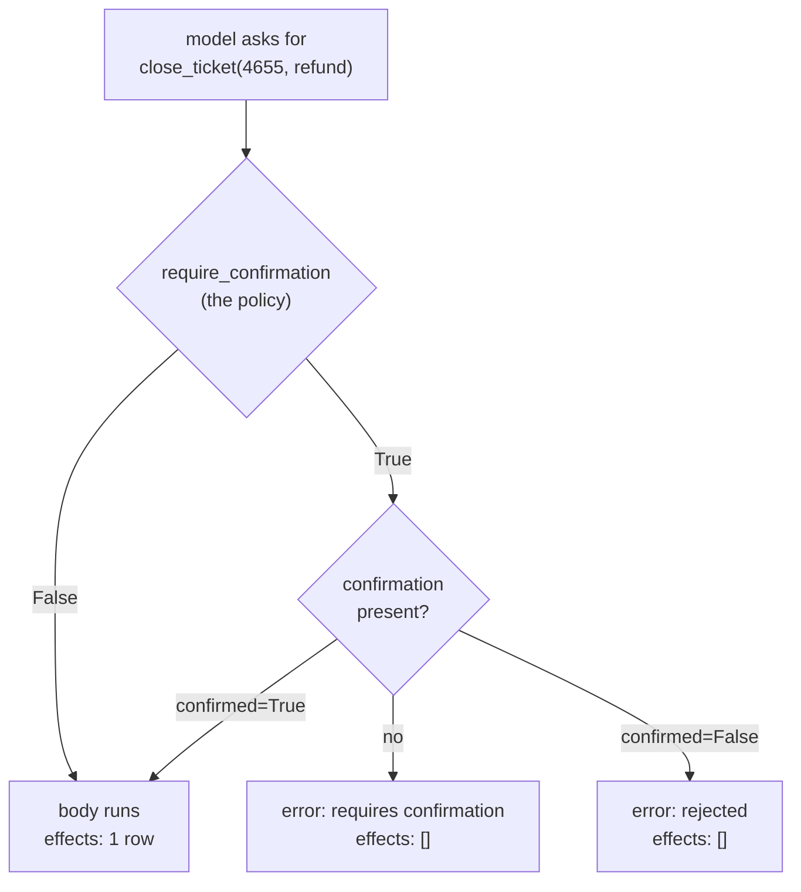

# 2.1 — One argument turns a tool into a gate

## One-line answer

`FunctionTool(func, require_confirmation=...)` takes the decision function from section 1 and puts
it in front of the function body, so a gated call returns a refusal with the body **not run** — and
the effects ledger is what proves it.

## The story

There is a photocopy shop near the college with one big machine and a boy who runs it.

Black-and-white copies you do yourself. You put the pages in, press the green button, and take what
comes out. Nobody watches you.

Colour is different. The colour tray is locked, and there is a small keypad on the side. You ask,
he walks over, types four digits without letting you see them, and then the machine will print in
colour. He is not standing over you the whole time. He typed a code and walked away, and the
machine did the rest.

What is worth noticing is where the check lives. It is not in the boy's head — he does not have to
remember which customers are allowed colour. It is not in a rule on the wall that everybody ignores.
It is **in the machine**, at the point where the colour actually happens. You cannot get a colour
copy by asking nicely, or by using a different tray, or by coming back when he is at lunch. The
machine will not do the thing until the code is entered.

That is the shape today's mechanism has. The check does not sit in the caller's good intentions. It
sits in the thing that does the work.

## The idea in plain language

Section 1 ended with a decision function and a problem. The decision function —
`needs_approval(action, args)` — is pure, testable and reviewable. The problem, measured in part
[1.4](../01-the-policy-is-data/1.4-the-guard-that-was-only-added-in-three-places.md), is that
calling it at each place the action happens gives you as many policies as you have call sites.

The fix is to move the call into the one place every caller must pass through.

In ADK, a function becomes something an agent can call by being wrapped in a **`FunctionTool`** —
the object that holds the function, derives the schema a model sees from the signature, and is what
the runtime actually invokes. Wrapping is not optional; there is no path from a model to a plain
Python function that skips it. So the wrapper is the choke point, and `FunctionTool` takes one
argument that turns it into a gate:

```
FunctionTool(close_ticket, require_confirmation=gate_close)
```

`require_confirmation` is the hook. When it is a function, ADK calls it with **the same arguments
the tool is about to be called with** and reads the answer as a yes/no. That is exactly the shape
part [1.1](../01-the-policy-is-data/1.1-a-gate-is-a-decision-about-one-action.md) argued for: the
decision is about the call, not the tool.

Three terms this section uses, defined once:

- **The tool body** — the actual Python function. On this desk it is `close_ticket`, and it appends
  to a ledger and returns a dict. Whether the body ran is the only fact that matters, because the
  body is where the world changes.
- **The confirmation** — a small object ADK carries alongside the call, holding whether a human has
  said yes. Verified on the installed package, it has exactly three fields: `hint`, `confirmed`,
  `payload`.
- **The effects ledger** — `_actions.EFFECTS`, a list this lab appends to inside every function
  that changes something. It exists so that "the gate stopped it" is a claim with evidence rather
  than a sentence in a document.

## Why Sutra needs it

Day 58's triage graph ends at a drafted reply and stops. Phase 9's gate — *kill it mid-run; it
resumes; a human approved the write* — needs the second half of that sentence to be true of the
desk's real write, and Day 65 audits it.

There are two places the gate can go, and this day builds both because Sutra has both shapes. This
section is the tool shape: an agent decides to call `close_ticket`, and the gate is on the tool.
Section 4 is the graph shape, where the pause is a node. Section 6 wires whichever one the desk
actually uses and then measures what the other one leaves open.

## The mechanism

The gate function is three lines, and the third one is the policy from section 1 unchanged:

```python
def gate_close(ticket_id: str, resolution: str) -> bool:
    """The policy, asked about these arguments. This is the whole gate."""
    return _policy.needs_approval("close_ticket", {"resolution": resolution})
```

**Line by line:**

- The parameters are named `ticket_id` and `resolution` — the **same names as the tool body's
  parameters**. ADK calls this function with the tool's own arguments, so the names have to match or
  it will not bind. That is a real constraint and it is easy to get wrong the first time.
- It returns a plain `bool`, not a message and not an exception. Deciding and acting stay apart, for
  the reason part 1.1 gave: a policy that also does something is a policy nobody can read.
- It delegates to `_policy.needs_approval` rather than restating the rule. If this function
  contained `resolution in ("refund", "credit")`, the policy file would have a second, invisible
  copy of itself — which is
  [1.4](../01-the-policy-is-data/1.4-the-guard-that-was-only-added-in-three-places.md)'s failure
  wearing a different hat.

Now the wrapper, and four passes over it. Verified against `adk.dev/runtime/resume/`, fetched
2026-09-06, and against the installed `google-adk==2.7.1` — `FunctionTool.__init__` takes exactly
`(self, func, require_confirmation)`, which is how this part knows the argument exists and what it
is called.

```bash
cd days/day-64-approval-gates-build/lab
uv run python toolgate.py
```

**Line by line:**

- `toolgate.py` builds one `FunctionTool` and calls `run_async` four times with different arguments
  and different answers. `run_async` is the function the framework itself calls when a model asks
  for a tool, so this is the library's own code path and not a re-implementation of it.
- **No model is involved.** A model's only job here is to produce the arguments; the script supplies
  them directly. That is why this whole section costs zero requests
  ([§6 of the hub](../../LESSON.md) states the budget).
- After each pass it resets and prints `_actions.EFFECTS`. Printing the return value alone would not
  be evidence — a refusal that still ran the body would look identical from the outside.

Measured on 2026-09-06:

```text
tool: close_ticket   policy: policy.json v3

  1 ungated argument                 {'closed': '4610', 'resolution': 'note'}
                                     effects: [('close_ticket', '4610', 'note')]

  2 gated, nobody asked yet          {'error': 'This tool call requires confirmation, please approve or reject.'}
                                     effects: []
                                     requested for: ['fc-1']

  3 gated, rejected                  {'error': 'This tool call is rejected.'}
                                     effects: []

  4 gated, approved                  {'closed': '4655', 'resolution': 'refund'}
                                     effects: [('close_ticket', '4655', 'refund')]
```

Read the `effects` lines first, because they are the argument.

**Pass 1** is `close_ticket(4610, "note")`. The policy says no gate, the body ran, the ledger has a
row. Nobody was asked and nobody should have been.

**Pass 2** is `close_ticket(4655, "refund")` with no answer from anybody. The tool returns an error
dict and **`effects: []`**. The body did not run. That empty list is the whole feature: the same
function, the same wrapper, one argument different, and the world did not change.

**Pass 4** is the same call with a confirmation carrying `confirmed=True`. The body ran. So the
gate is not a permanent block on the tool — it is a stop that a person can clear, which is what
distinguishes an approval gate from an allowlist.

The line `requested for: ['fc-1']` is the tool telling the runtime *which call* it wants an answer
about, keyed by the function call's id. Part [3.1](../03-binding-the-answer/3.1-the-question-has-to-be-written-down.md)
is about that key and why it matters more than it looks.



## When it breaks

The first thing that breaks is the parameter names. `require_confirmation` is called with the
tool's arguments, so a gate function whose parameters do not match the tool's raises before it ever
reaches the policy:

```text
TypeError: gate_close() got an unexpected keyword argument 'ticket_id'
```

That is a gate written as `def gate_close(id, resolution)` against a tool whose parameter is
`ticket_id`. It fails loudly on the first gated call, which is the good case. The bad case is a
gate function with `**kwargs`, which accepts anything, reads the wrong key, gets `None`, and quietly
decides "not gated" for every call in production.

The second thing is the experimental warning, which you will see the first time you touch this
surface:

```text
UserWarning: [EXPERIMENTAL] feature FeatureName.TOOL_CONFIRMATION is enabled.
```

It is emitted by a decorator on the `ToolConfirmation` class itself in the installed package. It is
not an error and nothing is broken, but it is a fact worth carrying into a design review: this API
may change shape between releases, and a gate built on it needs a pinned version and a test that
would notice. The lab filters this warning to keep the measured output to one thing; the hub's §8
records where it comes from.

## In production

**What a professional writes instead.** They do not write a `gate_close` per tool. They write one
factory — `gated(func, action)` — that returns a `FunctionTool` with the policy already bound, and
they register tools through it. Then "is this tool gated?" is answered by looking at one list rather
than by grepping for `require_confirmation`, and a tool registered the ordinary way is a visible
omission rather than an invisible one. Part
[6.2](../06-wiring-the-desk/6.2-three-roads-to-one-function.md) measures what happens when it is
invisible.

**What degrades at scale.** The gate function runs on every call to a gated tool, including the
ungated arguments. It must be cheap and it must not do input/output — the policy is already in
memory from section 1, and this is why that mattered. A gate that queries a permissions service per
call turns every tool call into a network round trip and makes your tool latency depend on somebody
else's uptime.

**The failure mode that only appears with real traffic.** Arguments arrive in shapes the gate
function did not anticipate, because a model produced them. `resolution` comes back as `"Refund"`
with a capital R, or as `"refund "` with a trailing space, or as `None` because the model omitted an
optional parameter. Each of those makes `needs_approval` answer `False` for a call that should have
been stopped, and none of them raises. Normalise arguments **inside** the gate, and make the policy
comparison explicit about case and whitespace, before you ship it.

**The review comment a senior engineer leaves:** *"This proves the tool returned an error, not that
the refund did not happen. Assert on the side effect, not on the return value — if `close_ticket`
had written to the database before checking, this test would still be green."*

**The interview question:** *"How would you stop an agent from doing something irreversible without
a human?"* An honest answer: *"Put the check in the wrapper the framework has to go through, not at
the call sites. In ADK that is `FunctionTool(func, require_confirmation=policy)`, where the policy
gets the actual arguments, so the same tool can be gated for a refund and free for a note. And I
test it by asserting the side effect never happened, not by asserting the return value was an
error — those are different claims, and only one of them is the one you care about."*

## Check yourself

```bash
cd days/day-64-approval-gates-build/lab
uv run python toolgate.py
```

Now edit `gate_close` to take `**kwargs` instead of named parameters, return
`_policy.needs_approval("close_ticket", kwargs)`, and re-run. Read pass 2 carefully.

**Out loud, without scrolling up:** in pass 2 the tool returned an error dict. What is the *other*
line of that output that tells you the refund did not happen, and why is the error dict alone not
enough?

**Next:** [2.2 — What comes back when the tool refuses](2.2-what-comes-back-when-the-tool-refuses.md).
