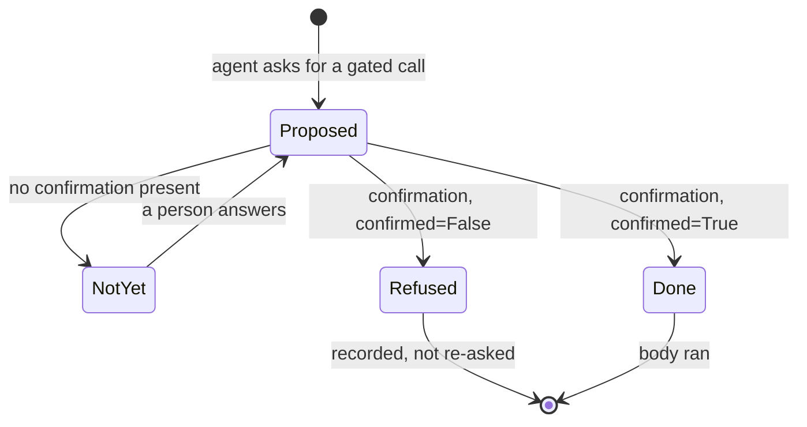

# 2.3 — A rejection is not a failure

## One-line answer

*Nobody has answered yet* and *a person answered no* are two different outcomes with two different
correct responses, and ADK returns two different strings for them — which is the only reason your
code can tell them apart.

## The story

The bowler appeals, the whole field goes up, and the umpire shakes his head. Not out.

The captain taps his shoulders and asks for a review. Everyone waits. On the big screen the ball
tracks back, clips the top of the stumps, and the decision is sent back upstairs as *umpire's call*
— which means the original decision stands. Not out.

Now watch what the fielding side does, because it is the whole point. They do not appeal again. They
do not ask for a second review of the same ball. They have used their review, they got an answer,
and the answer was no. The ball is dead and the game moves on to the next delivery.

Compare that with the moments earlier in the same over when the umpire simply had not decided yet —
when the ball was still in the air, or he was still conferring with the square-leg umpire. Nobody
was allowed to bowl the next ball then either, but for a completely different reason. One is *not
yet*. The other is *no*. If you treat them the same you either bowl before the umpire is ready, or
you spend the afternoon appealing at a man who has already told you.

## The idea in plain language

Part [2.2](2.2-what-comes-back-when-the-tool-refuses.md) showed the confirmation object's three
fields, and one of them is a trap:

```
confirmed: False
```

`False` is the **default value of the field**, not a decision. A freshly created confirmation has
`confirmed=False` because nobody has touched it, and a confirmation carrying a human's rejection
also has `confirmed=False`. The field alone cannot tell you which of those you are holding.

What distinguishes them is whether a confirmation exists at all:

| Situation | Is there a confirmation? | `confirmed` | What it means |
| --- | --- | --- | --- |
| Nobody has been asked yet | no | — | *not yet*: pause, ask, wait |
| A person said no | yes | `False` | *no*: stop, record it, do not re-ask |
| A person said yes | yes | `True` | *go*: run the body |

Three states, not two. The mistake is to write `if confirmation.confirmed:` and treat everything
else as one bucket, because then a run that has never asked anybody looks exactly like a run whose
approver refused, and the code cannot do the right thing in either case.

The right thing differs sharply:

- On **not yet**, the run should pause and a question should reach a person. Doing anything else
  either blocks a process or loses the question.
- On **no**, the run should stop, write down that it was refused and why, and carry on with the
  rest of its work — the reply is not sent, the ticket stays open, and somebody may look at it
  later. Re-asking is the cricket team appealing twice; it wastes the approver's attention, which
  part [7.1](../07-in-production/7.1-the-queue-in-front-of-the-approver.md) shows is the scarcest
  thing in the system.

One term, defined once: **fail-closed** means that when the system cannot get an answer, it declines
to act. Both *not yet* and *no* are fail-closed on the action; they differ in what happens next, not
in whether the refund goes out.

## Why Sutra needs it

Day 65 audits Phase 9 with a criterion that only makes sense if this distinction is real: *a human
approved the write*. A desk that cannot tell "refused" from "not asked" cannot honestly report which
of its unsent replies were **declined** and which are **still waiting** — and those are two very
different lines on an operations dashboard, because one of them needs somebody to go and look.

Section 4 hits the same fork inside a graph, where nothing prevents the send node running after a
rejection unless you write the line that reads the answer. Part
[4.3](../04-the-node-gate/4.3-the-human-said-no-and-the-reply-went-anyway.md) measures that going
wrong.

## The mechanism

ADK distinguishes the two states in the string it returns, and the way to know that is to put the
two arms side by side. Passes 2 and 3 of `toolgate.py` are exactly those arms — same tool, same
arguments, one with no confirmation and one with a rejected confirmation.

```bash
cd days/day-64-approval-gates-build/lab
uv run python toolgate.py
```

**Line by line:**

- Pass 2 builds the tool context with `confirmed=None`, which in `_adk.context` means **no
  `ToolConfirmation` object at all** — the "nobody asked" state.
- Pass 3 builds it with `confirmed=False`, which constructs a real `ToolConfirmation` whose
  `confirmed` field is `False` — the "a person said no" state.
- Both passes call the same tool with the same arguments. The only variable is which of the three
  states the context is in.

Measured on 2026-09-06, the two lines that matter:

```text
  2 gated, nobody asked yet          {'error': 'This tool call requires confirmation, please approve or reject.'}
                                     effects: []
                                     requested for: ['fc-1']

  3 gated, rejected                  {'error': 'This tool call is rejected.'}
                                     effects: []
```

Two different sentences:

- **`requires confirmation, please approve or reject`** — not yet.
- **`is rejected`** — no.

And one line that appears under pass 2 and **not** under pass 3: `requested for: ['fc-1']`. That is
the side channel from part [2.2](2.2-what-comes-back-when-the-tool-refuses.md), the tool telling the
runtime to go and ask somebody. On a rejection the tool does not ask again, because somebody has
already answered. The framework encodes exactly the discipline the fielding side showed after the
review.

Both passes have `effects: []`. The refund did not happen either way, and that is the part these two
states agree on.



## When it breaks

The break is a one-character difference in the code that reads the answer, and it does not raise.

Write the gate as `if ctx.tool_confirmation and ctx.tool_confirmation.confirmed:` and you have three
states handled correctly. Write it as `if ctx.tool_confirmation.confirmed:` and a run that has never
asked anybody raises:

```traceback
Traceback (most recent call last):
  File "<string>", line 1, in <module>
AttributeError: 'NoneType' object has no attribute 'confirmed'
```

That is the good failure, because it is loud. The bad failure is the other direction — code that
does `confirmed = getattr(ctx.tool_confirmation, "confirmed", False)` and then branches on the
boolean. It never raises, it collapses three states into two, and the symptom is a queue of
proposals that were never actually put in front of anybody being reported as *rejected by the
approver*. Nobody notices, because a refused refund looks exactly like a refund that was correctly
refused.

The smallest fix is to make the distinction impossible to lose: return a three-valued result from
whatever function reads the confirmation — `"pending"`, `"refused"`, `"approved"` — rather than a
bool. A bool cannot represent three states, and every bug in this part is somebody trying to make it.

## In production

**What a professional writes instead.** They store the outcome as a named state on the pending
record rather than deriving it from a nullable object at each read. The record moves
`pending → approved` or `pending → refused`, the transition is written once with a timestamp and an
identity, and every later reader looks at the state rather than re-deriving it. Part
[5.1](../05-the-record/5.1-the-decision-is-already-written-down.md) shows the record; the reason it
is a record and not a boolean is this part.

**What degrades at scale.** *Not yet* has a growing cost and *no* does not. Every pending proposal
occupies a slot in a queue that a person has to work through, and the pile grows while your traffic
does; every rejection is finished business. Systems that conflate the two report a healthy number of
"handled" approvals while the pending pile grows behind it. Count them separately or you will not
see the problem until an approver tells you.

**The failure mode that only appears with real traffic.** Rejections arrive for runs that have
already moved on — the approver was slow, the run timed out, the ticket was closed by a person in the
meantime. Now a `no` arrives for something that is no longer pending. If your code treats an
unexpected rejection as "stop the run", it stops a run that is doing something else by then. Rejections
need to be matched to the proposal they answer, which is section 3's whole subject.

**The review comment a senior engineer leaves:** *"`if not confirmed` is doing double duty here —
it catches 'the approver said no' and 'we never asked'. Those need different handling and different
metrics. Make the reader return an enum, not a bool, and make the two paths visibly separate."*

**The interview question:** *"Your approval gate blocks an action. How do you know whether a human
refused it or nobody has looked yet?"* An honest answer: *"They are different states and you have to
keep them apart deliberately, because the obvious field is a boolean that defaults to false. In ADK
the confirmation object is absent when nobody has been asked and present with `confirmed=False` when
somebody refused, and the framework returns two different messages for them. We store a three-valued
state on the pending record instead of re-deriving it, because the moment you collapse it into a
bool you start reporting unasked proposals as rejections and your pending queue grows invisibly."*

## Check yourself

```bash
cd days/day-64-approval-gates-build/lab
uv run python toolgate.py
```

Compare the `error` strings from passes 2 and 3 character by character, then find the one extra line
that appears under only one of them and say what it causes.

**Out loud, without scrolling up:** `confirmed` is `False` in two of the three states. Name both,
and say what distinguishes them.

**Next:** [3.1 — The question has to be written down somewhere](../03-binding-the-answer/3.1-the-question-has-to-be-written-down.md).
