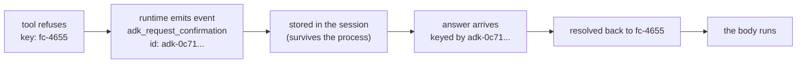

# 3.1 — The question has to be written down somewhere

## One-line answer

A pause only works if the question survives the process that asked it, so the gate writes a
**pending record keyed by the function call's id**, and that key is what lets an answer arriving
later — from another process, on another machine — find the call it belongs to.

## The story

Before an operation the nurse brings a form and reads it to you.

It says what is going to be done, and it says which side. Left knee. She reads that part out loud
and asks you to say it back, and then you sign, and then — this is the part that surprised me the
first time I saw it — somebody draws an arrow on your leg with a marker pen.

The form goes into the file. The file goes with you. When you reach the theatre, the person who
operates is not the person who took your consent, and they have never met you. They do not ask you
again, because you are by then in no condition to answer. They read the form.

Every step of that exists because the person who asks and the person who acts are not the same
person, and the gap between them can be hours. The consent has to be a **thing**, written down,
attached to the specific patient and the specific knee. A nurse remembering that you agreed is not
consent. It does not travel.

## The idea in plain language

Every gate so far in this day has been within one function call: the tool refuses, and you look at
the return value. That works in a script and it does not survive contact with a real system,
because the answer does not come back within the call.

The approver is a person. They will answer after your process has finished, or restarted, or been
replaced by a different pod. Day 60 established the distinction this rests on — the **run** is not
the **process**, and a run that outlives its process must have its state written down somewhere the
next process can read
([`days/day-60-durable-execution/`](../../../day-60-durable-execution/LESSON.md)). Day 61 made that
concrete with checkpoints.

So a gate needs a **pending record**: a written statement that a specific call is waiting for a
specific answer. And a pending record needs a **key** — something that identifies which call it is
about, so that when an answer turns up, it can be matched to the right one.

The obvious wrong keys are worth naming, because each of them is somebody's first attempt:

- **The tool name.** `close_ticket` is waiting. Two tickets in flight and you cannot tell which
  approval answers which.
- **The ticket id.** Better, and still wrong: one ticket can produce two proposals — a refund and a
  reply — and they need separate answers.
- **The run id.** Wrong in the other direction: one run can be waiting on more than one thing.

The right key identifies **one call**: this invocation of this tool with these arguments. ADK
already has such an identifier, because every function call a model emits carries an `id`, and that
is what the framework keys the pending confirmation by.

One term, defined once: a **function call id** is the identifier attached to a single tool call in
the conversation — generated by the model or the runtime, unique within the run, and present on both
the request and the response. It is the correlation id for one call, and Day 22's structured logging
taught the general habit of carrying one
([`days/day-22-structured-logging/`](../../../day-22-structured-logging/LESSON.md)).

## Why Sutra needs it

The desk is meant to run unattended. A ticket arrives at night, the graph runs, it reaches the reply
station, and the policy says a human must approve. Nobody is going to be there. The process should
end — holding a process open waiting for a person is the bug Day 61 spent a section on — and the
question should still be answerable in the morning by a shift lead who was never part of that run.

That only works if the question is a record with a key. Section 4 puts the same requirement inside a
graph, and part [5.1](../05-the-record/5.1-the-decision-is-already-written-down.md) shows that once
the record exists, the audit trail is something you read back rather than something you write.

## The mechanism

When the gated tool refused in part [2.2](../02-the-tool-gate/2.2-what-comes-back-when-the-tool-refuses.md),
it wrote into a side channel on the tool context. That side channel is a dictionary, and its **key**
is the thing this part is about:

```bash
cd days/day-64-approval-gates-build/lab
uv run python pending.py
```

**Line by line:**

- `pending.py` calls the gated tool once, with a deliberately recognisable call id — `fc-4655`,
  from `_replay.CALL_ID` — so that the key is readable in the output rather than a random string.
- It iterates `ctx.actions.requested_tool_confirmations.items()`, which is a mapping from call id to
  confirmation. Printing the key and the fields separately is the point: the fields are the question,
  the key is what the question is about.

Measured on 2026-09-06:

```text
what the tool wrote when it refused:

  keyed by function_call_id  fc-4655
  hint                       'Please approve or reject the tool call close_ticket() by responding with a FunctionResponse with an expected ToolConfirmation payload.'
  confirmed                  False
  payload                    None
```

`keyed by function_call_id  fc-4655`. Not by the tool name, not by the ticket, not by the run. By
the call.

That dictionary lives on the tool context for the duration of the call and would vanish with it. The
runtime's job is to turn it into something durable, and it does that by emitting an **event** — and
events are what a session stores. The second half of `pending.py` hands the pieces to ADK's own
`generate_request_confirmation_event` and prints the result:

```text
the event the client receives:

  long_running_tool_ids  {'adk-0c710636-36be-453d-9dcd-a9d13d726627'}
  function_call.name     adk_request_confirmation
  function_call.id       adk-0c710636-36be-453d-9dcd-a9d13d726627
```

Three things worth reading slowly.

**The event is itself a function call**, named `adk_request_confirmation`. The request for approval
is not a special message type outside the conversation; it is a call, in the same stream as every
other call, which is why it gets stored and replayed like everything else.

**It has its own id**, a fresh `adk-` identifier, distinct from `fc-4655`. So there are now two ids
in play: the call being asked about, and the question asking about it. Conflating them is a
recurring bug — the answer comes back keyed by the *question's* id, and has to be resolved back to
the *call's* id before anything can run.

**`long_running_tool_ids`** contains that question id. This is how the runtime is told *do not wait
for this one to return* — it is the same mechanism a long-running tool uses, which is why an
approval and a job that takes a long time are the same shape to ADK. The run can end. The question
outlives it.



## When it breaks

The break is what happens when the key is not unique, and it is quiet.

`_adk.context` defaults its call id to `fc-1`. Call the gated tool twice in one run with that
default and both pending records land under the same key — the second overwrites the first. One
question is silently lost, and the answer to the survivor is applied to whichever call the code
happens to look at.

You can watch the collision directly:

```bash
cd days/day-64-approval-gates-build/lab
uv run python -c "
import asyncio, _actions, _adk, _policy
from google.adk.tools import FunctionTool


def gate_close(ticket_id: str, resolution: str) -> bool:
    return _policy.needs_approval('close_ticket', {'resolution': resolution})


async def main():
    ic = await _adk.invocation()
    tool = FunctionTool(_actions.close_ticket, require_confirmation=gate_close)
    ctx = _adk.context(ic)
    for ticket in ('4655', '4699'):
        await tool.run_async(
            args={'ticket_id': ticket, 'resolution': 'refund'}, tool_context=ctx
        )
    print('pending keys:', list(ctx.actions.requested_tool_confirmations))


asyncio.run(main())
"
```

**Line by line:**

- The two calls share **one** `ToolContext`, and therefore one default call id. That is the mistake
  being reproduced: in real code it happens when a context is built once and reused across a loop.
- Two different tickets, two genuinely different questions, both gated.
- Printing the keys rather than the values is enough — if there are two questions there must be two
  keys.

Measured on 2026-09-06:

```text
pending keys: ['fc-1']
```

One key. Two refunds were proposed and one question exists. Nothing raised, nothing warned. The
shift lead will see a single approval request, approve it, and one of the two refunds will go out —
and which one depends on code neither of you has read.

The fix is that the call id must come from the call, never from a default. In a real run the model
supplies it and this cannot happen; it happens in the code *around* the framework, in retry
wrappers and batch loops that reuse a context they should have rebuilt.

## In production

**What a professional writes instead.** The pending record is a row in a store with the call id as
its primary key, so a duplicate is a constraint violation rather than an overwrite. That single
choice converts this entire failure mode from silent to loud, and it costs nothing.

**What degrades at scale.** Pending records accumulate. Every proposal that is never answered stays
in the store for ever unless something expires it, and the ones nobody answers are exactly the ones
nobody is watching. Give a pending record a state and an age from the beginning, and decide what
happens to an old one — part [7.2](../07-in-production/7.2-the-deadline-the-approval-must-beat.md)
measures the pile.

**The failure mode that only appears with real traffic.** Call ids are unique *within a run*, which
is not the same as globally unique. Two runs can each have a call whose id is `fc-1`. Key your store
on the pair (run, call) or on a genuinely unique value, or the first time two nightly jobs overlap
you will apply one shift lead's approval to another run's refund.

**The review comment a senior engineer leaves:** *"The pending record is keyed by ticket id. One
ticket can produce a refund and a reply in the same run, and both are gated. When the approval comes
back you will not know which one it answers — key it on the call."*

**The interview question:** *"Your agent pauses for a human. Where does the question live while it
waits?"* An honest answer: *"In a record with a key, not in the process. The process ends — you
cannot hold one open for however long a person takes. In ADK the tool writes a pending confirmation
keyed by the function call id and the runtime turns that into a stored event, which is what lets an
answer arriving tomorrow find the call it belongs to. The mistake I have made is keying on something
coarser, like the ticket, and then being unable to tell which of two proposals an approval answered."*

## Check yourself

```bash
cd days/day-64-approval-gates-build/lab
uv run python pending.py
```

Find the two different ids in that output and say what each one identifies.

**Out loud, without scrolling up:** why can the pending record not be keyed by the tool name, and
why can it not be keyed by the run?

**Next:** [3.2 — The request carries a copy of the call](3.2-the-request-carries-a-copy-of-the-call.md).
