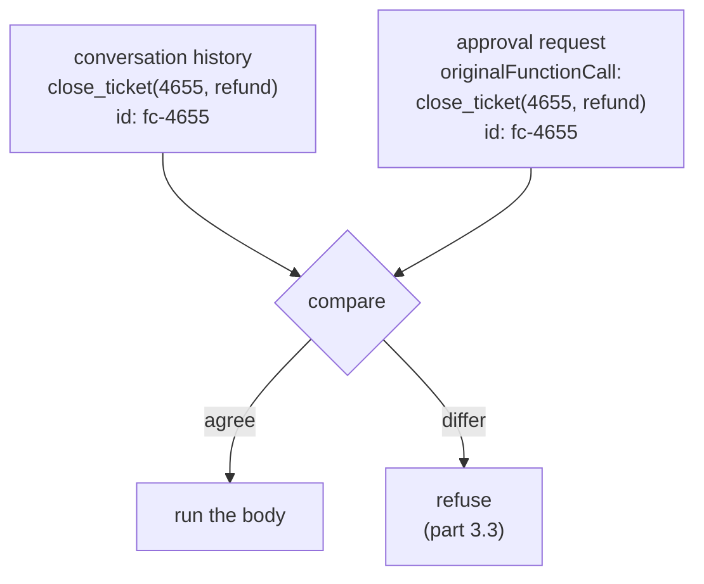

# 3.2 — The request carries a copy of the call

## One-line answer

The approval request does not merely point at the call it is about — it carries a **full copy of the
call's name and arguments** inside itself, and that redundancy is what makes it possible to check
later that the answer and the action still match.

## The story

Write a cheque and you write the amount twice.

Once in the box on the right, in figures: `4,500`. Once on the line in the middle, in words: *four
thousand five hundred only*. Then you draw a line through the empty space after the words, so nobody
can continue the sentence.

It feels like pointless duplication until you think about who is protected by it. The figures are
easy to alter — a five becomes a fifty-five with one stroke of a pen. The words are hard to alter,
because you would have to fit *fifty-five thousand* into a space sized for *four thousand five
hundred*, in someone else's handwriting, without the ink looking wrong.

The bank does not trust either version on its own. It compares them. If the two disagree, the cheque
is not honoured, and — this is the part that matters — the bank does not have to work out which
version is the real one. It only has to notice that they differ.

That is the whole design. You do not prevent tampering by making one copy tamper-proof. You make two
copies that a tamperer would have to change consistently, and then you check them against each other.

## The idea in plain language

Part [3.1](3.1-the-question-has-to-be-written-down.md) established that a pending record needs a key
so an answer can find its call. That is enough to route an answer, and it is not enough to trust one.

A key only says *which* call. It says nothing about *what that call was*. If the pending record holds
only `fc-4655`, then an answer arriving later says, in effect, "yes to whatever `fc-4655` was" — and
whether that is safe depends entirely on nothing having changed in between.

Things do change in between. The run may have been resumed from a checkpoint written by different
code (Day 61's version-stamp problem). The arguments may have been reconstructed rather than
restored. Somebody may have edited the request on the way to the approver, or on the way back.

So the request carries a copy. Inside the approval request event, alongside the question, sits the
**original function call**: its name, its id, and its arguments, in full. Two records of the same
call now exist — the one in the conversation history, and the one embedded in the question — and
they can be compared.

This is a general pattern with a name worth knowing: **binding**. An approval is bound to the exact
thing it approves, rather than floating free as a yes that any action can claim. The consent form in
part 3.1 said *left knee* for the same reason a cheque says the amount twice.

One term, defined once: **`originalFunctionCall`** is the field inside the approval request holding
that copy. The name is camel-case because the field travels over the wire as JSON, and ADK's models
alias Python's snake-case names to camel-case on the way out.

## Why Sutra needs it

Sutra's gated action is a refund reply to a customer. Between the moment the desk proposes it and
the moment a shift lead answers, the run has been checkpointed, the process has ended, and a new
process has picked the run back up — every one of those a place where the arguments could come back
different from how they went in.

Part [3.3](3.3-approve-one-thing-execute-another.md) is where this stops being theoretical: it hands
the framework four approvals, one of them with the arguments edited, and shows what the comparison
catches. Without the copy there would be nothing to compare, and all four would be accepted.

## The mechanism

The copy is visible in the event a client receives, which `pending.py` prints in full:

```bash
cd days/day-64-approval-gates-build/lab
uv run python pending.py
```

**Line by line:**

- The second half of the script builds the real approval-request event using ADK's own
  `generate_request_confirmation_event`, so what is printed is the framework's construction, not a
  hand-written imitation of it.
- It dumps `function_call.args` as indented, key-sorted JSON, because the structure is the subject —
  a one-line repr would hide the nesting that this part is about.

Measured on 2026-09-06:

```text
  function_call.args:
    {
      "originalFunctionCall": {
        "args": {
          "resolution": "refund",
          "ticket_id": "4655"
        },
        "id": "fc-4655",
        "name": "close_ticket"
      },
      "toolConfirmation": {
        "confirmed": false,
        "hint": "Please approve or reject the tool call close_ticket() by responding with a FunctionResponse with an expected ToolConfirmation payload."
      }
    }
```

The request has two halves and they do different jobs.

**`toolConfirmation`** is the question — the fields from part
[2.2](../02-the-tool-gate/2.2-what-comes-back-when-the-tool-refuses.md), with `confirmed: false`
meaning *nobody has answered yet* rather than *no*, as part
[2.3](../02-the-tool-gate/2.3-a-rejection-is-not-a-failure.md) established.

**`originalFunctionCall`** is the copy. `name: close_ticket`, `id: fc-4655`, and the arguments in
full: `resolution: refund`, `ticket_id: 4655`. Everything needed to reconstruct exactly what was
proposed, embedded in the question about it.

Notice what this buys immediately, before any tampering is considered. The approver's client does
not have to go and look up what `fc-4655` was. The request is **self-describing** — you could show
it to a person, or write it to a file, or put it on a queue, and it would still say what it is
about. That is why the same structure works whether the approver is a UI, a chat message or a row in
a database.

And notice the redundancy. The id `fc-4655` appears as the key of the pending record *and* inside
the copy. The arguments exist in the conversation history *and* inside the copy. Both facts are
written twice, in two places, by two paths — exactly the cheque.



## When it breaks

The copy is only useful if something compares it. A gate that reads `confirmed` and nothing else has
the copy sitting right there in the payload and ignores it.

That failure has no error text, because nothing fails — which is precisely the problem, and part
[3.3](3.3-approve-one-thing-execute-another.md) measures it directly.

What does break loudly is the shape. The field is `originalFunctionCall`, not
`original_function_call`, in the serialised form. Read it with the Python name and you get nothing:

```bash
cd days/day-64-approval-gates-build/lab
uv run python -c "
import warnings

warnings.filterwarnings('ignore', message=r'.*EXPERIMENTAL.*')
import _replay

args = _replay.confirmation_event('close_ticket', {'ticket_id': '4655'}).content.parts[0].function_call.args
print('camel :', args.get('originalFunctionCall'))
print('snake :', args.get('original_function_call'))
"
```

**Line by line:**

- `_replay.confirmation_event` builds the same event shape the runtime does, dumping the model with
  `by_alias=True` — which is what produces the camel-case key.
- The `warnings.filterwarnings` line suppresses the `[EXPERIMENTAL]` notice from part
  [2.1](../02-the-tool-gate/2.1-one-argument-turns-a-tool-into-a-gate.md); without it the notice is
  the first line of the output and the two lines that matter are the second and third.
- Reading both spellings side by side is the whole demonstration: one returns the call, the other
  returns `None`.

Measured on 2026-09-06:

```text
camel : {'id': 'fc-4655', 'args': {'ticket_id': '4655'}, 'name': 'close_ticket'}
snake : None
```

`None`, not a `KeyError`. Code written with the snake-case name does not crash — it reads `None`,
skips the comparison it was supposed to make, and approves. A validation step that silently does
nothing is worse than no validation step, because a reviewer reading the code sees a check.

## In production

**What a professional writes instead.** They do not compare the two copies field by field at the
call site. They compute a **fingerprint** of the proposal — a hash over the action name and the
canonicalised arguments — store it on the pending record, and recompute it before executing. One
value to compare, computed the same way in both places. Canonicalised matters: sort the keys and
normalise types, or the same call hashes two ways depending on dictionary ordering.

**What degrades at scale.** The copy is duplicated data, and for large arguments — a drafted reply
is several hundred characters, an attachment is worse — you are storing the payload twice per
proposal. At volume, store the fingerprint rather than the full copy, and keep the full copy only
where a human has to read it.

**The failure mode that only appears with real traffic.** Arguments that are not stable under a
round trip. A float that serialises differently, a dict whose key order changes, a timestamp
generated inside the tool rather than passed into it — each makes an honest proposal fail its own
comparison. The first production incident with a bound approval is almost never an attacker; it is a
mismatch you created yourself, and it fails closed, so the symptom is refunds not going out.

**The review comment a senior engineer leaves:** *"We store the call id on the pending record and
nothing else. That means an approval authorises an id, not an action. Put the arguments — or a hash
of them — on the record, and compare before you execute."*

**The interview question:** *"An approval comes back an hour later. How do you know it approves the
thing you are about to do?"* An honest answer: *"Because the approval is bound to the proposal, not
just addressed to it. The request carries a full copy of the call — name, id, arguments — so you can
compare what was approved against what you are about to run. In ADK that copy is
`originalFunctionCall` inside the confirmation request. In our own code we store a hash of the
canonicalised arguments on the pending record and recompute it before executing, because comparing
one value is harder to get wrong than comparing a structure."*

## Check yourself

```bash
cd days/day-64-approval-gates-build/lab
uv run python pending.py
```

Find every place `fc-4655` appears in that output, and every place the arguments appear. Count them.

**Out loud, without scrolling up:** the approval request stores the call's arguments even though the
conversation history already has them. What does the duplication make possible?

**Next:** [3.3 — Approve one thing, execute another](3.3-approve-one-thing-execute-another.md).
