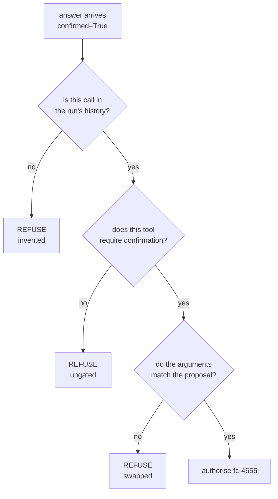

# 3.3 — Approve one thing, execute another

## One-line answer

A gate that only reads `confirmed` accepts an approval for a call that was never made, for a tool
that never needed one, and for arguments that were edited on the way back — **four out of four**
against ADK's own validator's one out of four.

## The story

You rent a flat. The agreement is eleven pages and you read it, slowly, at the table in the broker's
office, with your landlord sitting opposite.

Page four is the one you argued about: the rent, the increase at renewal, and the notice period.
You got the increase down from ten per cent to seven. You initial the bottom of every page and sign
the last one, and the broker takes the file away to have it stamped.

Two months later something comes up and you go back to the file. Page four says ten per cent.

Your initials are on it. The paper is the same paper, the font is the same font, the page number is
right. Somebody printed a new page four and put it in the file before it was stamped, and nothing
about the document as an object tells you that happened — the signature at the end was never a
signature on *page four*. It was a signature on *the file*, and the file's contents changed after
you signed.

This is why initialling every page exists. Not because anybody enjoys it. Because a signature that
does not bind to specific content is a signature on whatever the content turns out to be.

## The idea in plain language

Part [3.2](3.2-the-request-carries-a-copy-of-the-call.md) showed that the approval request carries a
full copy of the call it is about. This part is about what happens when nobody looks at it.

The gate everybody writes first is this:

```
if all(c.confirmed for c in confirmations.values()):
    run_it()
```

Read it charitably. It checks that every confirmation in hand says yes. It looks like a security
check. It is not one, because it never asks **what** those confirmations are confirmations *of*.

There are at least three separate attacks that walk straight past it, and they are worth keeping
apart because they need different defences:

- **Swapped arguments.** An approval that honestly answers a real question, returned with the
  arguments changed. The shift lead approved closing ticket 4655 with a *note*; what comes back
  claims approval for closing it with a *refund*.
- **An approval for the wrong tool.** A confirmation harvested from a call that genuinely needed one,
  presented as approval for a tool that never asked. Or, worse, an approval offered for a tool that
  needs no approval at all — accepting it means your gate believes an approval it did not request.
- **An invented call.** An approval for a call id that appears nowhere in the run's history. Nothing
  proposed it, nobody was asked about it, and the answer arrives anyway.

The general name for the first one is **time-of-check-to-time-of-use**, usually shortened to TOCTOU:
the gap between checking a thing and acting on it, during which the thing can change. On this desk
the gap is however long a person takes to answer, which is the longest gap in the whole system.

One term, defined once: **validation** here means confirming that an incoming answer corresponds to
a question this run actually asked, about a call this run actually proposed, with the arguments it
was proposed with. It is a different activity from reading the yes/no, and it has to happen first.

## Why Sutra needs it

Phase 9's gate says *a human approved the write*. Day 65 audits it. A desk whose gate accepts an
approval for a call nobody proposed cannot honestly claim that sentence — it can claim that
something arrived saying yes.

And the desk's gap is real. The proposal is checkpointed, the process ends, the answer arrives over a
different path in a different process. Every one of those hops is somewhere a payload can be edited,
replayed or fabricated, and the run has no memory of the conversation except what it reads back out
of storage.

## The mechanism

ADK ships a validator, and `toctou.py` drives it directly with four incoming approvals — one honest,
three not.

```bash
cd days/day-64-approval-gates-build/lab
uv run python toctou.py
```

**Line by line:**

- The script imports `_resolve_confirmation_targets` from
  `google.adk.flows.llm_flows.request_confirmation`. That is the framework's own function for
  turning an incoming answer into the set of calls it authorises — so what is measured is ADK's real
  behaviour, not a re-implementation.
- Each case builds a **call event** and a **confirmation event** with `_replay`, then hands both plus
  the answer to the validator. The call event is the run's history; the confirmation event is the
  question that was asked about it.
- The `swapped` case is the interesting construction: the call event says `resolution: note`, and the
  confirmation event claims to be about `resolution: refund`. Same call id, different arguments —
  page four, reprinted.
- The `invented` case builds its call event with the id `fc-x` while the answer claims `fc-4655`, so
  the id being answered is absent from the history.

Measured on 2026-09-06:

```text
validator: ADK _resolve_confirmation_targets

  honest     ACCEPTED  for call ids ['fc-4655']
  swapped    REFUSED   ValueError: Function call arguments mismatch for ID 'fc-4655'.
  ungated    REFUSED   ValueError: Tool 'read_ticket' does not require confirmation.
  invented   REFUSED   ValueError: Original function call for ID 'fc-4655' not found in session history.
```

One accepted, three refused, and each refusal names a different check:

**`Function call arguments mismatch for ID 'fc-4655'`** — the framework compared the arguments in the
confirmation request against the arguments in the call event and found them different. This is part
3.2's copy being used for exactly what it exists for. Without the copy there would be nothing to
compare and this line could not exist.

**`Tool 'read_ticket' does not require confirmation'`** — an approval was offered for a tool the
policy does not gate, and it was refused rather than shrugged off. That is stricter than it first
looks, and it is right: an approval you did not ask for is evidence that something has gone wrong,
not a harmless extra.

**`Original function call for ID 'fc-4655' not found in session history`** — the id being answered
does not exist in this run. Nothing proposed it.

Now the same four cases past the gate everybody writes first. The script's `--no-checks` arm replaces
the validator with `naive_accept`, which is the two-line version from the top of this part:

```bash
cd days/day-64-approval-gates-build/lab
uv run python toctou.py --no-checks
```

**Line by line:**

- `--no-checks` switches only the validator. The four cases, the events and the answers are byte for
  byte identical to the run above.
- `naive_accept` is `all(c.confirmed for c in confirmations.values())` — the whole of it.

Measured on 2026-09-06:

```text
validator: confirmed == True

  honest     ACCEPTED
  swapped    ACCEPTED
  ungated    ACCEPTED
  invented   ACCEPTED
```

**Four out of four.** The refund goes out on arguments the approver never saw, on a call nobody
proposed, on an approval for a different tool. No exception, no log line, no difference in the return
value. The two-line gate and the real validator agree exactly on the honest case, which is why this
bug survives testing: the happy path is identical.



## When it breaks

The validator's strictness is not free, and the way it breaks in practice is a **false refusal** on
an honest approval.

Any argument that does not survive the round trip unchanged trips the arguments-mismatch check. A
drafted reply that gets whitespace-normalised by the client. A number that goes out as `4655` and
comes back as `"4655"`. A dict whose keys are reordered by a JSON library. Each produces:

```text
ValueError: Function call arguments mismatch for ID 'fc-4655'.
```

on a proposal that a real person really did approve. The refund does not go out, the approver is
certain they clicked yes, and the log says the arguments were tampered with. The first time you meet
this line it will almost certainly be your own serialisation, not an attacker.

That is the correct direction to fail — a gate that fails closed on ambiguity is doing its job — but
it means the check needs an operational answer, not just a code answer: a refused approval must be
visible to somebody, with both versions of the arguments, or the ticket simply stops moving and
nobody knows why.

## In production

**What a professional writes instead.** They never hand-roll this comparison. They keep the
proposal's fingerprint on the pending record (part 3.2), recompute it from the arguments about to be
executed, and compare the two — and they canonicalise before hashing: sorted keys, normalised
whitespace, explicit types. Then a mismatch is one boolean rather than a structural diff, and the
canonicalisation rules live in one function that both sides call.

**What degrades at scale.** The history lookup is the expensive check. Finding "the original function
call for id X" means reading the run's events, and for a long run that is a lot of events to scan for
one id. Index the pending records by call id rather than searching history, and keep the history
check as the authority for the cases the index cannot answer.

**The failure mode that only appears with real traffic.** Approvals arriving out of order, or twice,
or for runs that have already finished — because the transport between your approver and your runtime
is a network, and networks reorder and duplicate. The arguments check passes, the history check
passes, and the approval is still wrong because it is *late*. Bind the approval to the run's state as
well as to the call: part [3.4](3.4-one-approval-delivered-twice.md) is the duplicate case, and part
[7.2](../07-in-production/7.2-the-deadline-the-approval-must-beat.md) is the late one.

**The review comment a senior engineer leaves:** *"This reads `confirmed` and executes. It never
checks that the approval is for this call, this tool, or these arguments. Right now anything that
can put a `confirmed: true` on the queue can make us refund a customer. Use the framework's resolver
or write the three checks yourself, and add a test for the swapped-arguments case specifically —
the happy path will not catch it."*

**The interview question:** *"What is time-of-check-to-time-of-use, and where does it show up in an
agent with a human approval step?"* An honest answer: *"It is the gap between validating something
and acting on it, during which the thing can change. In an agent the gap is enormous — a person
takes as long as they take, and the run is checkpointed and resumed in between. The specific bug is
approving one call and executing another: the shift lead approves a note, the arguments come back as
a refund, and a gate that only reads the yes/no accepts it. I measured our naive version accepting
all four of a swapped, an ungated, an invented and an honest approval, where ADK's own resolver
accepts one. The fix is binding — the approval carries a copy of the call, and you compare before
you execute."*

## Check yourself

```bash
cd days/day-64-approval-gates-build/lab
uv run python toctou.py
uv run python toctou.py --no-checks
```

Now change `NOTE` in `toctou.py` to `{"ticket_id": "4655", "resolution": "credit"}` — still a gated
resolution — and re-run both arms. Say why the verdict does not change.

**Out loud, without scrolling up:** name the three checks the validator makes, and say which one the
copy from part 3.2 makes possible.

**Next:** [3.4 — One approval, delivered twice](3.4-one-approval-delivered-twice.md).
