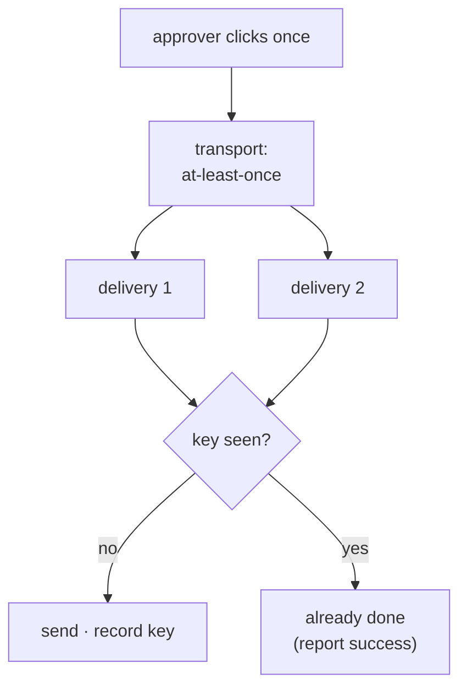

# 3.4 — One approval, delivered twice

## One-line answer

The approver clicks once and the answer arrives twice, because the transport between them and your
runtime guarantees *at least once* and never *exactly once* — and without a key, one approval sends
the customer two emails.

## The story

You are at the counter of a shop paying by card. The machine beeps, the screen says something
unhelpful, and the boy holding it frowns and says it did not go through.

So you tap again. This time it prints a slip and everyone is satisfied.

On the way home your phone buzzes twice, one after the other, with two messages from your bank. Two
debits. Same shop, same amount, a few seconds apart.

Nobody did anything wrong, and nothing in the shop knows anything is wrong. The first tap reached
the bank and the bank moved the money; what failed was the message coming *back* to the machine.
From where you and the boy were standing, "the payment failed" and "the confirmation failed" looked
exactly the same, and the only action available to either of you was to try again.

Getting the money back takes a phone call and some days. The interesting part is that the fix was
never going to be at your end. You cannot tell the difference between those two failures. Only the
bank can, and only if it wrote down that it had already seen this payment.

## The idea in plain language

Everything in section 3 so far has assumed one answer arrives once. That assumption does not hold.

An approval travels from a person to your runtime, and the path is a network — a browser, an HTTP
request, possibly a queue, possibly a retry wrapper in between. Each of those hops can deliver a
message and then fail to record that it did. When that happens, the sending side retries, because
the alternative is losing the message altogether.

That trade-off has a standard name. A transport gives you either **at-most-once** delivery (never
duplicated, sometimes lost) or **at-least-once** (never lost, sometimes duplicated). Almost
everything real chooses at-least-once, because losing an approval is worse than repeating one — and
having chosen it, the duplicates are now your problem.

ADK's own documentation says this out loud for the resume path, on `adk.dev/runtime/resume/`,
fetched 2026-09-06:

> "Tools in an agent are run at least once, and may run more than once when resuming a workflow."

Two sources of duplication, then, and they compound:

- **The answer arrives twice.** The approver double-clicks, or the queue redelivers.
- **The run resumes twice.** Day 60 measured this directly: a resumed run re-executes work, and
  which work depends on `rerun_on_resume`
  ([`days/day-60-durable-execution/`](../../../day-60-durable-execution/LESSON.md)).

"Exactly once" is not a property you can buy from a transport. It is something you construct, and
the construction has a name: **idempotency**, which means an operation can be applied more than once
without changing the result beyond the first application. Reading a ticket is naturally idempotent.
Sending an email is not, and never will be, because the effect leaves your system.

One term, defined once: an **idempotency key** is a value that names *the thing being done* rather
than *this attempt at doing it*. You record the key when the effect happens, and check it before
doing the effect again. Part [3.5](3.5-the-key-names-the-decision.md) is entirely about choosing it.

## Why Sutra needs it

Sutra's gated action is a reply that leaves the building. Part
[1.2](../01-the-policy-is-data/1.2-the-policy-is-a-file-not-a-habit.md) records the reason in the
policy file itself — *"leaves the building and cannot be recalled"* — and that sentence is exactly
why a duplicate matters here more than anywhere else in the system. A duplicated memory write is
noise. A duplicated refund is money, twice.

Day 65's gate asks whether the write is idempotent under a double resume. This part is where that
question gets its measurement, and part
[6.3](../06-wiring-the-desk/6.3-the-check-that-goes-red-when-the-gate-goes.md) turns it into a check
that goes red.

## The paper behind it

> **Principles of transaction-oriented database recovery** · `doi:10.1145/289.291` · 1983 ·
> <https://doi.org/10.1145/289.291>

Its claim, in one sentence: a system that survives failure needs its state changes to be **atomic and
durable**, so that after a crash every effect either happened completely or did not happen at all,
and a recovery procedure can tell which.

Day 47 teaches it:
[`papers/01-transaction-oriented-recovery.md`](../../../day-47-persistent-sessions/papers/01-transaction-oriented-recovery.md).
The idea this part borrows is the second half of that sentence — recovery only works if the system
wrote down what it had already done. An idempotency key is that record, for an effect that lives
outside the database and cannot be rolled back.

## The mechanism

`twice.py` applies one approval twice, which is the smallest honest model of a double delivery.

```bash
cd days/day-64-approval-gates-build/lab
uv run python twice.py
```

**Line by line:**

- `APPROVAL` is a single dict, defined once and passed to `apply()` twice. That matters: this is
  *one* approval delivered twice, not two approvals. Nothing about the payload differs between the
  deliveries, because in the real failure nothing does.
- `apply()` with `keyed=False` goes straight to `_actions.send_reply`, the ledger-appending function
  from part [2.1](../02-the-tool-gate/2.1-one-argument-turns-a-tool-into-a-gate.md).
- The script prints the ledger rather than a return value, for the reason part 2.1 gave: the return
  value cannot tell you whether the effect happened.

Measured on 2026-09-06:

```text
idempotency key: off

  delivery 1   sent
  delivery 2   sent

  effects           [('send_reply', '4655', 'email'), ('send_reply', '4655', 'email')]
  replies sent      2
  customer receives 2 email(s) for one approval
```

Two rows in the ledger. One shift lead, one click, one decision — and the customer's inbox has two
copies of a refund confirmation.

Notice what did **not** protect against this. The policy was correct. The gate fired. A human was
asked and really did approve. Everything section 1, 2 and 3.3 built worked exactly as designed, and
the outcome is still wrong, because none of those mechanisms were about *how many times*.

Now the same script with the key turned on:

```bash
cd days/day-64-approval-gates-build/lab
uv run python twice.py --keyed
```

**Line by line:**

- `--keyed` makes `apply()` compute `key_for(approval)` and check it against `SENT_KEYS` before doing
  anything.
- The check and the record are on either side of the effect: check, add, then send. Part
  [3.5](3.5-the-key-names-the-decision.md) is about the order and the key's construction, which are
  both load-bearing.

Measured on 2026-09-06:

```text
idempotency key: on

  delivery 1   sent
  delivery 2   already done

  effects           [('send_reply', '4655', 'email')]
  replies sent      1
  customer receives 1 email(s) for one approval
```

One row. The second delivery returns `already done` — not an error, not a refusal. The correct
response to a duplicate is to report success, because from the caller's point of view the thing they
asked for has happened. Returning an error would make the sender retry again, which is the same bug
one level up.



## When it breaks

The key exists and the duplicate still gets through, because the check and the effect are not atomic.
Two deliveries arriving at the same moment both read the key set before either has written to it:

```bash
cd days/day-64-approval-gates-build/lab
uv run python -c "
import threading

import _actions
import twice

_actions.reset()
twice.SENT_KEYS.clear()
both_checked = threading.Barrier(2)


def worker():
    key = twice.key_for(twice.APPROVAL)
    seen = key in twice.SENT_KEYS
    both_checked.wait()
    if not seen:
        twice.SENT_KEYS.add(key)
        _actions.send_reply('4655', 'email', 'Your refund is on its way.')


threads = [threading.Thread(target=worker) for _ in range(2)]
for t in threads:
    t.start()
for t in threads:
    t.join()
print('  effects        ', _actions.EFFECTS)
print('  replies sent   ', len(_actions.EFFECTS))
"
```

**Line by line:**

- `threading.Barrier(2)` forces the interleaving that in production happens by luck: both workers
  complete their `key in SENT_KEYS` check before either is allowed past. Without the barrier this
  race is real but intermittent, and an intermittent demonstration teaches nothing.
- `seen` is captured **before** the barrier, which is the bug being reproduced — the decision is made
  on a reading of the set that is already stale by the time it is acted on.
- The key and the effect are the same ones `twice.py` uses, so the only difference from the `--keyed`
  arm is concurrency.

Measured on 2026-09-06:

```text
  effects         [('send_reply', '4655', 'email'), ('send_reply', '4655', 'email')]
  replies sent    2
```

The key is present, the code that reads it is correct, and the customer gets two emails anyway. The
window between the read and the write is where both slipped through. This is the race the paper above
is about, and the reason its answer is a transaction rather than a variable.

The fix is not a lock around the check. It is to make the *recording* of the key the thing that
fails when it is already there — an insert into a table with a unique constraint, so the second
insert raises and the second send never happens:

```bash
cd days/day-64-approval-gates-build/lab
uv run python -c "
import sqlite3

db = sqlite3.connect(':memory:')
db.execute('CREATE TABLE sent (key TEXT PRIMARY KEY)')
key = 'approval:4655|shift_lead|True'
db.execute('INSERT INTO sent VALUES (?)', (key,))
db.execute('INSERT INTO sent VALUES (?)', (key,))
"
```

**Line by line:**

- `key TEXT PRIMARY KEY` is the whole mechanism. The uniqueness is enforced by the store, not by the
  code that reads it, so two processes that never see each other still cannot both succeed.
- The second `INSERT` is the duplicate delivery. In real code it sits in a `try`, and the
  `except IntegrityError` branch is what returns `already done`.

Measured on 2026-09-06:

```traceback
Traceback (most recent call last):
  File "<string>", line 7, in <module>
sqlite3.IntegrityError: UNIQUE constraint failed: sent.key
```

The exception is the feature. A `try`/`except` around an insert is doing what a lock cannot do
across two processes, and this desk has two processes by design, because the run that proposes and
the process that resumes are not the same one.

There is a second, quieter break: the key is recorded **after** the effect. Send the email, then
record the key, and a crash in between leaves an effect with no record — so the retry sends it again
and the key never stops anything. Record first, then act, and accept the opposite failure (a
recorded key with no effect, which shows up as a reply that never went out) because that one is
visible and safe. Choosing which way to fail is the whole of this design.

## In production

**What a professional writes instead.** The idempotency key goes into the same transaction as the
work wherever that is possible, and where it is not — an email, an outbound HTTP call — they use the
**outbox pattern**: write the intent and the key transactionally, then have a separate sender
deliver it, so the durable record and the effect are ordered by construction rather than by hope.

**What degrades at scale.** The set of seen keys grows for ever. `SENT_KEYS` in the lab is a Python
set that dies with the process, which is fine for a demonstration and useless in production, where
the duplicate may arrive after a restart — that is the whole scenario. Keys need a store, and a store
needs an expiry, and the expiry has to be longer than the longest plausible retry window of every
transport in the path. Get that wrong and a late duplicate arrives after its key was cleaned up.

**The failure mode that only appears with real traffic.** Duplicates that are not duplicates. Two
genuinely separate approvals for the same ticket — a refund approved in the morning, a second refund
approved in the afternoon after the customer called back — hash to the same key if the key was built
from the ticket and the action. Now the second one is silently swallowed as `already done` and the
customer never gets their money. Suppressing a real action is as bad as duplicating one, and it is
much harder to notice.

**The review comment a senior engineer leaves:** *"We check the key and then send. Two workers will
both pass that check. Make the key an insert with a unique constraint and let the database refuse the
second one — and move the record before the send, so we fail towards not sending rather than towards
sending twice."*

**The interview question:** *"Your human approval arrives twice. What happens?"* An honest answer:
*"Without a key, the effect happens twice — I measured one approval producing two customer emails.
Transports give you at-least-once, so duplicates are not an edge case, they are the contract, and
ADK's own docs say tools may run more than once on resume. So the write has to be idempotent: a key
that names the decision, recorded before the effect, in a store where recording it twice is a
constraint violation rather than a second row. And the key has to be narrow enough that two genuine
approvals do not collide — swallowing a real refund is worse than the bug you were fixing."*

## Check yourself

```bash
cd days/day-64-approval-gates-build/lab
uv run python twice.py
uv run python twice.py --keyed
```

Now change `apply()` so the key is added to `SENT_KEYS` *after* `send_reply` rather than before, and
say which failure that trades for which.

**Out loud, without scrolling up:** why is returning an error for a duplicate delivery the wrong
answer, and what should the second delivery return instead?

**Next:** [3.5 — The key names the decision, not the attempt](3.5-the-key-names-the-decision.md).
