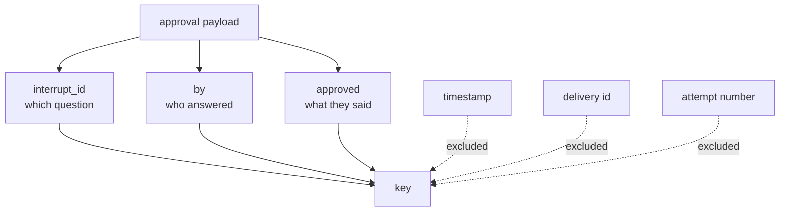

# 3.5 — The key names the decision, not the attempt

## One-line answer

An idempotency key built from the attempt suppresses nothing, and a key built too coarsely suppresses
a real second decision — the key has to name **which decision was made**, which on this desk is the
interrupt, the decider and the answer.

## The story

In the exam hall they pass round an attendance sheet.

It has your roll number printed on it, and one empty box beside it. You sign in the box. When it
comes past you a second time — because it goes up the row and back down — your box already has your
signature in it, so you pass it on.

Nobody is confused by this. The sheet is not asking *have you signed this sheet*. It is asking *is
this candidate present*, and once that is recorded, recording it again would either be pointless or a
different candidate's problem.

Now imagine two variants of the same sheet, both of which somebody has actually printed.

One has a fresh empty box for every pass of the sheet. It never stops anybody signing twice, because
each pass is a new box; the sheet records how many times it went round, not who was in the room.

The other has one box per *bench* rather than per candidate. Two people share a bench, the first
signs, and the second finds the box full and passes it on. The sheet now says one person was present
when two were.

The first sheet catches nothing. The second sheet loses somebody. The difference between them and the
real one is entirely in what the box is a box *for*.

## The idea in plain language

Part [3.4](3.4-one-approval-delivered-twice.md) established that the second delivery of an approval
must be recognised and dropped. This part is about the value you recognise it by, because the two
ways of getting it wrong fail in opposite directions.

**Too specific** — the key names *this attempt*. A fresh UUID per delivery, a timestamp, a retry
counter, the HTTP request id. Every delivery produces a different key, every key is unseen, and the
duplicate goes through. This is the sheet with a fresh box per pass. It looks like idempotency, it
costs a store, and it prevents nothing.

**Too coarse** — the key names something broader than one decision. The ticket id. The action name.
The pair of them. Two genuinely separate decisions about the same ticket now collide, the second is
swallowed as a duplicate, and an effect a human really did approve never happens. This is the sheet
with one box per bench, and it is the more dangerous mistake, because a suppressed action is
invisible: no error, no duplicate, just a customer who never got their refund.

The rule that lands between them: **the key is a function of what was decided, and of nothing else.**
Not of how the message travelled. Not of when it arrived. Not of how many times it has been tried.

Concretely, a decision on this desk is identified by three things:

| Component | Why it is in the key |
| --- | --- |
| The interrupt id | *Which question* was answered — the proposal, from part 3.1 |
| The decider | *Who* answered; two approvers answering the same question are two decisions |
| The answer | *What* they decided; an approval and a later rejection are not the same event |

One term, defined once: **derived**, as opposed to **assigned**. An assigned key is generated at the
moment of use and has to be carried alongside the message. A derived key is computed from the
message's own content, so two copies of one message produce it independently without having to agree
in advance. Derived is what you want here, because the two deliveries never meet.

## Why Sutra needs it

The desk's approvals arrive from outside the run — a shift lead answering in the morning a question
asked overnight — and they arrive over whatever transport the operations team wires up. Nothing in
this repository controls how many times that transport delivers.

So the key cannot depend on the transport cooperating. It has to be computable from the approval
itself, by whichever process happens to pick it up, with no coordination. Day 65's gate asks whether
the write survives a double resume, and part
[6.3](../06-wiring-the-desk/6.3-the-check-that-goes-red-when-the-gate-goes.md) makes it a check that
goes red when this key is removed.

## The mechanism

The key is four lines in `twice.py`, and the docstring is the argument:

```python
def key_for(approval: dict[str, str]) -> str:
    """The key names the decision, not the attempt.

    Two deliveries of one approval share an interrupt id and a decider; two genuinely separate
    approvals do not. That is the whole design: derive the key from what was decided.
    """
    return f"{approval['interrupt_id']}|{approval['by']}|{approval['approved']}"
```

**Line by line:**

- `approval['interrupt_id']` — the question's identifier, `approval:4655`. This is the part that ties
  the key to one proposal rather than to a ticket, which is the too-coarse mistake.
- `approval['by']` — the decider. Included so that two approvers answering the same question produce
  two keys, because those are two facts and an audit needs both. If your policy requires two
  approvals for one action, this is the component that makes that expressible.
- `approval['approved']` — the answer. A `True` and a later `False` for the same question are
  different decisions; without this component, an approval followed by a retraction would be
  swallowed as a duplicate of the approval.
- **Nothing else is in it.** No timestamp, no attempt number, no delivery id. Every one of those
  would make two deliveries of one decision produce two keys, which is the too-specific mistake.
- The separator is `|` and the parts are joined into a string, which is fine for a demonstration. In
  a store you would hash the canonicalised tuple instead — part
  [3.2](3.2-the-request-carries-a-copy-of-the-call.md) made the same point about fingerprints, and
  the reason is the same: one value is easier to index and compare than a structure.

Watch it separate a duplicate from a genuine second decision:

```bash
cd days/day-64-approval-gates-build/lab
uv run python -c "
import twice

first = twice.APPROVAL
again = dict(first)
second_decision = dict(first, approved=False)
other_approver = dict(first, by='duty_manager')
other_ticket = dict(first, interrupt_id='approval:4699')

for label, approval in [
    ('the same approval again', again),
    ('the opposite answer', second_decision),
    ('a different approver', other_approver),
    ('a different proposal', other_ticket),
]:
    same = twice.key_for(approval) == twice.key_for(first)
    print(f'  {label:<26} same key as the first: {same}')
"
```

**Line by line:**

- `again` is a fresh dict with identical contents — a genuine duplicate, built the way a redelivery
  would arrive: same content, no shared object identity.
- The other three each change exactly one component of the key, so each isolates one question: does
  the answer matter, does the decider matter, does the proposal matter.
- The comparison is against `key_for(first)`, so `True` means "would be suppressed as a duplicate"
  and `False` means "would be treated as a new decision".

Measured on 2026-09-06:

```text
  the same approval again    same key as the first: True
  the opposite answer        same key as the first: False
  a different approver       same key as the first: False
  a different proposal       same key as the first: False
```

One `True` and three `False`, which is exactly the discrimination the sheet in the story makes. The
redelivery collides and is dropped; every genuinely different decision gets its own key and is
allowed through.



## When it breaks

Add a timestamp to the key and the whole mechanism becomes decoration. It is a one-word change and it
raises nothing:

```bash
cd days/day-64-approval-gates-build/lab
uv run python -c "
import _actions
import twice

_actions.reset()
twice.SENT_KEYS.clear()
twice.key_for = lambda a: f\"{a['interrupt_id']}|{a['by']}|{a['approved']}|{a['at']}\"

for attempt in (1, 2):
    payload = dict(twice.APPROVAL, at=f'2026-09-06T09:0{attempt}:00Z')
    print(f'  delivery {attempt}   {twice.apply(payload, keyed=True)}')
print(f'  replies sent   {len(_actions.EFFECTS)}')
"
```

**Line by line:**

- The replacement `key_for` differs from the real one by one component: `a['at']`, the moment the
  approval was recorded.
- The two payloads differ only in that field, which is what a redelivery stamped on arrival looks
  like — the decision is identical, the arrival is not.
- `keyed=True` is passed, so the idempotency machinery is fully switched on. That is the point: this
  is not the unprotected arm.

Measured on 2026-09-06:

```text
  delivery 1   sent
  delivery 2   sent
  replies sent   2
```

Two replies, with the key check enabled and passing. `SENT_KEYS` now holds two entries and has
prevented nothing. A reviewer reading this code sees a key, a store and a check, and every one of
them is real; the bug is that the key answers *when did this arrive* rather than *what was decided*.

The opposite failure has no output to show, because its symptom is an absence: drop `approved` from
the key and a rejection that follows an approval for the same question is silently swallowed as a
duplicate. Nothing is logged, because as far as the code is concerned nothing happened.

## In production

**What a professional writes instead.** They hash a canonical form rather than concatenating with a
separator — `sha256` over a sorted, typed tuple — because `a|b` and `a` + `|b` are the same string
and a delimiter that can appear inside a component makes two different decisions collide. And they
put the key in the same place the effect is recorded, so there is one row that says both *what was
decided* and *that it was carried out*.

**What degrades at scale.** The key set becomes a table with a retention policy, and the policy is a
correctness decision rather than a housekeeping one: expire a key sooner than the longest retry
window in the path and a late duplicate is no longer recognised. Write the retention down next to the
transport's retry configuration, because the two are the same number.

**The failure mode that only appears with real traffic.** Approvers who click twice on genuinely
different things within the same question — approve, then immediately change their mind and reject.
With `approved` in the key both are recorded, which is right, and now your code has to decide what a
rejection *after* a completed send means. The key made the ambiguity visible; it did not resolve it.
That resolution is a policy question, and it belongs in Day 63's table rather than in this function.

**The review comment a senior engineer leaves:** *"The idempotency key includes `received_at`. That
means every redelivery is a fresh key and the table is doing nothing except growing. Derive the key
from the decision — question, decider, answer — and nothing about the delivery."*

**The interview question:** *"How do you choose an idempotency key?"* An honest answer: *"It has to
name the decision, not the attempt. Anything about the delivery — a timestamp, a request id, a retry
count — makes every duplicate look new, and the key prevents nothing while looking like it does. Too
coarse is worse: key on the ticket instead of the proposal and a real second approval gets swallowed,
which is silent. On our desk the key is the interrupt id, the decider and the answer, hashed, and I
can name what each component is there to distinguish. And it has to be derived from the payload
rather than assigned, because the two deliveries are handled by two processes that never talk."*

## Check yourself

```bash
cd days/day-64-approval-gates-build/lab
uv run python twice.py --keyed
```

Now remove `approval['by']` from `key_for` and say which real pair of decisions would start
colliding.

**Out loud, without scrolling up:** name the two ways an idempotency key can be wrong, and say which
one is silent.

**Next:** [4.1 — A node that stops and asks](../04-the-node-gate/4.1-a-node-that-stops-and-asks.md).
