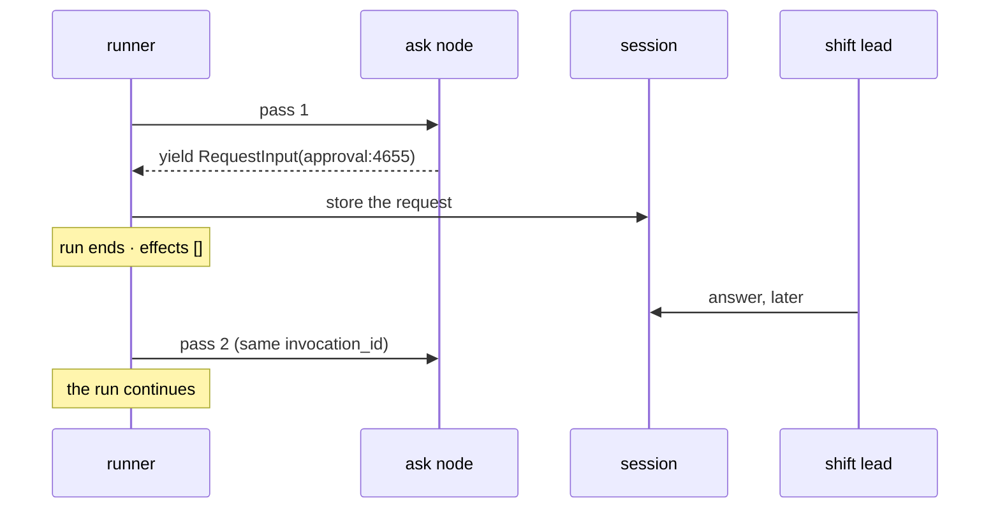

# 4.1 — A node that stops and asks

## One-line answer

Inside a graph the pause is not a tool argument but a node that **yields a `RequestInput`**, and the
run genuinely ends there — the process exits, the effects ledger is empty, and the question waits in
the session for whoever picks it up next.

## The story

At the level crossing near our town the gate is worked by hand.

When a train is due, the gateman winds the barrier down, and the road waits. That much everybody
knows. The part you only see if you are stuck there long enough is what happens when something is
wrong — a car stalled on the tracks, a barrier that will not come down.

He does not decide. He goes into the little cabin and picks up a phone that connects to exactly one
place, the station up the line, and he tells them. And then he waits, and the road waits with him,
and nothing at all happens until the answer comes back down the wire.

Two things about that cabin are worth carrying into today's mechanism.

The first is that the phone is **part of the crossing**, not a thing he brought. It is bolted to the
wall, it has one destination, and it exists precisely because the man at the gate is not the man who
decides. The crossing was designed knowing there would be moments it could not resolve on its own.

The second is that while he waits, he is not doing anything else. He is not half-lowering the
barrier. He has stopped, completely, at a defined point, and the state of the world is unambiguous to
everybody looking at it.

## The idea in plain language

Section 2 put the gate on a tool, where ADK does the pausing for you: you supply
`require_confirmation` and the framework arranges the rest.

A graph is different. Day 53 established that in ADK 2.x the composition layer is a **graph of
nodes**, with agents as one node type
([`days/day-53-graph-workflow-runtime/`](../../../day-53-graph-workflow-runtime/LESSON.md)), and Day
58 built the desk's triage graph out of them
([`days/day-58-triage-graph-v1/`](../../../day-58-triage-graph-v1/LESSON.md)). In that world the
thing that needs to stop is a **node**, and no tool is involved.

So there is a second mechanism, and it is the one Addendum 01 calls out as ADK-76: *HITL resumption
for standalone nodes*. A node stops by **yielding a `RequestInput`** — an object saying *I need an
answer before anything else happens*.

Three fields, verified by introspection against installed `google-adk==2.7.1` on 2026-09-06, where
`RequestInput` declares exactly `interrupt_id`, `payload`, `message` and `response_schema`:

- **`interrupt_id`** — the key. This is part
  [3.1](../03-binding-the-answer/3.1-the-question-has-to-be-written-down.md)'s question, in its graph
  spelling: the identifier an answer will be addressed to. You choose it, which means you can make it
  mean something (`approval:4655`) rather than accepting a generated string.
- **`message`** — what the human reads. Part
  [2.2](../02-the-tool-gate/2.2-what-comes-back-when-the-tool-refuses.md) complained that the tool
  path's default hint is written for whoever is integrating the client; here the sentence is yours.
- **`payload`** — the evidence. The slot that was `None` on the tool path. This is where the
  proposal goes so that the approver can see what they are approving.

One term, defined once: **to yield** here means the ordinary Python generator `yield`. A node that
yields rather than returns is producing events as it goes, which is plan §5.1's **trap #3** —
1.x custom agents collected events into a list and returned them, and 2.x nodes yield them as they
happen. For a `RequestInput` specifically, 2.7.1 is forgiving: a node that *returns* one pauses too,
measured on 2026-09-06. The habit is still `yield`, because a node that yields can emit a request and
then carry on emitting, and a node that returns has said its last word.

## Why Sutra needs it

The desk's write is the last station of a graph, not a tool an agent chose to call. Day 58 stopped at
a drafted reply precisely because there was nowhere safe to put the send. Part
[6.1](../06-wiring-the-desk/6.1-the-sixth-station.md) adds that station, and this is the mechanism it
is built from.

It also has to work overnight, which is the requirement that rules out every simpler design. A ticket
arrives, the graph runs, the reply is drafted, and the shift lead is at home. The process must end.
The question must not.

## The mechanism

The asking node is six lines and there is no framework ceremony in it:

```python
def ask():
    """Stop here and ask a human whether the drafted reply may go out."""
    yield RequestInput(
        interrupt_id=INTERRUPT,
        message="Send the refund reply for ticket 4655 to the customer by email?",
        payload={"ticket": "4655", "channel": "email", "resolution": "refund"},
    )
```

**Line by line:**

- `def ask()` takes no arguments in this first version. A node may take `node_input` or a `Context`;
  this one needs neither, because its whole job is to stop.
- `yield`, not `return`. Returning the `RequestInput` would make it the node's *output* — an ordinary
  value handed to the next node — and nothing would pause. This one-character distinction is the
  entire mechanism.
- `interrupt_id=INTERRUPT` is `"approval:4655"`, chosen to be readable. In real code it is derived
  from the ticket, and part
  [3.1](../03-binding-the-answer/3.1-the-question-has-to-be-written-down.md)'s warning applies
  unchanged: it must identify **one proposal**, not a ticket and not a run.
- `message` is written for a shift lead. It names the customer-visible effect — a refund reply, by
  email — rather than the function that would perform it.
- `payload` carries the three facts the approver needs to decide. It is not the whole draft: what
  belongs here is a Day 63 question, and part
  [5.2](../05-the-record/5.2-what-the-record-has-to-answer.md) is about the version that has to
  survive an audit.

The graph is two nodes and one edge, and the run is two passes:

```bash
cd days/day-64-approval-gates-build/lab
uv run python nodegate.py
```

**Line by line:**

- `Workflow(name="reply_gate", edges=[("START", ask, tail)])` — the smallest graph that can
  demonstrate this: start, ask, then the node that does the thing.
- `ResumabilityConfig(is_resumable=True)` on the `App` is what `adk.dev/runtime/resume/` (fetched
  2026-09-06) tells you to set: *"Enable the Resume function for an agent workflow by applying a
  Resumability configuration to the App object."* Measured on 2026-09-06, this graph resumes
  **identically with and without it** — the hub's §8 records the discrepancy. Set it anyway: it is
  what the documentation specifies, and behaviour that works today without the flag the docs require
  is behaviour that can be tightened in the next release.
- Pass 1 runs the graph normally and prints any function calls the events carry. Pass 2 is a separate
  `run_async` with the same `invocation_id`, which is how the runtime knows this is a continuation
  and not a new run.
- `_actions.EFFECTS` is printed after each pass. That is the evidence, for the reason part 2.1 gave.

Measured on 2026-09-06:

```text
graph: ask -> send    human says: yes

  pass 1 - the run starts
    paused: adk_request_input id=approval:4655
            message: Send the refund reply for ticket 4655 to the customer by email?
    effects after pass 1: []
```

Read `effects after pass 1: []` first. The graph started, ran its first node, and stopped. Nothing
left the building. The `async for` loop over `run_async` **completed** — the run did not block, did
not sleep and is not holding a thread. It ended, the way the gateman's shift can end with the
question still open.

`paused: adk_request_input id=approval:4655` is the pause surfacing as a function call in the event
stream, exactly as the tool path's `adk_request_confirmation` did in part
[3.1](../03-binding-the-answer/3.1-the-question-has-to-be-written-down.md). Two different mechanisms,
one shape: a request for input is a call, and calls are what sessions store.

And the id is **`approval:4655`** — the one you wrote, not a generated string. That is the difference
that makes this path pleasant to operate: the question in your queue is named after the thing it is
about.



## When it breaks

The break that costs an evening is an answer addressed to the wrong question, and it makes no noise
at all.

```bash
cd days/day-64-approval-gates-build/lab
uv run python -c "
import asyncio
import warnings

warnings.filterwarnings('ignore', message=r'.*EXPERIMENTAL.*')
import _actions
import nodegate
from google.adk import Workflow
from google.adk.apps import App
from google.adk.apps.app import ResumabilityConfig
from google.adk.runners import InMemoryRunner
from google.adk.workflow.utils._workflow_hitl_utils import create_request_input_response
from google.genai import types


async def resume_with(answer_id):
    _actions.reset()
    wf = Workflow(name='reply_gate', edges=[('START', nodegate.ask, nodegate.send)])
    app = App(
        name='mismatch',
        root_agent=wf,
        resumability_config=ResumabilityConfig(is_resumable=True),
    )
    runner = InMemoryRunner(app=app)
    s = await runner.session_service.create_session(app_name='mismatch', user_id='u')
    inv = None
    async for e in runner.run_async(
        user_id='u',
        session_id=s.id,
        new_message=types.Content(role='user', parts=[types.Part(text='go')]),
    ):
        inv = e.invocation_id
    reply = create_request_input_response(answer_id, {'approved': True})
    async for e in runner.run_async(
        user_id='u',
        session_id=s.id,
        new_message=types.Content(role='user', parts=[reply]),
        invocation_id=inv,
    ):
        pass
    print(f'  answer addressed to {answer_id!r:<22} effects: {_actions.EFFECTS}')


asyncio.run(resume_with('approval:4655'))
asyncio.run(resume_with('approval:9999'))
"
```

**Line by line:**

- Both arms are the same graph, the same pause and the same `{'approved': True}` answer. The only
  difference is the `interrupt_id` the answer is addressed to.
- `approval:4655` is the id the `ask` node actually published; `approval:9999` is a plausible
  neighbour — the id of a different ticket's proposal, which is exactly what a queue delivering to
  the wrong subscriber, or an operator resuming the wrong run, would produce.

Measured on 2026-09-06:

```text
  answer addressed to 'approval:4655'        effects: [('send_reply', '4655', 'email')]
  answer addressed to 'approval:9999'        effects: []
```

No exception. No warning. The second `run_async` completed normally and returned events. The run
simply did not advance, because nothing answered the question it was waiting on, and `effects: []`
is the only evidence anything went wrong.

Fail-closed is the right direction — an unmatched answer must not release the refund. But *silently*
fail-closed is an operational trap: the shift lead is certain they approved it, the run is still
sitting there, and there is nothing in the log that says so. Anything that applies an answer must
check that it actually resolved a pending request, and treat "matched nothing" as a reportable event
rather than a no-op. This is why part
[3.1](../03-binding-the-answer/3.1-the-question-has-to-be-written-down.md) spent a whole part on the
key: on the graph path, a wrong key does not raise.

## In production

**What a professional writes instead.** They do not hard-code the interrupt id or the message. The id
is derived from the proposal (`approval:{ticket}:{action}`) so it is unique per proposal rather than
per ticket, and the message is rendered from the same structured payload the record stores — one
source, two renderings — so the sentence the approver read and the sentence in the audit trail cannot
drift apart. Part [5.2](../05-the-record/5.2-what-the-record-has-to-answer.md) is where that matters.

**What degrades at scale.** Every pause is a stored request and a run that is now open. Thousands of
open runs is an operational state, not a neutral fact: something has to list them, something has to
notice the ones nobody has answered, and something has to close them when they are abandoned. Part
[7.1](../07-in-production/7.1-the-queue-in-front-of-the-approver.md) measures the pile.

**The failure mode that only appears with real traffic.** The payload was assembled from live state
that has since changed. The approver reads *"refund, by email, ticket 4655"*, approves it in the
morning, and by then the customer has emailed again and the draft has been regenerated. The payload
is a snapshot and the world is not, which is part
[3.3](../03-binding-the-answer/3.3-approve-one-thing-execute-another.md)'s time-of-check-to-time-of-use
in its honest form — no attacker, just elapsed time.

**The review comment a senior engineer leaves:** *"The interrupt id is a constant. Two tickets in
flight will collide on it and one shift lead's answer will resume the wrong run. Derive it from the
proposal, and assert it is unique before you store the request."*

**The interview question:** *"How does an agent workflow wait for a human without holding a process
open?"* An honest answer: *"It does not wait — it stops. In ADK a node yields a `RequestInput` with
an interrupt id you choose, the runtime stores that as an event in the session, and the run ends
cleanly with no thread parked anywhere. Later, a second run against the same invocation id resumes
from that point. The thing that bit us is that an answer addressed to the wrong interrupt id does
not raise — the resume completes, the run does not advance, and the only symptom is that the effect
never happened. So whatever applies an answer has to assert it matched a pending request."*

## Check yourself

```bash
cd days/day-64-approval-gates-build/lab
uv run python nodegate.py
```

Now run the mismatch snippet from *When it breaks* and confirm you get an empty effects list with no
error. Then find the line in `nodegate.py` that would have to change for the run to notice.

**Out loud, without scrolling up:** the run paused and the process ended. Where is the question while
nobody is answering it, and what identifies which question an incoming answer belongs to?

**Next:** [4.2 — Where the answer lands when the run comes back](4.2-where-the-answer-lands.md).
